# Lab 1 - Set up Microsoft Intune

**Summary**

In this lab, you will use the Microsoft Intune admin center to create
and modify users, assign administrative roles, create and modify groups,
and manage license assignments in Microsoft Entra ID.

Exercise 1: Creating users in Microsoft Intune admin center

### Scenario

You need to create user accounts in Microsoft Intune admin center for
some new employees that will start next week. New users are listed in
the following table:

[TABLE]

**Note**: For location use either your local region or United States.

You've also been told that several more employees will be hired over the
next couple of months. You've decided that scripting would be a far more
efficient method of adding a large number of new users. You've decided
to create a PowerShell script and test it out when you create Cody
Godinez's account.

### Task 1: Create users by using the Microsoft Intune admin center

1.  On SEA-SVR1, sign in as Contoso\Administrator with the password
    of `Pa55w.rd`.

2.  Login to <https://Intune.microsoft.com>.

    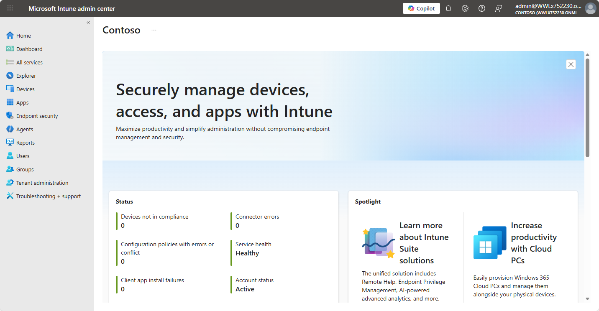

3.  From the left navigation pane, click on Users to create new users.

    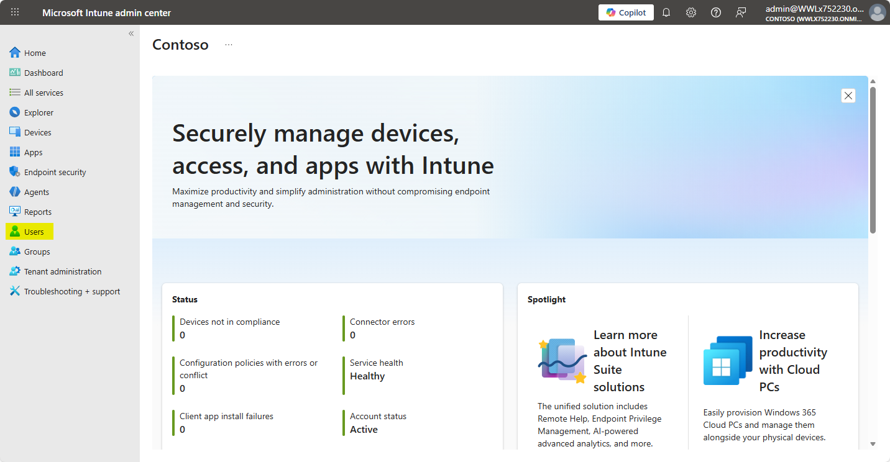

    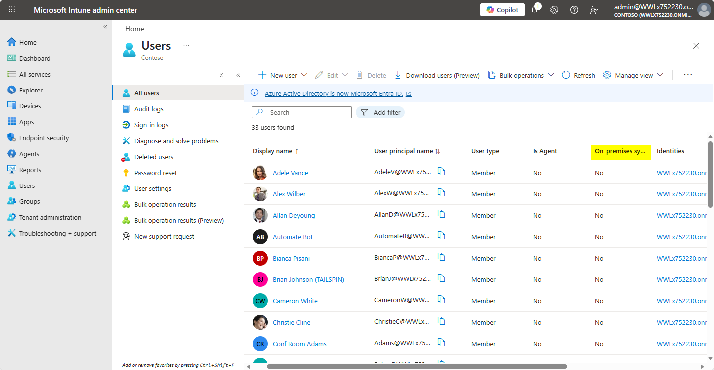

    **Take note of the users that already exist as members. Each user is
    enabled as indicated on the Account enabled column. The On-premises
    synced enabled column states No for all current users. This indicates
    that each user was created directly and is not synchronized from an
    on-premises directory service.**

4.  On the **Users | All users** page, select **New user** then
    select **Create new user**.

    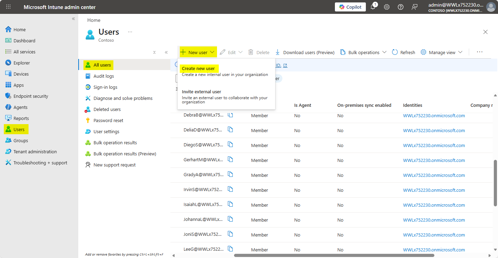

5.  On the New User page, ensure that Create user is selected,  enter the
    following:

    User principal name:`ereeve`

    Display Name:`Edmund Reeve`

    Uncheck Auto-generate password.**

    Password `P@55w.rd1234`

    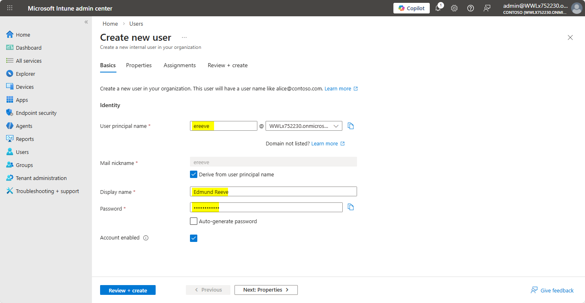

6.  On the Properties tab, provide the below information and then click
    on Next Assignments.

    Job title, enter `HR Rep`

    Department, enter `HR`

    Usage location - United States

    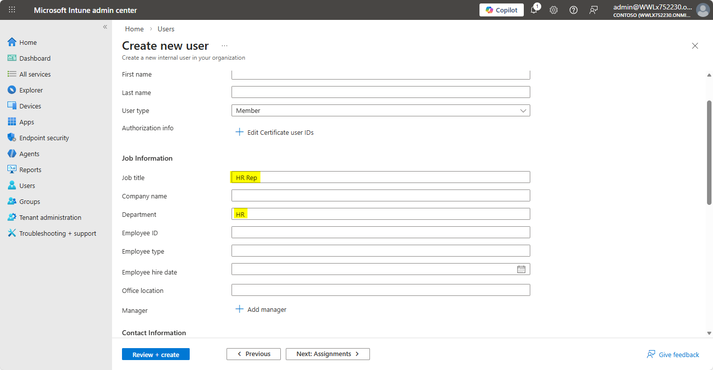

7.  On the Assignments tab, click on Review + create button. Then Verify
    the details then click on the **Create** button.

    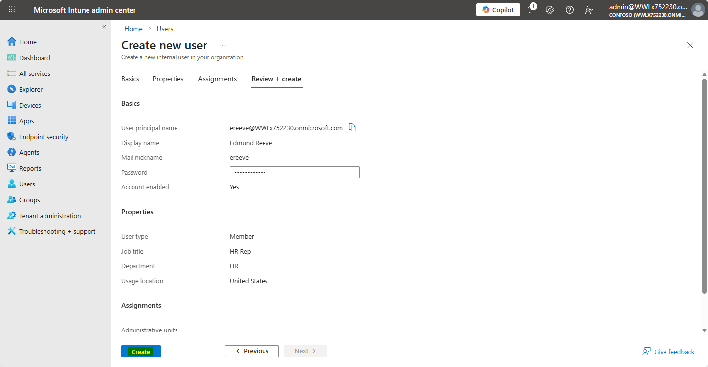

8.  Similarly create the user account for Miranda Snider with the below
    details.

    - User principal name:`msnider`

    - Display Name:`Miranda Snider`

    - Uncheck Auto-generate password.

    - Password:`P@55w.rd1234`  

    - Job title -`Helpdesk Manager`  

    - Department:`Operations`

    - Usage location: United States

    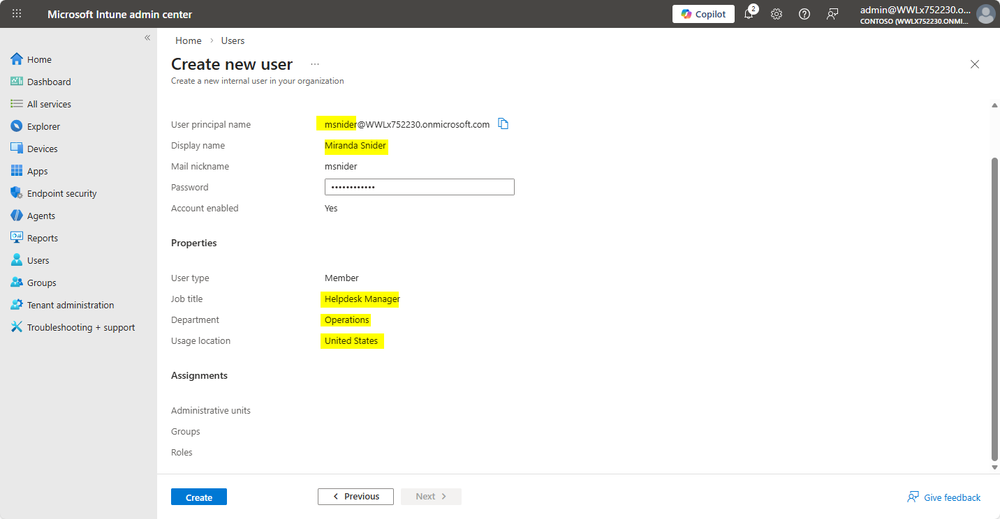

9.  Select the user account of **Allan Deyoung** and click on Edit
    properties and update the Job information with the below details and
    then click on the Save button.

    1.  Job title- [IT Admin]  

    2.  Department - [IT]  

    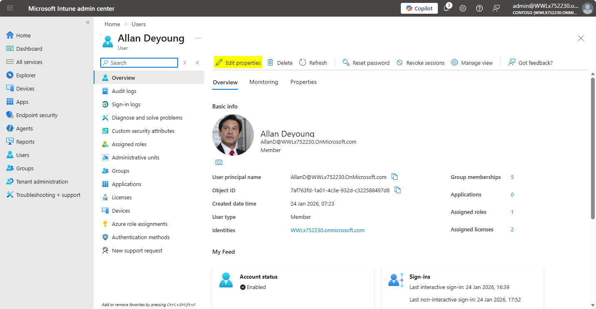

    

10. Select the user account of **Joni Sherman** and click on Edit
    properties and update the Job information with the below details and
    then click on the Save button.

    1.  Job title - `ParaLegal` 

    2.  Department -`Legal`  

    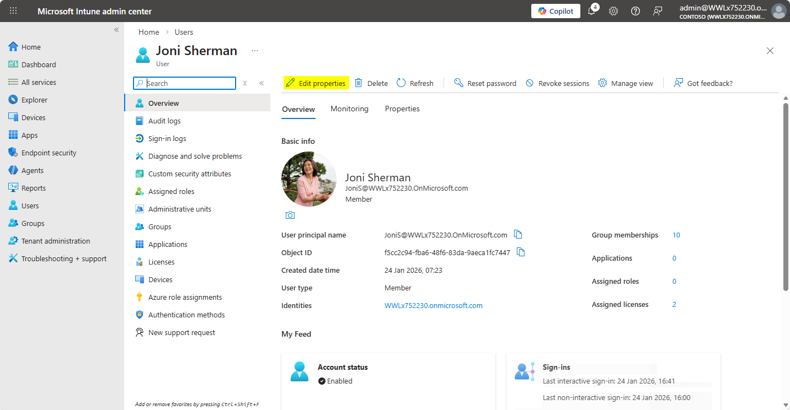

    

11. Select the user account of **Alex Wilber** and click on Edit
    properties and update the Job information with the below details and
    then click on the Save button.

    1.  Job title -`Marketing Assistant`

    2.  Department - `Marketing`

    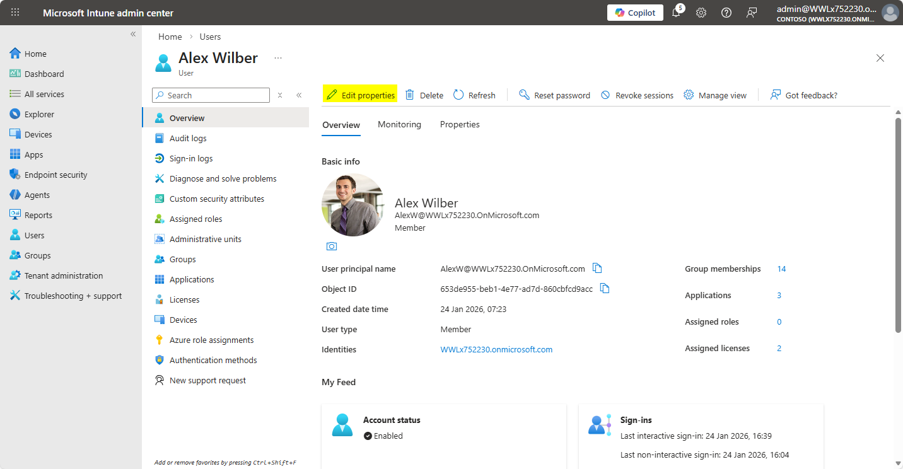

    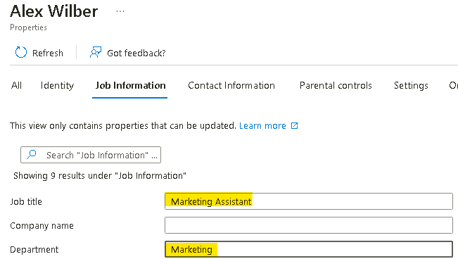

### Task 2: Create users by using PowerShell

1.  On [***SEA-SVR1***](urn:gd:lg:a:select-vm), on the taskbar,
    right-click **Start**, and then select **Windows PowerShell
    (Admin)**.

> 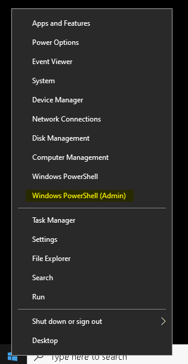

2.  In the **Windows PowerShell** window, type the following command,
    and then press **Enter**. If prompted, enter 
    !\![**Y**]  !!  at the NuGet and repository
    messages:

> !!**Install-Module Microsoft.Graph -Scope CurrentUser**!!
>
> 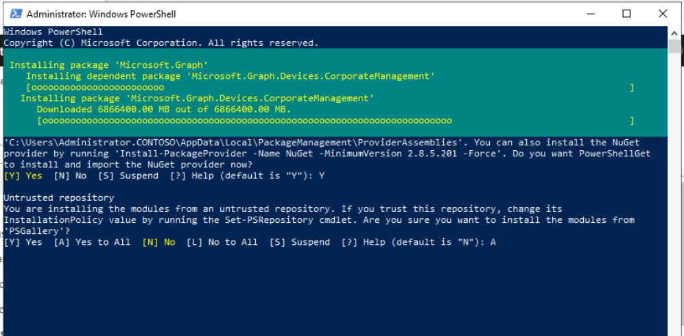
>
> 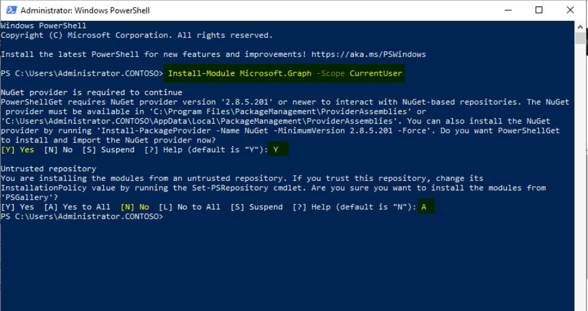

3.  In the **Windows PowerShell** window, type the following command,
    and then press **Enter**:

> !!**Connect-MgGraph -Scopes
> "Directory.ReadWrite.All","User.ReadWrite.All","Group.ReadWrite.All","RoleManagement.ReadWrite.Directory","Policy.ReadWrite.Authorization","Application.ReadWrite.All","offline_access"**
>
> !!

4.  Select **Work or school account**

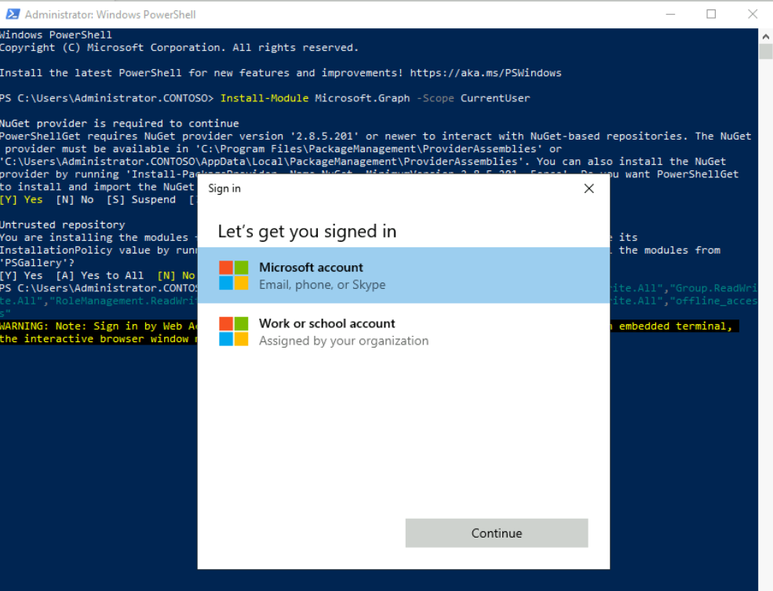

5.  Click **Yes.**

> 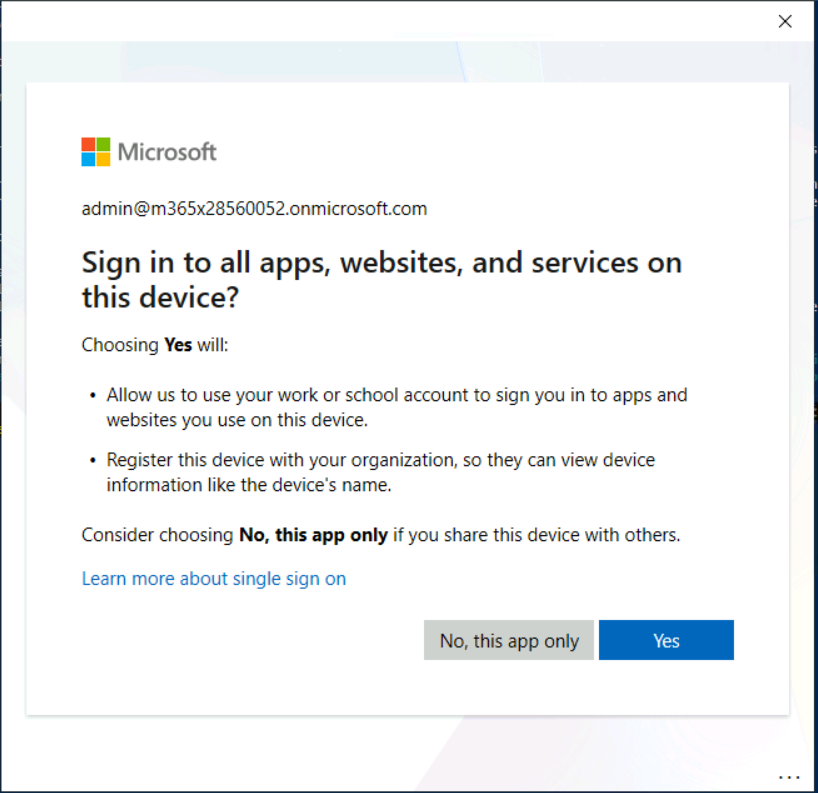
>
> 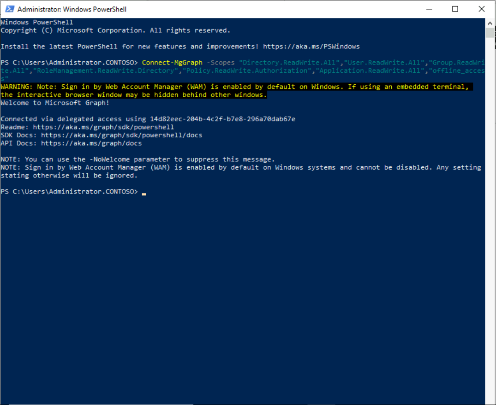

6.  In the **Sign in to your account** dialog box, sign in using the
    Office 365 Tenant credentials from the Home tab.

> **Note – If you had been prompted to change the Tenant admin
> credentials password, ensure to provide the updated password.**

7.  In the **Windows PowerShell** window, type the following code to
    create a new user, and then press **Enter**.

> Note – paste the below command in notepad and substitute the Tenant
> details then copy and paste the command in Windows PowerShell, if
> required to ensure the tenant information is correct
>
> !! **New-MgUser -UserPrincipalName
> "cgodinez@M365xXXXXXXXX.onmicrosoft.com" -DisplayName "Cody Godinez"
> -GivenName "Cody" -Surname "Godinez" -MailNickname "cgodinez"
> -PasswordProfile @{ Password="P@55w.rd1234";
> ForceChangePasswordNextSignIn=$false } -AccountEnabled:$true
> -UsageLocation "US" -JobTitle "Sales Rep" -Department "Sales"**
>
> 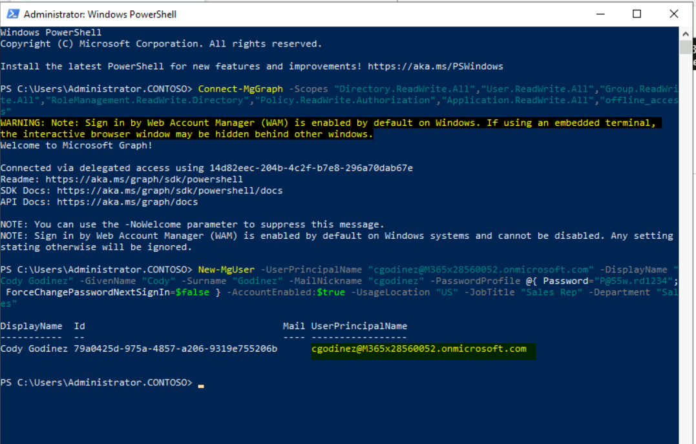

8.  In the **Windows PowerShell** window, type the following command to
    reset the passwords of the Alew Wilber, Allan Deyoung and Joni
    Sherman

!!Connect-MgGraph -Scopes
"User.ReadWrite.All","Directory.ReadWrite.All","Directory.AccessAsUser.All"!!

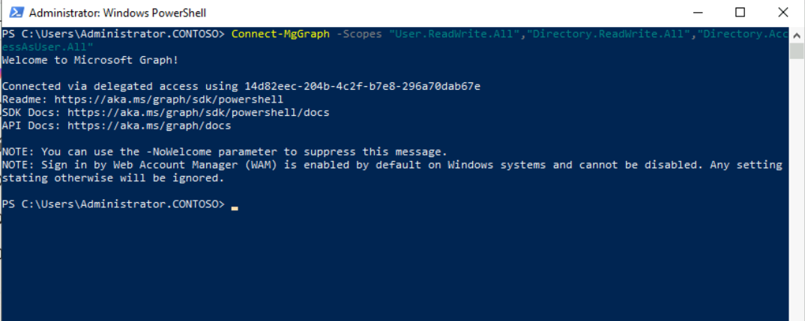

> !! **Get-MgUser -Filter "displayName eq 'Alex Wilber'" |**
>
> **ForEach-Object {**
>
> **    Update-MgUser -UserId $\_.Id -PasswordProfile @{**
>
> **        Password = "P@55w.rd1234"**
>
> **        ForceChangePasswordNextSignIn = $false**
>
> **    }**
>
> **}**
>
> !!
>
> !!**Get-MgUser -Filter "displayName eq 'Allan Deyoung'" |**
>
> **ForEach-Object {**
>
> **Update-MgUser -UserId $\_.Id -PasswordProfile @{**
>
> **Password = "P@55w.rd1234"**
>
> **ForceChangePasswordNextSignIn = $false**
>
> **}**
>
> **}**!!
>
> !!**Get-MgUser -Filter "displayName eq Joni Sherman " |**
>
> **ForEach-Object {**
>
> **    Update-MgUser -UserId $\_.Id -PasswordProfile @{**
>
> **        Password = "P@55w.rd1234"**
>
> **        ForceChangePasswordNextSignIn = $false**
>
> **    }**
>
> **}**
>
> !!
>
> 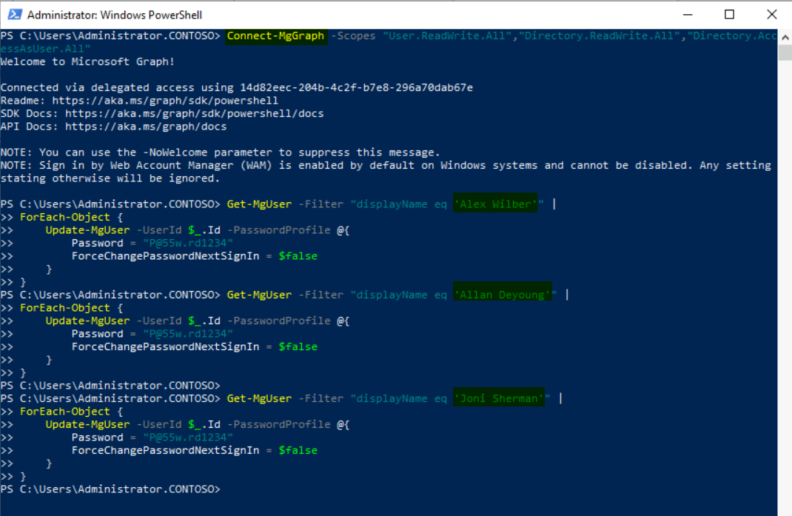

9.  In the **Windows PowerShell** window, type the following command,
    and then press **Enter**:

> !!**Get-MgUser -All -Property
> "displayName,userPrincipalName,assignedLicenses" |**
>
> **  Select-Object DisplayName, UserPrincipalName, @{N='IsLicensed';E={
> $\_.AssignedLicenses.Count -gt 0 }} |**
>
> **  Format-Table -AutoSize**
>
> !!

10. Verify that the list of users from your tenant is displayed. Also
    take note of which users have a license assigned. Any user with
    the **isLicensed** value of **False** has not been assigned a
    license.

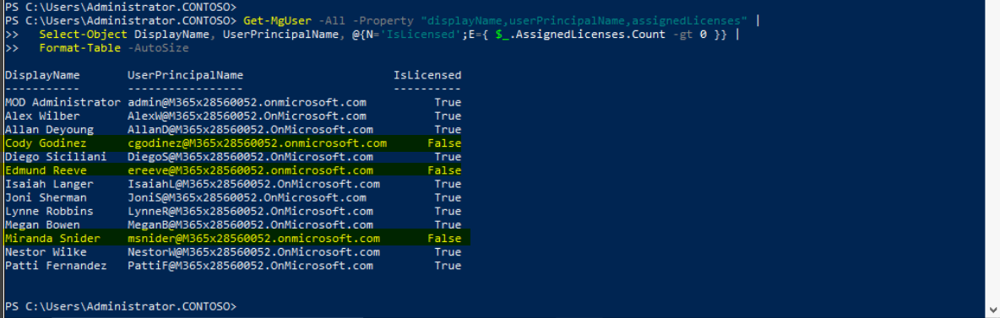

**Results**: After completing this exercise, you will have successfully
created new user accounts in Microsoft Intune admin center.

Exercise 2: Assigning Administrative Roles in Microsoft Entra ID

**Scenario**

You need to review and modify the current administrative roles for your
tenant.

You have been provided a list of users should have administrative roles
assigned as indicated in the following table.

[TABLE]

Task 1: Review and Assign Administrative Roles

1.  On [***SEA-SVR1***](urn:gd:lg:a:select-vm), switch to **Microsoft
    Edge**.

2.  In the **Microsoft Entra admin center**, in the Navigation pane,
    expand **Entra ID.**

3.  Select **Roles & admin** and search for !!**Global administrator**!!
    and click on the Role **Global Administrator**.

> 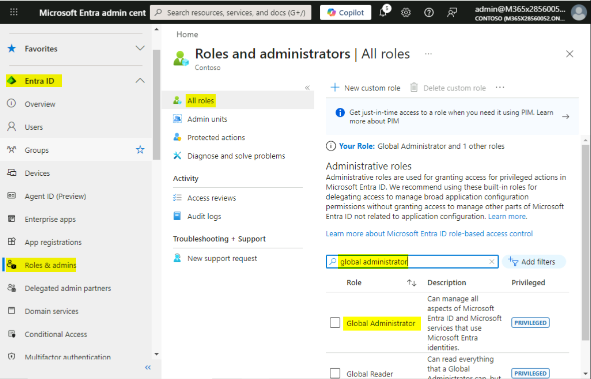

4.  Click on **Add assignments**.

> 

5.  On the Add assignments page, under Select member(s) click on No
    member selected.

> 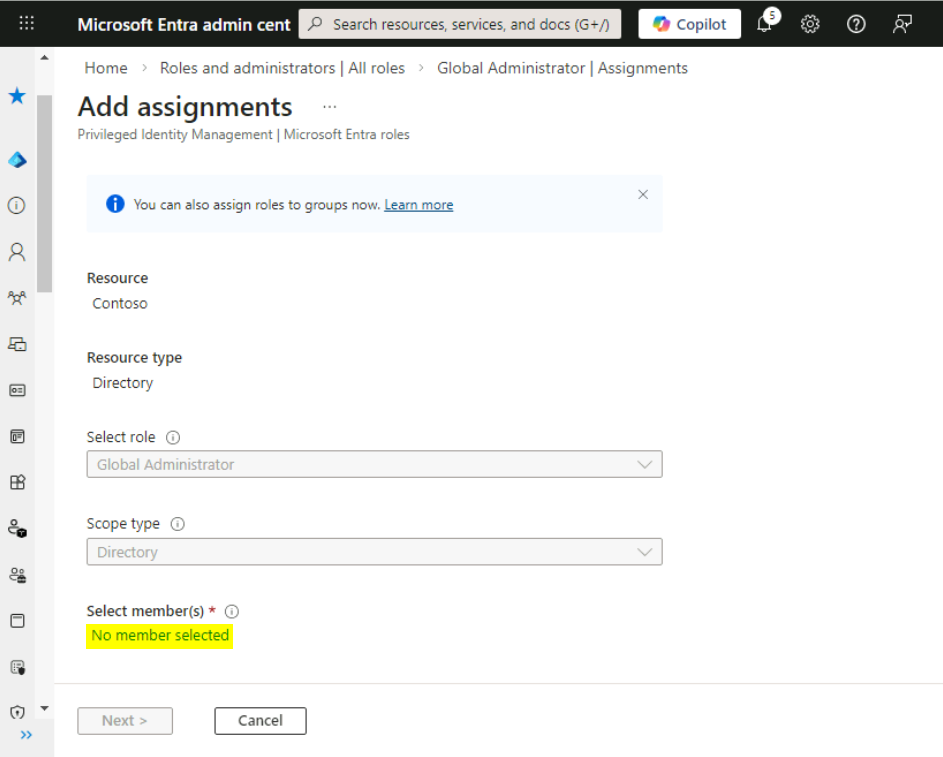

6.  select **Allan Deyoung** and then click **Select**.

> 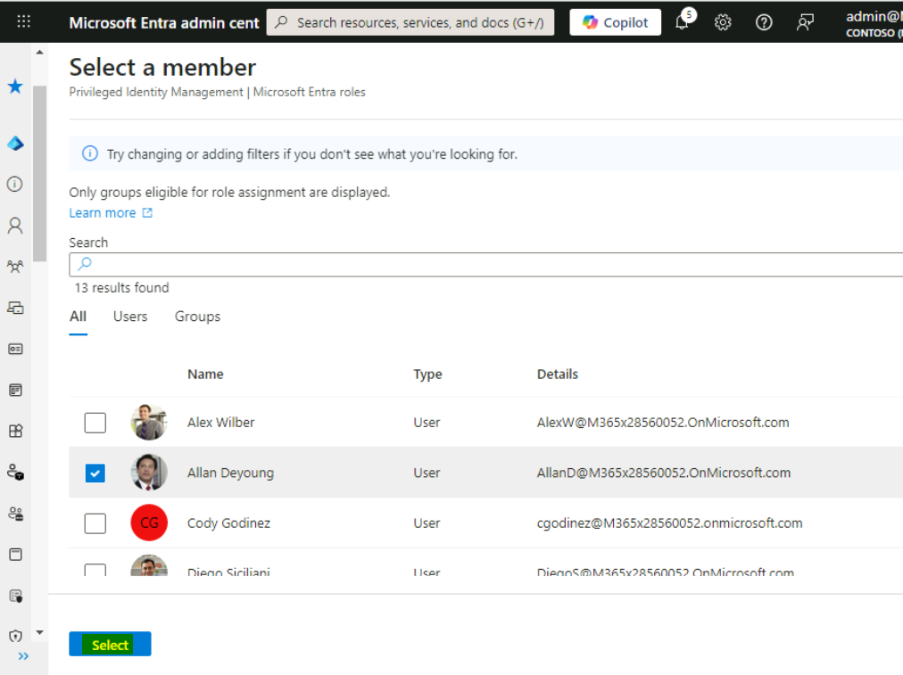

7.  Click **Next**

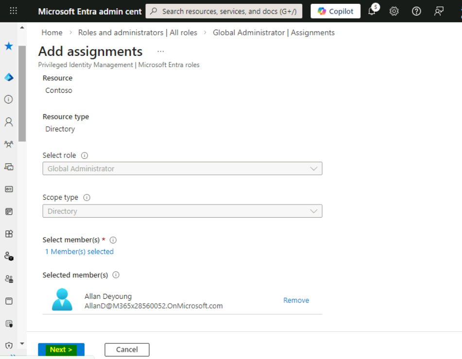

8.  On the Add assignment page, select assignment type as **Active** and
    enter justification as !!Role Assignment!! and click **Assign.**

> 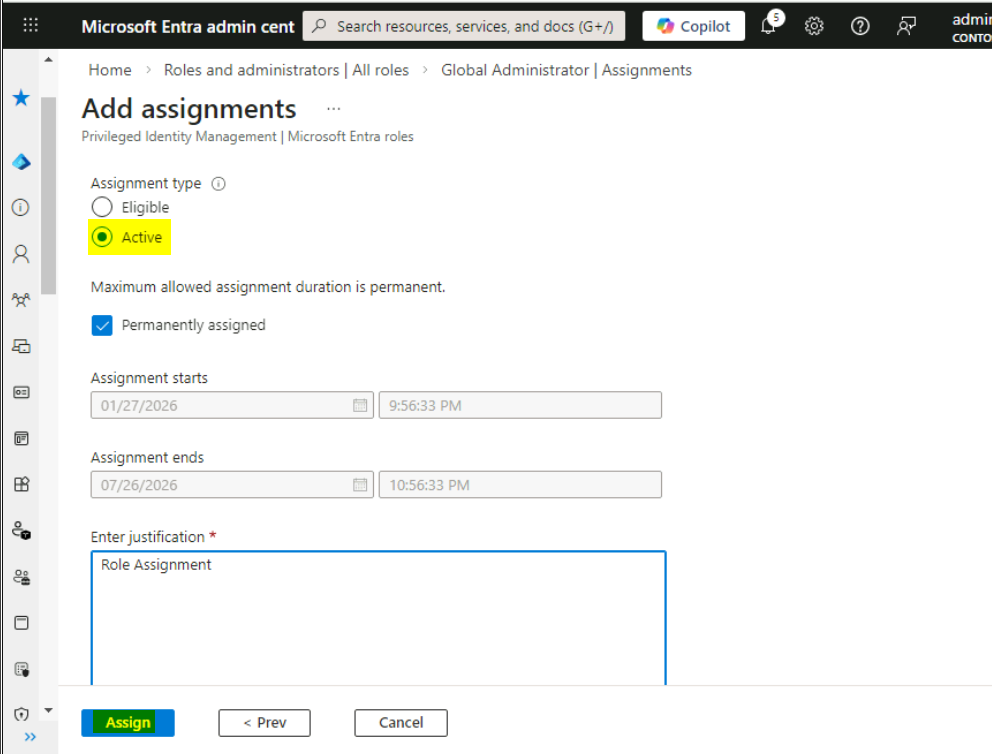

9.  At the top of the page, in the navigation link, select **Roles and
    administrators**.

> 

10. On the **Roles and administrators** page, search and select !!**User
    administrator**!!. Ensure that **Assignments** is selected.

> 
>
> Notice that there are no users currently assigned to the User
> administrator role.

11. Click on + **Add assignments**.

> 

12. On the Add assignments page, click on No member selected and
    select **Edmund Reeve** .

> 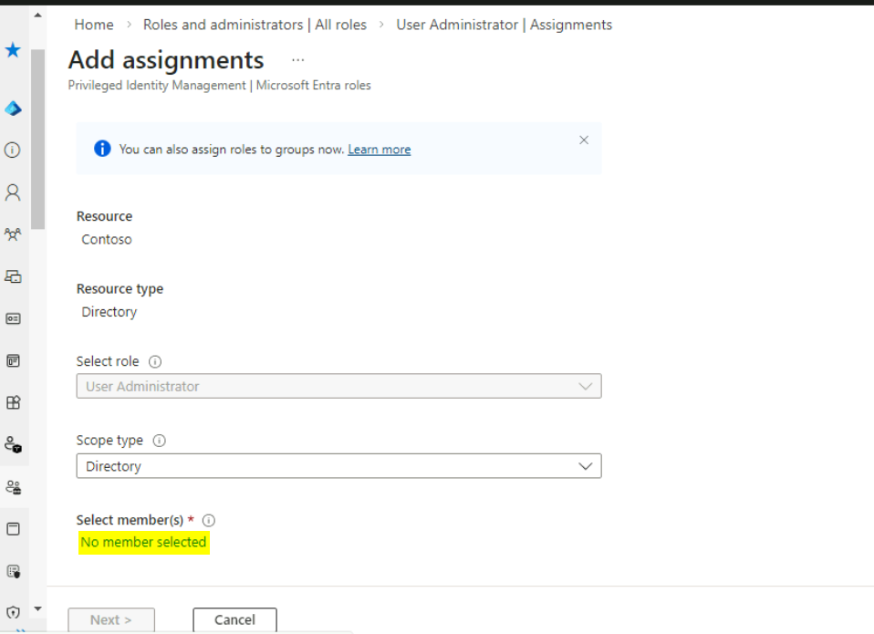
>
> 

13. On the Add assignments page, select the assignment type as
    **Active**, enter justification as !!**Role assignment**!! and click
    **Assign**.

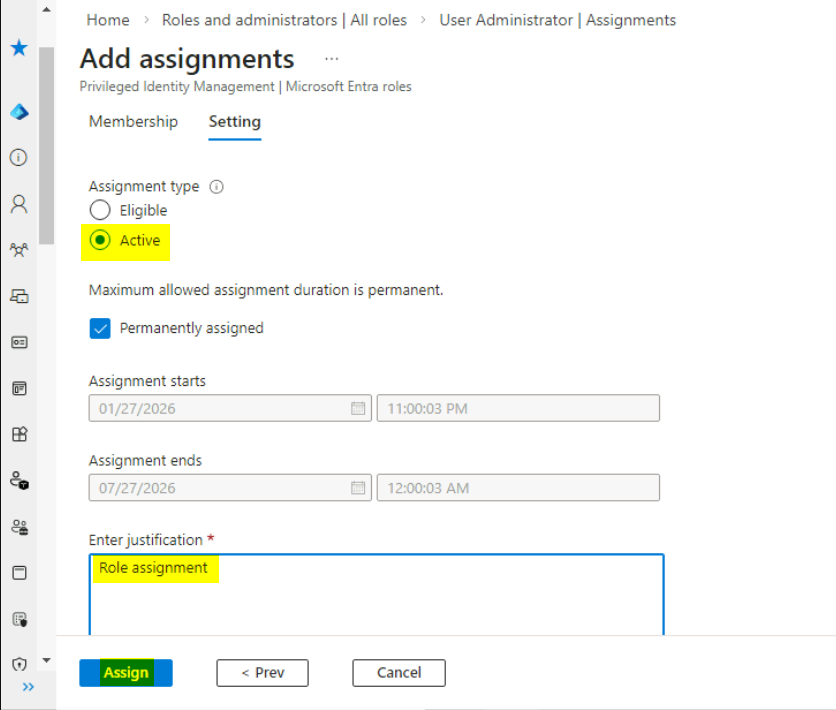

14. Click on **Roles and administrators** link, then search and
    select !!**Helpdesk administrator**!!.

> 
>
> 
>
> Notice that there are no users currently assigned to the Helpdesk
> administrator role.

15. On the **Helpdesk administrator | Assignments** page, select **Add
    assignments**.

> 

16. On the Add assignments page, On the Add assignments page, click on
    No member selected and select **Miranda Snider**

> 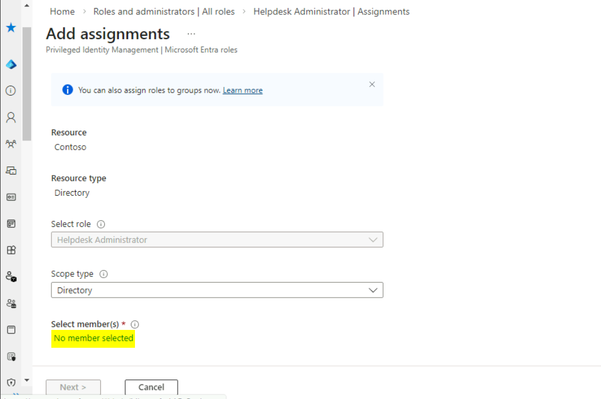
>
> 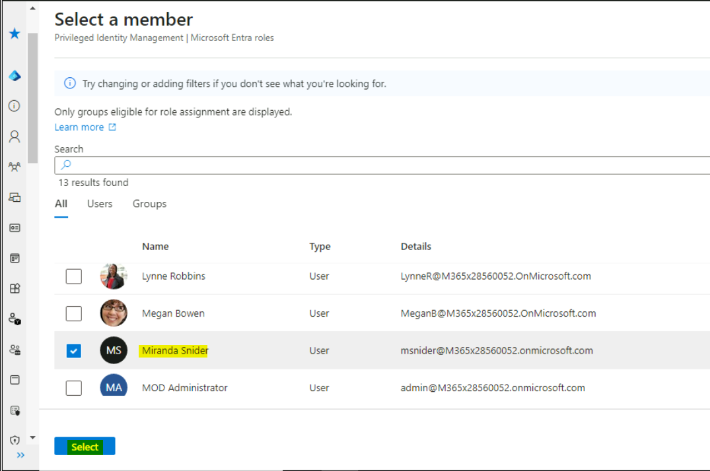

17. On the Add assignments page, select the assignment type as
    **Active**, enter justification as !!**Role assignment**!! and click
    **Assign**.

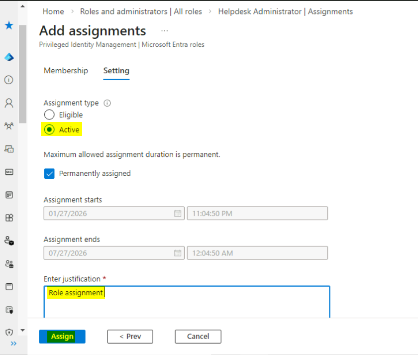

18. At the top of the page, in the navigation link, select **Roles and
    administrators**.

> 

**Results**: After completing this exercise, you should have
successfully assigned administrative roles to users.

Exercise 3: Creating and managing groups and validating license
assignment.

**Scenario**

You need to add the three new users to a Security group and assign
licenses as indicated in the following table.

[TABLE]

You have also been asked to modify the Company branding for the sign-in
page.

Task 1: Create groups by using the Microsoft Entra admin center

1.  On [***SEA-SVR1***](urn:gd:lg:a:select-vm), in the **Microsoft
    Intune admin center**, in the navigation pane, select **Groups** and
    then click on **New group.**

> 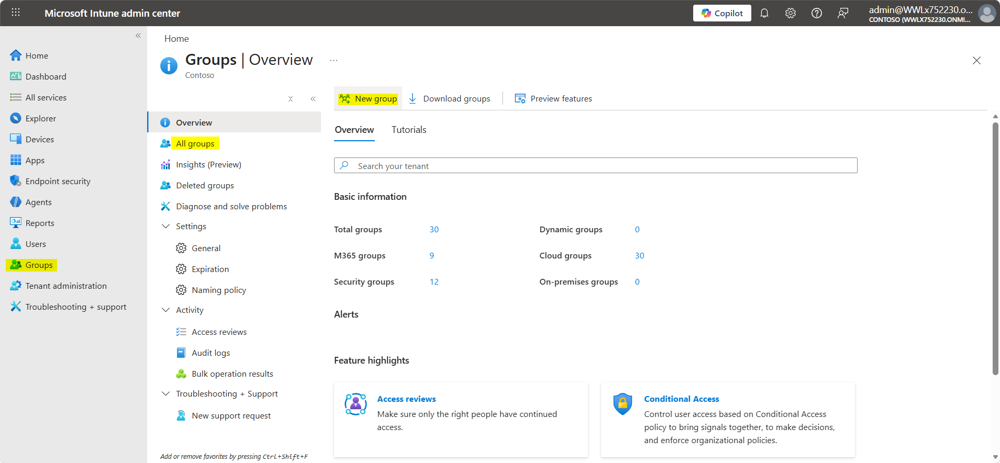

2.  On the **New Group** page, enter the following:

    - Group type: **Security**

    - Group name: !\![**Contoso_Managers**]  !!

    - Membership type: **Assigned**

3.  Under Members, click on **No members selected**.

4.  In the Add members page add **Edmund Reeve**, **Miranda Snider**,
    **Miriam Snider** and then click **Select**.

> 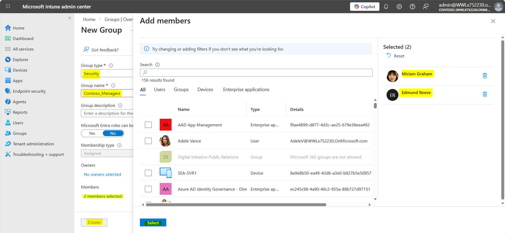

5.  Select **Create**.

Task 2: Create groups by using PowerShell

1.  On [***SEA-SVR1***](urn:gd:lg:a:select-vm), switch to Windows
    PowerShell.

2.  In the **Windows PowerShell** window, type the following code to
    create a new group, and then press **Enter**:

> !!**New-MgGroup -DisplayName "Contoso_Sales" -Description "Contoso
> Sales team users" -MailEnabled:$false -MailNickname "Contoso_Sales"
> -SecurityEnabled:$true**
>
> !!
>
> 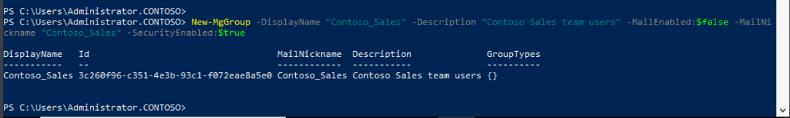

3.  In the **Windows PowerShell** window, type the following command,
    and then press **Enter**:

> !!**Get-MgGroup -All**!!
>
> 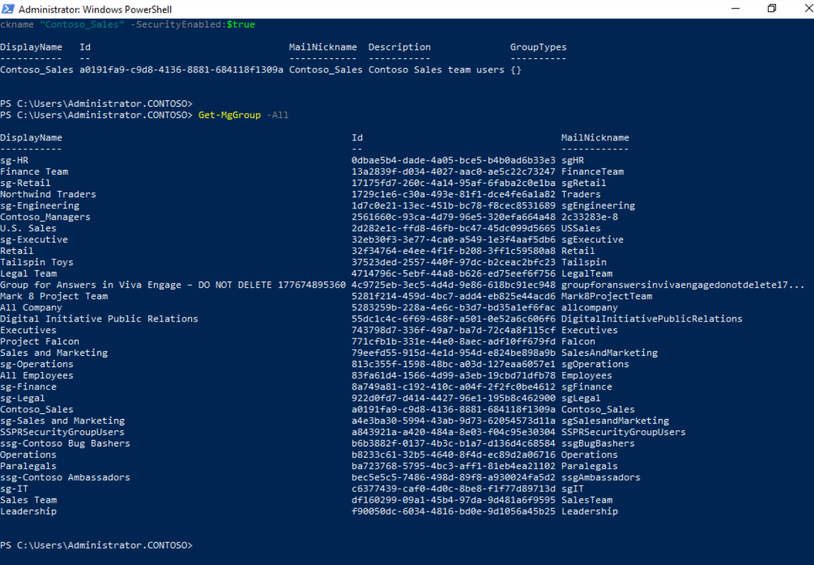

4.  Verify that you get the list of groups in your tenant, including the
    **Contoso_Sales** group you just created.

> 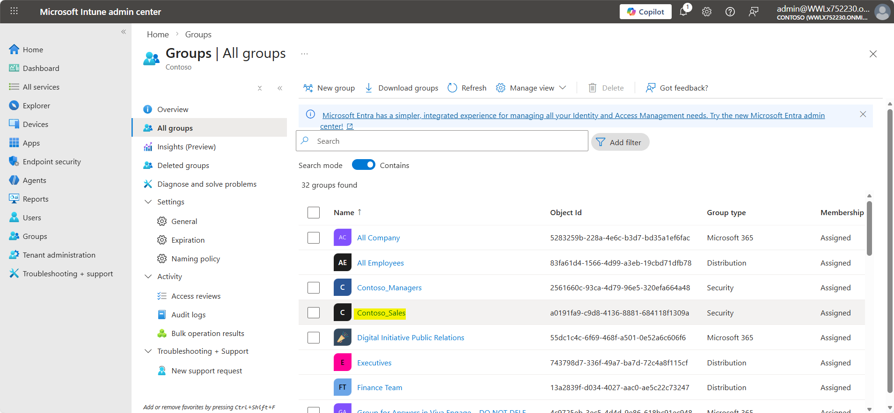

5.  In the **Windows PowerShell** window, type the following code to
    define a variable as the Contoso_Sales group, and then
    press **Enter**:

> !!$group = Get-MgGroup -Filter "displayName eq 'Contoso_Sales'"!!
>
> 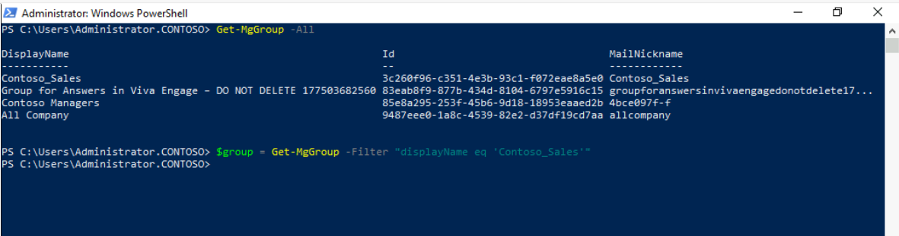

6.  In the **Windows PowerShell** window, type the following code to
    define another variable as the user, and then press **Enter**:

> !! $user = Get-MgUser -Filter "displayName eq 'Cody Godinez'"!!
>
> 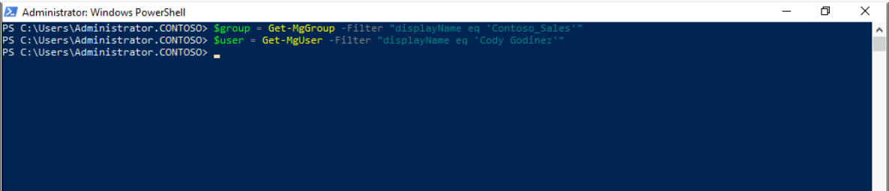

7.  In the **Windows PowerShell** window, type the following code to add
    Cody to Contoso_Sales using set variables, and then press **Enter**:

> **!!New-MgGroupMemberByRef -GroupId $group.Id -BodyParameter @{**
>
> **  "@odata.id" =
> "https://graph.microsoft.com/v1.0/directoryObjects/$($user.Id)"**
>
> **}!!**
>
> 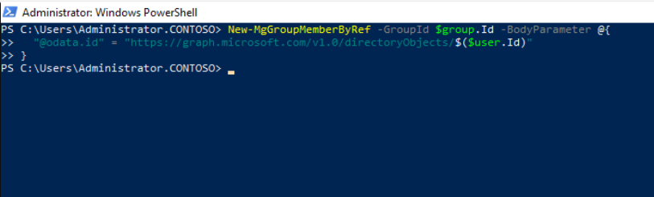

8.  In the **Windows PowerShell** window, type the following code, and
    then press **Enter**:

!! Get-MgGroupMember -GroupId $group.Id -All |

  Where-Object { $\_.AdditionalProperties\['@odata.type'\] -eq
'#microsoft.graph.user' } |

  ForEach-Object { Get-MgUser -UserId $\_.Id } |

  Select-Object DisplayName, UserPrincipalName, Id!!

9.  Verify that you see **Cody Godinez** in the command output result.

> 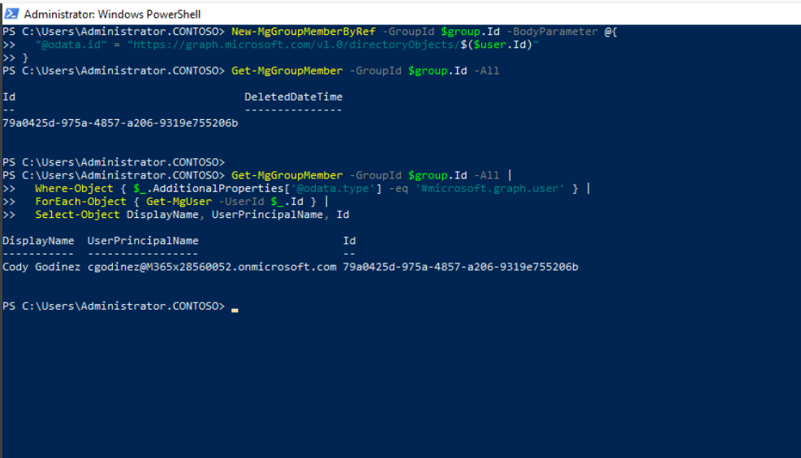

10. Close Windows PowerShell.

Task 3: Review licenses and modify company branding

1.  In the Microsoft Entra admin center, in the Navigation pane, expand
    **Identity**, then expand **Billing** and select **Licenses**.

> https://admin.microsoft.com/Adminportal/Home?referrer=entra#/licenses
>
> 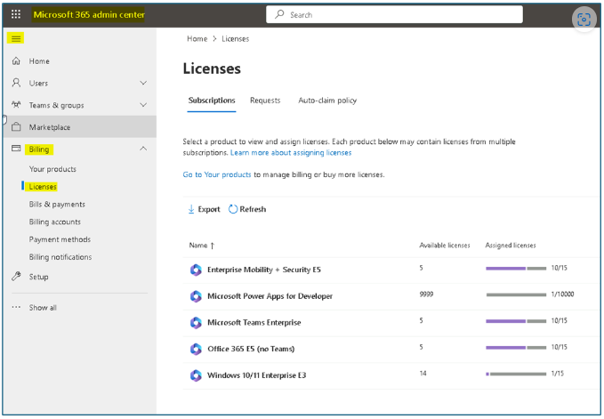

2.  On the **Licenses** page, under Subscriptions, check for all the
    available licenses.

> 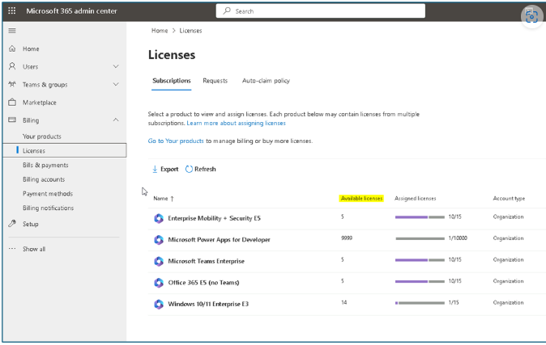
>
> Note - Take note of the current licenses available and assigned
> for **Enterprise Mobility + Security E5** and **Office 365 E5 (no
> Teams)**
>
> 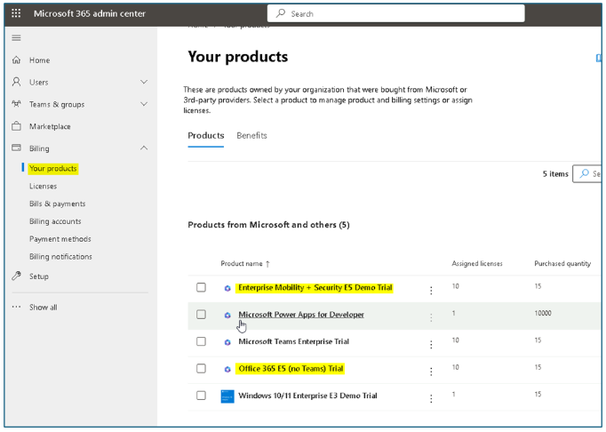

3.  In the Microsoft 365 admin center, On the left navigation pane
    select **Users** and then **Active users**.

> 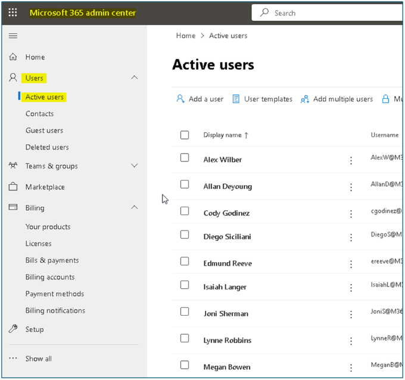

4.  In the user list, select **Cody Godinez**.

> 

5.  On the Cody Godinez page, select **Licenses and apps**

> 
>
> Notice that Cody does not have any current license assignments.

6.  On the **Licenses and apps** page, select the check box next
    to **Enterprise Mobility + Security E5** and **Office 365 E5 (no
    Teams)** and click on **Save changes**.

> 
>
> 

**Note**: Repeat steps 4 to 8 for assigning licenses Enterprise
Mobility + Security E5 and Office 365 E5 (no Teams) to Joni Sherman,
Alex Wilber and Allan Deyoung in case they aren’t assigned the licenses.

7.  In the Microsoft Intune admin center, in the Navigation pane,
    expand **Teams &groups** and select **Active teams & groups**.

> 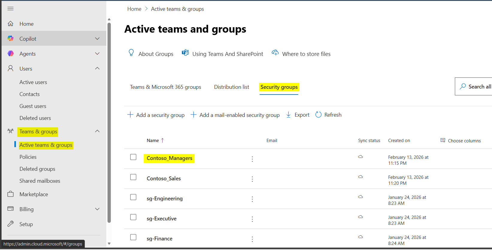

8.  On the **Contoso_Managers** page, select **Licenses**.

> 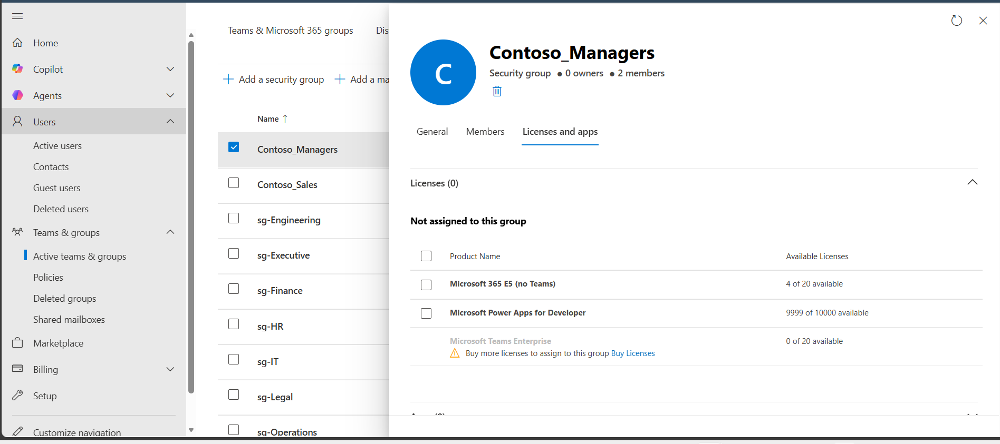
>
> **Notice that the Contoso_Managers group does not have any current
> license assignments.**

9.  Click on the checkbox beside **Microsoft 365 E5** to assign the
    license to the team, click **Save changes**

> 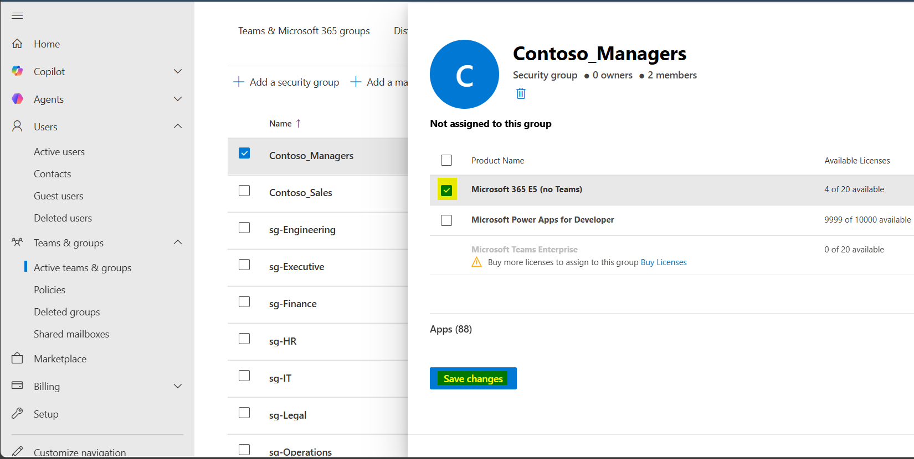
>
> Take note of the users that are assigned the Office 365 E5 (no Teams)
> license. Notice the Assignment Paths column which indicates how
> license assignment is configured for each user. Edmund and Miranda
> both receive their license assignment from their membership in the
> Contoso_Managers group. You may need to select **Refresh** a couple of
> times to update the Assignment path column.
>
> 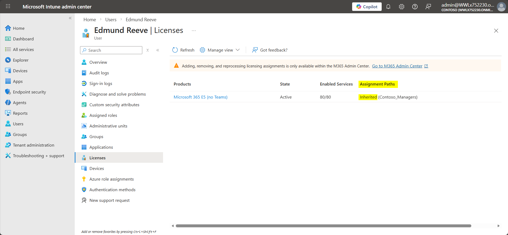
>
> 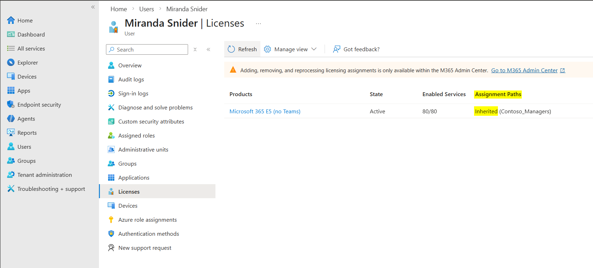

10. Close Microsoft Edge.

**Results**: After completing this exercise, you should have
successfully created and managed groups, and assigned licenses.
