# Lab 15 – Advanced Analytics and Reporting in Intune

**Summary**

In this lab, you will **explore** and use the **advanced analytics and
reporting capabilities** in Microsoft Intune. You will work with
Intune’s reporting solutions—including **Endpoint Analytics**, **Device
reports**, **App reports**, **Compliance reporting**, and **Audit
logs**—to understand how administrators can monitor device health, track
user experience, measure compliance, and gain insights into the
organization’s endpoint environment.

------------------------------------------------------------------------

**Prerequisites**

Before beginning this lab, ensure the following labs are completed:

- Lab 5 – Manage Device Enrollment into Intune

- Lab 6 – Enrolling Devices into Intune

- Lab 7 – Creating and Deploying Configuration Profiles

- Lab 14 – Monitoring Device Performance with Endpoint Analytics
  (recommended)

You must also have:

- At least one Windows 10/11 device enrolled (SEA‑WS1)

- Admin access to the Intune admin center

------------------------------------------------------------------------

**Scenario**

Contoso wants to strengthen visibility across all managed devices.
Leadership is requesting reports on:

- Device performance

- User experience

- App performance and installation status

- Device compliance posture

- Security configuration drift

- Audit and administrative activity

As an Intune administrator, you will explore the **Advanced Analytics
and Reporting** features to gather this information.

------------------------------------------------------------------------

## Exercise 1: Explore Intune Reporting Overview

### Task 1: Access the Reports Workspace

1.  Sign in to the **Microsoft Intune admin center**.

> 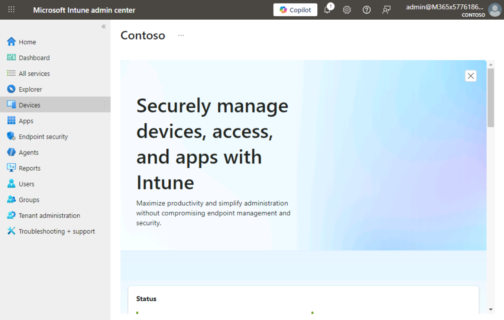

2.  In the left navigation pane, select **Reports**.

> 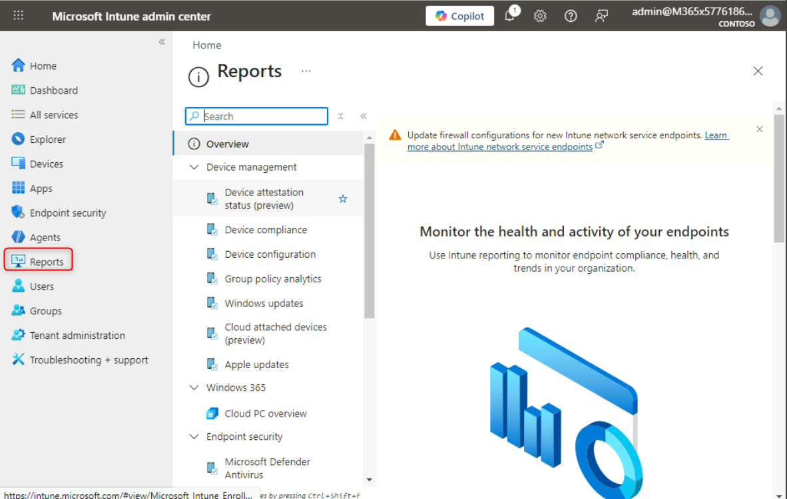

3.  Review the reporting categories:

    - **Device management**

    - **Endpoint security**

    - **Analytics**

> 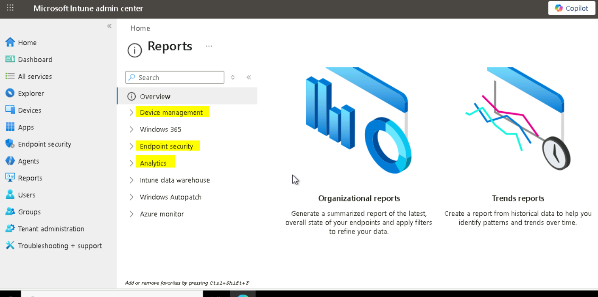

### Task 2: Review Endpoint Analytics Reports

1.  In the Intune admin center, go to:  
    **Reports → Analytics → Endpoint analytics**

> 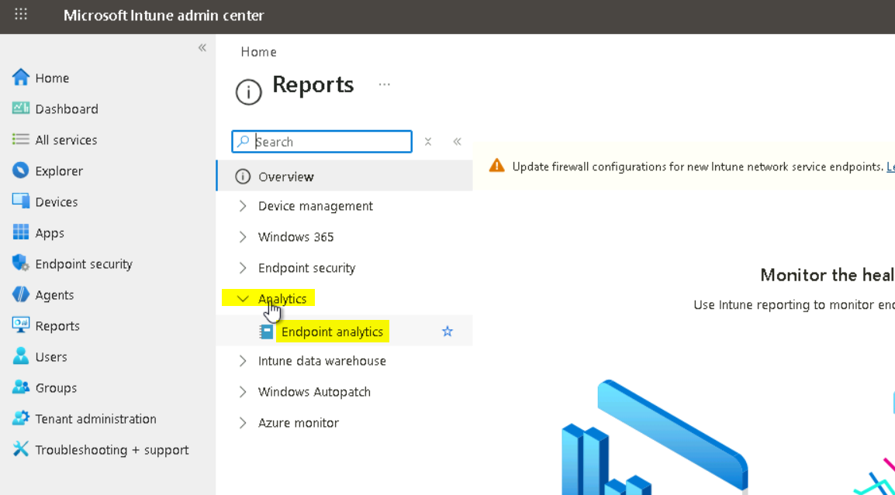

2.  For Collect device data from, ensure that **All cloud -managed
    devices** is selected and click **Start**

> 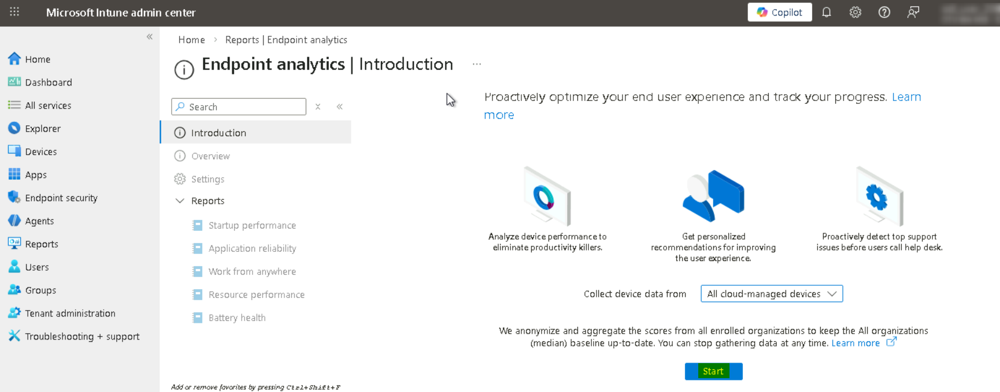

3.  Explore available insights:

    - **Startup performance**

    - **Application reliability**

    - **Work from anywhere score**

    - **Battery health (if applicable)**

> 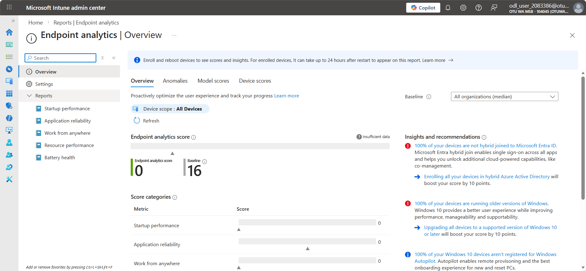
>
> 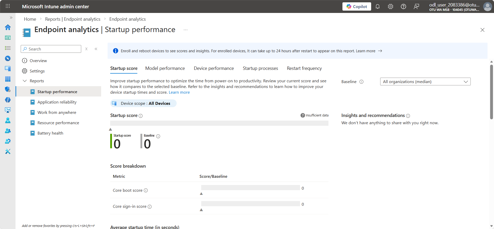
>
> 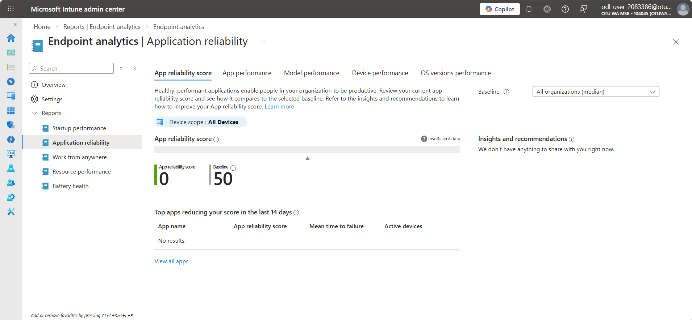
>
> 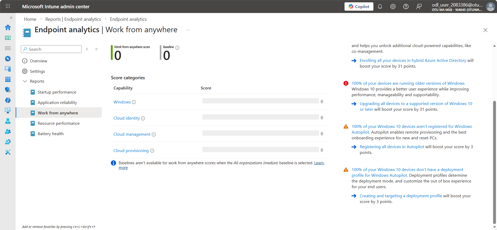

Endpoint Analytics helps evaluate how device performance affects user
productivity.

------------------------------------------------------------------------

## Exercise 2: Review Device and Compliance Reports

### Task 1: Device Compliance Reports

1.  Navigate to:  
    **Reports → Device management → Device compliance**

> 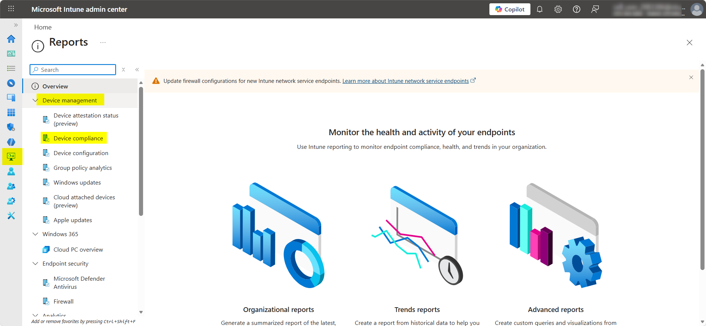

2.  Review the reports page, to see the following options.

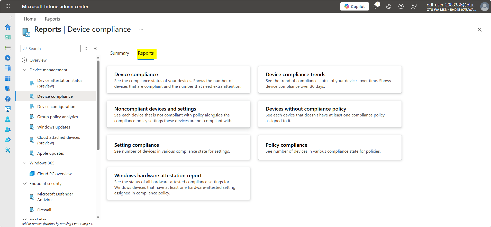

### Task 2: Device Configuration Reports

1.  Navigate to:  
    **Reports → Device management → Configuration profiles**

2.  Review:

    - Deployment status

    - Policy conflict details

    - Per-device configuration results

This is critical for troubleshooting devices with configuration
failures.

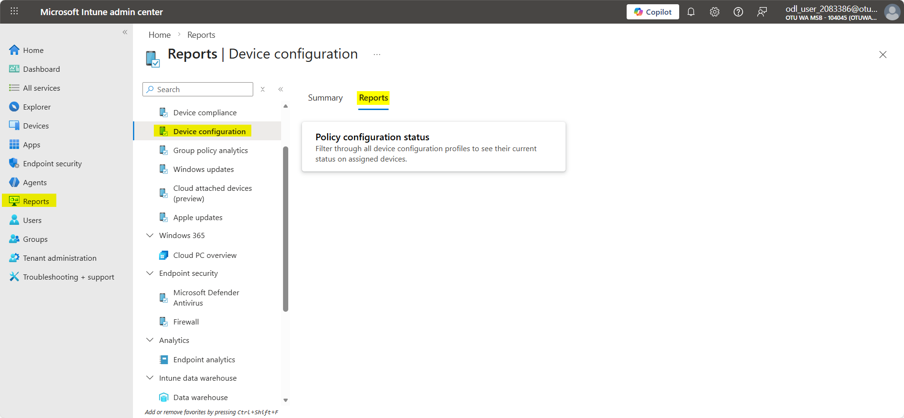

------------------------------------------------------------------------

## Exercise 3: Analyze App Reports

### Task 1: Review Managed App Installation Status

1.  Go to: **Apps → Monitor, s**elect **App install status**.

> 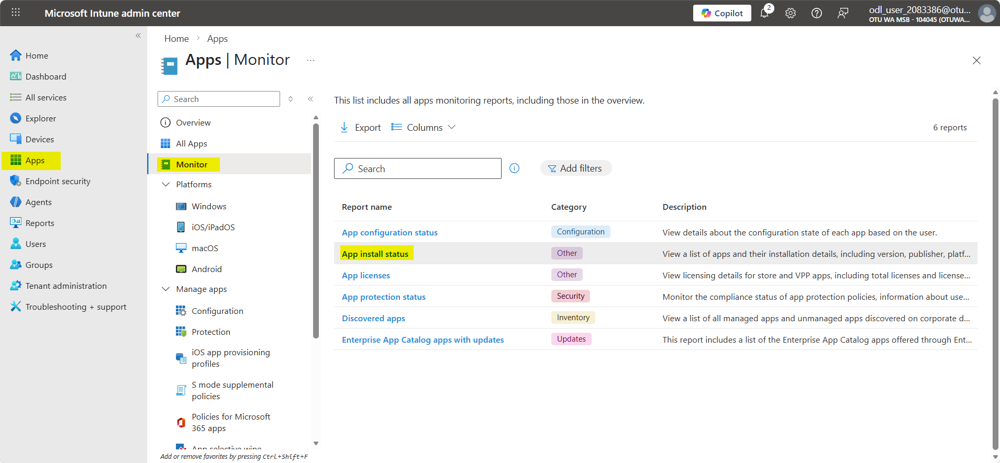
>
> 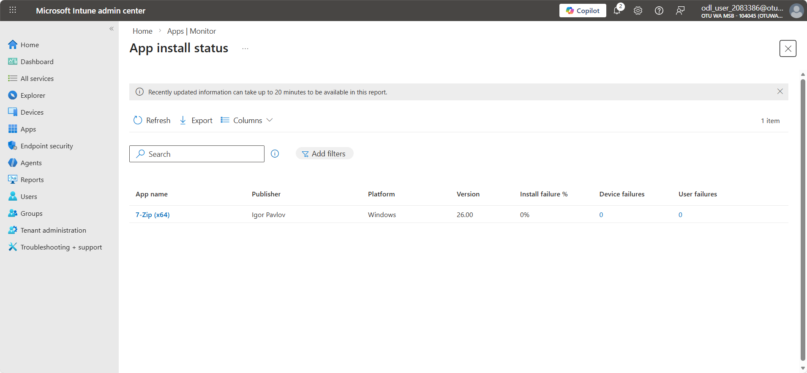

2.  Review:

    - Installation success

    - Pending installations

    - Failed installations

    - Platform-based filters (Windows, iOS, Android)

> 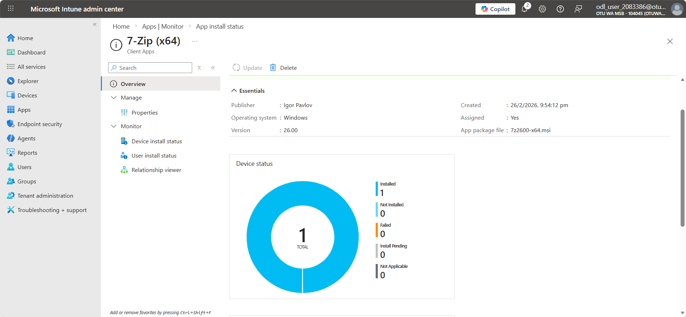

3.  Identify an app with installation issues and view its error code.

------------------------------------------------------------------------

## Exercise 4: Explore Security & Endpoint Reporting

### Task 1: Endpoint Security Reports

1.  Navigate to:  
    **Endpoint security → Antivirus**

> 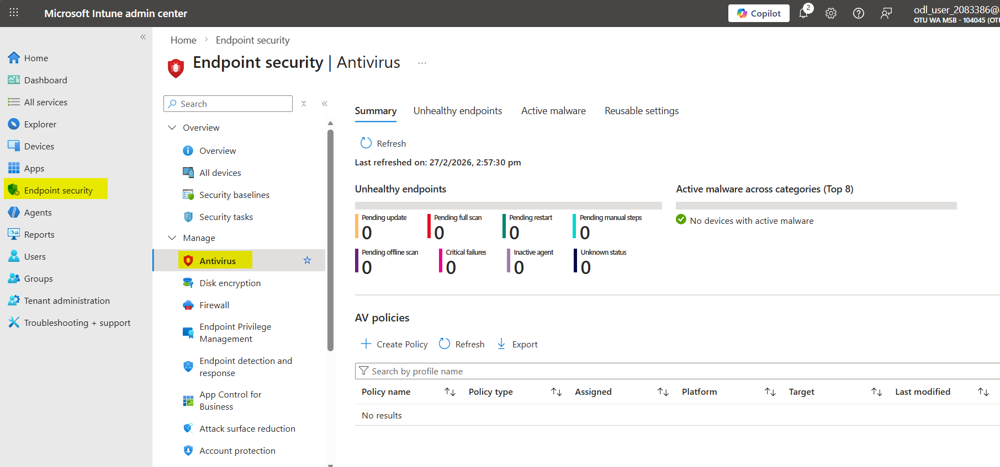

2.  Review:

    - Summary

    - Active Malware

    - Unhealthy endpoints

3.  Open **Endpoint security → Firewall → Reports** to validate firewall
    status.

> 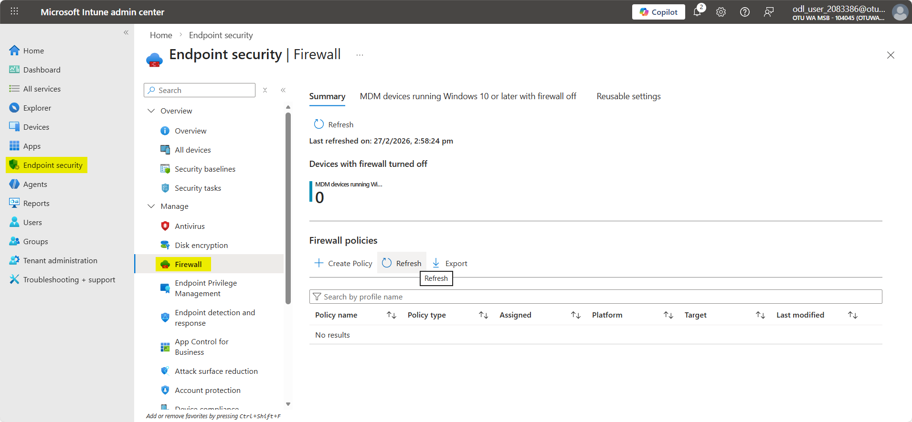

------------------------------------------------------------------------

## Exercise 5: Use Audit Logs and Operational Data

### Task 1: Audit Logs

1.  Go to:  
    **Tenant administration → Audit logs**

> 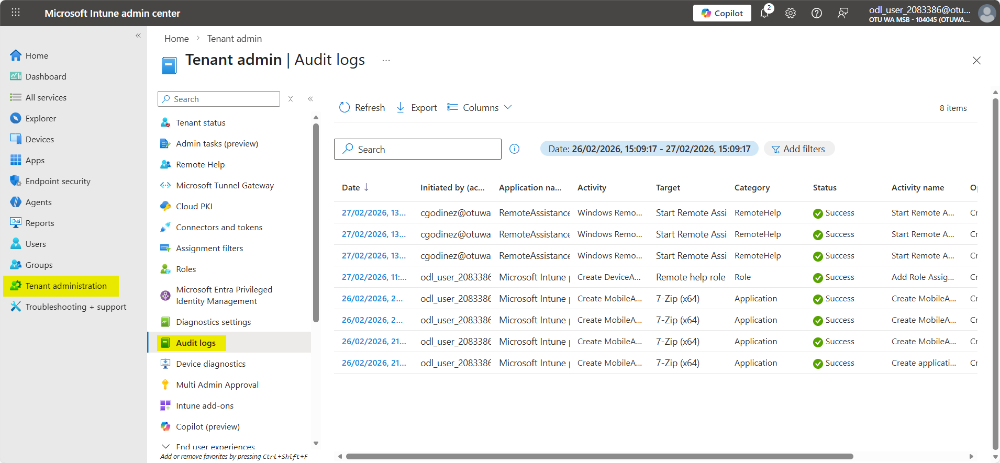

2.  Review log activities such as:

    - Policy changes

    - App deployments

    - User assignment changes

### Task 2: Diagnose Operational Issues

1.  Navigate to:  
    **Tenant administration → Device diagnostics**

2.  Review the options available to diagnose Operational Issues

> 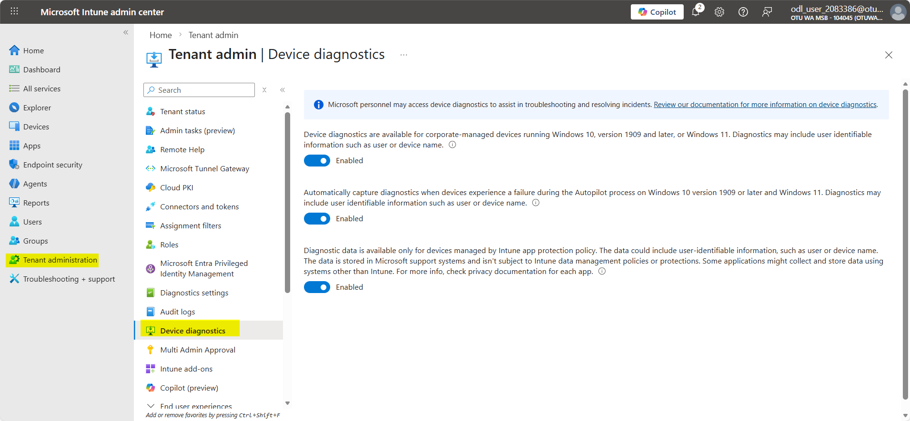

------------------------------------------------------------------------

**Results**

After completing this lab, you will have:

- Explored Intune’s complete reporting ecosystem

- Interpreted Endpoint Analytics performance data

- Reviewed compliance, configuration, and device status reports

- Analyzed application deployment and protection insights

- Examined security posture and antivirus reporting

- Used audit logs for operational tracking

Contoso now benefits from improved visibility into device performance,
app reliability, and compliance across all managed endpoints.
