# Lab 20 - Configure VPN Policies for iOS Devices

**Summary**

In this lab, we will use Microsoft Intune to create and apply a
Configuration profile to run configure Wi-Fi settings for iOS and iPadOS
devices.

**Exercise 1: Creating a Configuration profile.**

**Scenario**

You have been asked to create a Configuration profile to be used to
automatically configure VPN Policies for enrolled iOS and iPadOS
devices. You need to ensure that the VPN settings are configured as
follows:

**Task 1: Create the iOS_iPadOS device group**

1.  Switch
    to *[SEA-SVR1](https://labclient.labondemand.com/Instructions/e7cc4ae1-e3d9-4c55-accc-696f537e1e17?rc=10).*
     In the **Microsoft Intune admin center** window, navigate and
    select **Groups**, then click on **New group**.

> 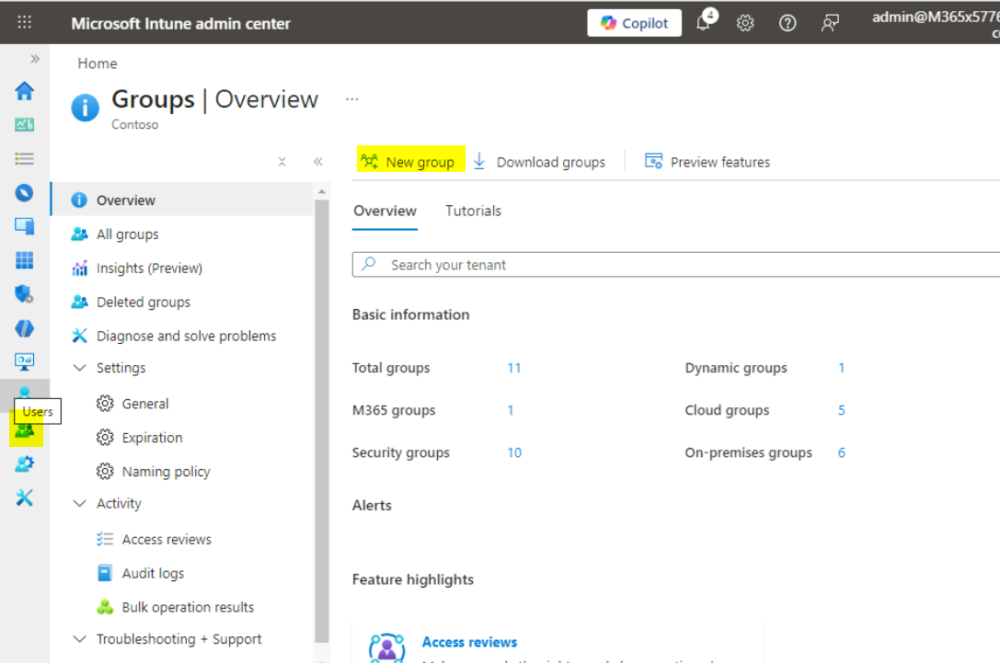

2.  On the **New Group** blade, enter the following information and
    click on the **Create** button as shown in the below image:

    - Group type: **Security**

    - Group name: !!**iOS_iPadOS Devices**!!

    - Group description: !!**All iOS and iPadOS devices**!!

    - Membership type: **Assigned**

> 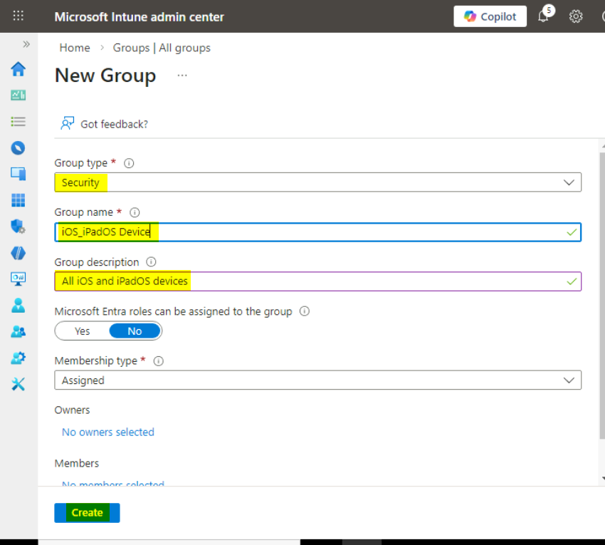

3.  On the **Groups | All groups** blade, refresh the page and verify
    that the **iOS_iPadOS Devices** group is displayed.

> 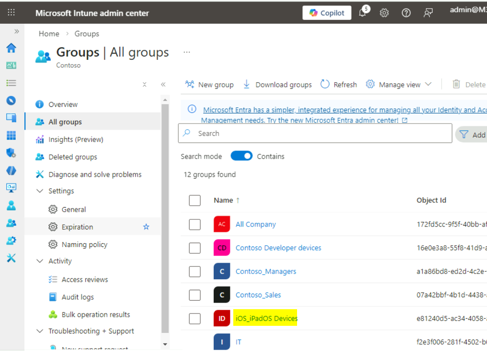

**Task 2: Create a Configuration profile based on scenario
requirements**

1.  Switch to **Microsoft Intune admin center** tab,
    select **Devices** from the navigation bar.

> 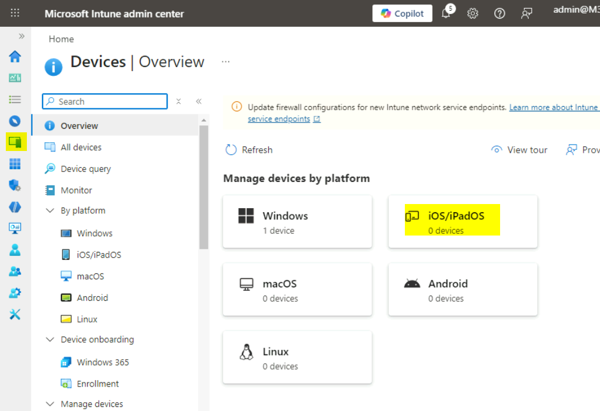

2.  On the **Devices | Overview** page, select **iOS/iPadOS** as shown
    in the below image.

> 

3.  On the **iOS/iPadOS** page, navigate and click on **Configuration
    profiles**.

> 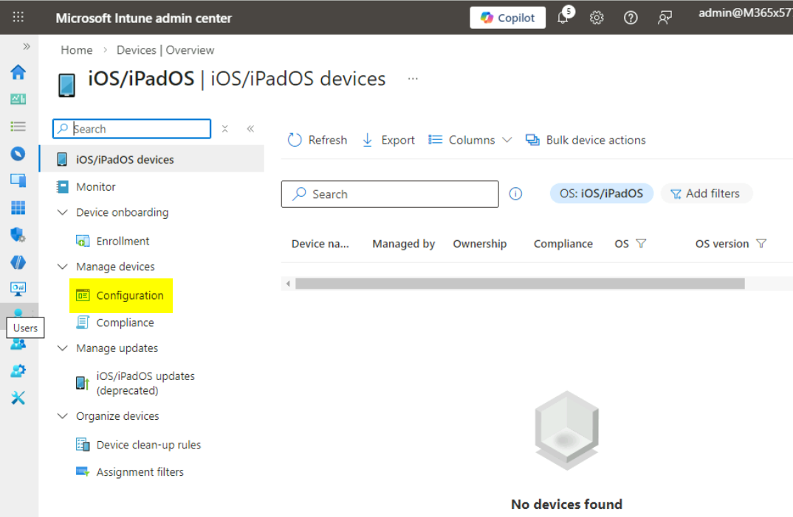

4.  On the **iOS/iPadOS | Configuration profiles** page, in the
    **Policies** tab, click on **+ Create** and select **+ New Policy**.

> 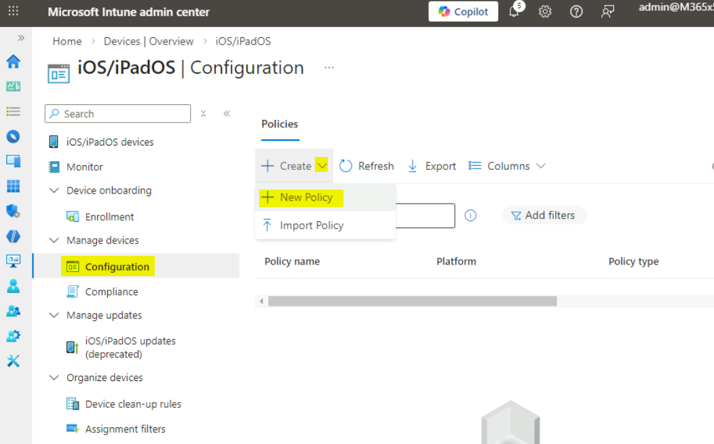

5.  In the **Create a profile** blade, select the following options, and
    then select **Create**:

    - Platform: **iOS/iPadOS**

    - Profile type: **Templates**

    - Template name: **VPN**

> 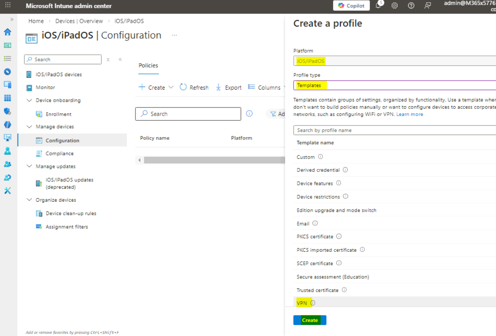

6.  In the **Basics** blade, enter the following information, and then
    select **Next**:

    - Name: !!**iOS/iPadOS Wi-Fi Policy**!!

    - Description: !!**VPN settings for iOS/iPadOS Devices**!!

> 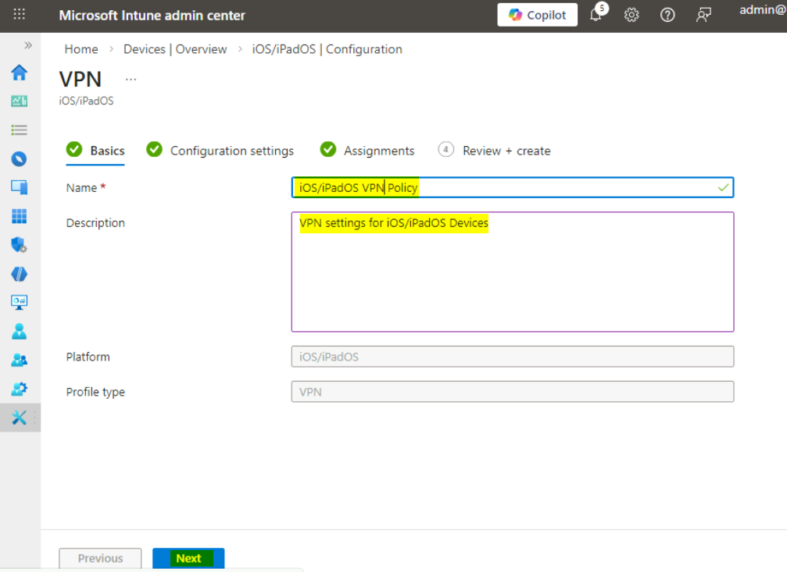

7.  On the **Configuration settings** blade, next to **Connection
    type**, select **Microsoft Tunnel**.

> Additional options display based upon the type selected.

8.  On the **Configuration settings** blade, select the following
    options, and then select **Next**:

    - Connection name: !!**Contoso VPN**!!

    - Microsoft Tunnel site: !!**Contoso secure access site**!!

> 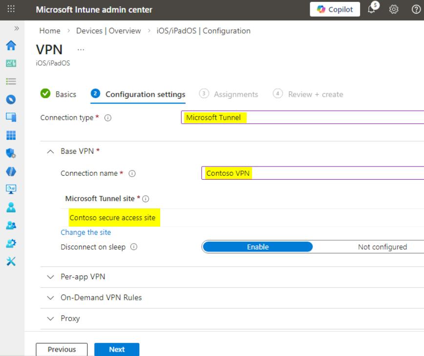

9.  On the **Assignments** blade, under **Included groups**,
    select **Add groups**.

> 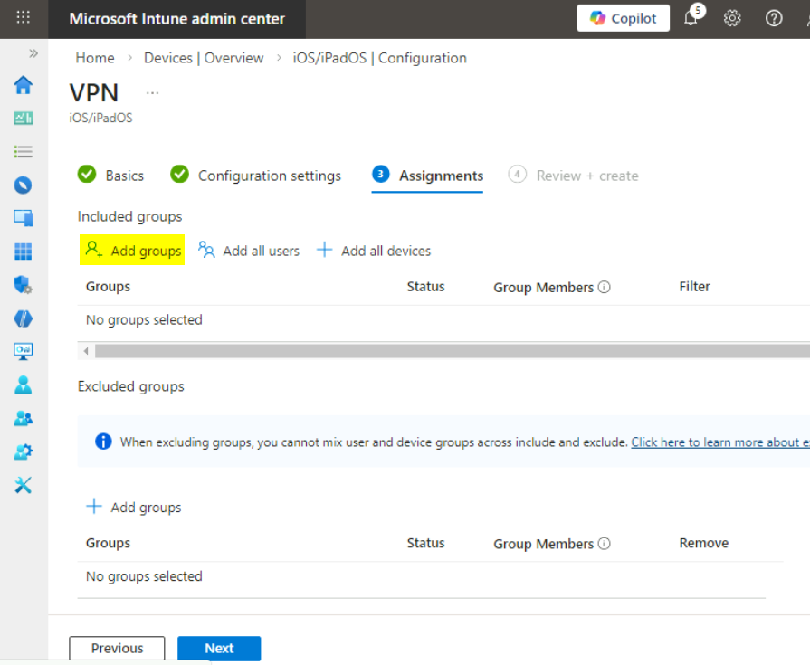

10. In the **Select groups to include** window, select **iOS_iPadOS
    Devices**, and then click **Select**.

> 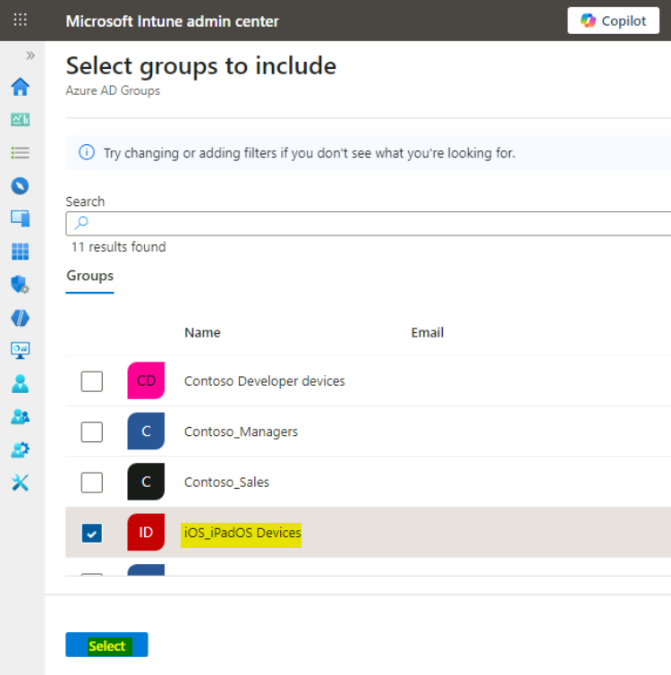

11. In the **Assignments** tab, click on the **Next** button.

> 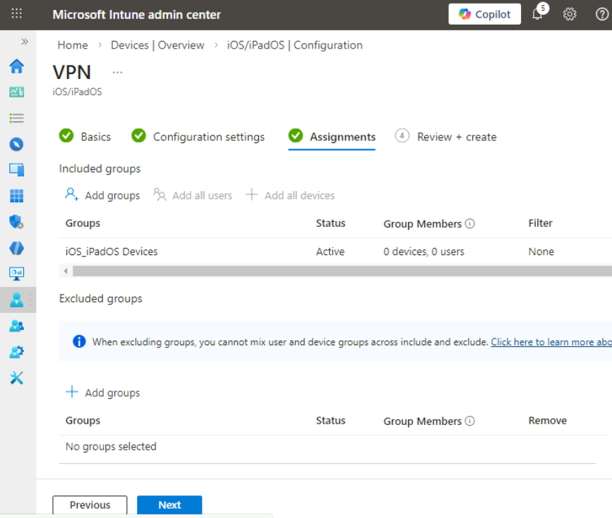

12. In the **Review + create** tab, click on the **Create** button.

> 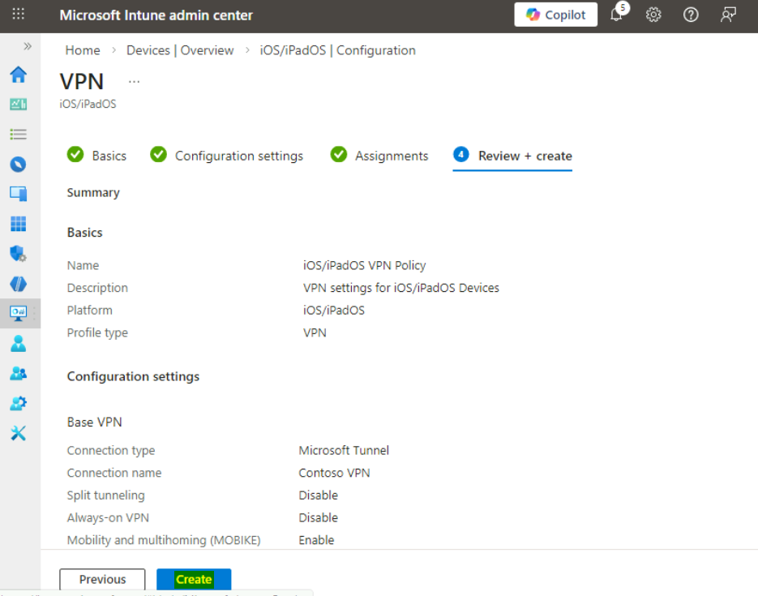

13. Verify that the **iOS/iPadOS VPN Policy** is listed.

> 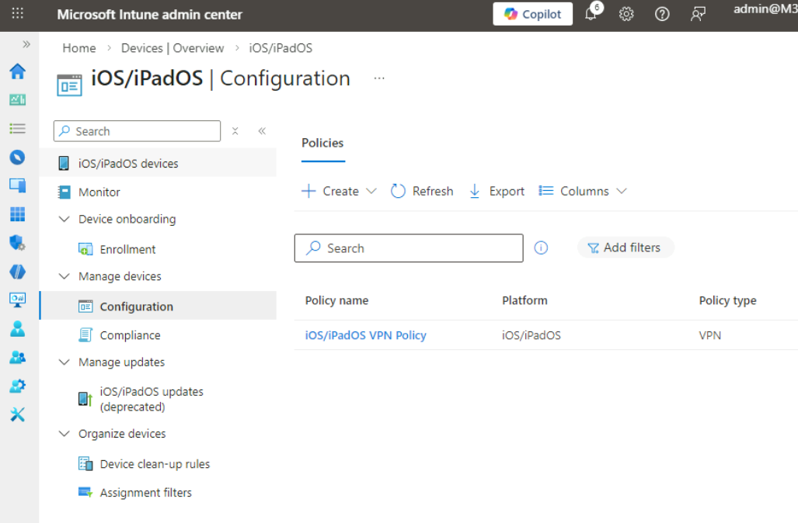
>
> **Results**: After completing this exercise, you will have
> successfully created and assigned a Configuration profile to configure
> Wi-Fi settings for iOS and iPadOS devices.
