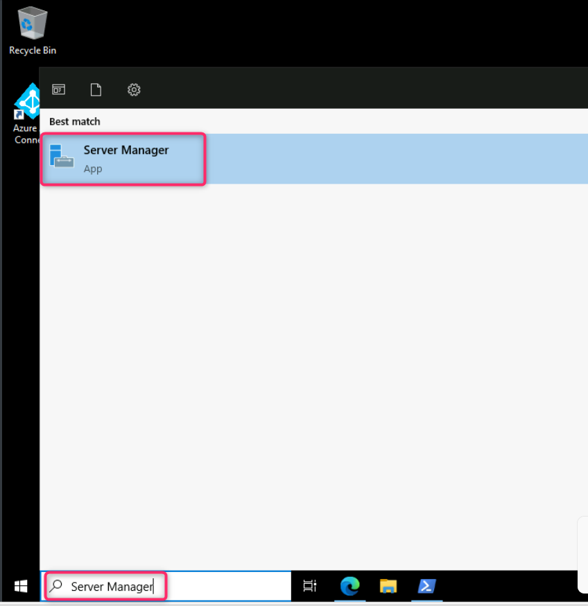
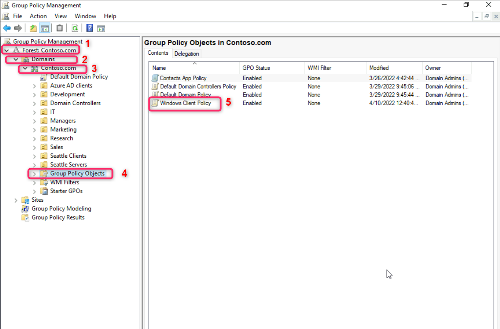
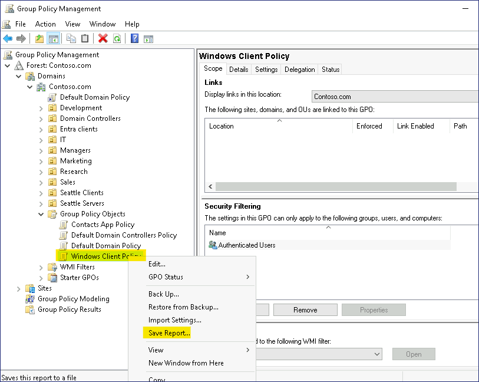
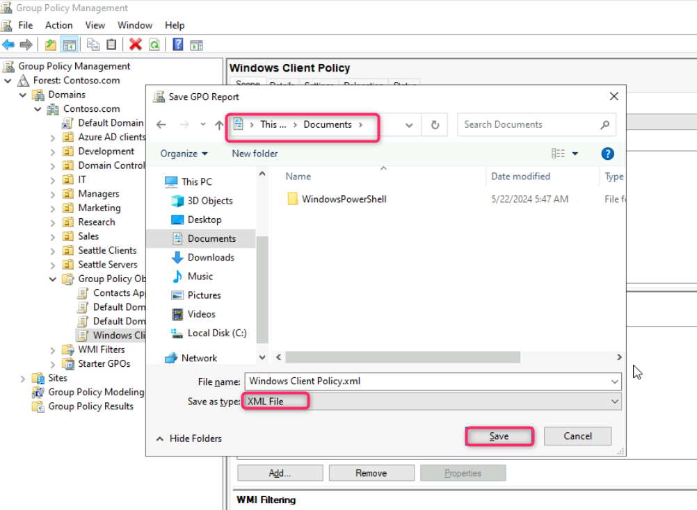
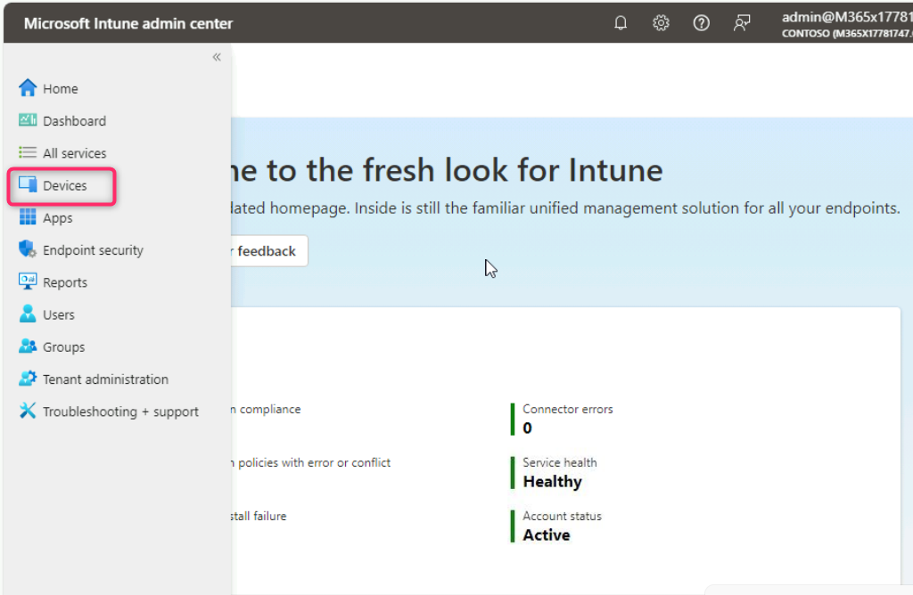
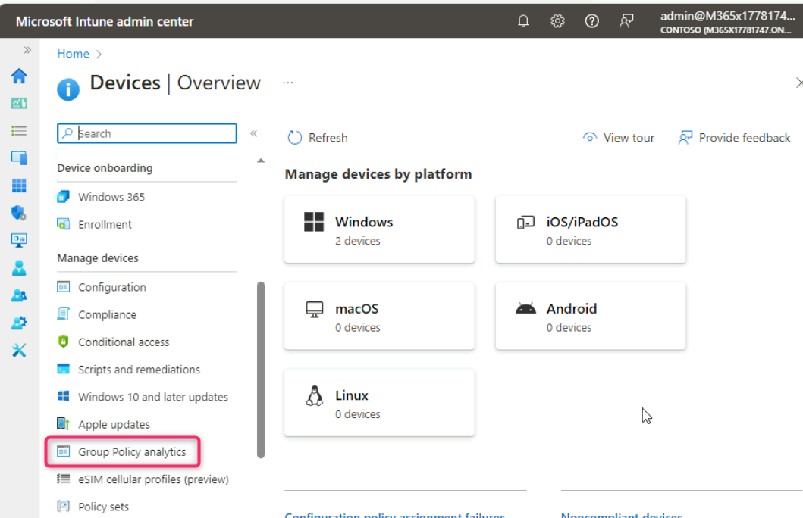
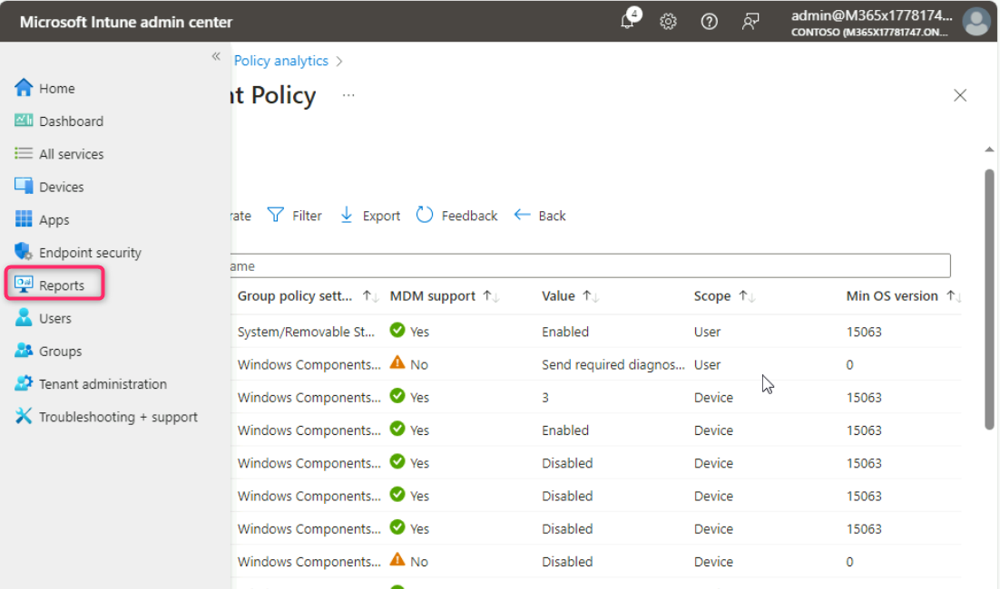
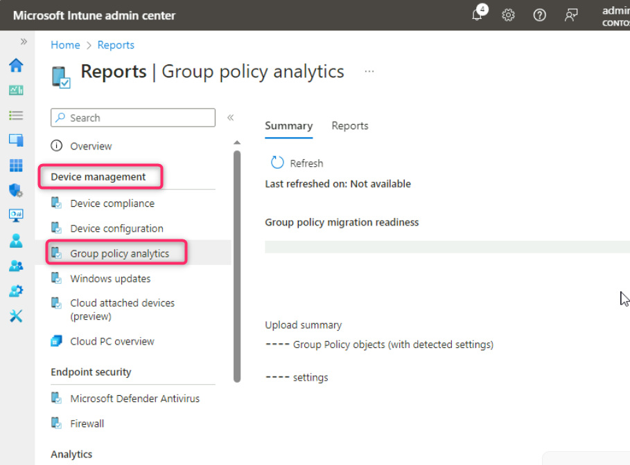

**Lab 10 - Using Group Policy Analytics to validate GPO support in
Microsoft Intune**

**Summary**

In this lab, you use Group Policy Analytics to import an Active
Directory Group Policy Object (GPO) and identify settings that support
equivalent Microsoft Intune MDM policy.

**Scenario**

Contoso has traditionally used Active Directory GPOs to deploy computer
and user policy settings throughout the domain. You plan to move all
supported GPO settings to Microsoft Intune configuration profiles. You
have a GPO named **Windows Client Policy**. You need to use Group Policy
Analytics to validate the settings in the Windows Client Policy GPO and
identify which settings can be successfully migrated into Intune.

**Task 1: Export the Windows Client Policy GPO to an XML file**

1.  Login to  with the provided credentials search bar, type !!**Server
    Manager**!! and then select it.

> 

2.  In **Server Manager - Dashboard**, select **Tools** and then
    select **Group Policy Management**.

> 

3.  In the Group Policy Management console,
    expand **Forest:Contoso.com**, then **Domains**, then
    **Contoso.com**, and then select **Group Policy Objects**.

> Verify that there are several Group Policy Objects listed.

4.  In the details pane, select the **Windows Client Policy** GPO.

> 

5.  Right-click on **Windows Client Policy** and then select **Save
    Report**.

> 

6.  In the Save GPO Report dialog box, select **Documents**, change
    the **Save as type** to **XML file**, and then select **Save**.

> 

7.  Close the Group Policy Management console.

8.  Close Server Manager.

**Task 2: Analyze the Windows Client GPO using Group Policy Analytics**

1.  Open Microsoft Edge, type !!**https://intune.microsoft.com**!! in
    the address bar, and then press **Enter**.

2.  Sign in with Office 365 Tenant credentials if prompted.

3.  In the **Microsoft Intune admin center**, navigate and
    select **Devices**.

> 

4.  Navigate to **Manage devices** section and select **Group Policy
    analytics**.

> 

5.  On the **Devices | Group Policy analytics** blade,
    select **Import**.

> 

6.  On the **GPO file upload** tab, click on the folder beside **Select
    a file** search bar as shown in the below image.

> 

7.  In the **Open** box, select **Documents** and then select **Windows
    Client Policy.xml**. Then, click on the **Open** button.

> 

8.  Click on the **Next** button.

> 

9.  In the **Scope tags**, click on the **Next** button.

> 

10. In the **Review + create** tab, click on the **Create** button.

> 

11. The Windows Client Policy GPO is immediately imported and analyzed.
    Close the **Import GPO files** page.

12. On the **Devices | Group Policy analytics** blade, review the
    information next to **Windows Client Policy**.

> Notice that 89% of the settings have MDM support.
>
> 

13. Under MDM Support, select **89%**.

> Notice each **Setting Name**, **MDM Support**, **CSP Name**, and
> the **CSP Mapping** for each supported setting. Take note of which
> settings do not have an equivalent CSP mapping.
>
> 

14. Close the **Windows Client Policy** window.

**Task 3: Review the Group Policy Analytics Summary Report**

1.  In the **Microsoft Intune admin center** navigation menu,
    select **Reports**.

> 

2.  On the **Reports** page, in the **Device management** section,
    select **Group Policy analytics**.

> 

3.  In the details pane, under **Summary**, select **Refresh**. You may
    need to refresh couple of times

> It may take 5-10 minutes to refresh and build the summary report.

4.  Review the **Group policy migration readiness** information.

> 
>
> There should be a number of policies ready for migration and a number
> of policies not supported.

5.  Select the **Reports** tab, and then select **Group policy migration
    readiness**.

> 

6.  Select **Generate report**.

> 

7.  The Group policy migration readiness report provides information
    related to each setting, and the Profile Type supported.

> 

8.  Close the **Group policy migration readiness** window.

**Results**: After completing this exercise, you will have successfully
exported a GPO and used Group Policy Analytics to validate equivalent
policy settings in Intune.
