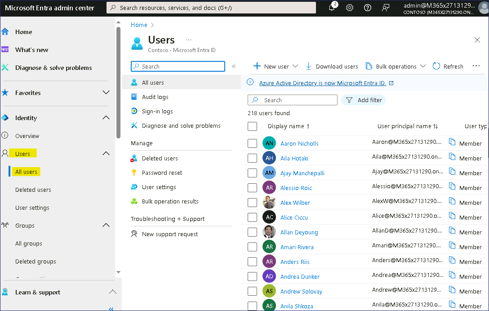
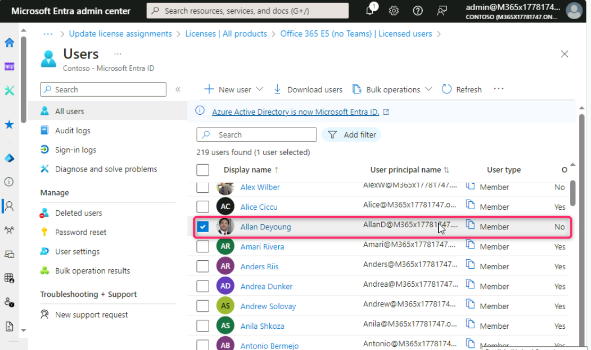
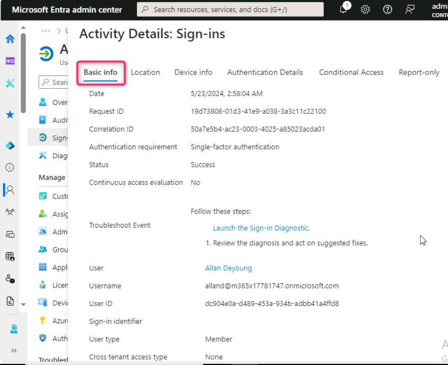
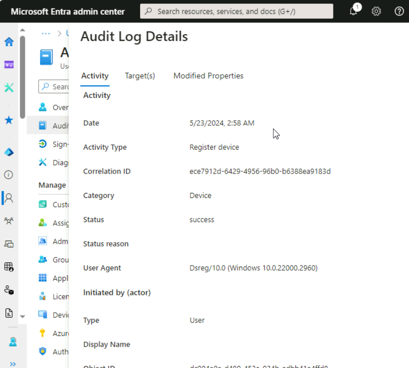
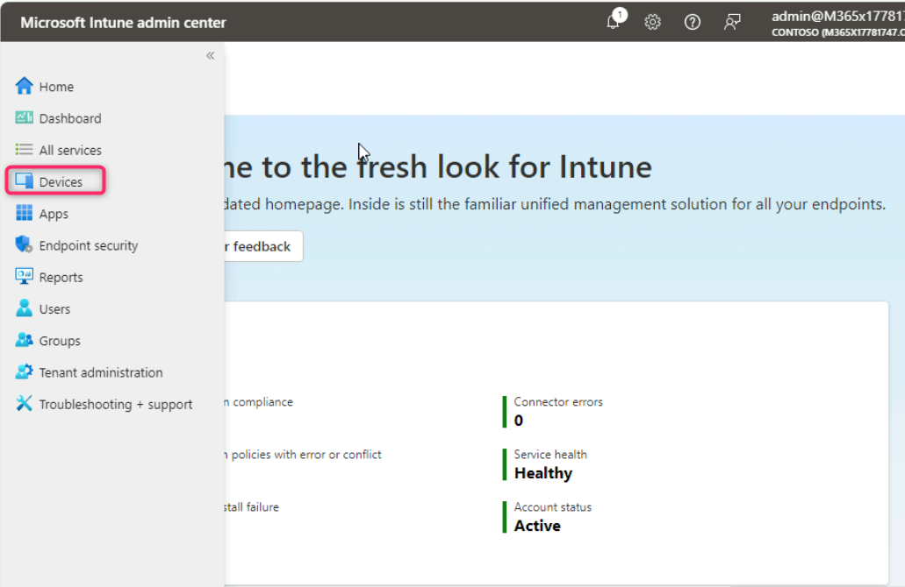
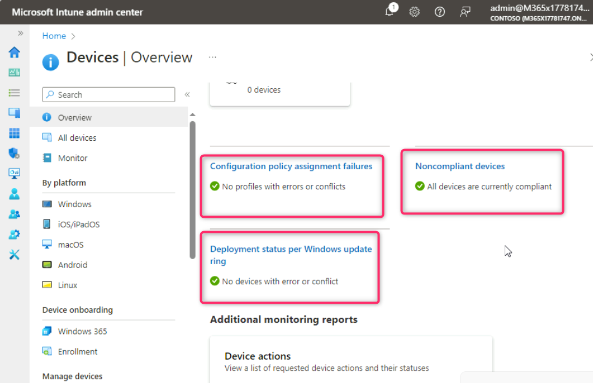
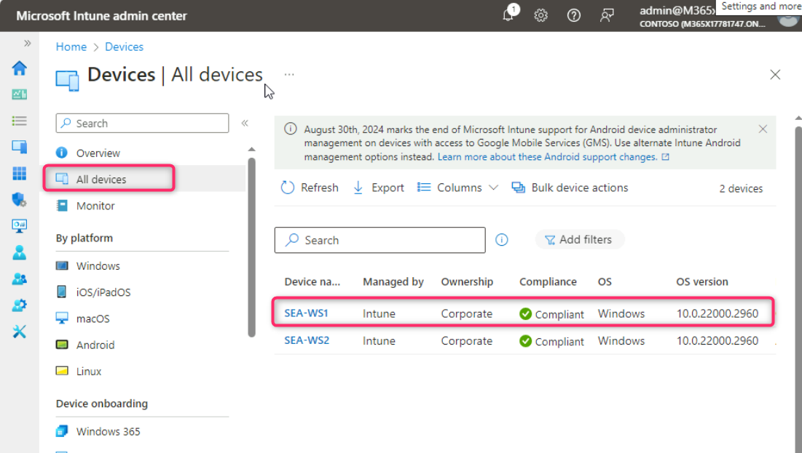
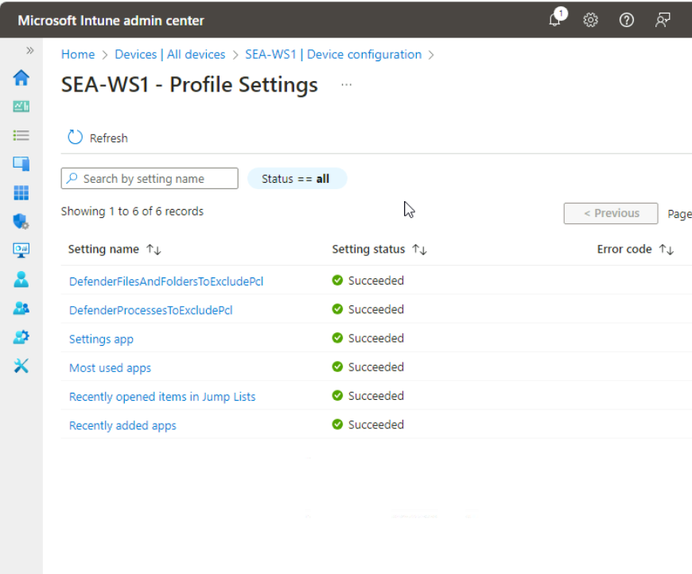

**Lab 11- Monitor device and user activity in Intune**

**Summary**

In this lab, you will monitor user Sign-in activity, Audit logs, and
device activity.

**Prerequisites**

To following lab(s) must be completed before this lab:

- Lab \#1-Managing Identities in Microsoft Entra ID

- Lab \#2-Synchronizing Identities by using Microsoft Entra Connect

- Lab \#5-Manage Device Enrollment into Microsoft Intune

- Lab \#6-Enrolling devices into Microsoft Intune

- Lab \#7-Creating and Deploying Configuration Profiles

**Note**: You will also need a mobile phone that can receive text
messages used to secure Windows Hello sign in authentication to
Microsoft Entra ID.

**Scenario**

You need to review Cindy White sign-in activity and general information
provided by the Audit logs. You also need to verify the hardware
On [*SEA-WS1*](https://labclient.labondemand.com/Instructions/e7cc4ae1-e3d9-4c55-accc-696f537e1e17?rc=10) and
confirm the configuration profile assigned to this device is
successfully applied.

**Task 1: Monitor user activity**

1.  Switch to
    *[SEA-SVR1](https://labclient.labondemand.com/Instructions/e7cc4ae1-e3d9-4c55-accc-696f537e1e17?rc=10)*
    and login with the provided credentials if required.

2.  On the **Microsoft Entra admin center** page, navigate and select
    **Users**, then click on **All users**.

> 

3.  In the **Users** page, navigate and select **Allan Deyoung**.

> 

4.  In the **Allan Deyoung** User page, navigate and click on **Sign-in
    logs**.

> 

5.  In **Allan Deyoung | Sign-in logs** page, click on the first entry
    under the **User sign-ins (interactive)** tab.

> 

6.  Select each of the main pages, including **Basic
    info**, **Location**, **Device info**, **Authentication Details**,
    and **Conditional Access**. Scroll down and examine information on
    each page. After carefully reviewing the information provided in
    each page, close the pane.

> 
>
> 
>
> 
>
> 
>
> 

7.  In the Users navigation pane, select **Audit logs**.

8.  In the details pane, audit information is displayed about
    administrative changes to users. Examine the information by
    selecting the various entries.

> 
>
> 

**Task 2: Monitor device activity**

1.  Switch to **Microsoft Intune admin center** window, navigate and
    click on **Devices**.

2.  In the Devices navigation pane, select **Overview**.

> 

3.  Scroll down and review the following:

- Configuration policy assignment failures

- Noncompliant devices.

- Deployment status per Windows update ring.

> 

4.  Scroll down to **Manage devices** section and click on
    **Configuration**. Review the configuration details.

> 

5.  Scroll up and select **All devices**. In the **Devices | All
    devices** page, information about the devices such as Device name,
    Managed by, Ownership, Compliance, OS, and OS version are displayed.
    Click on **SEA-WS1**.

> 

6.  In the SEA-WS1 navigation pane, select **Hardware** and examine the
    hardware inventory.

> 

7.  In the SEA-WS1 navigation pane, select **Discovered apps** and
    examine the app inventory.

> 

8.  In the SEA-WS1 navigation pane, select **Device configuration** and
    in the details pane take note of the Device configuration profiles
    assigned to the device. The **State** column should
    display **Succeeded**, which means that the profiles were applied
    successfully to the device.

> 

9.  In the **SEA-WS1 | Device configuration** page, click on **Contoso
    Developer – standard**.

> 

10. On the **Contoso Developer – standard** blade, take note of each
    setting you configured in the profile.

> The **State** should display **Succeeded** next to all of them.
>
> 

**Results**: After completing this exercise, you will have successfully
monitored user Sign-in activity, Audit logs, and device activity.
