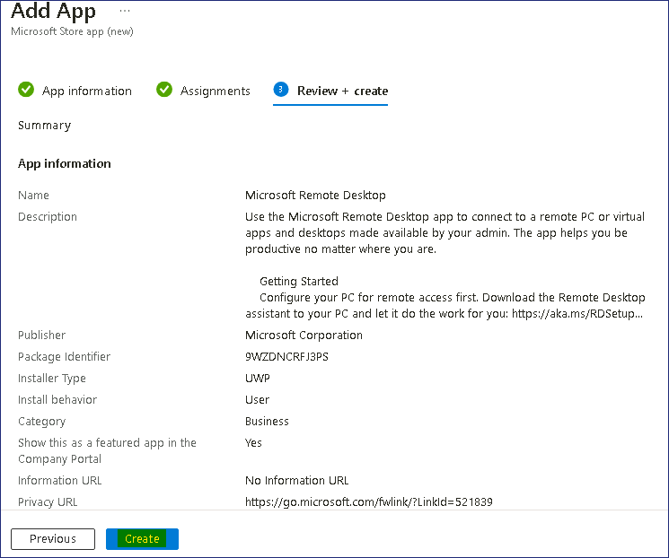
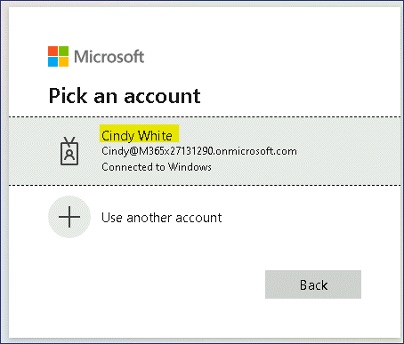
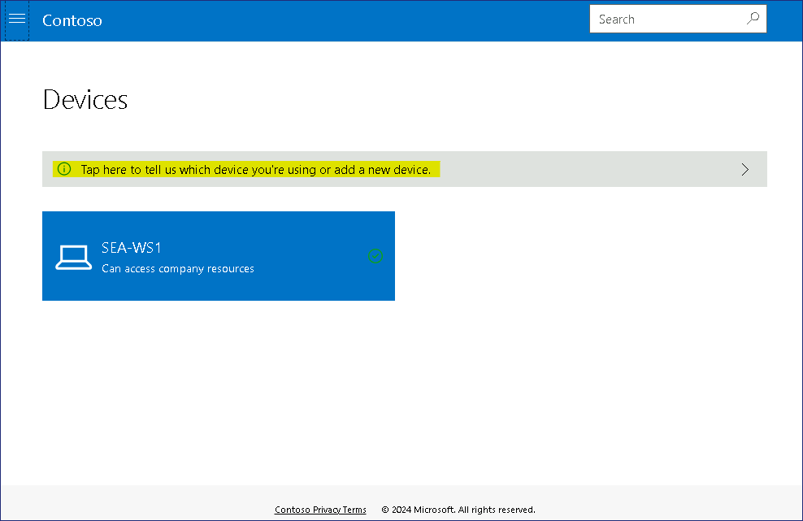
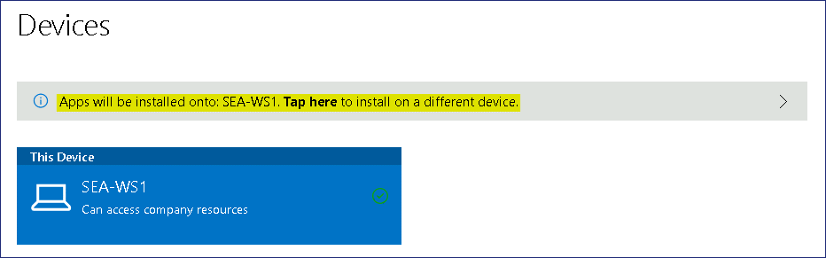
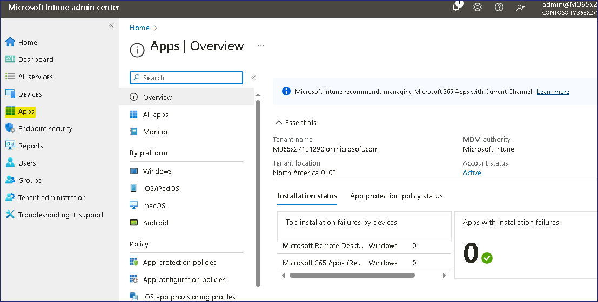

Lab12 - Deploying cloud apps using Microsoft Intune

**Summary**

In this lab, you create and deploy cloud-based apps using Intune and the
Company Portal Website.

**Prerequisites**

To following lab(s) must be completed before this lab:

- Lab \#1-Managing Identities in Microsoft Entra ID

- Lab \#2-Synchronizing Identities by using Microsoft Entra Connect

- Lab \#5-Manage Device Enrollment into Microsoft Intune

- Lab \#6-Enrolling devices into Microsoft Intune

- Lab \#7-Creating and Deploying Configuration Profiles

**Note**: You will also need a mobile phone that can receive text
messages used to secure Windows Hello sign in authentication to
Microsoft Entra ID.

Exercise 1: Add a Microsoft Store App to Microsoft Intune

**Scenario**

You use Microsoft Intune to manage desktops and apps for Contoso
Corporation. The Research department often connects to various servers
to perform tasks and has asked for the Microsoft Remote Desktop app to
be available for Research members to install as needed. The Microsoft
Remote Desktop is available from the Microsoft Store, but you decide to
add the app to Intune so that users can access it from the Company
Portal website. A Research member named Aaron Nicholls has agreed to
test the installation process after you have published the app to the
portal.

Task 1: Add Microsoft Remote Desktop to Microsoft Intune

1.  On SEA-SVR1,
    if necessary, sign in
    as **Contoso\Administrator** with
    the password !!Pa55w.rd!!  and
    close **Server Manager**.

2.  On the taskbar, select **Microsoft Edge**.

3.  In Microsoft Edge, type !!https://Intune.microsoft.com!! in the
    address bar, and then press **Enter**.

4.  Sign in using the Office 365 Tenant credentials from the Home tab.

5.  On the **Microsoft Intune admin center** page, select **Apps**.

     

6.  On the **Apps** page, in the navigation pane, select **All apps**.

7.  In the details pane, select **+Add**.

     

8.  On the **Select app type** page, click the drop-down menu, and then
    select **Microsoft store app (new)**.

     

     Read the information about Microsoft store app and then
     click **Select**. The **Add App** page opens.

9.  On the **App information** page, click on **Search the** **Microsoft
    Store app (new)** link.

     

10. On the **Search the** **Microsoft Store app (new)** tab search and
    select !!Microsoft Remote Desktop!!
    then click on the Select button.

     

11. Back on the Add App tab, enter the following information and then
    select **Next**:

    - Category: **Business**

    - Show this as a featured app in the Company Portal: **Yes**

     

12. On the **Assignments** tab, click on **+ Add group**

     

13. On the **Select groups** page, select the **Research** group and **sales** group, and
    then click **Select**.

     

14. Click on **Next** button.

     

15. On the Review + create tab, click on the **Create** button.

     

16. The Microsoft Remote Desktop page opens.

     Take note of the Properties, Device install status, and User install
     status nodes.

     

**Task 2: Force policy synchronization from the Microsoft Intune console**

1.  In the **Microsoft Intune admin center**, select **Devices** and
    then select **All devices**.

2.  In the details pane, select **SEA-WS1**.

     

3.  On the **SEA-WS1** blade, select **Sync** and when prompted
    select **Yes**.

     

     Microsoft Intune will contact the device and synchronize all policies.
     This may take up to 5 minutes.

**Task 3: Install an app from the Company Portal Website**

1.  Sign in to SEA-WS1  as **Cindy White** using her credentials
    !!**Cindy@M365xXXXXXX.onmicrosoft.com**!! with Password
    !!**P@55w.rd1234**!! or with the PIN !!**102938**!!

2.  On the taskbar, select **Microsoft Edge**.

3.  If necessary, at the **Welcome to Microsoft Edge** page,
    select **Confirm and continue**. Close the Welcome page.

4.  In the address bar browse
    to !!https://portal.manage.microsoft.com!!

5.  Sign in as !!Cindy@M365xXXXXXX.onmicrosoft.com!!

     

6.  On the Contoso web portal, select **Devices**.

     

7.  On the Devices page, select **Tap here to tell us which device
    you're using or add a new device**.

     

8.  On the **Which device are you using** dialog box, select the option
    next to **SEA-WS1**, and then click on the **Select** button.

     

      Notice that the message now changes to Apps will be installed
      onto: **SEA-WS1**
    
     

9.  At the top-left corner, select the navigation button and then
    select **Downloads & updates**.

     

10. From the listed results, check the status, the **Microsoft Remote
    Desktop** app should appear as **Installed**.

     Note - It might take upto 10-20 minutes for the app to appear.
 
     

11. Click on the **Start** **Menu** and verify that **Remote
    Desktop** is displayed on the Start menu.

     

**Results**: After completing this exercise, you will have successfully
added and installed a Microsoft Store App from Microsoft Intune.

**Exercise 2: Configure and deploy Microsoft 365 Apps from Microsoft
Intune**

**Scenario**

All the users of the Research department at Contoso require Microsoft
365 Apps. You've been asked to deploy the 64-bit versions of Microsoft
Excel, Outlook, PowerPoint and Word to their Windows devices. You also
need to ensure they are configured for the Current Channel for updates.

**Task 1: Verify installed apps on SEA-WS1**

1.  On SEA-WS1, on the taskbar,
    select **Start** and then select the **Settings** app.

     

2.  In the **Settings** app, select **Apps**, then **Apps & features**.

     

     Verify that **Microsoft 365 Apps for enterprise - en-us** is not
     listed.

     

3.  Close all open windows.

**Task 2: Add Microsoft 365 apps to Microsoft Intune**

1.  Switch to SEA-SVR1, while in
    the **Microsoft Intune admin center**, select **Apps**.

2.  In the **Apps | Overview** blade, select **All Apps**. In the
    details pane, select **+Add**.

     

3.  In the **Select app type** blade, under **Microsoft 365 Apps**,
    select **Windows 10 and later**, and then click **Select**.

     

4.  On the **Add Microsoft 365 Apps** blade, configure the following
    options and select **Next**:

    - Suite Name: !!Microsoft 365 Apps (Research)!!

    - Suite Description: !!Microsoft 365 Apps for the Research department at Contoso!! (Select **Edit
      Description** to enter this information.)

     

5.  On the **Configure app suite** tab, expand the **Select Office
    apps** dropdown, select the following Office apps:

    - Excel

    - Outlook

    - PowerPoint

    - Word

     

6.  On the **Configure app suite** tab, configure the following options
    and select **Next**:

    - Architecture: **64-bit**

    - Default file format: **Office Open XML Format**

    - Update channel: **Current Channel**

    - Accept the Microsoft Software License Terms on behalf of
      users: **Yes**

     

7.  On the **Assignments** tab, in the **Required** section,
    select **Add group.**

     

8.  On the **Select groups** blade, select **Research**, and then
    choose **Select**.

     

9.  Select **Next**.

     

10. On the **Review + Create** tab, select **Create**.

     

11. On the **Microsoft 365 Apps (Research)** page,
    select **Properties**.

     

12. In the details pane verify that **Research** is listed
    under **Required** in the **Assignments** section.

     

**Task 3: Force policy synchronization from the Microsoft Intune console**

1.  In the **Microsoft Intune admin center**, select **Devices** and
    then select **All devices**.

2.  In the details pane, select **SEA-WS1**.

     

3.  On the **SEA-WS1** blade, select **Sync** and when prompted
    select **Yes**.

     

    > Microsoft Intune will contact the device and synchronize all policies.
    > This may take up to 5 minutes.

**Task 4: Verify Microsoft 365 apps are installed**

1.  If you are already signed in
    to SEA-WS1 as **Cindy White**.

     **Note** – You may need to wait approximately 10-15 minutes for the
     Microsoft 365 Suite to install on the device.

2.  Sign out and Sign in again to  as **Cindy White** using her
    credentials !!Cindy@M365xXXXXXX.onmicrosoft.com!! with Password
    !!P@55w.rd1234!!

3.  On **SEA-WS1**, on the taskbar,
    select **Start** and then select the **Settings** app.

     

4.  In the **Settings** app, select **Apps** and on the **Apps &
    features** page.

    

5.  Search for !!**Microsoft 365**!! and verify that **Microsoft 365
    Apps for enterprise - en-us** is listed.

      

6.  Close the **Settings** app and select the **Start** button.

7.  In the **Recommended** section you should be able to see the newly
    installed Apps which were selected from the Microsoft 365 Apps in
    Microsoft Intune .

     

**Task 5: Monitor app installation status in Microsoft Intune**

1.  Switch to ***SEA-SVR1*** and in the **Microsoft Intune admin center**, select **Apps**.

    

2.  On the **Apps | Overview** blade, select **Monitor** and then
    select **App install status**.

    

3.  In the details pane, select **Microsoft 365 Apps (Research)**.

    

4.  In the details pane, under **Device status** and under **User
    status**, verify that **1** is displayed under Installed.

    

     **Note**: This indicates that the app is installed on one device and
     for one user. Note that it may take some time for the information to
     display and may appear as **Install Pending**.

     **Note** – You can start **Lab 13** and then check back after
     **30-45** minutes.

    

5.  Select **Device install status**.

    In the details pane, you can see the devices that the app is installed
    on, and also the name of the user. The **Device Name** column should
    list **SEA-WS1** and the **Status** column should say **Installed**.
    This means that the app is installed on **SEA-WS1**.

    

6.  In the **Microsoft Intune admin center**, select **Devices**.

7.  On the **Devices | Overview** blade, select **All devices** and then
    in the details pane, select **SEA-WS1**.

     

8.  On the **SEA-WS1** blade, select **Managed Apps**.

9.  On the **SEA-WS1 | Managed Apps** blade, in the details pane,
    select **Microsoft 365 Apps (Research)**.

     

     On the **Microsoft 365 Apps (Research) - Installation
     details** window, you can see the entire lifecycle of the application,
     that is - when it was created, assigned, installation time and status
     and the last time the device checked in (synced with Microsoft
     Intune).

    

10. Close all open windows.

    **Results**: After completing this exercise, you will have successfully
    configured and deployed Microsoft 365 Apps from Microsoft Intune.
