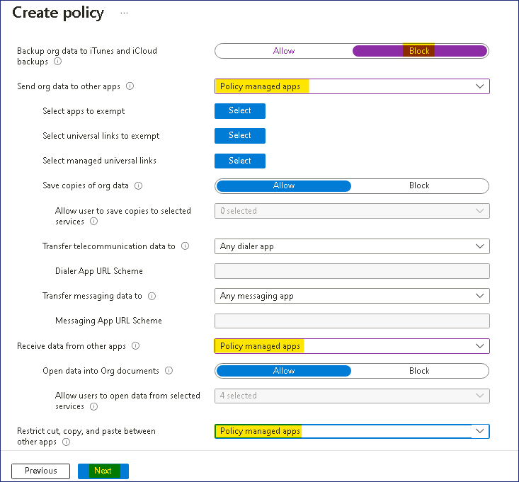

# Lab13: Configure App Protection Policies for Mobile Devices

**Summary**

In this lab, you will configure an App protection policy for a mobile
device.

**Scenario**

All of the developers at Contoso have iPhones and iPads running the
latest iOS/iPadOS versions. The security department is concerned with
data leaks and wants to prevent data from the corporate e-mail to be
copied out to other apps on the mobile devices. You must provide a
solution that addresses the concerns from the security department. You
need to ensure the following:

- Outlook data must be restricted from backing up to iTunes or iCloud.

- Only policy managed apps can send and receive data from Outlook.

- Only policy managed apps can cut, copy, or paste with Outlook.

- Users must provide their Work or school account credentials for access
  to Outlook.

Task 1: Create an App protection policy for iOS/iPadOS devices

1.  On SEA-SVR1, if necessary, sign in
    as Contoso\Administrator with the
    password !!Pa55w.rd!!

2.  On the taskbar, select **Microsoft Edge** and navigate to
    **Microsoft Intune admin
    center** !!https://intune.microsoft.com!!  in the address bar,
    and then press **Enter**.

3.  Sign in with the Office 365 Tenant admin credentials from the Home
    tab.

4.  On the **Microsoft Intune admin center** page, select **Apps**.

     

5.  On the **Apps | Overview** blade, under **Manage apps**, select **Protection**.

    

6.  In the details pane, select **+Create policy** and then
    select **iOS/iPadOS**.

     

7.  On the **Basics** tab, configure the following options and
    select **Next**:

    - Name: !!Outlook – Developers!!

    - Description: !!Policy to prevent cut/copy and paste from
      Outlook!!

     

8.  On the **Apps** tab, click + **Select public apps**.

9.  On the **Select apps to target** blade, in the text box, type
    !!**Outlook**!! Select **Microsoft Outlook** and then click on
    the **Select** button, and then select **Next**.

     

10. On the **Data protection** tab, configure the following options and
    select **Next**:

    - Backup Org data to ITunes and iCloud backups: **Block**

    - Send Org data to other apps: **Policy managed apps**

    - Receive data from other apps: **Policy managed apps**

    - Restrict cut, copy, and paste between other apps: **Policy managed
      apps**

    Leave all other settings at default

     

11. On the **Access requirements** tab, configure the following options
    and select **Next**:

    - PIN for access: **Not required**

    - Work or school account credentials for access: **Require**

     

12. On the **Conditional launch** tab, review the settings.
    Select **Next**.

     

     **Note**: Here you can set the sign-in security requirements for your
     access protection policy. You can select a setting and enter the value
     that users must meet to sign in to your company app. Make note of the
     various settings but do not change anything.

13. On the **Assignments** tab, select **Next**.

     

14. On the **Review + create** tab, review the settings and
    select **Create**.

     

15. On the **Apps | App protection policies** blade, in the details
    pane, verify that **Outlook - Developers** is listed.

     

16. Close Microsoft Edge.

    **Results**: After completing this exercise, you will have successfully
    configured an App protection policy for a mobile device.
