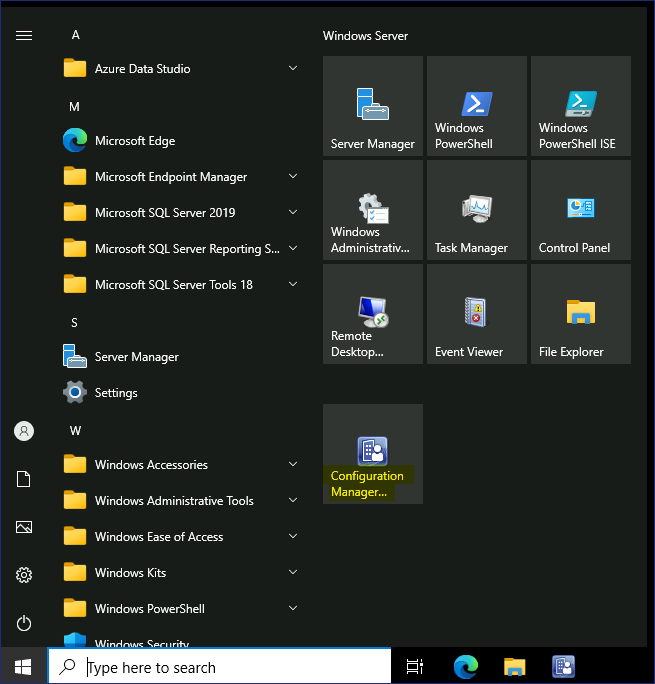
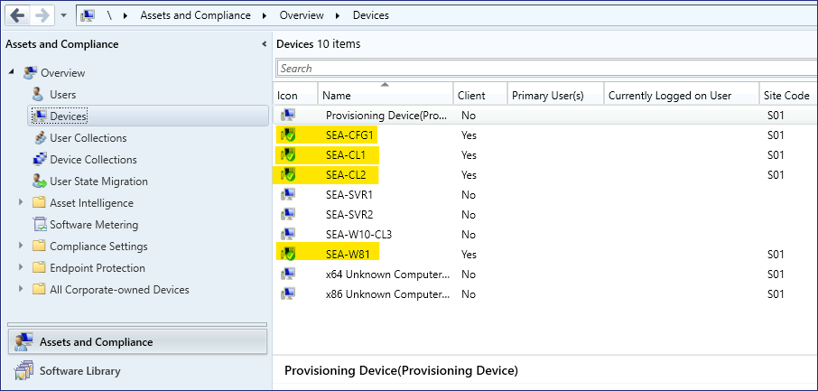
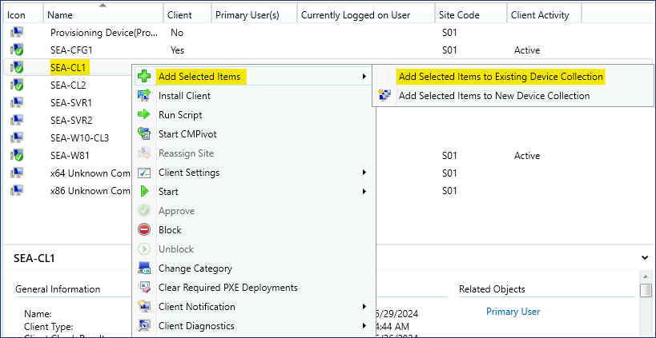
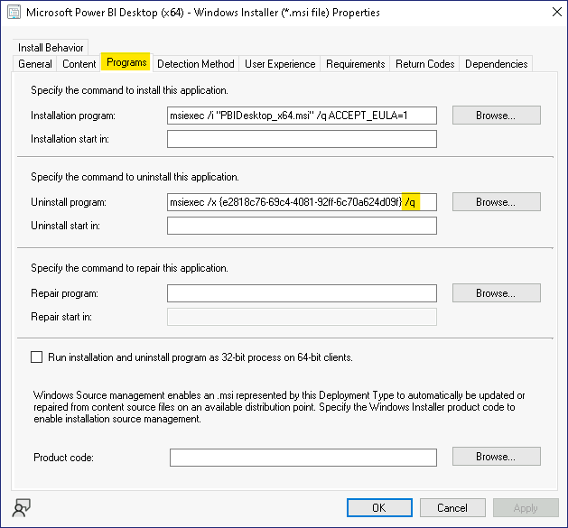
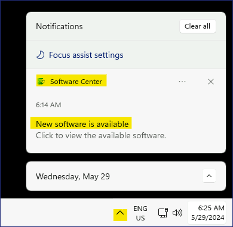
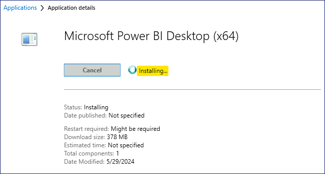

Lab14 - Deploy Apps using Endpoint Configuration Manager

**Summary**

In this lab, you will use Microsoft Endpoint Configuration Manager to
deploy applications to desktop client workstations.

**Scenario**

Contoso uses Microsoft Endpoint Configuration Manager to manage desktop
workstations within the on-premises Active Directory network
environment. You need to deploy a new application named Microsoft Power
BI desktop to the Windows 11 Configuration Manager clients. The Endpoint
Configuration Manager administrator has already created the application
object for you. Your tasks include creating a collection for the target
devices, distributing the application content to distribution points,
and then creating the deployment assigned to the target collection. You
will verify the process by ensuring that the application is displayed in
the Software Center on SEA-CL1.

Task 1: Create a device collection

1.  Switch to [***SEA-CFG1***](urn:gd:lg:a:select-vm), sign in
    as [**Contoso\Administrator**](urn:gd:lg:a:send-vm-keys) with the
    password !\!!.

2.  On the taskbar, select **Configuration Manager Console**. The
    Microsoft Endpoint Configuration Manager console opens.

> 

3.  In the **Assets and Compliance** workspace, select **Device
    Collections**.

> 

4.  Right-click **Device Collections** and then select **Create Device
    Collection**. The Create Device Collection Wizard opens.

> 

5.  On the **General** page, configure the following and then
    select **Next**:

    - Name: !\!!

    - Comment: !\!!

    - Limiting collection: **All Windows 11 Workstations**

> 

6.  On the **Membership Rules** page, select **Next**. At the
    Configuration Manager warning, select **OK**. You will add a direct
    member at a later step.

> 
>
> 

7.  On the **Summary** page, select **Next** and then on
    the **Completion** page, select **Close**.

> 
>
> The **Power BI App Deployment** collection is displayed in the Device
> Collections list.
>
> 

Task 2: Assign a Device to an existing Collection

1.  In the **Assets and Compliance** workspace, select **Devices**.

> Take note of the devices listed. Any device that has a green circle
> with a white checkmark are currently active.
>
> 

2.  In the details pane, select **SEA-CL1**.

3.  Right-click [***SEA-CL1***](urn:gd:lg:a:select-vm), point to **Add
    Selected Items**, and then select **Add Selected Items to Existing
    Device Collection**.

> 

4.  On the **Select Collection** dialog box, select **Power BI App
    Deployment**, and then select **OK**.

> 

5.  To verify, in the **Assets and Compliance** workspace,
    select **Device Collections** and then double-click **Power BI App
    Deployment**.

> 
>
> [***SEA-CL1***](urn:gd:lg:a:select-vm) should be listed as a member of
> this collection.
>
> 

Task 3: Configure a deployment type

1.  In the Microsoft Endpoint Configuration Manager console select
    the **Software Library** workspace.

> 

2.  In the **Software Library** workspace, expand **Application
    Management** and then select **Applications**.

> 
>
> 
>
> Notice the applications that have been created by the Endpoint
> Configuration Manager administrator.

3.  In the details pane, select **Microsoft Power BI Desktop (x64)**.

> 

4.  In the results pane, select the **Deployment Types** tab. Notice
    that there is one deployment type that is based upon Windows
    Installer.

> 

5.  Right-click the **Microsoft Power BI Desktop (x64) - Windows
    installer** deployment type and then select **Properties**.

> 

6.  In the **Properties** dialog box, select the **Programs** tab. Take
    note of how the application is installed. It will use msiexec with
    the /q switch which performs a quiet installation.

> 

7.  In the **Properties** dialog box, select the **Requirements** tab
    and then select **Add**.

> 

8.  In the **Create Requirement** dialog box, configure the following
    and then select **OK**:

    - Category: **Device**

    - Condition: **Operating System**

    - Rule type: **Value**

    - Operator: **One of Windows 11 (Select the check box next to
      Windows 11)**

> 

9.  In the **Properties** dialog box, select **OK**. This requirement
    will prevent the app from installing on any operating system except
    Windows 11.

> 

Task 4: Distribute content to distribution points

1.  In the **Software Library** workspace, select **Microsoft Power BI
    Desktop (x64)**.

2.  Right-click **Microsoft Power BI Desktop (x64)** and then
    select **Distribute Content**.

> 

3.  On the **General** page, select **Next**.

> 

4.  On the **Content** page, select **Next**.

> 

5.  On the **Content Destination** page, select **Add** and then
    select **Distribution Point**.

> 

6.  On the **Add Distribution Points** dialog box, select the check box
    next to **SEA-CFG1.CONTOSO.COM**, and then select **OK**.

> 

7.  On the **Content Destination** page, select **Next**.

> 

8.  On the **Summary** page, select **Next** and then select **Close**.

> 
>
> 

9.  In the **Summary** tab, select **Content Status**.

> 
>
> The Content Status page opens for Microsoft Power BI Desktop. In the
> results pane, verify that a green circle is displayed and that
> Success:1 displays next to the circle. This indicates that the content
> is now distributed to the distribution points and can now be deployed
> to devices. You may need to select the Refresh button in the ribbon.
>
> 

10. In the top left corner select the **Back to Applications** arrow to
    return to the Software Library Applications node.

Task 5: Create a deployment

1.  In the **Software Library** workspace, select **Microsoft Power BI
    Desktop (x64)**.

2.  Right-click **Microsoft Power BI Desktop (x64)** and then
    select **Deploy**. The **Deploy Software Wizard** opens.

> 

3.  On the **General** page, next to **Collection**, select **Browse**.

> 

4.  On the **Select Collection** page, select **User Collections** and
    then select **Device Collections**.

5.  In the **Device Collections** list, select **Power BI App
    Deployment** and then select **OK**.

> 

6.  On the **General** page, select **Next**.

> 

7.  On the **Content** page, select **Next**.

> 

8.  On the **Deployment Settings** page, verify that the **Action** is
    set to **Install** and the **Purpose** is set to **Available**.
    Select **Next**.

> 

9.  On the **Scheduling** page, select **Next**. The application will be
    available as soon as possible by default.

> 

10. On the **User Experience** page, next to **User notifications**,
    select **Display in Software Center and show all notifications**.
    Select **Next**.

> 

11. On the **Alerts** page, select **Next**.

> 

12. On the **Summary** page, select **Next** and then select **Close**.

> 
>
> 

13. In the results pane, on the **Deployments** tab, verify that the
    deployment displays.

> 

14. Close the Microsoft Endpoint Configuration Manager console.

15. Sign out of [***SEA-CFG1***](urn:gd:lg:a:select-vm).

Task 6: Use Software center to install a deployed app

1.  Switch to [***SEA-CL1***](urn:gd:lg:a:select-vm), and sign in
    as [**Contoso\Administrator**](urn:gd:lg:a:send-vm-keys) with the
    password of !\!!.

2.  Click on the **Start Menu** and then enter **Control Panel**.

3.  In the results, select **Control Panel**.

> 

4.  In the **Control panel**, select **System and Security**.

> 

5.  In **System and Security**, select **Configuration Manager**.
    Configuration Manager Properties is displayed.

> 

6.  In the **Configuration Manager Properties** dialog box, select
    the **Actions** tab.

> 

7.  On the **Actions** tab, select **Machine Policy Retrieval &
    Evaluation Cycle**, and then select **Run Now**. At the message
    prompt, select **OK**.

> 
>
> 

8.  Select **OK** to close the **Configuration Manager Properties**, and
    then close **Control Panel**.

> 

9.  In the notification area, select **New Software is Available** and
    then select **Open Software Center**. You might need to expand the
    notification area arrow to display the icon.

> 
>
> If the Software Center does not launch, then click on the **Start
> Menu** and scroll down and click on !!**Software Center**!!
>
> 

10. In the **Software Center**, on the **Applications** page, notice the
    new application available named **Microsoft Power BI Desktop
    (x64)**. This application is now available to any device that is a
    member of the **Power BI App Deployment** collection created
    previously.

> 

11. Select **Microsoft Power BI Desktop (x64)** and then
    select **Install**.

> 
>
> 
>
> The application downloads and installs without user input. You will
> know that the installation was successful when the **Power BI
> Desktop** shortcut displays on the desktop.
>
> 

12. Close Software Center.

13. Sign out of [***SEA-CL1***](urn:gd:lg:a:select-vm).

**Results**: After completing this exercise, you will have successfully
used Microsoft Endpoint Configuration Manager to deploy applications to
desktop client workstations.
