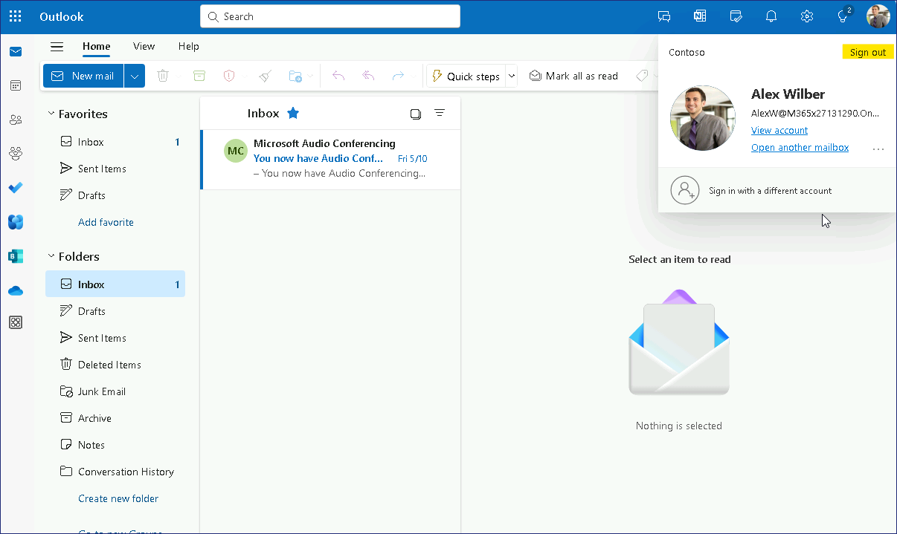
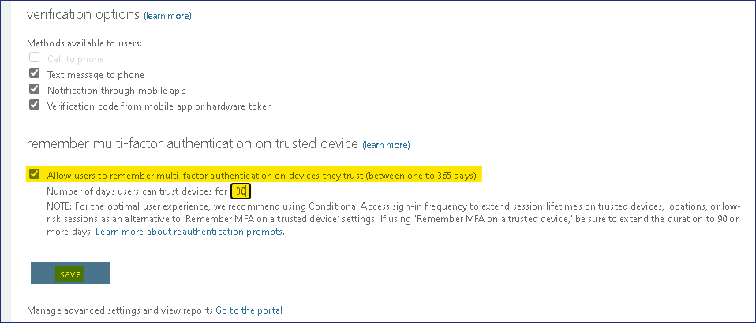
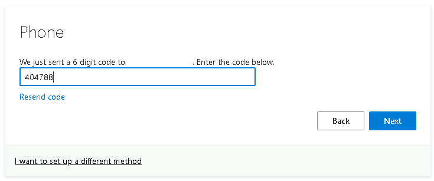
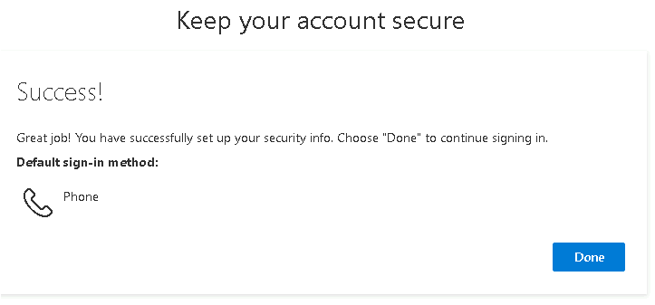
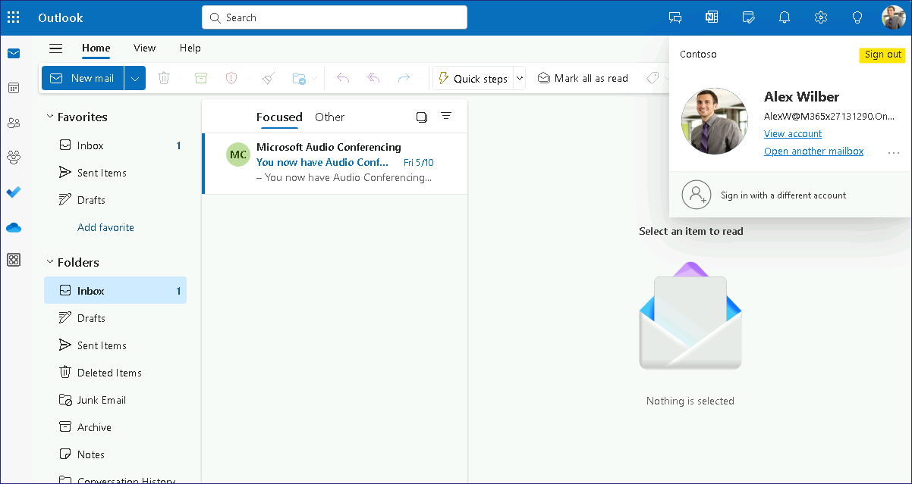
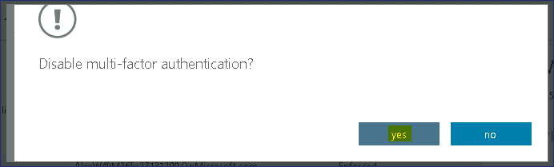
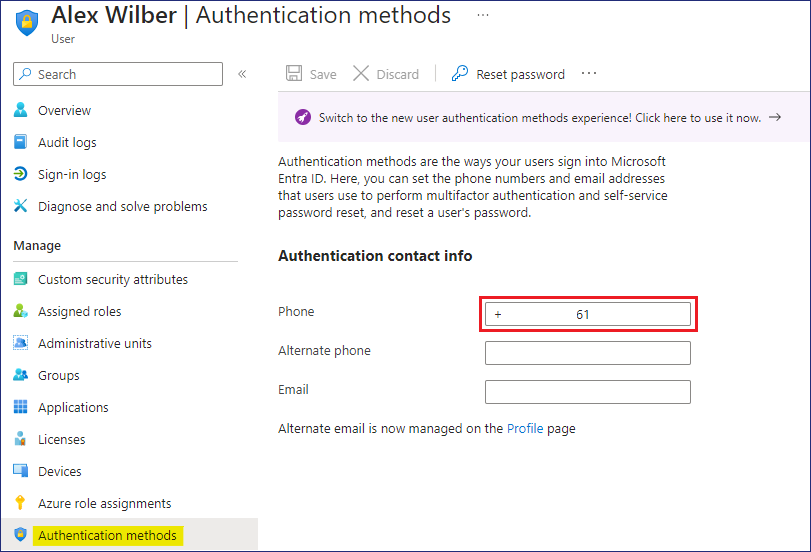

Lab 15 - Configuring Multi-factor Authentication

**Summary**

In this lab, you will configure per-user multi-factor authentication
(MFA) and apply MFA using a conditional access policy.

Exercise 1: Configure per-user multi-factor authentication.

**Scenario**

To provide additional security for user sign on events, you need to
configure and test multi-factor authentication (MFA). You decide to
first test out per-user MFA. Alex Wilber has agreed to validate the
settings for you.

Task 1: Validate sign-in before enabling MFA

1.  Switch and sign in
    to [**SEA-WS3**](urn:gd:lg:a:select-vm) as !\!!
    with the password !\!!

2.  On the taskbar, select **Microsoft Edge**. In the address bar,
    enter !\!!  and
    press Enter.

3.  At the **Sign in** page,
    enter !!**AlexW@M365xXXXXXXX.onmicrosoft.com**!!  and then
    select **Next**.

4.  On the **Enter password** page, enter !!**P@55w.rd1234**!! and
    select **Sign in**. At the Edge Save password prompt,
    select **Save**.

> Outlook on the Web opens. Take note that only the password was
> required to sign in to Outlook on the Web.

5.  At the top-right corner, select the **Account manager for Alex
    Wilber** and then select **Sign out**.

> 

6.  Close Microsoft Edge.

Task 2: Enable MFA for a user

1.  Switch to [**SEA-SVR1**](urn:gd:lg:a:select-vm).
    On [**SEA-SVR1**](urn:gd:lg:a:select-vm), if necessary, sign in
    as [**Contoso\Administrator**](urn:gd:lg:a:send-vm-keys) with the
    password of !! [**Pa55w.rd**](urn:gd:lg:a:send-vm-keys)!!  and
    close **Server Manager**.

2.  On the taskbar select **Microsoft Edge**, navigate to **Microsoft
    Entra admin center** !!**https://Entra.Microsoft.com**!!

3.  Sign in with **Office 365 Tenant admin** credentials.

> 
>
> The **Microsoft Entra admin center** opens.

4.  In the **Microsoft Entra admin center**, in the navigation pane,
    expand **Identity**, then select **Users**.

5.  Select **All users** and then at the top of the results pane
    select **Per-user MFA**. You may need to select the ellipse first to
    view the **Per-user MFA** option.

> 

6.  On the multi-factor authentication page, select **service
    settings**.

> 

7.  Scroll down to the **verification options** section.

> Take note of the various methods that can be configured for user
> verification.

8.  In the **remember multi-factor authentication on trusted
    device** section, select the check box next to **Allow users to
    remember multi-factor authentication on devices they trust**.

9.  Next to **Number of days users can trust devices for**,
    enter **30** and then select **save**. Select **close** when
    prompted.

> 
>
> 

10. At the top of the page, under **multi-factor authentication**,
    select **users**.

> 

11. In the user list, select the check box next to **Alex Wilber**.

12. In the Alex Wilber page, select **Enable**.

> 

13. On the **About enabling multi-factor auth** message, select **enable
    multi-factor auth**.

> 

14. On the **Updates successful** message, select **close**. Take note
    that the **Multi-Factor Auth Status** for Alex Wilber is
    now **Enabled**.

> 
>
> 

15. Close Microsoft Edge.

Task 3: Register and Validate MFA

1.  Switch to [**SEA-WS3**](urn:gd:lg:a:select-vm). On the taskbar,
    select **Microsoft Edge**.

2.  In the address bar,
    enter !\!!  and
    press Enter.

3.  On the **Pick an account** page,
    select !\!!

> 

4.  On the **Enter password** page, enter !!**P@55w.rd1234**!! and
    select **Sign in**.

5.  At the **More information required** page, select **Next**. The Keep
    you account secure page opens.

> 
>
> Typically, you will want to use the Microsoft Authenticator app to
> manage multi-factor authentication. However for this lab scenario, you
> will use text messages.

6.  On the **Keep your account secure** page, select **I want to set up
    a different method**.

> 

7.  In the **Choose a different method** dialog box, select **Phone**,
    and then select **Confirm**.

> 

8.  On the **Phone** page, enter your mobile phone number which you can
    receive text messages, and then select **Next**.

> 

9.  After you receive the verification code as a text message, enter the
    code where indicated on the **Phone** page and then select **Next**.

> 

10. At the SMS verified message, select **Next** and then
    select **Done**.

> 
>
> 

11. At the Stay signed in message, select **No**.

> 
>
> Outlook on the Web opens to Alex Wilber's inbox.

12. At the top-right corner, select the **Account manager for Alex
    Wilber** and then select **Sign out**.

> 
>
> **Note**: Users only have to register the first time they use MFA.
> Subsequent sign-ins only require providing the validation code which
> it texted to the phone number that you entered during registration.

13. In the address bar,
    enter !\!!  and
    press Enter.

14. On the **Pick an account** page,
    select !!**AlexW@M365xXXXXXXXX.onmicrosoft.com**!!

15. On the **Enter password** page, enter !!**P@55w.rd1234**!! and
    select **Sign in**.

> 
>
> The **Verify your identity** prompt opens. Notice that it contains the
> last two digits of your phone number.

16. At the **Verify your identity** prompt, select your Text phone
    number.

17. At the **Enter code** page, enter the code sent to your mobile
    phone, and then select **Verify**.

> 
>
> Notice that you can select a check box to not ask for verification
> again for 30 days.

18. As **Microsoft Authenticator App** ensure more security and smooth
    experience, you will be prompted to configure the same, for now
    click on **Skip for now**

> 

19. At the Stay signed in message, select **No**. Outlook on the Web
    opens to Alex Wilber's inbox.

> 

20. At the top-right corner, select the **Account manager for Alex
    Wilber** and then select **Sign out**.

> 

21. Close Microsoft Edge.

Task 3: Remove per-user MFA

1.  Switch to [**SEA-SVR1**](urn:gd:lg:a:select-vm).
    On [**SEA-SVR1**](urn:gd:lg:a:select-vm), if necessary, sign in
    as [**Contoso\Administrator**](urn:gd:lg:a:send-vm-keys) with the
    password of  !\!! and
    close **Server Manager**.

2.  On the taskbar select **Microsoft Edge**, navigate to **Microsoft
    Entra admin center** !!**https://Entra.Microsoft.com**!!

3.  Sign in with **Office 365 Tenant admin** credentials.

> 
>
> The **Microsoft Entra admin center** opens.

4.  In the **Microsoft Entra admin center**, in the navigation pane,
    expand **Identity**, then select **Users**.

5.  Select **All users** and then at the top of the results pane
    select **Per-user MFA**. You may need to select the ellipse first to
    view the **Per-user MFA** option.

> 

6.  At the top of the page, under **multi-factor authentication**,
    select **users**.

7.  In the user list, select the check box next to **Alex Wilber**.

> Take note that the **Multi-Factor Auth Status** for Alex Wilber is now
> set to **Enforced** (was previously set to Enabled). This is because
> Alex has registered and is using MFA.
>
> 

8.  In the Alex Wilber page, select **Manage user settings.**

> 

9.  On the Manage user settings box, select the check box next to all
    three options, select **save** and then select **close**.

> 
>
> These options will remove all saved MFA settings for Alex.
>
> 

10. In the user list, select the check box next to **Alex Wilber**.

11. In the Alex Wilber page, select **Disable**.

> 

12. On the **Disable multi-factor authentication** message,
    select **yes**.

> 

13. On the **Updates successful** message, select **close**.

> 
>
> Take note that the **Multi-Factor Auth Status** for Alex Wilber is
> now **Disabled**.
>
> 

14. Close Microsoft Edge.

**Results**: After completing this exercise, you will have successfully
configured per-user multi-factor authentication.

Exercise 2: Configure multi-factor authentication using conditional
access

**Scenario**

To provide additional security for user sign on events, you need to
configure and test multi-factor authentication (MFA). You decide that
using a conditional access policy provides greater flexibility for your
MFA requirements. Alex Wilber has agreed to validate the settings for
you.

Task 1: Validate sign-in before enabling conditional access with MFA

1.  Switch and sign in
    to [**SEA-WS3**](urn:gd:lg:a:select-vm) as !\!!
     with the password !\!!

2.  On the taskbar, select **Microsoft Edge**. In the address bar,
    enter !\!! and
    press Enter.

3.  At the **Sign in** page,
    enter !!**AlexW@M365xXXXXXXX.onmicrosoft.com**!!  and then
    select **Next**.

4.  On the **Enter password** page, enter !!**P@55w.rd1234**!!  and
    select **Sign in**. At the Edge Save password prompt,
    select **Save**.

> Outlook on the Web opens. Take note that only the password was
> required to sign in to Outlook on the Web.

5.  At the top-right corner, select the **Account manager for Alex
    Wilber** and then select **Sign out**.

> 

6.  Close Microsoft Edge.

Task 2: Configure conditional access with MFA

1.  Switch to [**SEA-SVR1**](urn:gd:lg:a:select-vm).
    On [**SEA-SVR1**](urn:gd:lg:a:select-vm), if necessary, sign in
    as [**Contoso\Administrator**](urn:gd:lg:a:send-vm-keys) with the
    password of  !\!!  and
    close **Server Manager**.

2.  On the taskbar select **Microsoft Edge**, navigate to **Microsoft
    Entra admin center** !!**https://Entra.Microsoft.com**!!

3.  Sign in with **Office 365 Tenant admin** credentials.

> 
>
> The **Microsoft Entra admin center** opens.

4.  In the **Microsoft Entra admin center**, in the navigation pane,
    expand **Identity**, then expand **Protection**, then **Conditional
    Access.**

> 

5.  On the **Conditional Access** page, select **Policies**, then select
    **+ New policy**.

> 

6.  On the **New Conditional access policy** page, in the **Name** box,
    enter !\!!.

7.  Under **Assignments**, select **0 users or workload identities
    selected**.

> 

8.  In the Users and groups pane, select the option next to **Select
    users and groups** and then select the check box next to **Users and
    groups**.

9.  On the **Select** page, select **Alex Wilber** and then
    click **Select**.

> 
>
> Note that typically you would specify a group, however for this
> exercise we will just test the setting on Alex Wilber.

10. Select **No target resources selected** under Target resources and
    then click **Select apps**.

> 

11. On the **Select** page, select the check box next to **Office
    365** and then click **Select**.

> 

12. Under **Access controls**, in the **Grant** section, select **0
    controls selected**.

> 

13. On the **Grant** page, select **Grant access**, select the check box
    next to **Require multi-factor authentication**, and then
    click **Select**.

> 

14. Under **Enable policy**, select **On**.

15. Select **Create** to create the Contoso MFA Policy. Notice that the
    policy is listed with a State of **On**.

> 
>
> 

16. In the **Microsoft Entra admin center**, select **Users**. In the
    User list, select **Alex Wilber**.

> 

17. On the Alex Wilber page, select **Authentication methods**.

> 
>
> Notice that a phone number has already been configured for Alex,

18. Close Microsoft Edge.

Task 3: Validate conditional access MFA

1.  Switch to [**SEA-WS3**](urn:gd:lg:a:select-vm). On the taskbar,
    select **Microsoft Edge**.

2.  In the address bar,
    enter !\!!  and
    press Enter.

3.  On the **Pick an account** page, select
    !!**AlexW@M365xXXXXXXX.onmicrosoft.com**!!

> 

4.  On the **Enter password** page, enter !!**P@55w.rd1234**!! and
    select **Sign in**.

5.  At the **Verify your identity** prompt, select your Text phone
    number.

> 

6.  At the **Enter code** page, enter the code sent to your mobile
    phone, and then select **Verify**.

> 
>
> Notice that you can select a check box to not ask for verification
> again for 30 days.

7.  At the Stay signed in message, select **No**. Outlook on the Web
    opens to Alex Wilber's inbox.

> 

8.  At the top-right corner, select the **Account manager for Alex
    Wilber** and then select **Sign out**.

> 

9.  Close Microsoft Edge.

Task 4: Remove conditional access MFA

1.  Switch to [**SEA-SVR1**](urn:gd:lg:a:select-vm).
    On [**SEA-SVR1**](urn:gd:lg:a:select-vm), if necessary, sign in
    as [**Contoso\Administrator**](urn:gd:lg:a:send-vm-keys) with the
    password of  !\!!  and
    close **Server Manager**.

2.  On the taskbar select **Microsoft Edge**, navigate to **Microsoft
    Entra admin center**  !!**https://Entra.Microsoft.com**!!

3.  Sign in with **Office 365 Tenant admin** credentials.

> 
>
> The **Microsoft Entra admin center** opens.

4.  In the **Microsoft Entra admin center**, in the navigation pane,
    expand **Identity**, then expand **Protection**, then **Conditional
    Access.**

> 

5.  On the **Conditional Access** page select **Policies** and then
    select **Contoso MFA Policy**.

6.  On the **Contoso MFA Policy** page, select **Delete** and then
    select **Delete**.

> 
>
> 

7.  For Delete confirmation, click on the Delete button.

> 
>
> 

8.  Close Microsoft Edge.

**Results**: After completing this exercise, you will have successfully
configured multi-factor authentication by using a conditional access
policy.
