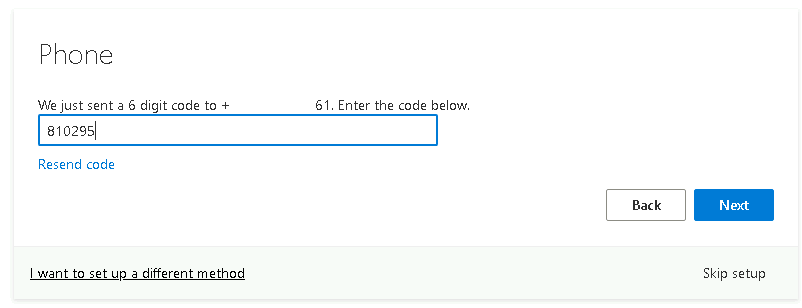
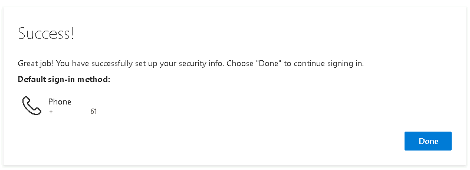
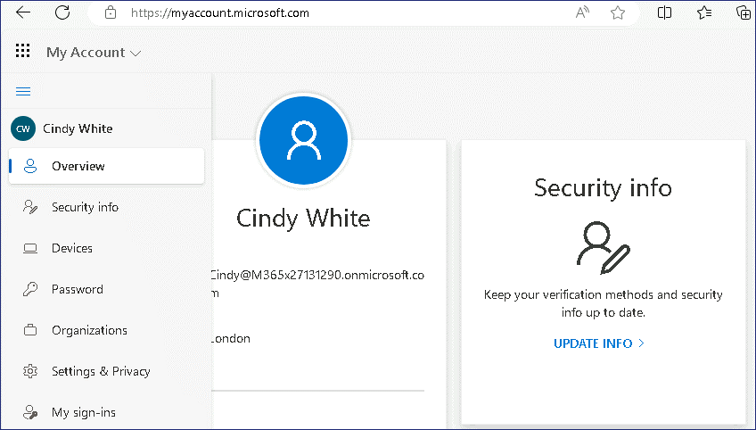
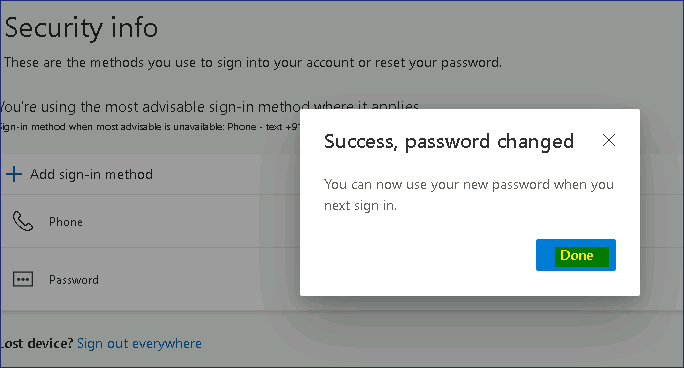

Lab 16 - Configuring Self-service password reset for user accounts in
Microsoft Entra

**Summary**

In this lab, you will configure and validate self-service password reset
(SSPR) for user accounts in **Microsoft Entra ID**.

**Prerequisites**

To following lab(s) must be completed before this lab:

- Lab \#2-Synchronizing Identities by using Microsoft Entra Connect

- Lab \#5-Manage Device Enrollment into Microsoft Intune

**Scenario**

The Help Desk has indicated that a large number of support tickets are
related to password resets. You have been asked to propose a solution
for users to reset their own password. For accounts that are
synchronized from AD DS, the process should reset both their Microsoft
Entra and AD DS password.

Task 1: Configure password writeback

1.  Sign in
    to ***SEA-SVR1*** as !!Contoso\Administrator!! with
    the password !!Pa55w.rd!! and
    close **Server Manager**.

2.  On the desktop, double-click **Azure AD Connect**.

    > 

3.  On the **Welcome to Microsoft Entra Connect Sync** page, select **Configure**.

    > 

4.  On the **Additional tasks** page, select **Customize synchronization
    options**, and then select **Next**.

    > 

5.  On the **Connect to Azure AD** page, if needed
    type !!admin@M365xXXXXXXX.onmicrosoft.com!! in
    the **USERNAME** text box, type the **PASSWORD**, and then
    select **Next**.

    > 

6.  On the **Connect to your directories** page, select **Next**.

7.  On the **Domain and OU filtering** page, select **Next**.

8.  On the **Optional features** page, select **Password writeback**,
    and then select **Next**.

    > 

9.  On the **Ready to configure** page, select **Configure**.

    > 
    >
    > 
    >
    > **Note**: Configuring can take a few minutes.

10. On the **Configuration complete** page, select **Exit**.

    > 

# Task 2: Enable self-service password reset.

1.  On the taskbar select **Microsoft Edge**, navigate to **Microsoft
    Entra admin center** !!https://Entra.Microsoft.com!!

2.  Sign in with **Office 365 Tenant admin** credentials.

    > 
    >
    > The **Microsoft Entra admin center** opens.

3.  In the **Microsoft Entra admin center**, in the navigation pane,
    expand **Identity**, then select **Users**.

4.  In the **Users** navigation pane, select **Password reset**.

    > 

5.  In the **Password reset | Properties** window, select **All** to
    enable self-service password reset to all users. Select **Save**.

    > 
    >
    > 

6.  On the **Password reset | Properties** blade,
    select **Authentication methods**.

    > 

7.  For the methods available to users, ensure that **Mobile
    Phone** and **Email** are selected, and then select **Security
    Questions**.

8.  For the **Number of questions required to register**, select **3**.

9.  For the **Number of questions required to reset**, select **3**.

    > 

10. In the **Select security questions** section, select **No security
    questions configured**, then select **Predefined**. Select three
    questions of your choice, and then select **OK** twice.

    > 
    >
    > 

11. Select **Save**.

    > 

12. Select **Registration** Select **Yes** for **Require users to
    register when signing in**, and **Number of days before users are
    asked to re-confirm their authentication information** set the value
    to **90,** then select **Save**.

    > 

13. In the navigation pane, select **On-premises integration**.

14. Verify that your on-premises writeback client is running and ensure
    the checkbox is ticked for **Enable password write back for synced
    users**. If needed, select **Save**.

    > 

15. Close Microsoft Edge.

# Task 3: Validate self-service password reset

1.  Switch to ***SEA-WS3***. If necessary, sign
    in as !!Admin!! with the password
    of !!Pa55w.rd!!

2.  On the taskbar, select **Microsoft Edge**. Browse
    to !!https://mysignins.microsoft.com/!!

3.  On the **Pick an account** page, select **Use another account**.

    > 

4.  On the **Sign in** page,
    enter !!Cindy@M365xXXXXXX.onmicrosoft.com!! and then
    select **Next**.

5.  On the **Enter password** page, enter !!P@55w.rd1234!! and then
    select **Sign in**. If Microsoft Edge prompts to save the password,
    select **Save**.

    > 

6.  You will be prompted for **More information required**, click on
    **Next**

    > 

7.  Provide the details and click on **Next.**

    > 

8.  Enter the 6-digit code and click on **Next**

    
    > 

9.  Click on Next again.

    > 

10. Click on **Done**.

    > 

11. You should be able to the **My Account** page

    > 

12. To change the **Password,** visit the link -
    !!https://mysignins.microsoft.com/security-info!!

13. Complete the Verification, by clicking on the Text +XXXXXXXXXXXXXX

    > 

14. Provide the 6-digit code and then click on Verify.

    > 

15. Click on **Skip for now.**

    > 

16. On the **Security info** page, click on **Change** for the Password.

    > 

17. On the **Change your password** page, enter the following
    information and then select **Submit**:

    - Create new password: **!!P@55w.rd12345!!**

    - Confirm new password: **!!P@55w.rd12345!!**

    > 

18. Click on Done button.

    > 

19. Close Microsoft Edge and sign out
    of SEA-WS3.

# Task 4: Run Azure AD Connect Sync

Note that this step is normally not necessary for password writeback,
but is recommended to address issues inherent in lab environments and
ensure AD DS is synchronized with Microsoft Entra.

1.  Switch to SEA-SVR1 and
    right-click Start and then select **Windows PowerShell
    (Admin)**.

    > 

2.  At the **Windows PowerShell** command prompt, type the following
    command, and then press **Enter**:

    > **!!Start-ADSyncSyncCycle -PolicyType Delta!!**
    >
    > 

3.  Close Windows PowerShell, and then wait for approximately 3-4
    minutes.

# Task 5: Verify password writeback

1.  Switch to ***SEA-CL1*** and sign out if
    necessary. On ***SEA-CL1***, select **Other
    user**, and then attempt to sign in as !!Contoso\Cindy!! with
    the password of !!P@55w.rd1234!!

    > 

2.  Ensure that you get the message that the username or password is
    incorrect.

    > 

3.  Now sign in as !!**Contoso\Cindy!!** with the password
    of !!**P@55w.rd12345!!** the password which was set using the SSPR
    feature.

4.  You should be signed in successfully this time with the **new
    password**.

    This confirms that the password you changed in the My Sign in portal is
    written back to the local Active Directory Domain Services (AD DS)
    account.

    

    > Note – If you receive the above message during login, it confirms that
    > ***authentication was successful***, but account did not have
    > permission to login on the SEA-CL1 due to group membership issue.

**Results**: After completing this exercise, you will have successfully
configured and validated self-service password reset.
