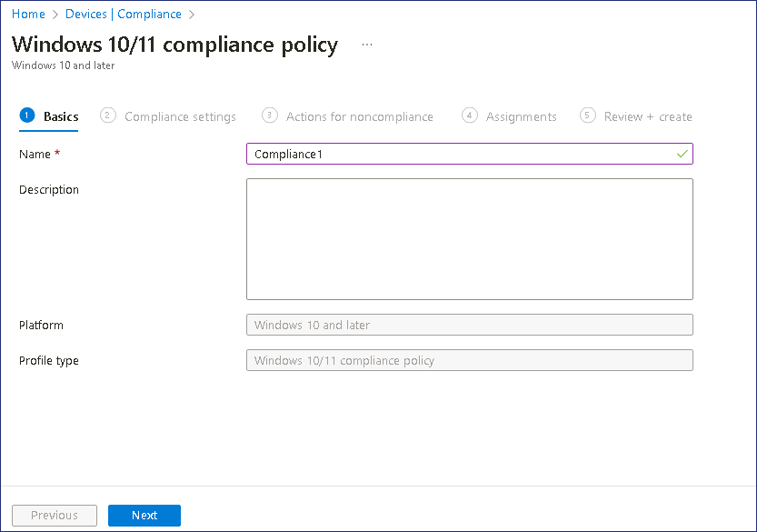
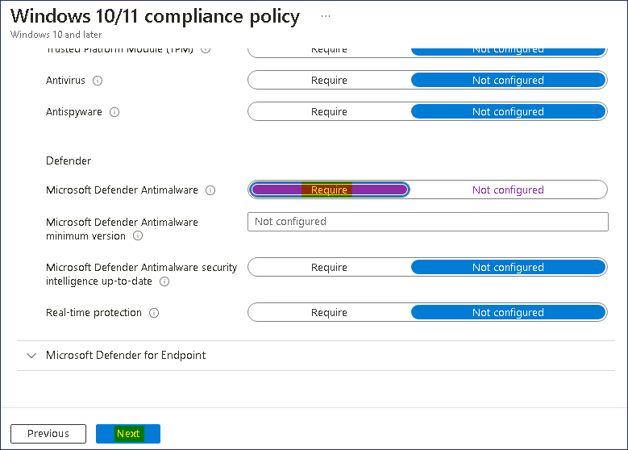
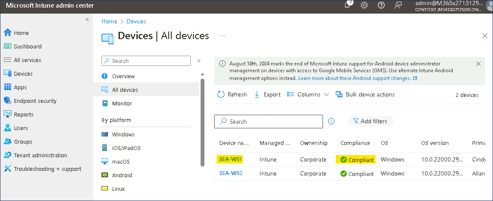
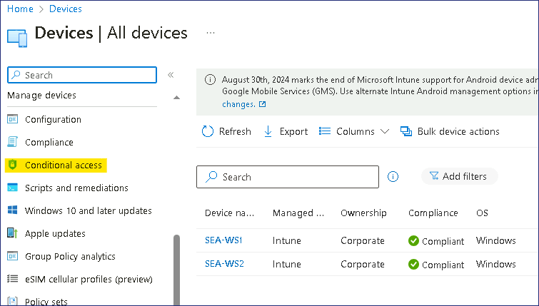

Lab17 - Configuring and validating device compliance

**Summary**

In this lab, you validate device compliance by configuring a compliance
policy and associated conditional access rule used to determine the
status of a managed device.

**Prerequisites**

To following lab(s) must be completed before this lab:

- Lab \#1-Managing Identities in Microsoft Entra ID

- Lab \#2-Synchronizing Identities by using Microsoft Entra Connect

- Lab \#5-Manage Device Enrollment into Microsoft Intune

- Lab \#6-Enrolling devices into Microsoft Intune

- Lab \#7-Creating and Deploying Configuration Profiles

Exercise 1: Configuring compliance policies.

**Scenario**

Contoso would like to ensure that Windows devices that are enrolled in
Microsoft Intune meet a minimum configuration specification. The
following are specifications are required:

- Minimum Windows operating system version: 10.0.19041.329

- Microsoft Defender Antimalware required.

If a device meets these requirements, it will be marked as compliant. If
the device does not meet these requirements, the device should be marked
as non-compliant.

# Task 1: Create and assign a compliance policy

1.  Sign in
    to SEA-SVR1 as !!Contoso\Administrator!! with
    the password !!**[Pa55w.rd](urn:gd:lg:a:send-vm-keys)!!

2.  On the taskbar, select **Microsoft Edge**. In Microsoft Edge,
    type !!https://Intune.microsoft.com!! in the address bar, and
    then press **Enter**.

3.  Sign in with **Office 365 Tenant Admin credentials**.

    > 

4.  From the navigation pane select **Devices**, then
    select **Compliance** under Manage devices.

    > 

5.  On the **Compliance | Policies** blade, in the details pane
    select **+ Create Policy**.

    > 

6.  On the **Create a policy** blade, provide the following value and
    select **Create**:

    - Platform: **Windows 10 and later**

    > 

7.  On the **Basics** tab, provide the following value and
    select **Next**:

    - Name: !!Compliance1!!

    > 

8.  On the **Compliance settings** tab, expand **Device Health** and
    review the available settings.

    > 

9.  On the **Compliance settings** tab, expand **Device Properties**. In
    the **Minimum OS version** field,
    type !!**[10.0.19041.329](urn:gd:lg:a:send-vm-keys)!!**

    > 

10. On the **Compliance settings** tab, expand **System Security**. Set
    the **Microsoft Defender Antimalware** setting to **Require** and
    then select **Next**.

    > 

11. On the **Actions for noncompliance** tab, note the action to **Mark
    device noncompliant** default setting is **immediately**.

    > 
    >
    > Review how you can configure the number of days after which the device
    > is marked as noncompliant, and configuration additional actions.

12. Select **Next**. On the **Assignments** tab, select **Add groups**.
    Select **Windows Devices**, choose **Select**, and then
    select **Next**.

    > 
    >
    > **Note**: The **Windows Devices** group was created in Creating and
    > Deploying Configuration Profiles - Lab.

13. Select **Create**.

    > 

14. In the navigation menu, select **Devices** and then in the Devices
    navigation pane, select **Compliance**.

    > 

15. On the **Compliance** page, select **Compliance settings**.

    > 

16. On the **Compliance policy settings** page, next to **Mark devices
    with no compliance policy assigned as**, select **Not
    Compliant** and then select **Save**.

    > 
    >
    > This setting will ensure that any device that does not have a
    > compliance policy assigned will be set to **Not compliant**.

    **Results**: After completing this exercise, you will have successfully
    configured a compliance policy.

# Exercise 2: Creating a conditional access policy to enforce compliance.

**Scenario**

When a user uses a device that is marked as non-compliant, they should
not be able to access their e-mail. You've been asked to configure a
conditional access policy that enforces this rule, and verify it
functions as expected.

## Task 1: Create a conditional access policy

1.  On SEA-SVR1, in the **Microsoft
    Intune admin center** select **Devices**, then select **Conditional
    access**.

     

2.  Click on **Policies** then select **+ New policy**,

     

3.  On the **New** blade, in the **Name** text box,
    type !!Conditional1!! and then
    select **0 users or workload identities selected**.

    > 

4.  On the **Users and groups** blade, select the **All users** radio
    button.

    > 

5.  On the **New** blade, select **No target resources selected**,
    select the **Select apps** radio button, select !!**Office 365
    Exchange Online!!**, and then click **Select**.

    > 

6.  On the **New** blade, in the **Conditions** section, select **0
    conditions selected**.

    > 

7.  In the list of conditions, under **Device platforms**, select **Not
    configured**. In the **Configure** section select **Yes**, select
    the **Select device platforms** radio button, select
    the **Windows** check box, and then select **Done**.

    > 

8.  On the **New** blade under **Access controls**, in
    the **Grant** section, select **0 controls selected**.

9.  Select the **Require device to be marked as compliant** check box,
    and then select **Select**.

    > 

10. On the **New** blade, select **On** for the **Enable policy** option
    and then select **Create**.

    > 

11. Close Microsoft Edge.

## Task 2: Verify that the conditional access policy is working

1.  Switch to ***SEA-WS3*** and sign in
    as !!Admin!! with the password
    of !!Pa55w.rd!!

2.  On ***SEA-WS3***, on the taskbar,
    select **Microsoft Edge**. In Microsoft Edge,
    type **!!outlook.office.com!!** and then
    press Enter.

3.  On the pick an account dialog box,
    select !!Cindy@M365xXXXXXXX.onmicrosoft.com!!

4.  On the **Enter password** page, enter !!**P@55w.rd12345!!** and
    select **Sign in**. If the Microsoft Edge Save password prompt
    appears, select **Update**.

    > 

5.  Verify that you receive the message **"** **Sign in with your work
    account"**.

    > 

6.  Select **More details**. You should see more information about why
    you are blocked.

    > 
    >
    > **Note**: This is because SEA-WS3 is not joined to Microsoft Entra ID
    > and not managed by Microsoft Intune, so not marked as compliant.

7.  **Close** the browser window.

8.  Switch to ***SEA-WS1***, and sign in as
    !!Cindy@M365xXXXXXXX.onmicrosoft.com!! with **password** page,
    enter **!!P@55w.rd12345!!** 

    > **Note**: SEA-WS1 is a managed Windows 11 device that is enrolled in
    > Intune.

9.  On the taskbar, select **Microsoft Edge**. In Microsoft Edge,
    type **!!Outlook.office.com!!** and then
    press **Enter**.

10. Verify that you can access Cindy's mailbox.

    > 
    >
    > **Note**: This is because **SEA-WS1** is a managed device and marked
    > as compliant.

11. Close Microsoft Edge and sign out
    of SEA-WS1.

## Task 3: Disable the conditional access policy

1.  On ***SEA-SVR1***, in the **Microsoft
    Intune admin center** !!https://intune.microsoft.com!!
    select **Devices**, then select **All devices**.

    > 
    >
    > Notice that **SEA-WS1** is compliant, which is why Cindy was allowed
    > to access his mailbox.

2.  From the navigation pane select **Devices**, then
    select **Conditional access**.

    > 

3.  On the **Conditional Access** page, select **Policies**, then click
    on **Conditional1**.

    > 

4.  On the **Conditional1** page, at the bottom of the page,
    select **Off** and then select **Save**.

    > 

5.  Close Microsoft Edge.

**Results**: After completing this exercise, you will have successfully
configured a conditional access policy to determine device compliance.d
