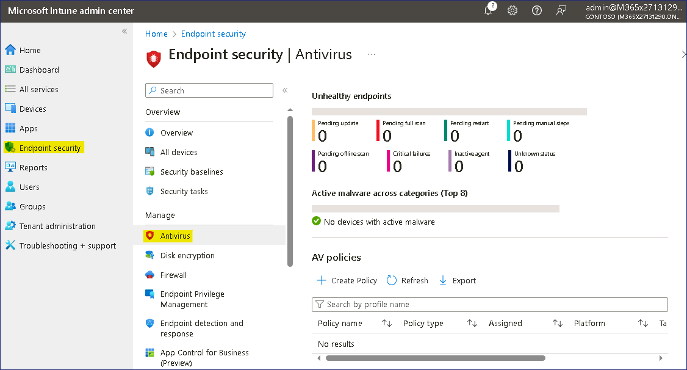
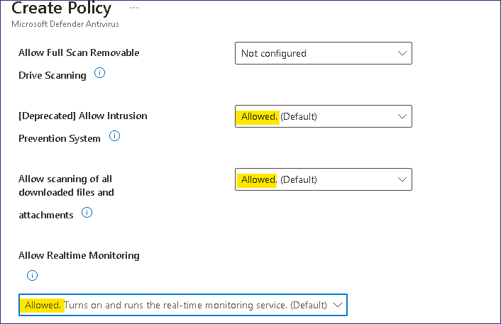
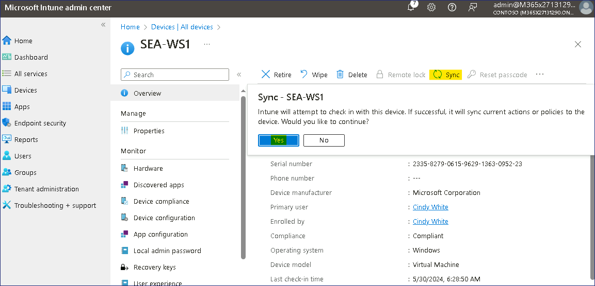
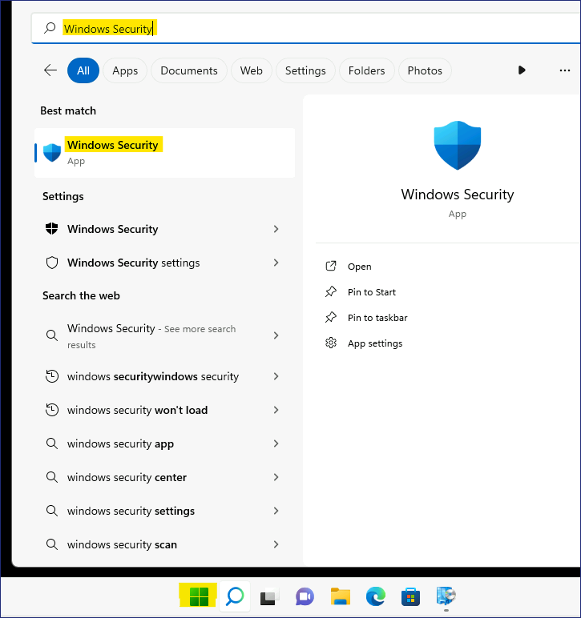
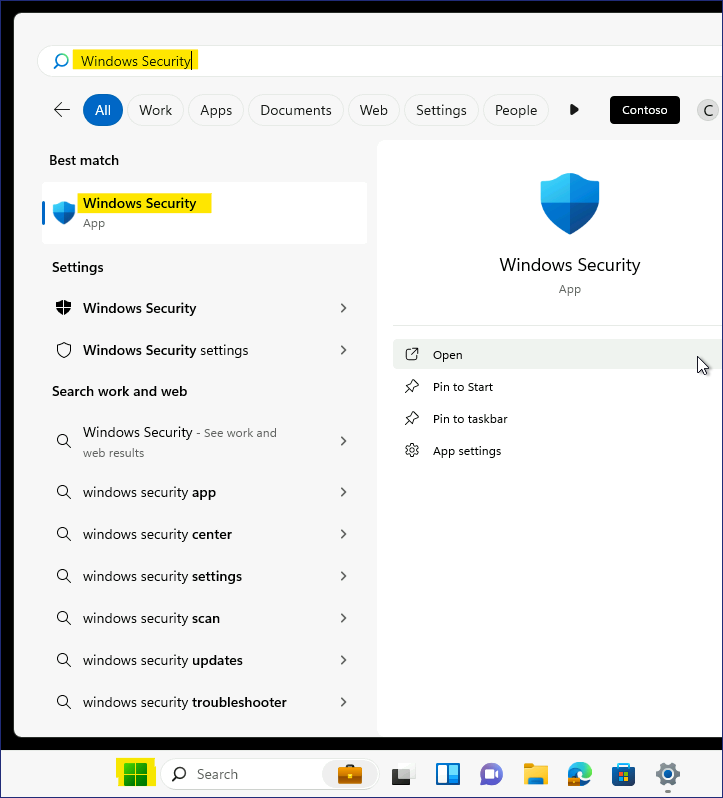

Lab 18 - Configuring Endpoint security using Microsoft Intune

**Summary**

In this lab, you will create a policy to configure Microsoft Defender
for managed devices in Microsoft Intune.

**Prerequisites**

To following lab(s) must be completed before this lab:

- Lab \#5-Manage Device Enrollment into Microsoft Intune

- Lab \#6-Enrolling devices into Microsoft Intune

- Lab \#7-Creating and Deploying Configuration Profiles

**Scenario**

You've been asked to ensure that the Contoso Developers Group have
Microsoft Defender correctly configured. It's been requested that:

- Tamper protection be prevented.

- Hide the Account protection, App and browser control, Device security,
  Device performance and health, and Family options areas in the Windows
  Security app

- Company name and phone number must be added.

- Real-time protection, Remediation, and scan settings are also to be
  configured.

Settings will be verified by testing on an enrolled device, SEA-WS1 and
a non-enrolled device, SEA-CL1.

## Task 1: Configure Windows Security Experience in Intune

1.  Switch and sign in
    to ***SEA-SVR1*** as !!Contoso\Administrator!! with
    the password !!Pa55w.rd!!

2.  On the taskbar, select **Microsoft Edge**.

3.  In Microsoft Edge, type !!https://Intune.microsoft.com!! in the
    address bar, and then press **Enter**.

4.  Sign in as Office 365 Tenant Admin.

    > 

5.  From the navigation pane select **Endpoint security**, then
    select **Antivirus**.

    > 

6.  On the **Endpoint security |Antivirus** pane, select **+ Create
    Policy**.

    > 

7.  In the **Create a profile** pane, for **Platform**, select **Windows
    10, Windows 11, and Windows Server**.

8.  In the **Profile** list, select **Windows Security experience**.
    Then select **Create**.

    > 

9.  On the Basics tab, in the **Name** field, enter !!**[Windows
    Security Settings](urn:gd:lg:a:send-vm-keys)!!**. Select **Next**.

    > 

10. Under **Defender**, configure the following settings:

    - TamperProtection (Device): **On**

    > 

11. Under **Windows Defender Security Center**, configure the following
    settings:

    - Disable Account Protection UI: **Enable**

    - Disable App Browser UI: **Enable**

    - Disable Device Security UI: **Enable**

    - Disable Family UI: **Enable**

    - Disable Health UI: **Enable**

    > 

12. Next to **Enable Customized Toasts** select **Enable**.

13. In the **Company name** field, select **Configured**, and then
    enter !!Contoso IT!!

14. For **Phone**, select **Configured** and then
    enter !!555-1234!! and then
    select **Next**.

    > 

15. On the **Scope tags** page, select **Next**.

    > 

16. On the **Assignments** tab, under **Included groups** select **Add
    groups**. Choose the **Contoso Developer Devices** group,
    click **Select** and then select **Next**.

    > 

17. On the **Review + create** tab, review the information and
    select **Save**.

    > 

## Task 2: Configure Microsoft Defender Antivirus policy in Intune

1.  On the **Endpoint security |Antivirus** pane, select **Create
    Policy**.

    > 

2.  In the **Create a profile** pane, for **Platform**, select **Windows
    10, Windows 11, and Windows Server**.

3.  In the **Profile** list, select **Microsoft Defender Antivirus**,
    then select **Create**.

    > 

4.  On the **Basics** tab, in the **Name** field, enter **!

5.  On the **Configuration settings** tab, configure the following
    settings:

    - Allow Intrusion Prevention System: **Allowed**

    - Allow scanning of all downloaded files and
      attachments: **Allowed**

    - Allow Realtime Monitoring: **Allowed**

    > 

    - Check For Signatures Before Running Scan: **Enabled**

    - Days to Retain Cleaned Malware: **!!60!!**

    > 

    - Schedule Quick Scan
      Time: **!!60!!** (represents 1:00AM)

    > 

    - Submit samples consent: **Send safe samples automatically**

    > 

6.  On the **Configuration settings** tab, select **Next**.

7.  On the **Scope tags** page, select **Next**.

    > 

8.  On the **Assignments** tab, under **Included groups** select **Add
    groups**.

9.  Choose the **Contoso Developer Devices** group and then
    choose **Select** and then select **Next**.

    > 

10. On the **Review + create** tab, review the information and
    select **Save**.

    > 

## Task 3: Sync the managed devices

1.  In the **Microsoft Intune admin center**, select **Devices** and
    then select **All devices**.

2.  On the **Devices | All devices** pane, select **SEA-WS1** and then
    on the **SEA-WS1** blade, select **Sync** on the toolbar, and then
    select **Yes**.

    > 
    >
    > Wait for 3-4 minutes for the sync to complete.

3.  Close Microsoft Edge.

## Task 4: Verify the configuration

1.  Switch to SEA-CL1. If necessary, sign
    in as !!Contoso\Administrator!! with
    the password of **!!Pa55w.rd!!**.

2.  On ***SEA-CL1***, select **Start**,
    type **!!Windows Security!!**, and then
    under the Windows Security icon select **Open**.

    > 
    >
    > Notice that all security options are displayed. This is because
    > SEA-CL1 is not enrolled to Intune.
    >
    > 

3.  Close **Windows Security** and sign out
    of SEA-CL1.

4.  Switch to ***SEA-WS1***, and sign in as
    **!!Cindy@M365x27131290.onmicrosoft.com!!** with Password
    **!!P@55w.rd12345!!** .

5.  Select **Start**, type **!!Windows
    Security!!**, and then under the Windows
    Security icon select **Open**.

    > 
    >
    > Notice that all of the restricted areas as configured in the Intune
    > policy are not displayed. ***SEA-WS1*** is
    > enrolled in Intune, which has applied the security settings.
    >
    > 

6.  Close **Windows Security** and sign out
    of ***SEA-WS1***.

**Results**: After completing this exercise, you will have successfully
created and applied a policy to configure Microsoft Defender for managed
devices in Intune.
