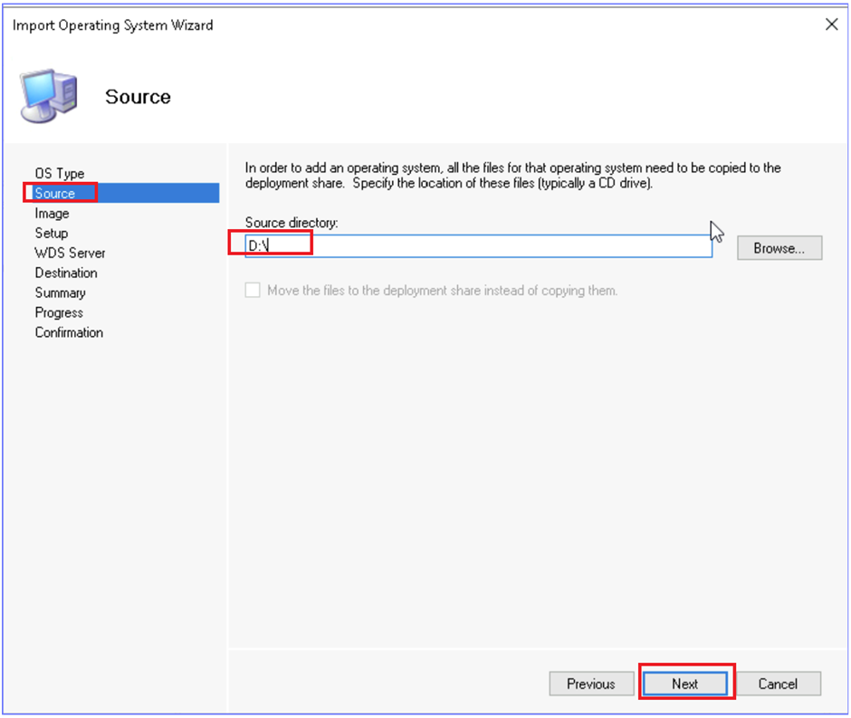

# **Lab 19 - Deploying Windows 11 using Microsoft Deployment Toolkit**

**Summary**

In this lab, you will use the Microsoft Deployment Toolkit to create and
deploy a Windows 11 operating system image.

**Scenario**

You need to deploy a new Windows 11 virtual machine named SEA-WS4. You
decide to use Microsoft Deployment Toolkit to deploy the operating
system to a virtual machine created in Hyper-V. You will configure a new
Deployment Share in MDT and then configure the task sequence that will
perform the steps to deploy SEA-WS4.

### **Task 1: Create a new Deployment Share**

1.  Switch to SEA-SVR2, sign in
    as !!Contoso\\Administrator!! with
    the password !!Pa55w.rd!!

    > 

2.  On the taskbar, select **File Explorer** and then browse
    to !!E:\\Labfiles\\ISOs!!

    > 

3.  Right-click **Win11_21H2_Eval.iso** and then select **Mount**. The
    ISO mounts as DVD Drive **D**.

    > 
    > 

4.  Close **File Explorer**.

5.  Select **Start menu**, expand **Microsoft Deployment Toolkit**, and
    then select **Deployment Workbench**.

    > 

6.  In the **Deployment Workbench**, right-click **Deployment
    Shares** and then select **New Deployment Share**.

    > 
    >
    > The **New Deployment Share Wizard** opens.

7.  On the **Path** page, under **Deployment share path**, change the
    value to !!E:\\DeploymentShare!! and
    then select **Next**.

    > 

8.  On the **Share** page, take note of the **Share name**, but do not
    change it. Select **Next**.

    > 

9.  On the **Descriptive Name** page, accept the default value and
    select **Next**.

    > .

10. On the **Options** page, configure the following, and then
    select **Next**:

    -   Ask to set the local Administrator password: **Enabled**

    -   All other check boxes: **Disabled**

    > .

11. On the **Summary** page, review the information and then
    select **Next**.

    > .

12. On the **Confirmation** page, ensure that the process was completed
    successfully and then select **Finish**.

    > .

13. Under **Deployment Shares**, expand the **MDT Deployment
    Share** folder.

    > Take note of the various nodes that can be configured for the
    > deployment share.

### **Task 2: Add Operating System files to the Deployment Share**

1.  In the Deployment Workbench, expand **Deployment Shares**,
    expand **MDT Deployment Share**, and then select **Operating
    Systems**.

    > .
 
2.  Right-click **Operating Systems** and then select **Import Operating
    System**. The Import Operating System Wizard opens.

    > .
 
3.  In the **Import Operating System Wizard**, on the **OS Type** page,
    select **Full set of source files** and then select **Next**.

    > .
 
4.  On the **Source** page, under **Source Directory**,
    enter D:\ and then select **Next**.

    > .
 
5.  On the **Destination** page, change the default destination
    directory name to !!Windows 11 Enterprise x64!! and then select **Next**.

    > .
 
6.  On the **Summary** page, review the information and then
    select **Next**.

    > .

    >
    > The operating system source files are copied into the deployment
    > share.

7.  On the **Confirmation** page, ensure that the process was completed
    successfully and then select **Finish**.

    > .

8.  In the **Deployment Workbench**, with **Operating
    Systems** selected, verify that the operating system displays.

### **Task 3: Add Applications to the Deployment Share**

1.  In the Deployment Workbench, expand **Deployment Shares**,
    expand **MDT Deployment Share**, and then select **Applications**.

2.  Right-click **Applications** and then select **New Application**.
    The New Application Wizard opens.

    > .
 
3.  In the **New Application Wizard**, on the **Application Type** page,
    select **Application with source files** and then select **Next**.

    > .
 
4.  On the **Details** page, configure the following, and then
    select **Next**:

    -   Publisher: !!Microsoft!!

    -   Application Name: !!XML Notepad!!

    > .

5.  On the **Source** page, under **Source directory**,
    enter !!E:\\Labfiles\\Apps!! and
    then select **Next**.

    > .
 
6.  On the **Destination** page, accept the default destination
    directory name and then select **Next**.

    > .
 
7.  On the **Command Details** page, under **Command
    line** enter !!XmlNotepadSetup.msi /q!! and then select **Next**.

    > .
 
8.  On the **Summary** page, review the information and then
    select **Next**.

    > 

9.  On the **Confirmation** page, ensure that the process was completed
    successfully and then se  lect **Finish**.

### **Task 4: Create an MDT Task Sequence**

1.  In the Deployment Workbench, expand **Deployment Shares**,
    expand **MDT Deployment Share**, and then select **Task Sequences**.

2.  Right-click **Task Sequences** and then select **New Task
    Sequence**. The **New Task Sequence Wizard** opens.

    > .
 
3.  On the **General Settings** page, configure the following and then
    select **Next**:

    -   Task sequence ID: !!001!!

    -   Task sequence name: !!Deploy Windows 11 Enterprise!!

    > .
 
4.  On the **Select Template** page, select **Standard Client Task
    Sequence**, and then select **Next**.

    > .
 
5.  On the **Select OS** page, select **Windows 10 Enterprise
    Evaluation** and then select **Next**.

    > .
 
6.  On the **Specify Product Key** page, select **Do not specify a
    product key at this time**, and then select **Next**.

    > .
 
7.  On the **OS Settings** page, configure the following and then
    select **Next**:

    -   Full Name: !!User!!

    -   Organization: !!Contoso
        Corporation!!

    -   Internet Explorer Home
        Page: !!about:blank!!

    > .

8.  On the **Admin Password** page, select **Use the specified local
    Administrator password**, and then
    enter !!Pa55w.rd!! in both text
    boxes. Select **Next**.

    > .

9.  On the **Summary** page, review the information and then
    select **Next**.

    > 
 
10. On the **Confirmation** page, ensure that the process completed
    successfully and then select **Finish**.

     

11. In the **Deployment Workbench**, with **Task Sequences** selected
    verify that the **Deploy Windows 11 Enterprise** task sequence
    displays.

    > .
 
12. Right-click the **Deploy Windows 11 Enterprise** task sequence, and
    then select **Properties**.

    > .
 
13. Select the **Task Sequence** tab.

14. Expand the **Validation** node and then select **Validate**.

15. On the **Properties** page, remove the check marks next to **Ensure
    minimum memory** and **Ensure minimum processor speed**.

    > Do not make any other changes.

16. On the **Deploy Windows 11 Enterprise Properties** window,
    select **OK**.

    > .
 
### **Task 5: Configure Deployment Share Properties and Windows PE settings**

1.  In the Deployment Workbench, expand **Deployment Shares**, and
    select **MDT Deployment Share**.

2.  Right-click **MDT Deployment Share** and then select **Properties**.

    > .
 
3.  In the **MDT Deployment Share Properties** window, on
    the **General** tab, take note of the information that was provided
    when the deployment share was created.

    > . height="5.4in"}

4.  Select the **Rules** tab.

    > [The Rules tab displays the content of the CustomSettings.ini file.
    > These values were also provided during the creation of the deployment
    > share.]{.mark}
    >
    > .
 
5.  Select the **Windows PE** tab.

    > [The Windows PE tab provides options for creating a Windows PE boot
    > disk.]{.mark}

6.  On the **Windows PE** tab, next to **Platform**, select **x64**.

7.  In the **Windows PE Customizations** section, next to **Scratch
    space size**, select **64**.

    > .
 
8.  Select the **Features** tab and then select the check box next to
    the following Feature Packs:

    -   DISM Cmdlets

    -   Windows PowerShell

    -   Microsoft Data Access Components (MDAC/ADO) support

    > .
     > .

9.  Select the **Monitoring** tab.

10. On the **Monitoring** tab, select the check box next to **Enable
    monitoring for this deployment share**.

11. In the **MDT Deployment Share Properties** window, select **OK**.

    > .
 
12. Right-click **MDT Deployment Share** and then select **Update
    Deployment Share**. The Update Deployment Share Wizard opens.

    > .
 
13. On the **Options** page, select **Optimize the boot image updating
    process** and then select **Next**.

    > .
 
14. On the **Summary** page, select **Next**.

    > .
     > [The Deployment Share starts to update and create the Windows PE
    > files. This will take a few minutes to complete.]{.mark}

15. On the **Confirmation** page, ensure that the process was completed
    successfully and then select **Finish**.

    > .
 
### **Task 6: Deploy Windows 11 Using MDT**

1.  On **SEA-SVR2**, on the taskbar,
    select **Hyper-V Manager**.

    > .
 
2.  In Hyper-V Manager, select **Virtual Switch Manager**.

    > .
 
3.  Select **External** in the list and then click **Create Virtual
    Switch**.

    > .
 
4.  In the **Virtual Switch Properties** page, under **Name**,
    enter **External network**,
    select **OK**, and then select **Yes**.

    > . 
    > .
 
5.  In Hyper-V Manager, select **SEA-SVR2** and then in the Actions
    pane, select **New** and then select **Virtual Machine**.

    > .
 
6.  On the **Before you Begin** page, select **Next**.

    > . 

7.  On the **Specify Name and Location** page, in the **Name** box
    type !!SEA-WS4!!.

8.  Select the check box next to **Store the virtual machine in a
    different location** and then next
    to **Location** type E:\\Labfiles\\VirtualMachines!!.
    Select **Next**.

    >  

9.  On the **Specify Generation** page, ensure that **Generation 2** is
    selected and then select **Next**.

    > .
 
10. On the **Assign Memory** page, next to **Startup
    memory** type !!8192!! and then
    select **Next**.

    > .
 
11. On the **Configure Networking** page, next to **Connection**,
    select **External Network** and then select **Next**.

    > . 

12. On the **Connect Virtual Hard Disk** page, select **Create a virtual
    hard disk** and enter the following and then click **Next**:

    -   Name: !!SEA-WS4.vhdx!!

    -   Location: !!E:\\Labfiles\\VirtualMachines!!

    -   Size: !!60!!

    > .

13. On the **Installation Options** page, select **Install an operating
    system from a bootable image file** and configure the following:

    -   Image file
        (.iso): !!E:\\DeploymentShare\\Boot\\LiteTouchPE_x64.iso!!

    > .
 
14. Select **Next** and then **Finish**.

    > .
 
15. In Hyper-V Manager, right-click **SEA-WS4**, and then
    select **Settings**.

    > .
 
16. Select **Security**, and then select the check box next to **Enable
    Trusted Platform Module**.

    > .
 
17. Select **Processor**, and then change the number of virtual
    processors to !!2!!.

18. Select **OK** to close the Settings dialog box.

    > .

19. In Hyper-V Manager, select **SEA-WS4**, select **Connect**, and then
    select **Start**.

    > . 
    > 
 
20. As the computer starts press any key on the keyboard to invoke the
    MDT Deployment Wizard. Maximize the window as needed.

    > .
 
21. On the **Welcome** page, select **Run the Deployment Wizard to
    install a new Operating System**.

    > .
 
22. On the **Specify credentials for connecting to network
    shares** window, enter the following and then select **OK**:

    -   User Name: !!Administrator!!

    -   Password: !!Pa55w.rd!!

    -   Domain: !!Contoso!!

    > .
 
23. On the **Task Sequence** page, select **Deploy Windows 11
    Enterprise** and then select **Next**.

    > .
 
24. On the **Computer Details** page, next to **Computer
    name** enter !!SEA-WS4!! and then
    select **Next**.

    > .
 
25. On the **Move Data and Settings** page, select **Next**.

    > .
 
26. On the **User Data (Restore)** page, select **Next**.

    > .
 
27. On the **Locale and Time** page, select **Next**.

    > .
 
28. On the **Applications** page, select **Next**.

    > .
    
29. On the **Administrator Password** page,
    enter !!Pa55w.rd!! in both text
    boxes and then select **Next**.

    > .

30. On the **Ready** page, select **Begin**.

    > .

    > [The installation begins. It will take some time to complete and will
    > reboot **SEA-WS4** during the installation as needed.]{.mark}

31. Switch to the **Deployment Workbench**.

32. In the Deployment Workbench, expand **Deployment Shares**, and
    expand **MDT Deployment Share**.

33. Select **Monitoring** and then in the details pane,
    double-click **SEA-WS4**.

    > 
    > [Review the monitoring status during the deployment.]{.mark}
    >
    > . 

34. Switch to **SEA-WS4**.

35. After the installation is complete, the desktop will open and
    finalize the deployment. At the deployment summary,
    select **Finish**.

    > .
 
36. Shut down **SEA-WS4** and close the Virtual Machine Connection
    window.

    > .

37. In Hyper-V Manager, right-click **SEA-WS4** and then
    select **Settings**.

    > .
 
38. In the **Settings for SEA-WS4**, expand **SCSI Controller** and then
    select **DVD Drive**.

39. In the details pane, under **Media**, select **None**, and then
    select **OK**.

    > . height="6.175in"}

40. Right-click **SEA-WS4** and then select **Checkpoint** to create a
    checkpoint of the current state of SEA-WS4.

    > .
    > .

41. On **SEA-SVR2**, close **Hyper-V
    Manager** and close the **Deployment Workbench**.

42. Open **File Explorer**, right-click **DVD Drive D** and then
    select **Eject**.

    > .
    > .
43. Close **File Explorer** and sign out of **SEA-SVR2**.

**Results**: After completing this exercise, you will have successfully
used the Microsoft Deployment Toolkit to create and deploy a Windows 11
workstation.
