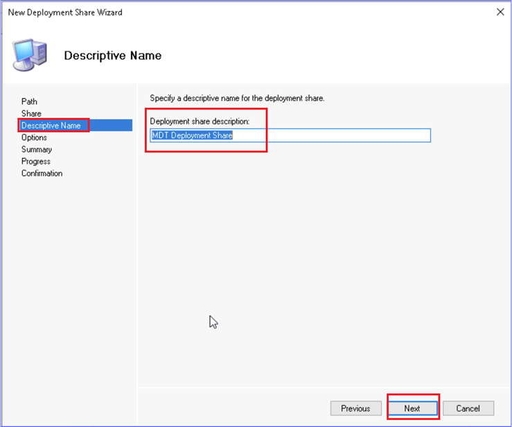
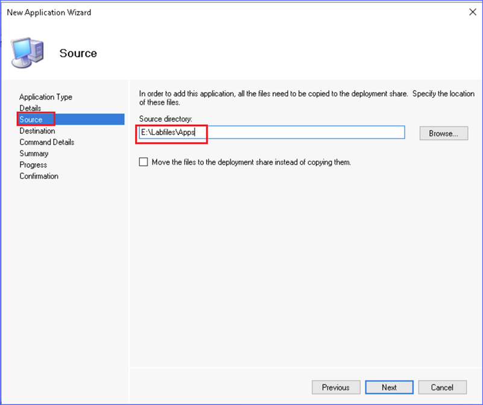

# **Lab 19 - Deploying Windows 11 using Microsoft Deployment Toolkit**

**Summary**

In this lab, you will use the Microsoft Deployment Toolkit to create and
deploy a Windows 11 operating system image.

**Scenario**

You need to deploy a new Windows 11 virtual machine named SEA-WS4. You
decide to use Microsoft Deployment Toolkit to deploy the operating
system to a virtual machine created in Hyper-V. You will configure a new
Deployment Share in MDT and then configure the task sequence that will
perform the steps to deploy SEA-WS4.

### **Task 1: Create a new Deployment Share**

1.  Switch to [**SEA-SVR2**](urn:gd:lg:a:select-vm), sign in
    as !!**[Contoso\\Administrator](urn:gd:lg:a:send-vm-keys)!!** with
    the password !!**[Pa55w.rd](urn:gd:lg:a:send-vm-keys)!!**

> {width="6.5in"
> height="4.432638888888889in"}

2.  On the taskbar, select **File Explorer** and then browse
    to !!**[E:\\Labfiles\\ISOs](urn:gd:lg:a:send-vm-keys)!!**

> {width="4.8125in"
> height="4.065972222222222in"}

3.  Right-click **Win11_21H2_Eval.iso** and then select **Mount**. The
    ISO mounts as DVD Drive **D**.

> {width="6.5in" height="4.03125in"}
>
> {width="6.5in"
> height="4.024305555555555in"}

4.  Close **File Explorer**.

5.  Select **Start menu**, expand **Microsoft Deployment Toolkit**, and
    then select **Deployment Workbench**.

> {width="6.5in"
> height="4.024305555555555in"}

6.  In the **Deployment Workbench**, right-click **Deployment
    Shares** and then select **New Deployment Share**.

> {width="6.5in"
> height="4.024305555555555in"}
>
> The **New Deployment Share Wizard** opens.

7.  On the **Path** page, under **Deployment share path**, change the
    value to !!**[E:\\DeploymentShare](urn:gd:lg:a:send-vm-keys)!!** and
    then select **Next**.

> {width="6.5in"
> height="4.024305555555555in"}

8.  On the **Share** page, take note of the **Share name**, but do not
    change it. Select **Next**.

> {width="6.5in"
> height="5.4215277777777775in"}

9.  On the **Descriptive Name** page, accept the default value and
    select **Next**.

> {width="6.5in"
> height="5.418055555555555in"}

10. On the **Options** page, configure the following, and then
    select **Next**:

    -   Ask to set the local Administrator password: **Enabled**

    -   All other check boxes: **Disabled**

> {width="6.5in"
> height="5.448611111111111in"}

11. On the **Summary** page, review the information and then
    select **Next**.

> {width="6.5in"
> height="5.448611111111111in"}

12. On the **Confirmation** page, ensure that the process was completed
    successfully and then select **Finish**.

> {width="6.5in"
> height="5.469444444444444in"}

13. Under **Deployment Shares**, expand the **MDT Deployment
    Share** folder.

> Take note of the various nodes that can be configured for the
> deployment share.

### **Task 2: Add Operating System files to the Deployment Share**

1.  In the Deployment Workbench, expand **Deployment Shares**,
    expand **MDT Deployment Share**, and then select **Operating
    Systems**.

> {width="6.5in"
> height="3.8652777777777776in"}

2.  Right-click **Operating Systems** and then select **Import Operating
    System**. The Import Operating System Wizard opens.

> {width="6.5in"
> height="3.9763888888888888in"}

3.  In the **Import Operating System Wizard**, on the **OS Type** page,
    select **Full set of source files** and then select **Next**.

> {width="6.5in"
> height="5.483333333333333in"}

4.  On the **Source** page, under **Source Directory**,
    enter !!**[D:\\](urn:gd:lg:a:send-vm-keys)!!** and then
    select **Next**.

> {width="6.5in"
> height="5.483333333333333in"}

5.  On the **Destination** page, change the default destination
    directory name to !!**[Windows 11 Enterprise
    x64](urn:gd:lg:a:send-vm-keys)!!** and then select **Next**.

> {width="6.5in"
> height="5.483333333333333in"}

6.  On the **Summary** page, review the information and then
    select **Next**.

> {width="6.5in"
> height="5.469444444444444in"}
>
> The operating system source files are copied into the deployment
> share.

7.  On the **Confirmation** page, ensure that the process was completed
    successfully and then select **Finish**.

> {width="6.5in"
> height="5.469444444444444in"}

8.  In the **Deployment Workbench**, with **Operating
    Systems** selected, verify that the operating system displays.

### **Task 3: Add Applications to the Deployment Share**

1.  In the Deployment Workbench, expand **Deployment Shares**,
    expand **MDT Deployment Share**, and then select **Applications**.

2.  Right-click **Applications** and then select **New Application**.
    The New Application Wizard opens.

> {width="6.5in"
> height="4.211111111111111in"}

3.  In the **New Application Wizard**, on the **Application Type** page,
    select **Application with source files** and then select **Next**.

> {width="6.5in"
> height="5.466666666666667in"}

4.  On the **Details** page, configure the following, and then
    select **Next**:

    -   Publisher: !!**[Microsoft](urn:gd:lg:a:send-vm-keys)!!**

    -   Application Name: !!**[XML
        Notepad](urn:gd:lg:a:send-vm-keys)!!**

> {width="6.5in"
> height="5.4430555555555555in"}

5.  On the **Source** page, under **Source directory**,
    enter !!**[E:\\Labfiles\\Apps](urn:gd:lg:a:send-vm-keys)!!** and
    then select **Next**.

> {width="6.5in"
> height="5.445138888888889in"}

6.  On the **Destination** page, accept the default destination
    directory name and then select **Next**.

> {width="6.5in"
> height="5.428472222222222in"}

7.  On the **Command Details** page, under **Command
    line** enter !!**[XmlNotepadSetup.msi
    /q](urn:gd:lg:a:send-vm-keys)!!** and then select **Next**.

> {width="6.5in"
> height="5.429861111111111in"}

8.  On the **Summary** page, review the information and then
    select **Next**.

> {width="6.5in" height="5.45in"}

9.  On the **Confirmation** page, ensure that the process was completed
    successfully and then select **Finish**.

### **Task 4: Create an MDT Task Sequence**

1.  In the Deployment Workbench, expand **Deployment Shares**,
    expand **MDT Deployment Share**, and then select **Task Sequences**.

2.  Right-click **Task Sequences** and then select **New Task
    Sequence**. The **New Task Sequence Wizard** opens.

> {width="6.5in"
> height="3.796527777777778in"}

3.  On the **General Settings** page, configure the following and then
    select **Next**:

    -   Task sequence ID: !!**[001](urn:gd:lg:a:send-vm-keys)!!**

    -   Task sequence name: !!**[Deploy Windows 11
        Enterprise](urn:gd:lg:a:send-vm-keys)!!**

> {width="6.5in"
> height="5.413194444444445in"}

4.  On the **Select Template** page, select **Standard Client Task
    Sequence**, and then select **Next**.

> {width="6.5in"
> height="5.4215277777777775in"}

5.  On the **Select OS** page, select **Windows 10 Enterprise
    Evaluation** and then select **Next**.

> {width="6.5in"
> height="5.445833333333334in"}

6.  On the **Specify Product Key** page, select **Do not specify a
    product key at this time**, and then select **Next**.

> {width="6.5in"
> height="5.434027777777778in"}

7.  On the **OS Settings** page, configure the following and then
    select **Next**:

    -   Full Name: !!**[User](urn:gd:lg:a:send-vm-keys)!!**

    -   Organization: !!**[Contoso
        Corporation](urn:gd:lg:a:send-vm-keys)!!**

    -   Internet Explorer Home
        Page: !!**[about:blank](urn:gd:lg:a:send-vm-keys)!!**

> {width="6.5in"
> height="5.435416666666667in"}

8.  On the **Admin Password** page, select **Use the specified local
    Administrator password**, and then
    enter !!**[Pa55w.rd](urn:gd:lg:a:send-vm-keys)!!** in both text
    boxes. Select **Next**.

> {width="6.5in"
> height="5.436111111111111in"}

9.  On the **Summary** page, review the information and then
    select **Next**.

> {width="6.5in" height="5.43125in"}

10. On the **Confirmation** page, ensure that the process completed
    successfully and then select **Finish**.

> {width="6.5in"
> height="5.435416666666667in"}

11. In the **Deployment Workbench**, with **Task Sequences** selected
    verify that the **Deploy Windows 11 Enterprise** task sequence
    displays.

> {width="6.5in"
> height="3.7895833333333333in"}

12. Right-click the **Deploy Windows 11 Enterprise** task sequence, and
    then select **Properties**.

> {width="6.5in"
> height="3.810416666666667in"}

13. Select the **Task Sequence** tab.

14. Expand the **Validation** node and then select **Validate**.

15. On the **Properties** page, remove the check marks next to **Ensure
    minimum memory** and **Ensure minimum processor speed**.

> Do not make any other changes.

16. On the **Deploy Windows 11 Enterprise Properties** window,
    select **OK**.

> {width="6.5in"
> height="5.248611111111111in"}

### **Task 5: Configure Deployment Share Properties and Windows PE settings**

1.  In the Deployment Workbench, expand **Deployment Shares**, and
    select **MDT Deployment Share**.

2.  Right-click **MDT Deployment Share** and then select **Properties**.

> {width="6.5in"
> height="3.9694444444444446in"}

3.  In the **MDT Deployment Share Properties** window, on
    the **General** tab, take note of the information that was provided
    when the deployment share was created.

> {width="6.5in" height="5.4in"}

4.  Select the **Rules** tab.

> [The Rules tab displays the content of the CustomSettings.ini file.
> These values were also provided during the creation of the deployment
> share.]{.mark}
>
> {width="6.5in"
> height="5.457638888888889in"}

5.  Select the **Windows PE** tab.

> [The Windows PE tab provides options for creating a Windows PE boot
> disk.]{.mark}

6.  On the **Windows PE** tab, next to **Platform**, select **x64**.

7.  In the **Windows PE Customizations** section, next to **Scratch
    space size**, select **64**.

> {width="6.5in"
> height="5.428472222222222in"}

8.  Select the **Features** tab and then select the check box next to
    the following Feature Packs:

    -   DISM Cmdlets

    -   Windows PowerShell

    -   Microsoft Data Access Components (MDAC/ADO) support

> {width="6.5in"
> height="5.428472222222222in"}
>
> {width="6.5in"
> height="5.448611111111111in"}

9.  Select the **Monitoring** tab.

10. On the **Monitoring** tab, select the check box next to **Enable
    monitoring for this deployment share**.

11. In the **MDT Deployment Share Properties** window, select **OK**.

> {width="6.5in"
> height="5.454861111111111in"}

12. Right-click **MDT Deployment Share** and then select **Update
    Deployment Share**. The Update Deployment Share Wizard opens.

> {width="6.5in"
> height="3.982638888888889in"}

13. On the **Options** page, select **Optimize the boot image updating
    process** and then select **Next**.

> {width="6.5in"
> height="5.420833333333333in"}

14. On the **Summary** page, select **Next**.

> {width="6.5in"
> height="5.420833333333333in"}
>
> [The Deployment Share starts to update and create the Windows PE
> files. This will take a few minutes to complete.]{.mark}

15. On the **Confirmation** page, ensure that the process was completed
    successfully and then select **Finish**.

> {width="6.5in"
> height="5.4215277777777775in"}

### **Task 6: Deploy Windows 11 Using MDT**

1.  On [**SEA-SVR2**](urn:gd:lg:a:select-vm), on the taskbar,
    select **Hyper-V Manager**.

> {width="6.5in"
> height="4.238888888888889in"}

2.  In Hyper-V Manager, select **Virtual Switch Manager**.

> {width="6.5in"
> height="4.038194444444445in"}

3.  Select **External** in the list and then click **Create Virtual
    Switch**.

> {width="6.5in"
> height="6.182638888888889in"}

4.  In the **Virtual Switch Properties** page, under **Name**,
    enter [**External network**](urn:gd:lg:a:send-vm-keys),
    select **OK**, and then select **Yes**.

> {width="6.5in" height="6.21875in"}
>
> {width="6.5in"
> height="6.220138888888889in"}

5.  In Hyper-V Manager, select **SEA-SVR2** and then in the Actions
    pane, select **New** and then select **Virtual Machine**.

> {width="6.5in"
> height="4.024305555555555in"}

6.  On the **Before you Begin** page, select **Next**.

> {width="6.5in" height="5.00625in"}

7.  On the **Specify Name and Location** page, in the **Name** box
    type !!**[SEA-WS4](urn:gd:lg:a:send-vm-keys)!!**.

8.  Select the check box next to **Store the virtual machine in a
    different location** and then next
    to **Location** type !!**[E:\\Labfiles\\VirtualMachines](urn:gd:lg:a:send-vm-keys)!!**.
    Select **Next**.

> {width="6.5in"
> height="4.985416666666667in"}

9.  On the **Specify Generation** page, ensure that **Generation 2** is
    selected and then select **Next**.

> {width="6.5in"
> height="4.978472222222222in"}

10. On the **Assign Memory** page, next to **Startup
    memory** type !!**[8192](urn:gd:lg:a:send-vm-keys)!!** and then
    select **Next**.

> {width="6.5in"
> height="4.978472222222222in"}

11. On the **Configure Networking** page, next to **Connection**,
    select **External Network** and then select **Next**.

> {width="6.5in"
> height="4.978472222222222in"}

12. On the **Connect Virtual Hard Disk** page, select **Create a virtual
    hard disk** and enter the following and then click **Next**:

    -   Name: !!**[SEA-WS4.vhdx](urn:gd:lg:a:send-vm-keys)!!**

    -   Location: !!**[E:\\Labfiles\\VirtualMachines](urn:gd:lg:a:send-vm-keys)!!**

    -   Size: !!**[60](urn:gd:lg:a:send-vm-keys)!!**

> {width="6.5in"
> height="4.964583333333334in"}

13. On the **Installation Options** page, select **Install an operating
    system from a bootable image file** and configure the following:

    -   Image file
        (.iso): !!**[E:\\DeploymentShare\\Boot\\LiteTouchPE_x64.iso](urn:gd:lg:a:send-vm-keys)!!**

> {width="6.5in"
> height="4.964583333333334in"}

14. Select **Next** and then **Finish**.

> {width="6.5in"
> height="4.964583333333334in"}

15. In Hyper-V Manager, right-click **SEA-WS4**, and then
    select **Settings**.

> {width="6.5in"
> height="4.010416666666667in"}

16. Select **Security**, and then select the check box next to **Enable
    Trusted Platform Module**.

> {width="6.5in"
> height="6.250694444444444in"}

17. Select **Processor**, and then change the number of virtual
    processors to !!**[2](urn:gd:lg:a:send-vm-keys)!!**.

18. Select **OK** to close the Settings dialog box.

> {width="6.5in"
> height="6.235416666666667in"}

19. In Hyper-V Manager, select **SEA-WS4**, select **Connect**, and then
    select **Start**.

> {width="6.5in" height="4.03125in"}
>
> {width="6.5in"
> height="5.075694444444444in"}

20. As the computer starts press any key on the keyboard to invoke the
    MDT Deployment Wizard. Maximize the window as needed.

> {width="6.5in"
> height="3.886111111111111in"}

21. On the **Welcome** page, select **Run the Deployment Wizard to
    install a new Operating System**.

> {width="6.5in"
> height="4.238888888888889in"}

22. On the **Specify credentials for connecting to network
    shares** window, enter the following and then select **OK**:

    -   User Name: !!**[Administrator](urn:gd:lg:a:send-vm-keys)!!**

    -   Password: !!**[Pa55w.rd](urn:gd:lg:a:send-vm-keys)!!**

    -   Domain: !!**[Contoso](urn:gd:lg:a:send-vm-keys)!!**

> {width="6.5in"
> height="4.245833333333334in"}

23. On the **Task Sequence** page, select **Deploy Windows 11
    Enterprise** and then select **Next**.

> {width="6.5in"
> height="4.771527777777778in"}

24. On the **Computer Details** page, next to **Computer
    name** enter !!**[SEA-WS4](urn:gd:lg:a:send-vm-keys)!!** and then
    select **Next**.

> {width="6.5in"
> height="4.778472222222222in"}

25. On the **Move Data and Settings** page, select **Next**.

> {width="6.5in"
> height="4.778472222222222in"}

26. On the **User Data (Restore)** page, select **Next**.

> {width="6.5in"
> height="4.792361111111111in"}

27. On the **Locale and Time** page, select **Next**.

> {width="6.5in"
> height="4.785416666666666in"}

28. On the **Applications** page, select **Next**.

> {width="6.5in"
> height="4.785416666666666in"}

29. On the **Administrator Password** page,
    enter !!**[Pa55w.rd](urn:gd:lg:a:send-vm-keys)!!** in both text
    boxes and then select **Next**.

> {width="6.5in"
> height="4.785416666666666in"}

30. On the **Ready** page, select **Begin**.

> {width="6.5in"
> height="4.785416666666666in"}
>
> [The installation begins. It will take some time to complete and will
> reboot **SEA-WS4** during the installation as needed.]{.mark}

31. Switch to the **Deployment Workbench**.

32. In the Deployment Workbench, expand **Deployment Shares**, and
    expand **MDT Deployment Share**.

33. Select **Monitoring** and then in the details pane,
    double-click **SEA-WS4**.

> {width="6.5in" height="3.9625in"}
>
> [Review the monitoring status during the deployment.]{.mark}
>
> {width="6.5in"
> height="3.4722222222222223in"}

34. Switch to **SEA-WS4**.

35. After the installation is complete, the desktop will open and
    finalize the deployment. At the deployment summary,
    select **Finish**.

> {width="6.5in"
> height="4.709027777777778in"}

36. Shut down **SEA-WS4** and close the Virtual Machine Connection
    window.

> {width="6.5in"
> height="4.697222222222222in"}

37. In Hyper-V Manager, right-click **SEA-WS4** and then
    select **Settings**.

> {width="6.5in"
> height="3.9208333333333334in"}

38. In the **Settings for SEA-WS4**, expand **SCSI Controller** and then
    select **DVD Drive**.

39. In the details pane, under **Media**, select **None**, and then
    select **OK**.

> {width="6.5in" height="6.175in"}

40. Right-click **SEA-WS4** and then select **Checkpoint** to create a
    checkpoint of the current state of SEA-WS4.

> {width="6.5in"
> height="4.045138888888889in"}
>
> {width="6.5in"
> height="3.911111111111111in"}

41. On [**SEA-SVR2**](urn:gd:lg:a:select-vm), close **Hyper-V
    Manager** and close the **Deployment Workbench**.

42. Open **File Explorer**, right-click **DVD Drive D** and then
    select **Eject**.

> {width="6.5in" height="4.03125in"}
>
> {width="6.5in"
> height="4.923611111111111in"}

43. Close **File Explorer** and sign out of **SEA-SVR2**.

**Results**: After completing this exercise, you will have successfully
used the Microsoft Deployment Toolkit to create and deploy a Windows 11
workstation.
