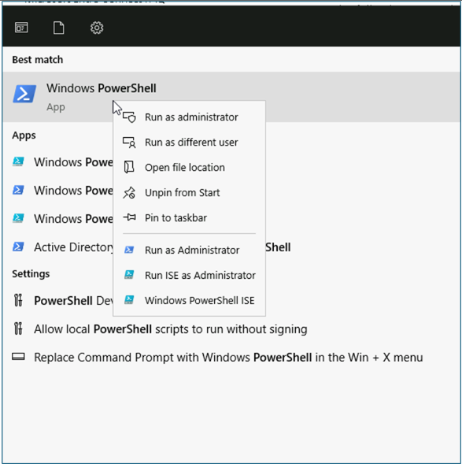
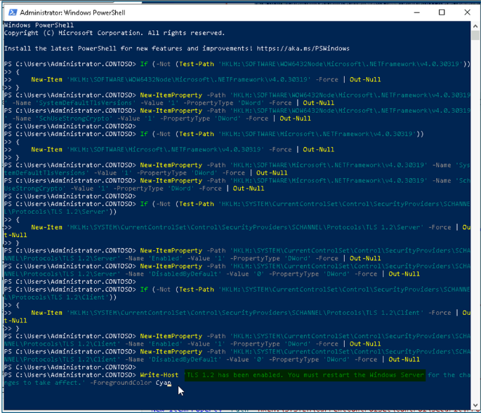
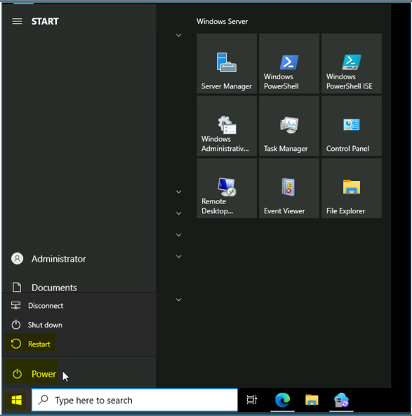
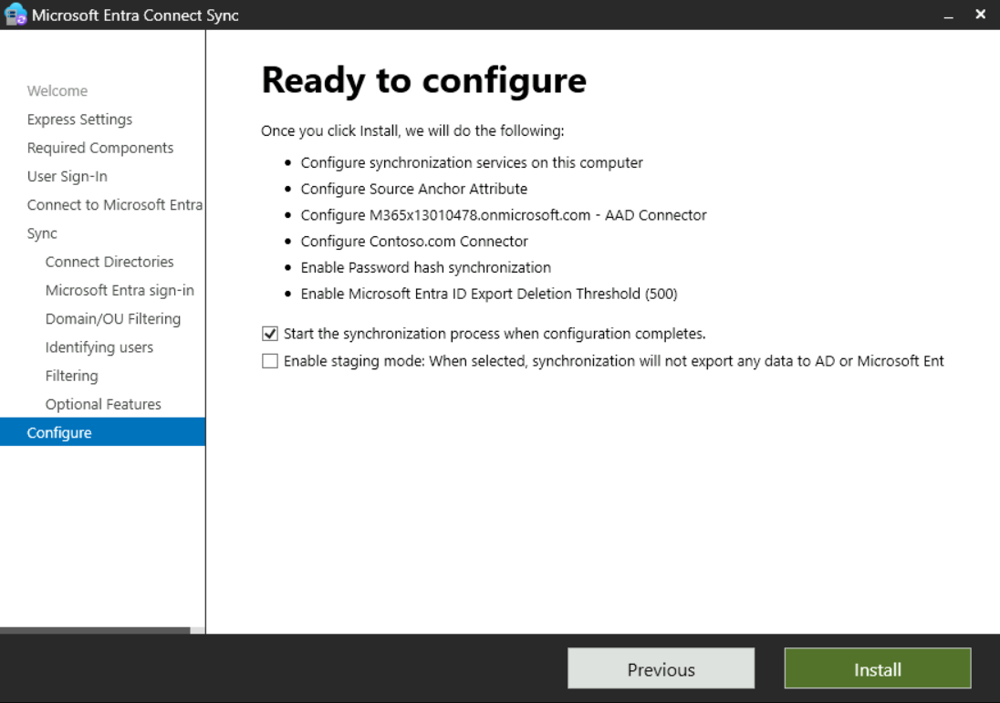
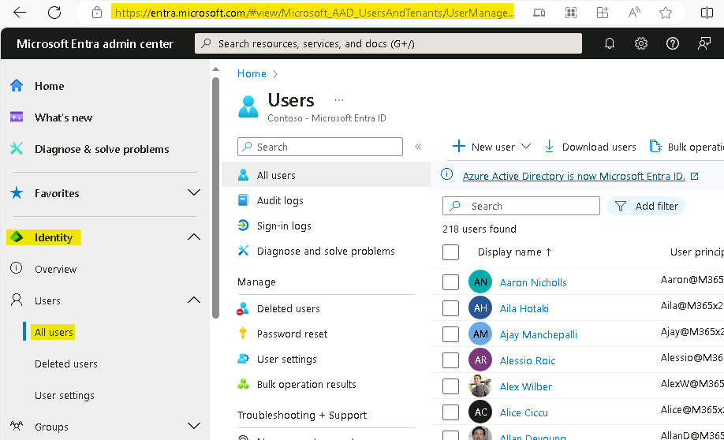

Lab 02 - Synchronizing Identities by using Microsoft Entra Connect

**Summary**

In this lab, you will configure synchronization from Active Directory
Domain Services to Microsoft Entra ID

**Scenario**

Contoso Corporation is currently managing users in both AD DS and
Microsoft Entra ID as separate processes. This is time-consuming and has
led to inconsistent information. You have been tasked with addressing
this issue by connecting the two directories by using the Microsoft
Entra Connect synchronization tool.

## Task 0: Enable TLS 1.2 using PowerShell script. 

1.  On **SEA-SVR1**, sign in
    as [**Contoso\\Administrator**](http://urn:gd:lg:a:send-vm-keys/) with
    the password of [**Pa55w.rd**](http://urn:gd:lg:a:send-vm-keys/) 

&nbsp;

2.  On the start menu type !!**PowerShell**!! right click on PowerShell
    and **select run as administrator**. 

{width="6.0625in" height="6.104166666666667in"} 

3.  Run the following script on the PowerShell. 

If (-Not (Test-Path
\'HKLM:\\SOFTWARE\\WOW6432Node\\Microsoft\\.NETFramework\\v4.0.30319\')) 

{ 

    New-Item
\'HKLM:\\SOFTWARE\\WOW6432Node\\Microsoft\\.NETFramework\\v4.0.30319\'
-Force \| Out-Null 

} 

New-ItemProperty -Path
\'HKLM:\\SOFTWARE\\WOW6432Node\\Microsoft\\.NETFramework\\v4.0.30319\'
-Name \'SystemDefaultTlsVersions\' -Value \'1\' -PropertyType \'DWord\'
-Force \| Out-Null 

New-ItemProperty -Path
\'HKLM:\\SOFTWARE\\WOW6432Node\\Microsoft\\.NETFramework\\v4.0.30319\'
-Name \'SchUseStrongCrypto\' -Value \'1\' -PropertyType \'DWord\' -Force
\| Out-Null 

 

If (-Not (Test-Path
\'HKLM:\\SOFTWARE\\Microsoft\\.NETFramework\\v4.0.30319\')) 

{ 

    New-Item \'HKLM:\\SOFTWARE\\Microsoft\\.NETFramework\\v4.0.30319\'
-Force \| Out-Null 

} 

New-ItemProperty -Path
\'HKLM:\\SOFTWARE\\Microsoft\\.NETFramework\\v4.0.30319\' -Name
\'SystemDefaultTlsVersions\' -Value \'1\' -PropertyType \'DWord\' -Force
\| Out-Null 

New-ItemProperty -Path
\'HKLM:\\SOFTWARE\\Microsoft\\.NETFramework\\v4.0.30319\' -Name
\'SchUseStrongCrypto\' -Value \'1\' -PropertyType \'DWord\' -Force \|
Out-Null 

 

If (-Not (Test-Path
\'HKLM:\\SYSTEM\\CurrentControlSet\\Control\\SecurityProviders\\SCHANNEL\\Protocols\\TLS
1.2\\Server\')) 

{ 

    New-Item
\'HKLM:\\SYSTEM\\CurrentControlSet\\Control\\SecurityProviders\\SCHANNEL\\Protocols\\TLS
1.2\\Server\' -Force \| Out-Null 

} 

New-ItemProperty -Path
\'HKLM:\\SYSTEM\\CurrentControlSet\\Control\\SecurityProviders\\SCHANNEL\\Protocols\\TLS
1.2\\Server\' -Name \'Enabled\' -Value \'1\' -PropertyType \'DWord\'
-Force \| Out-Null 

New-ItemProperty -Path
\'HKLM:\\SYSTEM\\CurrentControlSet\\Control\\SecurityProviders\\SCHANNEL\\Protocols\\TLS
1.2\\Server\' -Name \'DisabledByDefault\' -Value \'0\' -PropertyType
\'DWord\' -Force \| Out-Null 

 

If (-Not (Test-Path
\'HKLM:\\SYSTEM\\CurrentControlSet\\Control\\SecurityProviders\\SCHANNEL\\Protocols\\TLS
1.2\\Client\')) 

{ 

    New-Item
\'HKLM:\\SYSTEM\\CurrentControlSet\\Control\\SecurityProviders\\SCHANNEL\\Protocols\\TLS
1.2\\Client\' -Force \| Out-Null 

} 

New-ItemProperty -Path
\'HKLM:\\SYSTEM\\CurrentControlSet\\Control\\SecurityProviders\\SCHANNEL\\Protocols\\TLS
1.2\\Client\' -Name \'Enabled\' -Value \'1\' -PropertyType \'DWord\'
-Force \| Out-Null 

New-ItemProperty -Path
\'HKLM:\\SYSTEM\\CurrentControlSet\\Control\\SecurityProviders\\SCHANNEL\\Protocols\\TLS
1.2\\Client\' -Name \'DisabledByDefault\' -Value \'0\' -PropertyType
\'DWord\' -Force \| Out-Null 

 

Write-Host \'TLS 1.2 has been enabled. You must restart the Windows
Server for the changes to take affect.\' -ForegroundColor Cyan 

 

{width="6.5in" height="5.579861111111111in"} 

 

4.  Restart the Windows Server VM. 

{width="6.5in" height="6.547916666666667in"}

## Task 1: Configure directory synchronization with Microsoft Entra Connect

1.  On [**[SEA-SVR1]{.underline}**](urn:gd:lg:a:select-vm), if
    necessary, sign in
    as [**Contoso\\Administrator**](urn:gd:lg:a:send-vm-keys) with the
    password of !\!!

2.  On the taskbar, select **Microsoft Edge**.

3.  In the address bar,
    enter !\!!

4.  On the Microsoft Entra Connect page, select **Download**.

> Microsoft Entra Connect automatically downloads to
> the **Downloads** folder on **SEA-SVR1**.
>
> {width="6.5in"
> height="3.879861111111111in"}

5.  Click on **Open file** for the downloaded
    file **AzureADConnect.msi**.

> {width="4.406864610673666in"
> height="1.2814293525809275in"}

6.  In the **Microsoft Azure Active Directory Connect** wizard, on
    the **Welcome to Azure AD Connect** page, select the **I agree to
    the license terms and privacy notice** check box, and then
    select **Continue**.

> {width="6.5in" height="4.54375in"}

7.  On the **Express Settings** page, select **Customize**.

> {width="6.5in"
> height="4.533333333333333in"}

8.  On the **Install required components** page, select **Install**.

> {width="6.5in"
> height="4.538194444444445in"}

9.  On the **User sign-in** page, ensure that **Password Hash
    Synchronization** is selected, and then select **Next**.

> {width="6.5in"
> height="4.572222222222222in"}

10. On the **Connect to Azure AD** page, in
    the **USERNAME** and **PASSWORD** boxes, enter your **Office 365
    Tenant credentials** and then select **Next**.

> {width="6.5in"
> height="4.5465277777777775in"}

11. On the **Connect your directories** page, ensure
    that **Contoso.com** is listed under **FOREST**, and then
    select **Add Directory**.

> {width="6.5in" height="3.61875in"}

12. In the **AD forest account** window, select the **Create New AD
    Account** option, and in the **ENTERPRISE ADMIN USERNAME** field,
    type [**Contoso\\Administrator**](urn:gd:lg:a:send-vm-keys), and
    then type !\!! in
    the **PASSWORD** field. Select **OK**, and then select **Next**.

> {width="6.209199475065617in"
> height="4.917352362204724in"}
>
> {width="6.5in"
> height="4.552083333333333in"}

13. On the **Azure AD sign-in configuration** page, ensure that in
    the **USER PRINCIPAL NAME** drop-down list,
    the **userPrincipalName** value is selected.

> {width="6.5in"
> height="4.5465277777777775in"}

14. Select **Continue without matching all UPN suffixes to verified
    domains** and then select **Next**.

15. On the **Domain and OU filtering** page, select **Sync selected
    domains and OUs**.

16. Expand **Contoso.com**, clear the checkbox next
    to **Contoso.com** and ensure that the only following check boxes
    are selected: **IT**, **Managers**, **Marketing**, **Research**,
    and **Sales**. Select **Next**.

> {width="6.5in"
> height="4.513888888888889in"}

17. On the **Uniquely identifying your users** page, select **Next**.

18. On the **Filter users and devices** page, select **Next**.

19. On the **Optional features** page, review available options, but do
    not make any changes. Ensure that **Password hash
    synchronization** is selected, and then select **Next**.

> {width="6.5in"
> height="4.572916666666667in"}

20. On the **Ready to configure** page, ensure that **Start the
    synchronization process when configuration completes** is selected,
    and then select **Install**.

> {width="6.5in"
> height="4.558333333333334in"}

21. When configuration is complete, select **Exit**.

> {width="6.5in" height="4.498611111111111in"}
>
> **Note**: At this time, synchronization of objects from your local
> Active Directory Domain Services (AD DS) and Microsoft Entra ID
> begins. You should wait approximately 3-4 minutes for this process to
> complete.

22. Close all open windows.

## Task 2: Verify synchronization in Microsoft Entra ID

1.  In the **Microsoft Edge** open a new tab and navigate to the
    Microsoft Entra admin Center users page -
    !\!!
    If prompted to sign in use the Office 365 Tenant credentials from
    the Home tab of the Lab interface.

> {width="6.5in"
> height="3.951388888888889in"}

2.  Verify that you see users from your local AD DS. Ensure that these
    users have the value **Yes** in the **On-premises sync
    enabled** column.

> {width="6.5in" height="4.029861111111111in"}

3.  In the Navigation pane, select Expand **Groups** and then select
    **All groups**.

> {width="5.6910804899387575in"
> height="4.642244094488189in"}

4.  Verify that you see groups from your local AD DS ()

> {width="6.5in"
> height="4.059027777777778in"}

5.  Select the **Managers** group.

> {width="6.5in"
> height="4.059027777777778in"}

6.  On the **Managers** group page, select **Members** and then ensure
    that you see users.

> {width="5.951545275590552in"
> height="3.66121719160105in"}
>
> {width="5.9255982064741906in"
> height="3.97382217847769in"}
>
> **[Note that you cannot add to or remove members from this group, as
> it is sourced from the local AD DS.]{.mark}**

15. Close Microsoft Edge.

**Results**: After completing this exercise, you will have successfully
configured Microsoft Entra Connect to synchronize identity from Active
Directory Domain Services to Microsoft Entra ID
