Lab 20: Deploying Windows 11 with Autopilot

**Summary**

In this lab you will learn how provision a Windows 11 device with
Autopilot using User-driven mode.

**Prerequisites**

To following lab(s) must be completed before this lab:

-   Lab 01-Managing Identities in Microsoft Entra ID

-   Lab 02-Synchronizing Identities by using Azure AD Connect

-   Lab 11-Deploying Windows 11 using Microsoft Deployment Toolkit

**Scenario**

Contoso IT is planning to roll out a deployment of new Windows 11
devices using Autopilot. The devices have a default installation of
Windows 11. Users should be able to connect the device, turn it on, and
answer minimal questions during the OOBE, using their Microsoft Entra ID
credentials to sign in. The process should automatically enroll and join
the Entra ID domain. You have been asked to configure and test the
experience using the SEA-WS4, which you recently installed and
configured using Hyper-V.

Task 1: Create a group in Microsoft Entra Admin center.

1.  Switch and Sign in
    to [**[SEA-SVR1]{.underline}**](urn:gd:lg:a:select-vm) as !!  with
    the password [**Pa55w.rd**](urn:gd:lg:a:send-vm-keys) and
    close **Server Manager**.**Contoso\\Administrator**!! with the
    password !!!!  and close **Server Manager**.

2.  On the taskbar, select **Microsoft Edge**.

3.  In Microsoft Edge, in the address bar, type !!﷟HYPERLINK
    \"https://entra.microsoft.com\"**ttps://entra.microsoft.com**!!, and
    then press **Enter**. If prompted, sign in with your  and the
    password.[**admin@M365xXXXXXXXX.onmicrosoft.com**](mailto:admin@M365xXXXXXXXX.onmicrosoft.com)!!
     and the password.

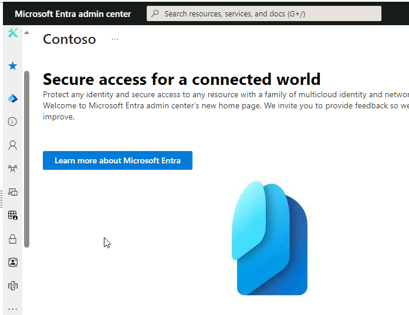{width="6.5in" height="5.017361111111111in"}

4.  In the navigation pane, select **Identity.**

5.  Under **Identity**, select **Groups**.

pon> 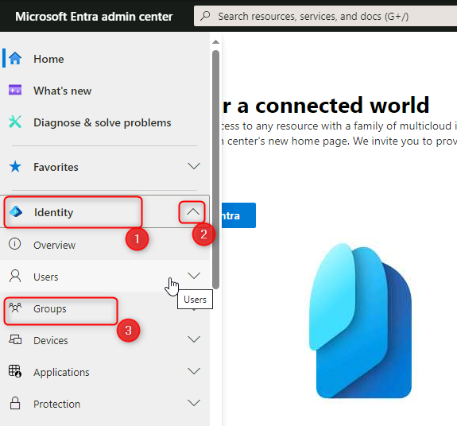{width="5.993591426071741in"
> height="5.587070209973754in"}

6.  In the **Groups \| All groups** blade, select **New group**.

> 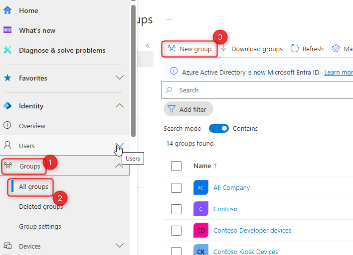{width="6.5in" height="4.709722222222222in"}

7.  In the **New Group** blade, in the **Group type** list,
    select **Security**.

8.  In the **Group name** box, type !!﷟HYPERLINK
    \"http://urn:gd:lg:a:send-vm-keys\"**IT Devices**!!.

9.  In the **Group description** box, type !!﷟HYPERLINK
    \"http://urn:gd:lg:a:send-vm-keys\"**IT Department Devices**!!.

10. In the **Membership type** list, select **Dynamic Device**.

11. Select **Add dynamic query**.

> {width="5.369595363079615in"
> height="5.5885487751531056in"}

12. On the **Dynamic membership rules** blade select **Edit** above
    the **Rule syntax** box.

> {width="6.5in" height="2.7909722222222224in"}

13. In the Edit rule syntax text box, add the following simple
    membership rule and select **OK**.

14. !!(device.devicePhysicalIDs -any (\_ -contains \"\[ZTDId\]\"))!!

> 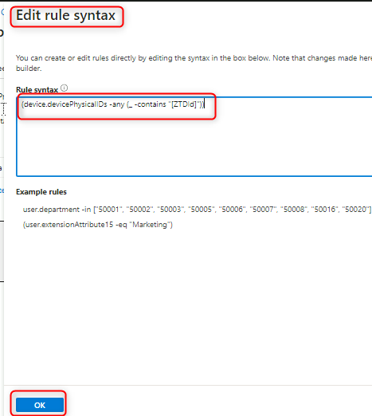{width="4.867839020122485in"
> height="5.441138451443569in"}

15. Select **Save** to close **Dynamic membership rules**, and then
    select **Create** to create the group.

> {width="4.919957349081365in"
> height="4.388351924759405in"}
>
> {width="5.045040463692039in"
> height="5.712153324584427in"}
>
> 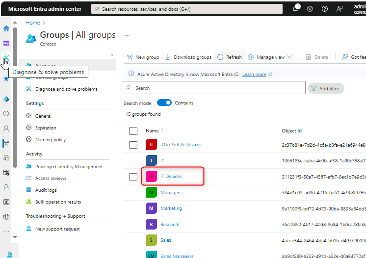{width="6.5in" height="4.583333333333333in"}

Task 2: Generate a device-specific comma-separated value (CSV) file

1.  Switch to [**[SEA-SVR2]{.underline}**](urn:gd:lg:a:select-vm) and
    sign in
    as [**Contoso\\Administrator**](urn:gd:lg:a:send-vm-keys) with the
    password of !!﷟HYPERLINK
    \"http://urn:gd:lg:a:send-vm-keys\"**Pa55w.rd**!!.

> {width="6.5in"
> height="5.097222222222222in"}

2.  Select **Hyper-V Manager** in the taskbar.

> {width="6.5in"
> height="6.2034722222222225in"}

3.  Under Virtual Machines, right-click **SEA-WS4** and
    select **Connect**.

> {width="6.5in" height="3.801388888888889in"}

4.  On the **SEA-WS4** window, select **Start**. When the computer
    starts, maximize the window.

> {width="6.5in"
> height="4.959722222222222in"}

5.  Sign in
    to **SEA-WS4** as [**Administrator**](urn:gd:lg:a:send-vm-keys) with
    the password of  !!﷟HYPERLINK
    \"http://urn:gd:lg:a:send-vm-keys\"**Pa55w.rd**!!.

> {width="6.5in"
> height="3.966666666666667in"}

6.  Right-click **Start**, select **Windows Terminal (Admin)**, and then
    select **Yes** at the **User Account Control** prompt.

> 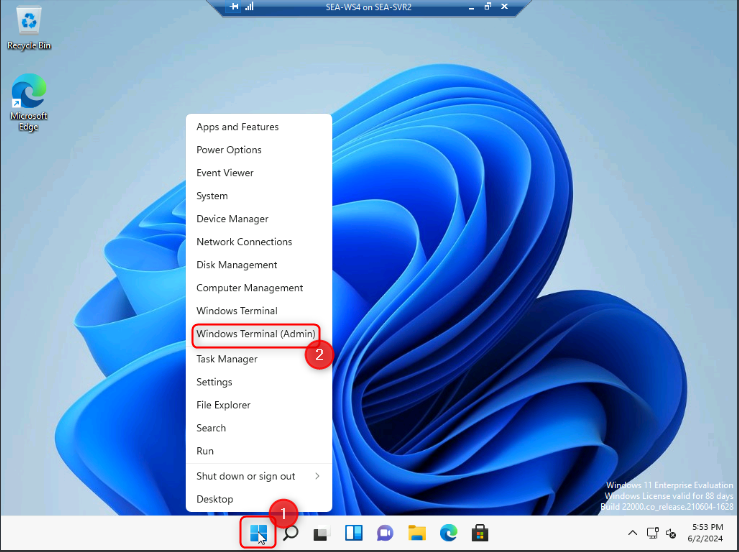{width="6.5in" height="4.854861111111111in"}
>
> {width="4.013100393700787in"
> height="3.2209044181977253in"}

7.  At the Windows PowerShell command-line prompt, type the following
    cmdlet, and then press **Enter**:

> !! Install-Script -Name Get-WindowsAutoPilotInfo!!

{width="6.5in"
height="4.126388888888889in"}

8.  You will receive three prompts. Each time,
    type [**Y**](urn:gd:lg:a:send-vm-keys), and then press **Enter**.

> {width="6.5in" height="4.08125in"}

9.  At the Windows PowerShell command-line prompt, type the following
    cmdlet, and then press **Enter**:

> !!**Set**-ExecutionPolicy *RemoteSigned*!!

10. When prompted, type [**Y**](urn:gd:lg:a:send-vm-keys), and then
    press Enter.

11. At the Windows PowerShell command-line prompt, type the following
    cmdlet, and then press **Enter**:

> !!Get-WindowsAutoPilotInfo.ps1 -OutputFile C:\\Computer.csv!!
>
> {width="6.5in" height="4.035416666666666in"}

12. At the Windows PowerShell command-line prompt, type the following
    command, press **Enter**, and then review the file content:

13. **type** !!C:\\Computer.csv!!

> 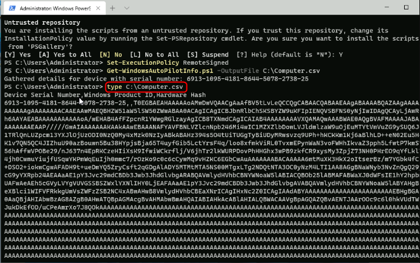{width="6.5in" height="4.06875in"}

14. At the Windows PowerShell command-line prompt, type the following
    command, press **Enter**. This will copy the file to **SEA-SVR2**:

15. copy !!c:\\computer.csv \\\\sea-svr2\\labfiles!!

> {width="6.5in"
> height="4.059027777777778in"}

16. Close the Windows PowerShell command prompt.

Task 3: Work with a Windows Autopilot deployment profile

1.  Switch to [**[SEA-SVR1]{.underline}**](urn:gd:lg:a:select-vm).

> {width="6.5in" height="4.8597222222222225in"}

2.  In **Microsoft Edge**, open a new tab and navigate to !!﷟HYPERLINK
    \"https://intune.microsoft.com\"**https://intune.microsoft.com**!!
    If prompted, sign in with  and
    password.[**admin@M365xXXXXXXX.onmicrosoft.com**](mailto:admin@M365xXXXXXXX.onmicrosoft.com)!!
    and password.

3.  In the **Microsoft Intune admin center**, select **Devices**.

4.  In the **Device enrollment** section, select **Enroll devices**.

5.  In the details pane scroll down to **Windows Autopilot Deployment
    Program**, and then select **Devices**.

> {width="6.5in"
> height="4.2444444444444445in"}

6.  In the **Windows Autopilot devices** blade on the menu bar,
    select **Import**, select the **folder icon** and then browse
    to !!﷟HYPERLINK
    \"http://urn:gd:lg:a:send-vm-keys\"**\\\\SEA-SVR2\\Labfiles**!!,
    select **Computer.csv**, select **Open**, and then
    select **Import**.

> {width="6.5in" height="4.135416666666667in"}
>
> {width="4.555130139982502in"
> height="2.939466316710411in"}
>
> {width="6.5in" height="4.225in"}
>
> {width="6.5in"
> height="3.5680555555555555in"}
>
> **Note**: The import process can take up to 15 minutes, but normally
> takes around 5 minutes.
>
> **Important**: After the process is complete, the device may not show.
> If this is the case, select the **Sync** button, wait a few minutes,
> and then select **Refresh**.

7.  Select **X** to close the **Windows Autopilot devices** blade.

> {width="6.5in" height="4.0875in"}

8.  On the Windows enrollment blade, in the details pane,
    select **Deployment Profiles**.

> {width="6.5in" height="4.245138888888889in"}

9.  On the **Windows AutoPilot deployment profiles** blade,
    select **Create profile** and then select **Windows PC**.

> 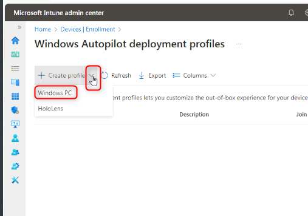{width="5.2847845581802275in"
> height="3.7108147419072615in"}

10. In the **Basics** tab, in the **Name** text box, type !!﷟HYPERLINK
    \"http://urn:gd:lg:a:send-vm-keys\"**Contoso profile1**!!.

11. For **Convert all targeted devices to Autopilot** select **No**, and
    then select **Next**.

> {width="6.275029527559055in"
> height="4.846991469816273in"}

12. On the **Out-of-box experience (OOBE)** tab, ensure that
    the **Deployment mode** is set to **User-Driven**.

13. Ensure that **Join to Microsoft Entra ID as** is set to **Microsoft
    Entra Joined**.

14. Ensure that the following options are set:

    -   Microsoft Software License Terms: **Hide**

    -   Privacy Settings: **Hide**

    -   Hide change account options: **Hide**

    -   User account type: **Administrator**.

    -   Allow pre-provisioned deployment: **No**

    -   Language (Region): **Operating system default**

    -   Automatically configure keyboard: **Yes**

    -   Apply device name template: **No**

15. Select **Next**.

> {width="6.5in" height="4.754166666666666in"}

16. On the **Assignments** tab, under **Included groups** select **Add
    groups**.

17. Select the **IT Devices** group and click **Select**.
    Select **Next**.

> {width="4.32580927384077in"
> height="4.315386045494313in"}
>
> {width="4.367504374453193in"
> height="4.9303805774278215in"}
>
> {width="4.826143919510061in"
> height="4.982498906386701in"}

18. On the **Review + create** blade, review the information and then
    select **Create**.

> {width="5.1388538932633425in"
> height="4.940803805774278in"}
>
> 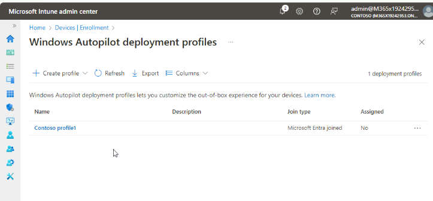{width="6.5in" height="3.0208333333333335in"}

Task 4: Reset the PC

1.  Switch to [**[SEA-SVR2]{.underline}**](urn:gd:lg:a:select-vm).
    The **SEA-WS4** computer should be still maximized.

> {width="6.5in" height="4.865972222222222in"}

2.  On **SEA-WS4**, select **Start**, type !!﷟HYPERLINK
    \"http://urn:gd:lg:a:send-vm-keys\"**reset**!!  and select **Reset
    this PC**.

> 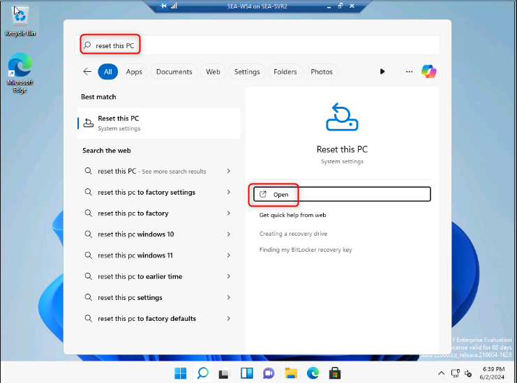{width="6.5in" height="4.815972222222222in"}

3.  In the **Reset this PC** section, select **Reset PC**.

> {width="6.5in"
> height="4.896527777777778in"}

4.  Select **Remove everything**, and then select **Local reinstall**.

> {width="5.180547900262467in"
> height="3.4085290901137357in"}
>
> {width="5.149277121609798in"
> height="3.4293766404199477in"}

5.  Select **Next** and then select **Reset**.

> {width="5.243089457567804in"
> height="3.5544608486439193in"}
>
> {width="5.149277121609798in"
> height="3.4085290901137357in"}
>
> **Note**: Normally this task is not required for new deployment of
> physical devices. The device's autopilot info is either provided by
> the manufacturer or can be obtained from the device prior to the OOBE.
> For the purposes of this lab, we must initiate a reset to simulate a
> new device OOBE.
>
> **Note**: This process can take 45-60 minutes and will reboot several
> times during the process. Your instructor may continue with the next
> module while this task completes. Be sure to come back to complete
> Task 5 during your next lab session.

Task 5: Verify Autopilot deployment

1.  At the **Contoso Corp. Sign-in Page**, enter  !!﷟HYPERLINK
    \"mailto:Cindy@M365x19242953.onmicrosoft.com\"**Cindy@M365x19242953.onmicrosoft.com**!!and
    select **Next**.

2.  At the Password page, enter !!﷟HYPERLINK
    \"mailto:P@55w.rd1234\"**P@55w.rd1234**!! and select **Sign in**.

3.  At the **Use Windows Hello with your account**, select **OK**.

> {width="6.5in"
> height="4.673611111111111in"}

4.  At the **Verify your identity** page, select the Text verification
    method.

> {width="4.970758967629046in"
> height="4.793604549431321in"}

5.  At the **Enter code** page, enter the code that has been texted to
    your mobile device and then select **Verify**.

> {width="4.867839020122485in"
> height="4.774025590551181in"}

6.  On the **Setup up a PIN** dialog box, in the **New
    PIN** and **Confirm PIN** fields,
    enter [**102938**](urn:gd:lg:a:send-vm-keys), and then
    select **OK**.

> {width="6.5in" height="4.70625in"}

7.  On the **All set!** page, select **OK**.

8.  Select **Start** and select **Settings**.

> {width="4.878262248468942in"
> height="5.06588801399825in"}

9.  Select **Accounts**, and then select **Access work or school**.
    Verify the device is connected to Contoso\'s Azure AD.

> {width="6.02486220472441in"
> height="4.774025590551181in"}

10. Select **Connected to Contoso\'s Azure AD** and select **Info**.

> {width="5.983168197725284in"
> height="4.7844499125109365in"}

11. On the **Managed by Contoso** page, scroll down and then
    select **Sync**.

> {width="6.139522090988627in"
> height="4.826143919510061in"}
>
> 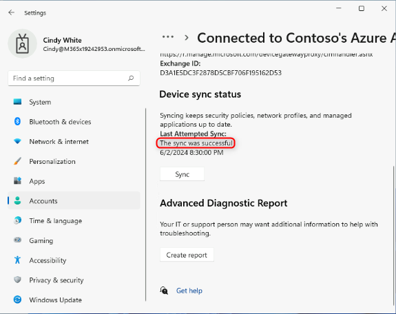{width="5.993591426071741in"
> height="4.753179133858268in"}

12. On **SEA-WS4**, close the **Settings** window.

13. Switch to [**[SEA-SVR1]{.underline}**](urn:gd:lg:a:select-vm).

14. In the Microsoft Entra admin center, select **Identity**,
    select **Devices** and then select **All devices**.

> 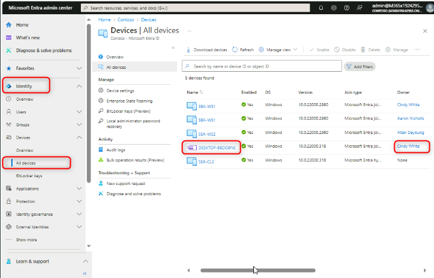{width="6.5in" height="4.175694444444445in"}
>
> Note that the new device displays with a name beginning with
> \"**DESKTOP-**\". Also note that the Join Type is **Microsoft Entra ID
> joined** with Cindy White as the owner.

15. Select the Autopilot device. Review the management options along the
    top menu bar.

> Notice that you can **Retire, Wipe, Sync,** and **Restart** the
> device.

16. Select the ellipse at the end of the menu bar and take notice of the
    additional management capabilities.

> {width="6.5in"
> height="3.186111111111111in"}
>
> {width="6.5in"
> height="3.576388888888889in"}
>
> Additional capabilities include Fresh Start, Autopilot Reset, Quick
> scan, Full scan, as well as others.

17. Close Microsoft Edge.

**Results**: After completing this exercise, you will have provisioned a
Windows 11 device with Autopilot using User-driven mode.
