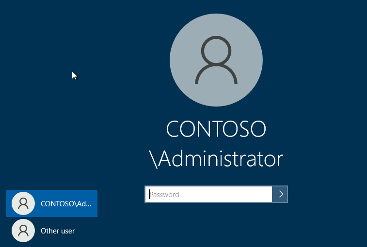
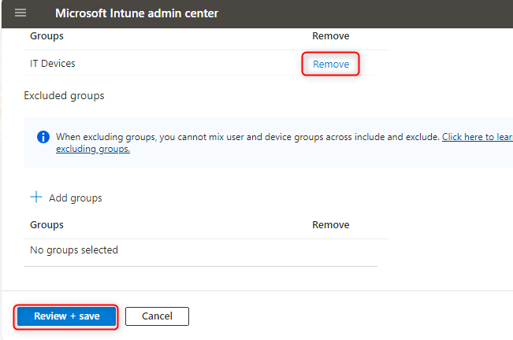
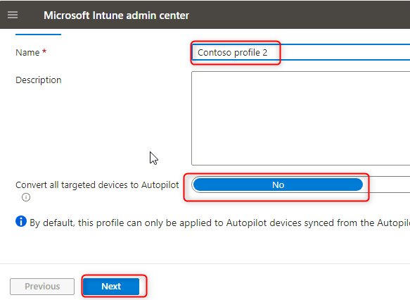
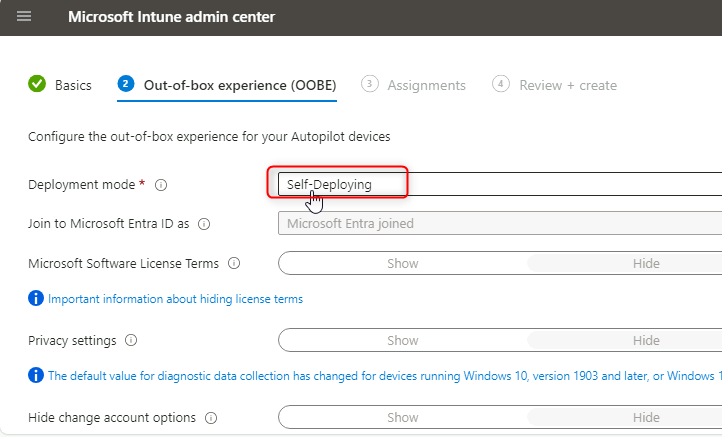
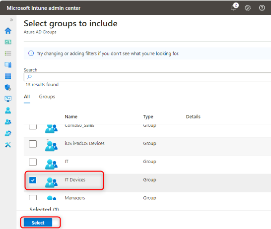

# Lab 21: Refreshing Windows with Autopilot Reset and Self-Deploying mode.

**Summary**

In this lab you will learn how perform a remote Autopilot reset.

**Prerequisites**

To following lab(s) must be completed before this lab:

-   Lab 01-Managing Identities in Microsoft Entra ID

-   Lab 02-Synchronizing Identities by using Azure AD Connect

-   Lab 21-Deploying Windows 11 using Microsoft Deployment Toolkit

-   Lab 20-Deploying Windows 11 with Autopilot

**Scenario**

SEA-WS4 has been deployed by using Windows Autopilot. You need to test
out another provisioning scenario that involves Autopilot Reset. You
will create a new deployment profile configured with the Windows
Autopilot Self-Deploying mode.

## Task 1: Configure a Self-Deploying Windows Autopilot deployment profile

1.  Switch to SEA-SVR1.

    > 
2.  In **Microsoft Edge**, open a new tab and navigate
    to !!https://intune.microsoft.com!!
    If prompted, sign in
    with admin@M365xXXXXXXXX.onmicrosoft.com and paswword.

3.  In the **Microsoft Intune admin center**, select **Devices**.

    > 

4.  In the **Device onboarding** section, select **Enrollment**.

    > 

5.  On the Windows enrollment blade, in the details pane,
    select **Deployment Profiles**.

    > 
6.  On the **Windows AutoPilot deployment profiles** blade,
    select **Contoso Profile 1** and then select **Properties**.

    > 
    > 
    >
    > 

7.  Scroll down to **Assignments** and then select **Edit**.

    > 

8.  Next to **IT Devices**, select **Remove**.

    > 
9.  Select **Review and save** and then select **Save**.

    > 

10. Close the **Contoso Profile 1\|Properties** page.

11. On the **Windows AutoPilot deployment profiles** blade,
    select **Create profile** and then select **Windows PC**.

    > 
12. In the **Basics** tab, in the **Name** text box, type !!Contoso profile 2!!

13. For **Convert all targeted devices to Autopilot** select **No**, and
    then select **Next**.

    > 

14. On the **Out-of-box experience (OOBE)** tab, ensure that
    the **Deployment mode** is set to **Self-Deploying**.

    > 

15. Ensure that the following options are set:

    -   Language (Region): **Operating system default**

    -   Automatically configure keyboard: **Yes**

    -   Apply device name template: **Yes**

    -   Enter a name: !!Contoso-%RAND:2%!!
    > 

16. Select **Next**.

17. On the **Assignments** tab, under **Included groups** select **Add
    groups**.

    > 

18. Select the **IT Devices** group and click **Select**.
    Select **Next**.

    > 
    >
    > 

19. On the **Review + create** blade, review the information and then
    select **Create**.

    > 

## Task 2: Perform an Autopilot reset

1.  In the **Microsoft Intune admin center**, select **Devices** and
    then select **All devices**.

2.  Select the Autopilot PC (Begins with the name DESKTOP).

    > 
 
3.  In the menu bar, select the ellipse and then select **Autopilot
    Reset**.

    > 

4.  At the message prompt, select **Yes**.

    > 

5.  Switch to SEA-SVR2 and
    maximize the **SEA-WS4** window.

        > **Note**: SEA-WS4 should still be running from the previous lab
        >
    > **Note**: Update the device to the latest version and then click on
    > restart.

6.  Restart **SEA-WS4**.

    > 
    >
    > **Note**: This process can take 30 minutes and will reboot several
    > times during the process. Your instructor may continue with the next
    > module while this task completes. Be sure to come back to complete
    > Task 3 during your next lab session.

## Task 3: Verify Autopilot deployment

1.  At the sign-in page,
    enter Cindy@M365x19242953.onmicrosoft.com with
    the Password of !!P@55w.rd1234!!

2.  At the **Use Windows Hello with your account**, select **OK**.

    > 

3.  At the **Verify your identity** page, select the Text verification
    method.

4.  At the **Enter code** page, enter the code that has been texted to
    your mobile device and then select **Verify**.

    > 

5.  On the **Setup up a PIN** dialog box, in the **New
    PIN** and **Confirm PIN** fields,
    enter !!102938!!, and then
    select **OK**.

    > 
6.  On the **All set!** page, select **OK**.

7.  Select **Start** and select **Settings**.

    >  
8.  Select **Accounts**, and then select **Access work or school**.
    Verify the device is connected to Contoso\'s Azure AD.

    >  

9.  Select **Connected to Contoso\'s Azure AD** and select **Info**.

    > 
 1. 
10. On the **Managed by Contoso** page, scroll down and then
    select **Sync**.

   

11. On **SEA-WS4**, close the **Settings** window.

12. Shut down **SEA-WS4** and close the **SEA-WS4** window.

13. On SEA-SVR2, close
    Hyper-V Manager.

**Results**: After completing this exercise, you will have provisioned a
Windows 11 device with Autopilot Reset using Self-Deploying mode.
