Lab 22: Configuring Cloud Attach and Co-Management Using Configuration
Manager

**Summary**

In this lab, you will enable Cloud Attach and configure Co-Management
using Microsoft Endpoint Configuration Manager and Microsoft Intune.

**Prerequisites**

To following lab(s) must be completed before this lab:

-   Lab 01-Managing Identities in Microsoft Entra ID

-   Lab 02-Synchronizing Identities by using Azure AD Connect

-   Lab 03-Configuring and managing Microsoft Entra ID join

-   Lab 05-Manage Device Enrollment into Intune

**Scenario**

Contoso has both a Microsoft Endpoint Configuration Manager
implementation and Microsoft Intune. You need to configure integration
between the two services and enable co-management for your managed
Windows devices. You will enable Cloud Attach, configure co-management,
and then validate the settings using SEA-CL1.

Task 1: Prepare the environment

1.  Switch to [**[SEA-SVR1]{.underline}**](urn:gd:lg:a:select-vm) and
    sign in
    as [**Contoso\\Administrator**](urn:gd:lg:a:send-vm-keys) with the
    password of !\!! .

2.  From Server Manager, select **Tools**, and then select **Active
    Directory Users and Computers**.

> 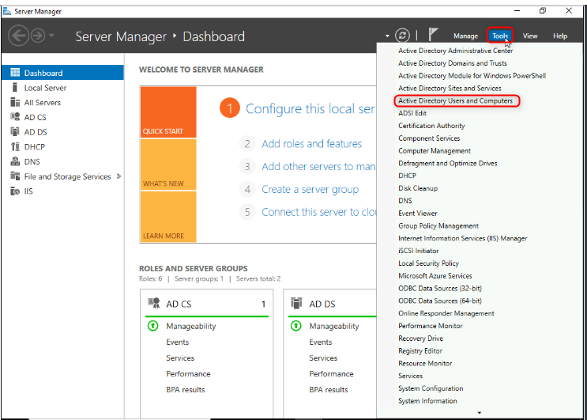{width="6.5in" height="4.645138888888889in"}

3.  In the navigation pane, select **Seattle Clients**.

> {width="5.628764216972878in"
> height="3.9505588363954507in"}

4.  Right-click **SEA-CL1** and then select **Move**.

> {width="5.753848425196851in"
> height="4.033947944006999in"}

5.  In the **Move** dialog box, select **Entra clients** and then
    select **OK**.

> {width="2.480825678040245in"
> height="2.5016732283464567in"}

6.  Close **Active Directory Users and Computers**.

7.  On the taskbar, right-click **Start** and select **Windows
    Powershell (Admin)**.

> {width="5.274360236220472in"
> height="5.795542432195975in"}

8.  In the **Windows PowerShell** window, type the following command,
    and then press **Enter**:

> !!**Start**-ADSyncSyncCycle -PolicyType **Initial**!!
>
> {width="6.429681758530184in"
> height="4.647712160979878in"}

9.  Close the PowerShell window.

10. Switch to [**[SEA-CL1]{.underline}**](urn:gd:lg:a:select-vm).

11. On the taskbar, right-click **Start**, select **Shut down or sign
    out** and then select **Restart**.

> 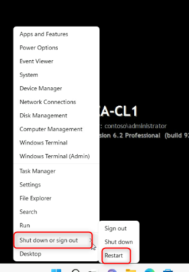{width="3.345987532808399in"
> height="4.805297462817148in"}
>
> **Note**: The reboot will trigger the hybrid Azure AD join on SEA-CL1.

12. After [**[SEA-CL1]{.underline}**](urn:gd:lg:a:select-vm) has
    restarted, sign in
    as [**Contoso\\Administrator**](urn:gd:lg:a:send-vm-keys) with the
    password of [**Pa55w.rd**](urn:gd:lg:a:send-vm-keys).

13. On the taskbar, right-click **Start** and select **Windows Terminal
    (Admin)**.

> 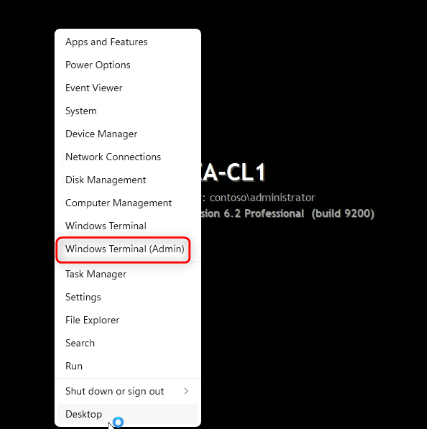{width="4.450893482064742in"
> height="4.471741032370954in"}

14. In the **Windows PowerShell** window, type the following command,
    and then press **Enter**:

> !!dsregcmd /**status**!!

15. In the output under **Device State**, verify that **AzureAdJoined :
    YES** and **DomainJoined : YES** are displayed.

> 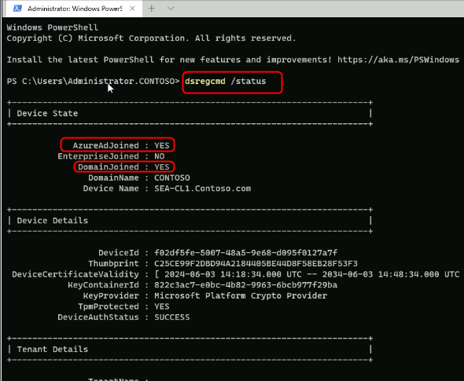{width="6.149946412948381in"
> height="5.055464785651793in"}
>
> **Note**: If the device is not yet joined to Azure AD wait for the
> Azure AD Connect sync to complete and reboot SEA-CL1 again.

16. Close all windows
    on [**[SEA-CL1]{.underline}**](urn:gd:lg:a:select-vm).

Task 2: Create a device collection

1.  Switch to [**[SEA-CFG1]{.underline}**](urn:gd:lg:a:select-vm), sign
    in as [**Contoso\\Administrator**](urn:gd:lg:a:send-vm-keys) with
    the password [**Pa55w.rd**](urn:gd:lg:a:send-vm-keys).

2.  On the taskbar, select **Configuration Manager Console**. The
    Microsoft Endpoint Configuration Manager console opens.

> {width="6.045709755030622in"
> height="3.8358989501312335in"}

3.  In the **Assets and Compliance** workspace, select **Device
    Collections**.

4.  Right-click **Device Collections** and then select **Create Device
    Collection**. The Create Device Collection Wizard opens.

> 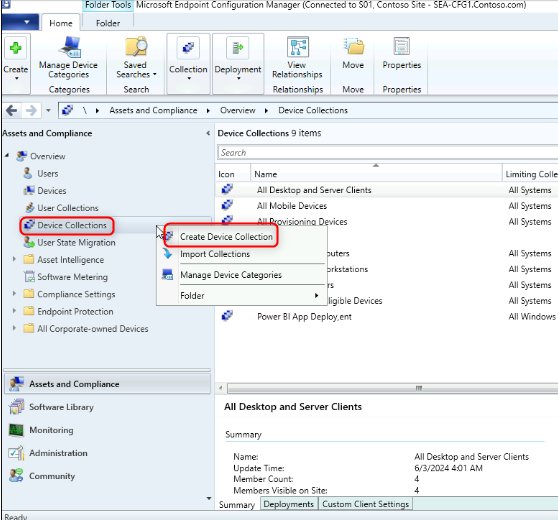{width="5.816389982502187in"
> height="5.420291994750656in"}

5.  On the **General** page, configure the following and then
    select **Next**:

    -   Name: !\!!

    -   Limiting collection: **All Desktop and Server Clients**

> 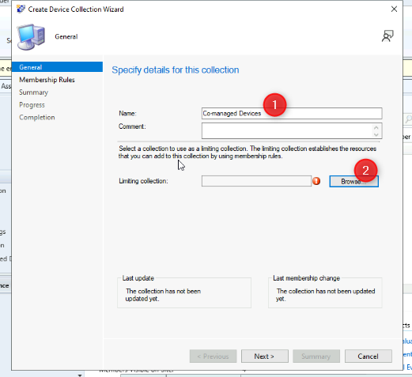{width="5.4307152230971125in"
> height="4.972075678040245in"}
>
> {width="5.503681102362204in"
> height="3.7316622922134735in"}
>
> 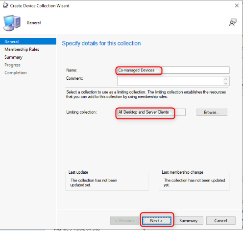{width="5.17012467191601in"
> height="4.919957349081365in"}

6.  On the **Membership Rules** page, select **Next**.

> {width="5.2639370078740155in"
> height="4.96165135608049in"}

7.  At the Configuration Manager warning, select **OK**. You will add a
    direct member at a later step.

> {width="3.0749726596675417in"
> height="1.2404133858267716in"}

8.  On the **Summary** page, select **Next** and then at
    the **Completion** page, select **Close**.

> {width="5.201395450568679in"
> height="4.899109798775153in"}
>
> {width="5.190971128608924in"
> height="4.9095330271216095in"}

Task 3: Assign a Device to an existing Collection

1.  In the **Assets and Compliance** workspace, select **Devices**.

> Take note of the devices listed. Any device that has a green circle
> with a white checkmark are currently active.

2.  In the details pane, select **SEA-CL1**.

3.  Right-click **SEA-CL1**, point to **Add Selected Items**, and then
    select **Add Selected Items to Existing Device Collection**.

> 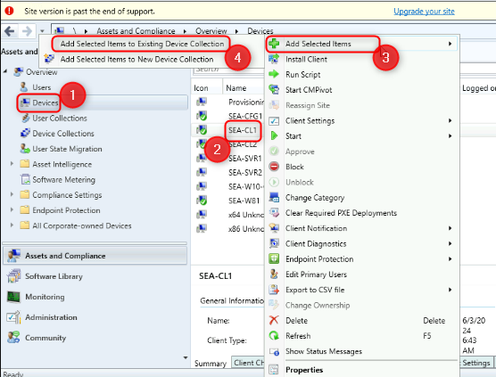{width="5.795542432195975in"
> height="4.409198381452319in"}

4.  On the **Select Collection** dialog box, select **Co-managed
    Devices**, and then select **OK**.

> 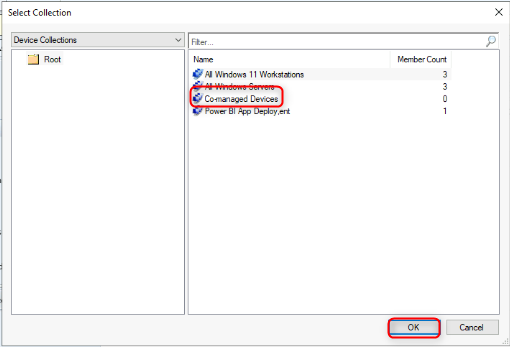{width="5.316055336832896in"
> height="3.6170024059492563in"}

5.  To verify, in the **Assets and Compliance** workspace,
    select **Device Collections** and then double-click **Co-managed
    Devices**.

> 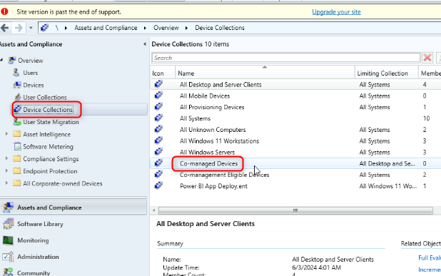{width="6.441807742782152in"
> height="4.033947944006999in"}
>
> 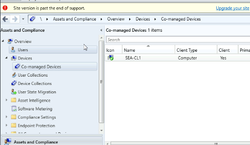{width="5.325068897637795in"
> height="3.0950010936132983in"}
>
> **SEA-CL1** should be listed as a member of this collection.

Task 4: Cloud attach Endpoint Configuration Manager

1.  In the Microsoft Endpoint Configuration Manager console, select
    the **Administration** workspace.

> 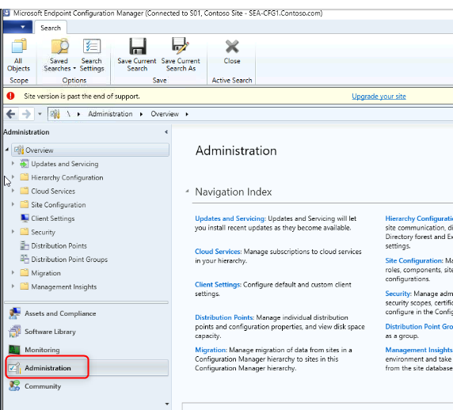{width="5.962320647419072in"
> height="5.399444444444445in"}

2.  In the **Administration** workspace, expand **Cloud Services** and
    then select **Cloud Attach**.

> {width="4.638519247594051in"
> height="3.9297112860892387in"}

3.  In the ribbon, select **Configure Cloud Attach**. The **Cloud Attach
    Configuration Wizard** opens.

> 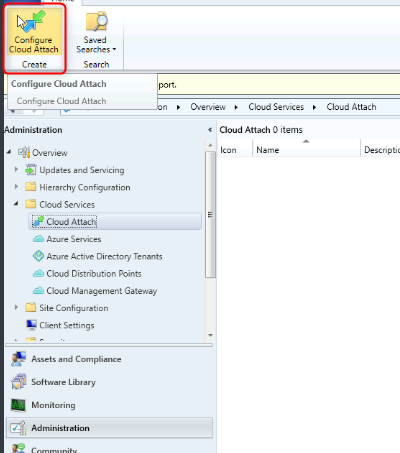{width="4.1694553805774275in"
> height="4.721908355205599in"}
>
> 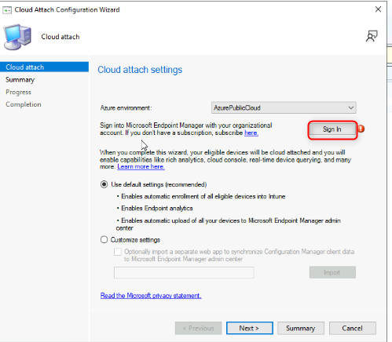{width="5.201395450568679in"
> height="4.544705818022747in"}

4.  In the **Cloud Attach Configuration Wizard**, on the **Cloud
    attach** page, select **Sign In**.

5.  Sign in
    as [**admin@M365x19242953.onmicrosoft.com**](urn:gd:lg:a:send-vm-keys) with
    the password [**9whL\~;H8ke=D1\^95%D**](urn:gd:lg:a:send-vm-keys).

6.  On the **Cloud attach** page, select **Customize settings**, and
    select **Next**.

> 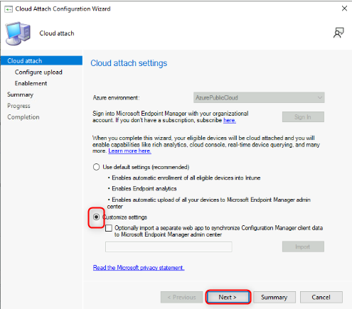{width="5.159700349956255in"
> height="4.53428258967629in"}

7.  On the **Create AAD Application** warning, select **Yes**.

> {width="3.0332786526684163in"
> height="1.1778707349081365in"}

8.  On the **Configure upload** page, accept the default and
    select **Next**.

> {width="5.316055336832896in"
> height="4.575976596675416in"}

9.  On the **Enablement** page, next to **Automatic enrollment in
    Intune**, select **Pilot**.

10. On the **Enablement** page, next to **Intune Auto Enrollment**,
    select **Browse**.

> 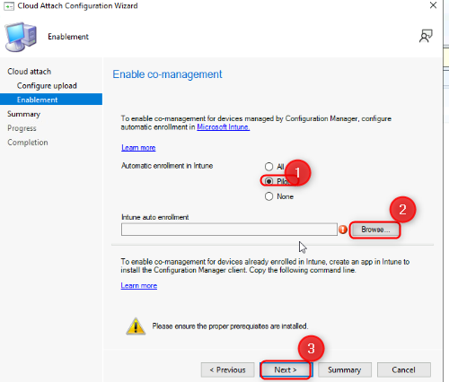{width="5.211818678915136in"
> height="4.440469160104987in"}

11. In the **Select Collection** dialog box, select **Co-managed
    Devices** and then select **OK**. Select **Next**.

> {width="5.336902887139107in"
> height="3.564884076990376in"}

12. On the **Summary** page, select **Next** and then on
    the **Completion** page, select **Close**.

> {width="5.190971128608924in"
> height="4.575976596675416in"}

Task 5: Configure Workloads

1.  In the Microsoft Endpoint Configuration Manager console, select
    the **Administration** workspace.

2.  In the **Administration** workspace, expand **Cloud Services** and
    then select **Cloud Attach**.

3.  In the details pane, select **CoMgmtSettingsProd** and then from the
    ribbon select **Properties**.

> {width="6.5in"
> height="3.5055555555555555in"}
>
> The **CoMgmtSettingsProd Properties** box opens.

4.  Select **Workloads**. On the **Workloads** page, drag the slider
    to **Pilot Intune** for the following workloads:

    -   **Compliance policies**

    -   **Client apps**

    -   **Windows Update policies**

> 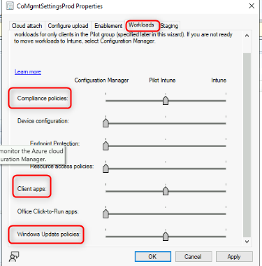{width="3.908863735783027in"
> height="3.9609820647419074in"}

5.  Select the **Staging page**. On the **Staging** page,
    select **Browse** next to **Compliance policies**, **Client Apps**,
    and **Windows Update Policies** and select the **Co-managed
    Devices** collection for each workload.

6.  Select **OK** to close the **CoMgmtSettingsProd Properties** box.

> 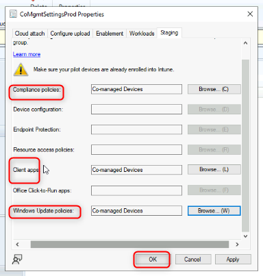{width="4.0026771653543305in"
> height="4.200726159230096in"}

Task 6: Validate that SEA-CL1 is co-managed

1.  Switch to [**[SEA-SVR1]{.underline}**](urn:gd:lg:a:select-vm).

2.  On the taskbar select **Microsoft Edge**, in the address bar
    type [**https://entra.microsoft.com**](https://entra.microsoft.com),
    and then press **Enter**.

3.  Sign in as
    user [**admin@M365x19242953.onmicrosoft.com**](urn:gd:lg:a:send-vm-keys),
    and use the password.

4.  If the **Stay signed in?** prompt appears, select **No**.

> The Microsoft Entra admin center opens.

5.  In the Microsoft Entra admin center, in the navigation pane, select
    **Identity.**

> 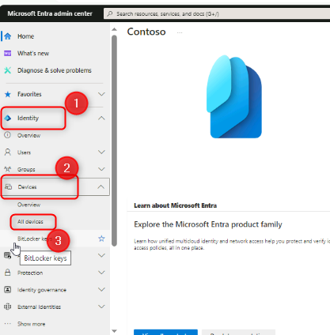{width="4.346656824146982in"
> height="4.419622703412074in"}

6.  In the **Devices\|All devices** page, Verify that **SEA-CL1** is
    listed and that **Join Type** is **Microsoft Entr hybrid Join**.

> 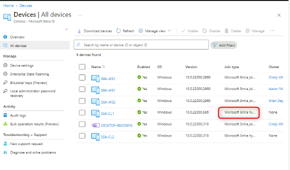{width="6.02486220472441in"
> height="3.5440365266841645in"}

7.  In Microsoft Edge open another tab and
    type [**https://intune.microsoft.com**](https://intune.microsoft.com) in
    the address bar, and then press **Enter**.

8.  In the navigation pane, select **Devices** and then select **All
    devices**.

9.  Verify that **SEA-CL1** is listed with the **Managed by** setting
    set to **Co-managed**.

> 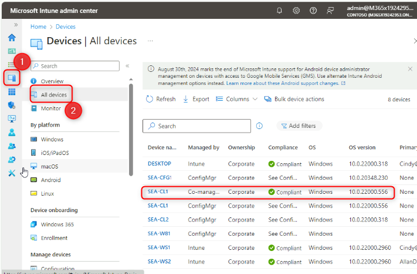{width="6.5in" height="4.26875in"}
>
> It may take some time to appear. Refresh the details pane as needed.
> The machine may appear under a different name, click on the device to
> confirm it states **SEA-CL1**.

10. Select **SEA-CL1** and in the details pane scroll down to display
    information related to the Co-management state.

11. Close Microsoft Edge.

**Results**: After completing this exercise, you will have successfully
enable Cloud Attach and configured co-management using Microsoft
Endpoint Configuration Manager and Microsoft Intune.
