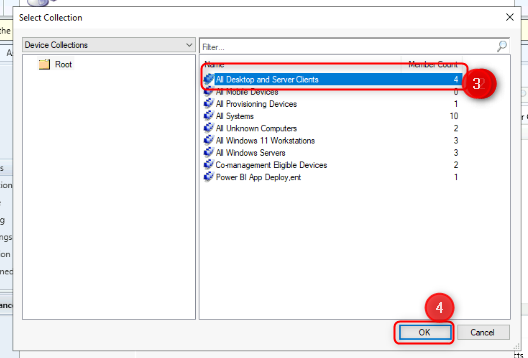

# Lab 22: Configuring Cloud Attach and Co-Management Using Configuration
Manager

**Summary**

In this lab, you will enable Cloud Attach and configure Co-Management
using Microsoft Endpoint Configuration Manager and Microsoft Intune.

**Prerequisites**

To following lab(s) must be completed before this lab:

-   Lab 01-Managing Identities in Microsoft Entra ID

-   Lab 02-Synchronizing Identities by using Azure AD Connect

-   Lab 03-Configuring and managing Microsoft Entra ID join

-   Lab 05-Manage Device Enrollment into Intune

**Scenario**

Contoso has both a Microsoft Endpoint Configuration Manager
implementation and Microsoft Intune. You need to configure integration
between the two services and enable co-management for your managed
Windows devices. You will enable Cloud Attach, configure co-management,
and then validate the settings using SEA-CL1.

## Task 1: Prepare the environment

1.  Switch to SEA-SVR1 and
    sign in
    as Contoso\\Administrator with the
    password of !!Pa55w.rd!! .

2.  From Server Manager, select **Tools**, and then select **Active
    Directory Users and Computers**.

    > 
3.  In the navigation pane, select **Seattle Clients**.

    > 

4.  Right-click **SEA-CL1** and then select **Move**.

    > 

5.  In the **Move** dialog box, select **Entra clients** and then
    select **OK**.

    > 

6.  Close **Active Directory Users and Computers**.

7.  On the taskbar, right-click **Start** and select **Windows
    Powershell (Admin)**.

    > 

8.  In the **Windows PowerShell** window, type the following command,
    and then press **Enter**:

    > !!Start-ADSyncSyncCycle -PolicyType Initial!!
    >
    > 

9.  Close the PowerShell window.

10. Switch to SEA-CL1.

11. On the taskbar, right-click Start, select **Shut down or sign
    out** and then select **Restart**.

    > 
    >
    > **Note**: The reboot will trigger the hybrid Azure AD join on SEA-CL1.

12. After SEA-CL1 has
    restarted, sign in
    as Contoso\\Administrator with the
    password of Pa55w.rd.

13. On the taskbar, right-click **Start** and select **Windows Terminal
    (Admin)**.

    > 

14. In the **Windows PowerShell** window, type the following command,
    and then press **Enter**:

    > !!dsregcmd /status!!

15. In the output under **Device State**, verify that **AzureAdJoined :
    YES** and **DomainJoined : YES** are displayed.

    > 
    > **Note**: If the device is not yet joined to Azure AD wait for the
    > Azure AD Connect sync to complete and reboot SEA-CL1 again.

16. Close all windows
    on SEA-CL1.

## Task 2: Create a device collection

1.  Switch to SEA-CFG1, sign
    in as Contoso\\Administrator with
    the password Pa55w.rd.

2.  On the taskbar, select **Configuration Manager Console**. The
    Microsoft Endpoint Configuration Manager console opens.

    > {width="6.045709755030622in"
    > height="3.8358989501312335in"}

3.  In the **Assets and Compliance** workspace, select **Device
    Collections**.

4.  Right-click **Device Collections** and then select **Create Device
    Collection**. The Create Device Collection Wizard opens.

    > 

5.  On the **General** page, configure the following and then
    select **Next**:

    -   Name: !!Co-managed Devices!!

    -   Limiting collection: **All Desktop and Server Clients**

    > 
    > 
    > 
6.  On the **Membership Rules** page, select **Next**.

    > 

7.  At the Configuration Manager warning, select **OK**. You will add a
    direct member at a later step.

    > 

8.  On the **Summary** page, select **Next** and then at
    the **Completion** page, select **Close**.

    > 
    >
    > 

## Task 3: Assign a Device to an existing Collection

1.  In the **Assets and Compliance** workspace, select **Devices**.

    > Take note of the devices listed. Any device that has a green circle
    > with a white checkmark are currently active.

2.  In the details pane, select **SEA-CL1**.

3.  Right-click **SEA-CL1**, point to **Add Selected Items**, and then
    select **Add Selected Items to Existing Device Collection**.

    > {width="5.795542432195975in"
    > height="4.409198381452319in"}

4.  On the **Select Collection** dialog box, select **Co-managed
    Devices**, and then select **OK**.

    > 
5.  To verify, in the **Assets and Compliance** workspace,
    select **Device Collections** and then double-click **Co-managed
    Devices**.

    > 
    > 
    >
    > **SEA-CL1** should be listed as a member of this collection.

## Task 4: Cloud attach Endpoint Configuration Manager

1.  In the Microsoft Endpoint Configuration Manager console, select
    the **Administration** workspace.

    > 
2.  In the **Administration** workspace, expand **Cloud Services** and
    then select **Cloud Attach**.

    > 

3.  In the ribbon, select **Configure Cloud Attach**. The **Cloud Attach
    Configuration Wizard** opens.

    > 
    > 
4.  In the **Cloud Attach Configuration Wizard**, on the **Cloud
    attach** page, select **Sign In**.

5.  Sign in Admin with the credentials provided in the resources tab.

6.  On the **Cloud attach** page, select **Customize settings**, and
    select **Next**.

    > 
7.  On the **Create AAD Application** warning, select **Yes**.

    > 

8.  On the **Configure upload** page, accept the default and
    select **Next**.

    > 

9.  On the **Enablement** page, next to **Automatic enrollment in
    Intune**, select **Pilot**.

10. On the **Enablement** page, next to **Intune Auto Enrollment**,
    select **Browse**.

    > 
11. In the **Select Collection** dialog box, select **Co-managed
    Devices** and then select **OK**. Select **Next**.

    > 

12. On the **Summary** page, select **Next** and then on
    the **Completion** page, select **Close**.

    > 

## Task 5: Configure Workloads

1.  In the Microsoft Endpoint Configuration Manager console, select
    the **Administration** workspace.

2.  In the **Administration** workspace, expand **Cloud Services** and
    then select **Cloud Attach**.

3.  In the details pane, select **CoMgmtSettingsProd** and then from the
    ribbon select **Properties**.

    > 
    >
    > The **CoMgmtSettingsProd Properties** box opens.

4.  Select **Workloads**. On the **Workloads** page, drag the slider
    to **Pilot Intune** for the following workloads:

    -   **Compliance policies**

    -   **Client apps**

    -   **Windows Update policies**

    > 
5.  Select the **Staging page**. On the **Staging** page,
    select **Browse** next to **Compliance policies**, **Client Apps**,
    and **Windows Update Policies** and select the **Co-managed
    Devices** collection for each workload.

6.  Select **OK** to close the **CoMgmtSettingsProd Properties** box.

    > 
 
## Task 6: Validate that SEA-CL1 is co-managed

1.  Switch to SEA-SVR1.
2.  On the taskbar select **Microsoft Edge**, in the address bar
    type !!(https://entra.microsoft.com!!
    and then press **Enter**.

3.  Sign in as Admin using the credentials provided in the resources tab.

4.  If the **Stay signed in?** prompt appears, select **No**.

    > The Microsoft Entra admin center opens.

5.  In the Microsoft Entra admin center, in the navigation pane, select
    **Identity.**

    > 
6.  In the **Devices\|All devices** page, Verify that **SEA-CL1** is
    listed and that **Join Type** is **Microsoft Entra hybrid Join**.

    > 
7.  In Microsoft Edge open another tab and
    type !!https://intune.microsoft.com!! in
    the address bar, and then press **Enter**.

8.  In the navigation pane, select **Devices** and then select **All
    devices**.

9.  Verify that **SEA-CL1** is listed with the **Managed by** setting
    set to **Co-managed**.

    > 
    > It may take some time to appear. Refresh the details pane as needed.
    > The machine may appear under a different name, click on the device to
    > confirm it states **SEA-CL1**.

10. Select **SEA-CL1** and in the details pane scroll down to display
    information related to the Co-management state.

11. Close Microsoft Edge.

**Results**: After completing this exercise, you will have successfully
enable Cloud Attach and configured co-management using Microsoft
Endpoint Configuration Manager and Microsoft Intune.
