Lab 23: Managing Windows quality and feature updates

**Summary**

In this lab you will configure Windows quality and feature update
settings using Intune.

**Prerequisites**

To following lab(s) must be completed before this lab:

-   Lab 01-Manage Device Enrollment into Intune

-   Lab 06-Enrolling devices into Intune

-   Lab 07-Creating and Deploying Configuration Profiles

**Note**: You will also need a mobile phone that can receive text
messages used to secure Windows Hello sign in authentication to Azure
AD.

**Scenario**

You have been asked to configure an update ring to only affect the
devices that are a member of the Contoso Developer Devices group. This
group must meet the following requirements:

-   Quality update deferral period (days): **15**

-   Feature update deferral period (days): **45**

-   Option to pause Windows updates: **Disable**

-   Option to check for Windows updates: **Enable**

-   Delivery optimization: Download Mode: **HTTP only, no peering (0)**

## Task 1: Verify current update settings for a single device

1.  Switch to SEA-WS1, sign
    in as as **Cindy White** with the
    PIN 102938.

2.  Select **Start**, and then select the **Settings** icon.

    > 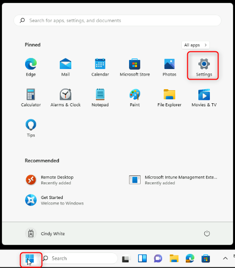

3.  In **Settings**, select **Windows Update**.

    > Notice that you have the option to pause updates for a specific amount
    > of time.

4.  On the **Windows Update** page, select **Advanced options**.

    > 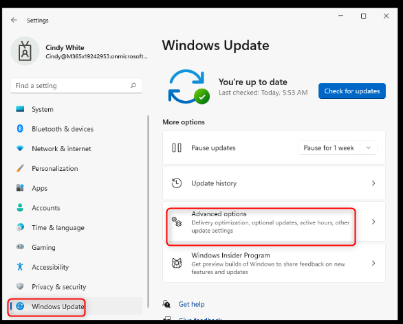
 
5.  On the **Advanced options** page select **Delivery Optimization**.

    > 

6.  On the **Delivery Optimization** page, verify that the **Allow
    downloads from other PCs** option is enabled.

7.  Select **Devices on the internet and my local network**.

    > 

8.  In **Settings**, select **Windows Update**.

    > 

9.  Select **Advanced options**, and then select **Configured update
    policies**.

    > 
    >
    > Take note that no update polices are set on the device.
    >
    > 
 
10. In the navigation pane, select **Windows Update**.

## Task 2: Review applied settings

1.  On the **Windows Update** page, select **Update history**.

    > 

2.  Review the updates listed, and then select **Uninstall updates**.

    > 

3.  Review the updates listed in **Installed Updates**. Close Installed
    Updates.

> 

4.  Close the **Settings** app.

## Task 3: Configure update settings by using Intune

1.  Switch to SEA-SVR1 and sign in
    as Contoso\\Administrator with the
    password of !!Pa55w.rd!!

2.  On the taskbar, select **Microsoft Edge**.

3.  In Microsoft Edge,
    type !!https://intune.microsoft.com!! in
    the address bar, and then press **Enter**.

4.  Sign in
    as !!admin@M365x19242953.onmicrosoft.com!! with
    the password.

5.  In the navigation pane, select **Devices** and then select **Windows
    10 and later Updates**.

    > 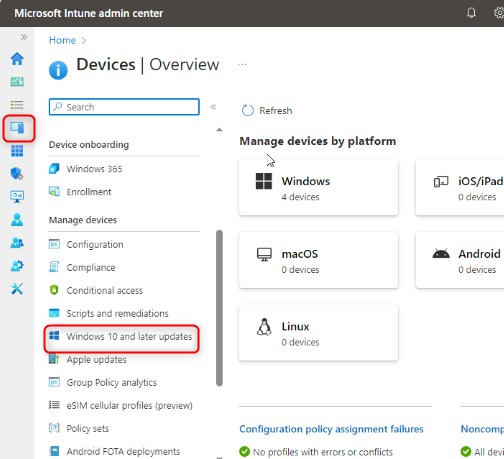
 
6.  On the **Devices \| Update rings for Windows 10 and later** blade
    select **Create profile**.

    > 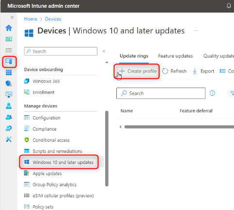
 
7.  In the **Basics** blade, enter the following information, and then
    select **Next**:

    -   Name: !!**Contoso Updates - standard!!

    -   Description: !!Standard Windows updates configuration!!

    > 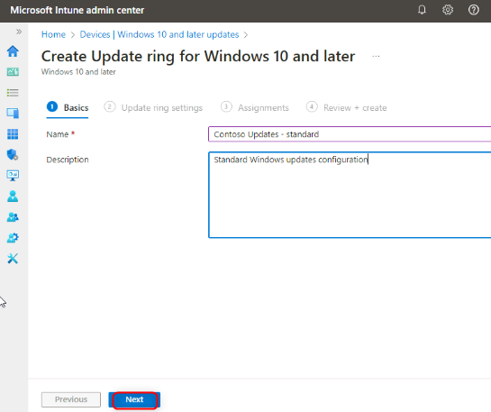
 
8.  In the **Update ring settings** blade, enter the following
    information, and then select **Next**:

    -   Quality update deferral period
        (days): **15**

    -   Feature update deferral period
        (days): **45**

    -   Option to pause Windows updates: **Disable**

    -   Option to check for Windows updates: **Enable**

    > 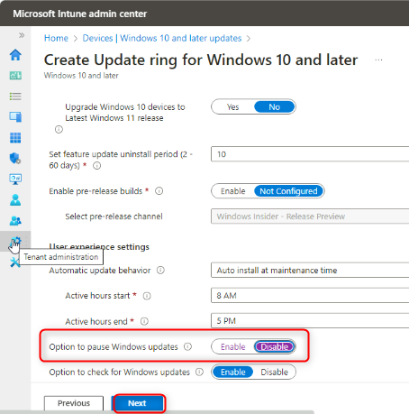
 
9.  On the **Assignments** blade, under **Included groups** select **Add
    groups**.

10. On the **Select groups to include** blade, in the **Search** box,
    select **Contoso Developer devices** and then select **Select**.

    > 

    > 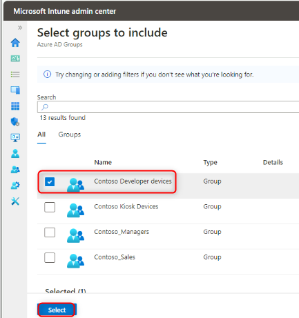
 
11. Select **Next** and on the **Review + create** blade
    select **Create**.

12. From the navigation bar select **Configuration profiles**.

13. On the **Devices \| Configuration** blade, in the details pane,
    select **Create policy**.

    > 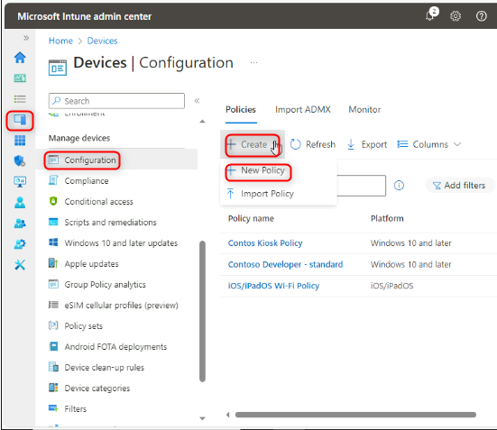

14. In the **Create a profile** blade, select the following options, and
    then select **Create**:

    -   Platform: **Windows 10 and later**

    -   Profile type: **Templates**

    -   Template name: **Delivery Optimization**

    > 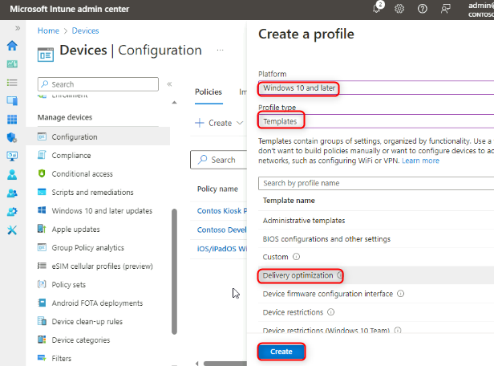
 
15. In the **Basics** blade, enter the following information, and then
    select **Next**:

    -   Name: !!Contoso Developer - Delivery Optimization!!

    -   Description: !!Delivery optimization for Developer!!

    > 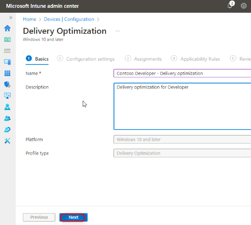

16. In the **Configuration settings** blade, enter the following
    information, and then select **Next**:

    -   Download Mode: **HTTP only, no peering (0)**

    > 

17. On the **Assignments** blade, under **Included groups** select **Add
    groups**.

18. On the **Select groups to include** blade, select **Contoso
    Developer devices** and then select **Select**.

    > 
    >
    > 

19. Select **Next** twice, and on the **Review + create** blade
    select **Create**.

    > 

## Task 4: Verify that the device's update settings are managed centrally

1.  Switch to ***SEA-WS1***, !!https://intune.microsoft.com!!

2.  Select **Start**, and then select the **Settings** icon.

    > 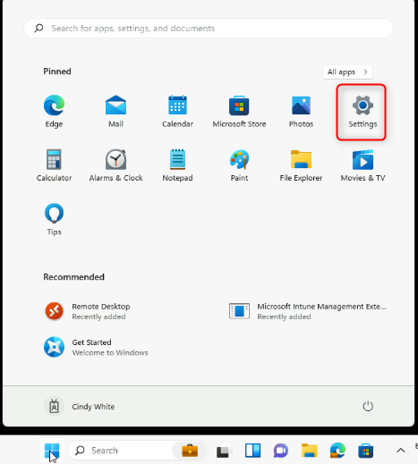
 
3.  In the **Settings** app, select **Accounts** and then
    select **Access work or school**.

    > 

4.  In the **Access work or school** section, select the **Connected to
    Contoso\'s Azure AD** link and then select **Info**.

    > 

5.  In the **Areas Managed by Contoso** dialog box, select **Sync**.
    Wait for the synchronization to complete.

    > 

6.  In the **Settings** app, select **Windows Update**.

    > Notice that you are not able to pause updates.

7.  Select **Advanced options**.

    > 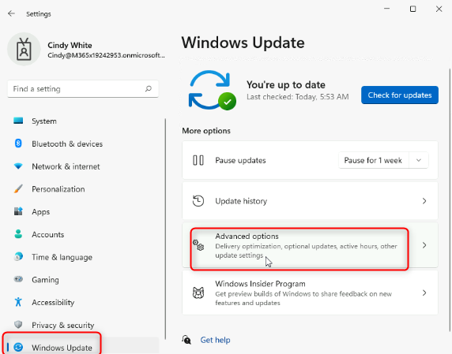
 
8.  Select **Delivery Optimization**.

    > 
    >
    > Notice that **Allow downloads from other PCs** is not available.

9.  In the **Settings** app, select **Windows Update**,
    select **Advanced options**, and then select **Configured update
    policies**.

    > 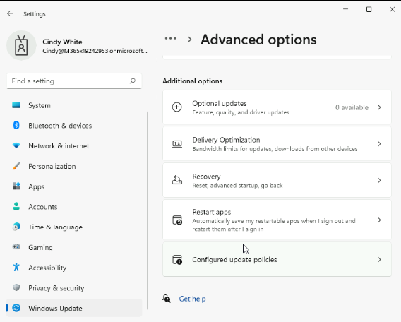
    > Take note of all the policies set on the device.

10. Close all open apps and windows.

> **Note**: The lab environment is configured to prevent Windows Updates
> from being applied to avoid delays and unintentional impact during the
> labs.
