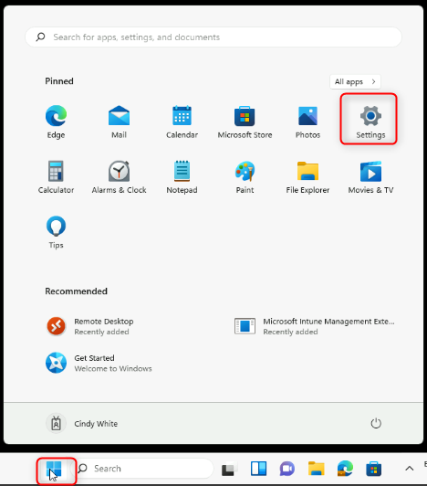
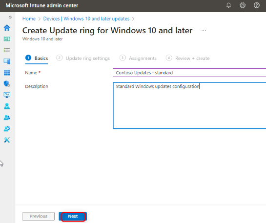
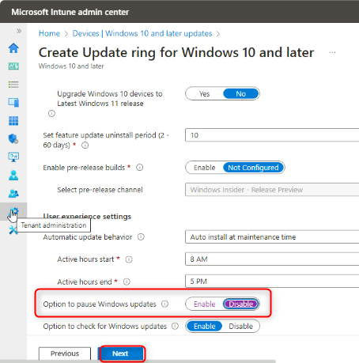
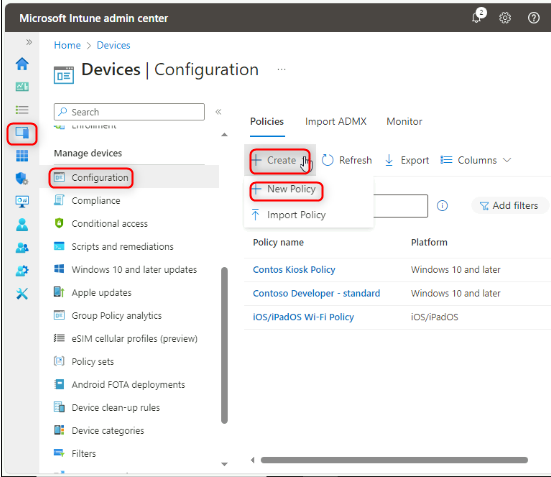
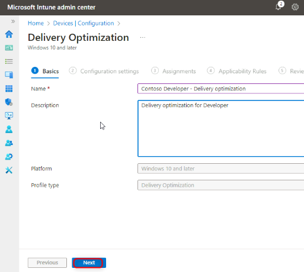
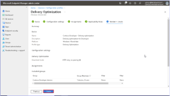
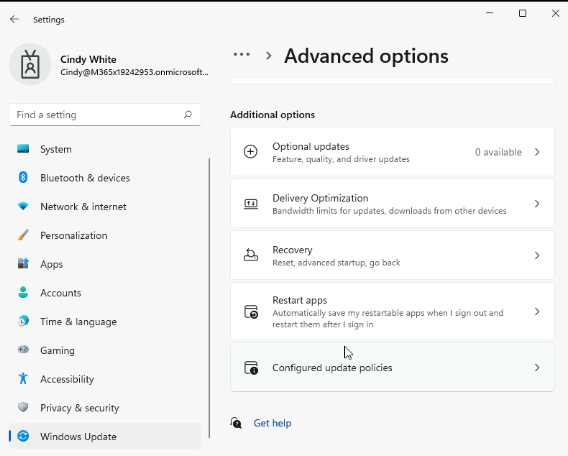

Lab 23: Managing Windows quality and feature updates

**Summary**

In this lab you will configure Windows quality and feature update
settings using Intune.

**Prerequisites**

To following lab(s) must be completed before this lab:

-   Lab 01-Manage Device Enrollment into Intune

-   Lab 06-Enrolling devices into Intune

-   Lab 07-Creating and Deploying Configuration Profiles

**Note**: You will also need a mobile phone that can receive text
messages used to secure Windows Hello sign in authentication to Azure
AD.

**Scenario**

You have been asked to configure an update ring to only affect the
devices that are a member of the Contoso Developer Devices group. This
group must meet the following requirements:

-   Quality update deferral period (days): **15**

-   Feature update deferral period (days): **45**

-   Option to pause Windows updates: **Disable**

-   Option to check for Windows updates: **Enable**

-   Delivery optimization: Download Mode: **HTTP only, no peering (0)**

Task 1: Verify current update settings for a single device

1.  Switch to [**[SEA-WS1]{.underline}**](urn:gd:lg:a:select-vm), sign
    in as as **Cindy White** with the
    PIN [**102938**](urn:gd:lg:a:select-vm).

2.  Select **Start**, and then select the **Settings** icon.

> {width="4.878262248468942in"
> height="5.54537510936133in"}

3.  In **Settings**, select **Windows Update**.

> Notice that you have the option to pause updates for a specific amount
> of time.

4.  On the **Windows Update** page, select **Advanced options**.

> {width="6.108251312335958in"
> height="4.919957349081365in"}

5.  On the **Advanced options** page select **Delivery Optimization**.

> {width="6.191640419947507in"
> height="4.774025590551181in"}

6.  On the **Delivery Optimization** page, verify that the **Allow
    downloads from other PCs** option is enabled.

7.  Select **Devices on the internet and my local network**.

> {width="6.066557305336833in"
> height="4.826143919510061in"}

8.  In **Settings**, select **Windows Update**.

> {width="6.076980533683289in"
> height="4.85741469816273in"}

9.  Select **Advanced options**, and then select **Configured update
    policies**.

> {width="5.993591426071741in"
> height="4.732331583552056in"}
>
> Take note that no update polices are set on the device.
>
> {width="6.02486220472441in"
> height="4.815720691163604in"}

10. In the navigation pane, select **Windows Update**.

Task 2: Review applied settings

1.  On the **Windows Update** page, select **Update history**.

> {width="6.02486220472441in"
> height="4.794873140857393in"}

2.  Review the updates listed, and then select **Uninstall updates**.

> {width="6.076980533683289in"
> height="4.774025590551181in"}

3.  Review the updates listed in **Installed Updates**. Close Installed
    Updates.

> {width="5.846113298337708in"
> height="4.397610454943132in"}

4.  Close the **Settings** app.

Task 3: Configure update settings by using Intune

1.  Switch to [**[SEA-SVR1]{.underline}**](urn:gd:lg:a:send-vm-keys) and
    sign in
    as [**Contoso\\Administrator**](urn:gd:lg:a:send-vm-keys) with the
    password of [**Pa55w.rd**](urn:gd:lg:a:send-vm-keys).

2.  On the taskbar, select **Microsoft Edge**.

3.  In Microsoft Edge,
    type [**https://intune.microsoft.com**](urn:gd:lg:a:send-vm-keys) in
    the address bar, and then press **Enter**.

4.  Sign in
    as [**admin@M365x19242953.onmicrosoft.com**](urn:gd:lg:a:send-vm-keys) with
    the password.

5.  In the navigation pane, select **Devices** and then select **Windows
    10 and later Updates**.

> {width="5.253513779527559in"
> height="4.7844499125109365in"}

6.  On the **Devices \| Update rings for Windows 10 and later** blade
    select **Create profile**.

> {width="5.034617235345582in"
> height="4.523858267716536in"}

7.  In the **Basics** blade, enter the following information, and then
    select **Next**:

    -   Name: !\!!

    -   Description: !\!!

> {width="5.680882545931759in"
> height="4.7636023622047245in"}

8.  In the **Update ring settings** blade, enter the following
    information, and then select **Next**:

    -   Quality update deferral period
        (days): [**15**](urn:gd:lg:a:send-vm-keys)

    -   Feature update deferral period
        (days): [**45**](urn:gd:lg:a:send-vm-keys)

    -   Option to pause Windows updates: **Disable**

    -   Option to check for Windows updates: **Enable**

> {width="4.732331583552056in"
> height="4.7844499125109365in"}

9.  On the **Assignments** blade, under **Included groups** select **Add
    groups**.

10. On the **Select groups to include** blade, in the **Search** box,
    select **Contoso Developer devices** and then select **Select**.

> {width="5.524527559055118in"
> height="4.919957349081365in"}
>
> {width="4.513435039370079in"
> height="4.805297462817148in"}

11. Select **Next** and on the **Review + create** blade
    select **Create**.

12. From the navigation bar select **Configuration profiles**.

13. On the **Devices \| Configuration** blade, in the details pane,
    select **Create policy**.

> {width="5.743424103237095in"
> height="4.972075678040245in"}

14. In the **Create a profile** blade, select the following options, and
    then select **Create**:

    -   Platform: **Windows 10 and later**

    -   Profile type: **Templates**

    -   Template name: **Delivery Optimization**

> {width="6.420961286089239in"
> height="4.753179133858268in"}

15. In the **Basics** blade, enter the following information, and then
    select **Next**:

    -   Name: !\!!

    -   Description: !\!!

> {width="5.347326115485564in"
> height="4.794873140857393in"}

16. In the **Configuration settings** blade, enter the following
    information, and then select **Next**:

    -   Download Mode: **HTTP only, no peering (0)**

> {width="5.441138451443569in"
> height="4.805297462817148in"}

17. On the **Assignments** blade, under **Included groups** select **Add
    groups**.

18. On the **Select groups to include** blade, select **Contoso
    Developer devices** and then select **Select**.

> {width="5.159700349956255in"
> height="4.867839020122485in"}
>
> {width="4.492587489063867in"
> height="4.7844499125109365in"}

19. Select **Next** twice, and on the **Review + create** blade
    select **Create**.

> {width="2.9375in"
> height="1.6666666666666667in"}

Task 4: Verify that the device's update settings are managed centrally

1.  Switch to [**[SEA-WS1]{.underline}**](https://intune.microsoft.com).

2.  Select **Start**, and then select the **Settings** icon.

> {width="4.867839020122485in"
> height="5.409867672790901in"}

3.  In the **Settings** app, select **Accounts** and then
    select **Access work or school**.

> {width="6.004015748031496in"
> height="4.794873140857393in"}

4.  In the **Access work or school** section, select the **Connected to
    Contoso\'s Azure AD** link and then select **Info**.

> {width="5.962320647419072in"
> height="4.836568241469816in"}

5.  In the **Areas Managed by Contoso** dialog box, select **Sync**.
    Wait for the synchronization to complete.

> {width="5.983168197725284in"
> height="4.721908355205599in"}

6.  In the **Settings** app, select **Windows Update**.

> Notice that you are not able to pause updates.

7.  Select **Advanced options**.

> {width="5.962320647419072in"
> height="4.680213254593176in"}

8.  Select **Delivery Optimization**.

> {width="6.02486220472441in"
> height="4.774025590551181in"}
>
> Notice that **Allow downloads from other PCs** is not available.

9.  In the **Settings** app, select **Windows Update**,
    select **Advanced options**, and then select **Configured update
    policies**.

> {width="5.91905949256343in"
> height="4.751920384951881in"}
>
> Take note of all the policies set on the device.

10. Close all open apps and windows.

> **Note**: The lab environment is configured to prevent Windows Updates
> from being applied to avoid delays and unintentional impact during the
> labs.
