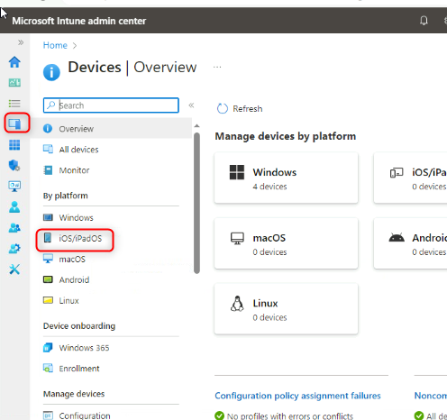
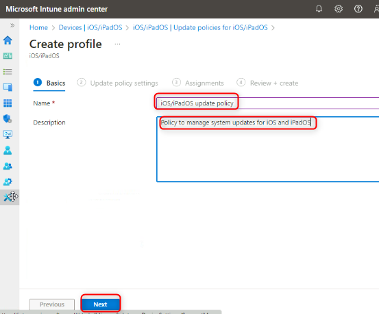
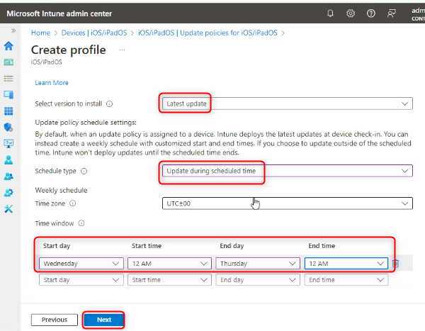

# Lab 24 : Managing Update policies for iOS and iPadOS

**Summary**

In this lab you will configure an Update policy to be used to manage
operating system updates for iOS and iPadOS.

**Scenario**

All of the developers at Contoso have iPhones and iPads running the
latest iOS/iPadOS versions. You have enrolled these devices through
Apple\'s Automated Device Enrollment and need to configure an update
policy for the device OS. You need to ensure the following:

-   Version to install: Latest update.

-   Only permit automatic updates to take place between Wednesday at
    12AM to Thursday at 12AM.

## Task 1: Create an Update policy for iOS/iPadOS devices

1.  On ***SEA-SVR1***, if necessary, sign in
    as ***Contoso\\Administrator*** with the password !!Pa55w.rd!! and close **Server
    Manager**.

2.  On the taskbar, select **Microsoft Edge**.

3.  In Microsoft Edge,
    type !!https://intune.microsoft.com!! in the address bar, and then press **Enter**.

4.  Sign in as admin@M365x19242953.onmicrosoft.com with the password.

5.  On the **Microsoft Intune admin center** page, select **Devices**.

6.  On the **Devices\|By platform** blade, under **Policy**, select  **iOS/iPadOS**.

    > 

7.  Select **Update Policies for iOS/iPadOS**

    > 

8.  In the details pane, select **Create profile**.

9.  On the **Basics** tab, configure the following options and
    select **Next**:

    -   Name: !!iOS/iPadOS update policy!!

    -   Description: !!Policy to manage system updates for iOS and iPadOS!!

    > 
 
10. On the **Update policy settings** tab, configure the following
    options and select **Next**:

    -   Select version to install: **Latest update**

    -   Schedule type: **Update during scheduled time**

    -   Time zone: **UTC:00**

    -   Time window:

    -   Start day: **Wednesday**

    -   Start time: **12 AM**

    -   End day: **Thursday**

    -   End time: **12 AM**

    > 

11. On the **Assignments** tab, select **Next**.

    > 

12. On the **Review + create** tab, review the settings and
    select **Create**.

13. On the **Devices| Update policies for iOS/iPadOS** blade, in the
    details pane, verify that **iOS/iPadOS update policy** is listed.

    > 

14. Close Microsoft Edge.

**Results**: After completing this exercise, you will have successfully
configured an Update policy for iOS and iPadOS.
