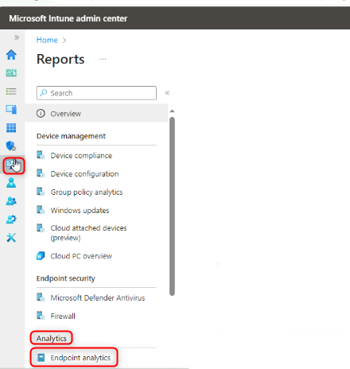
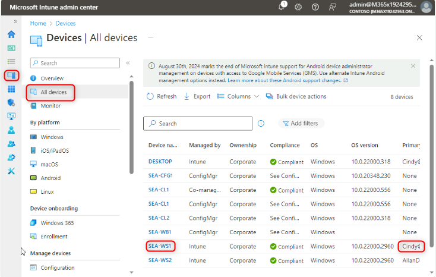
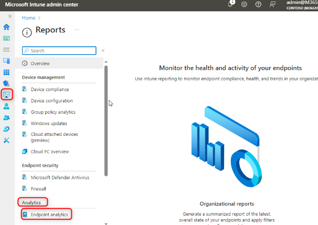

# Lab 25: Monitoring device performance and user experience with Endpoint analytics

**Summary**

In this lab you enable Endpoint analytics to monitor device performance
and user experience scores and insights.

**Prerequisites**

To following lab(s) must be completed before this lab:

-   Lab 05-Manage Device Enrollment into Intune

-   Lab 06-Enrolling devices into Intune

-   Lab 07-Creating and Deploying Configuration Profiles

**Scenario**

You have been asked to monitor startup performance, application
reliability, and user experience how often users restart their devices.
To acquire this information you need to enable Endpoint analytics.

### Task 1: Enable Endpoint analytics

1.  On [**SEA-SVR1**](urn:gd:lg:a:select-vm), if necessary, sign in
    as [**Contoso\\Administrator**](urn:gd:lg:a:send-vm-keys) with the
    password !\!! and
    close **Server Manager**.

2.  On the taskbar, select **Microsoft Edge**.

3.  In Microsoft Edge, type
    !\!! in
    the address bar, and then press **Enter**.

4.  Sign in
    as [**admin@M365x19242953.onmicrosoft.com**](urn:gd:lg:a:send-vm-keys) with
    the password.

5.  On the **Microsoft Intune admin center** page, select **Reports**.

6.  On the **Reports** blade, under **Analytics**, select **Endpoint
    analytics**.

> {width="4.586400918635171in"
> height="4.836568241469816in"}

7.  On the **Endpoint analytics** page, ensure that **Collect device
    data from** is set to **All cloud-managed devices**, and then
    select **Start**.

> {width="6.268055555555556in"
> height="4.154861111111111in"}
>
> Take note of the message at the top of the Overview page. It may take
> up to 24 hours for scores and insights to display on the page.
>
> {width="6.268055555555556in"
> height="4.039583333333334in"}

8.  Switch to [**SEA-WS1**](urn:gd:lg:a:select-vm) and restart the
    device.

9.  Sign in as **Cindy White** with the Password
    : [**102938**](urn:gd:lg:a:send-vm-keys).

10. Switch to [**SEA-SVR1**](urn:gd:lg:a:select-vm).

11. On the **Microsoft Intune admin center** page,
    select **Devices** and then select **All devices**.

12. Select **SEA-WS1**.

> {width="6.268055555555556in"
> height="3.9791666666666665in"}

13. On the **SEA-WS1** page, select **Sync** and then select **Yes**.

> {width="6.268055555555556in"
> height="3.922222222222222in"}

14. On the **SEA-WS1** page, under **Monitor**, select **User
    experience**. {width="3.7108147419072615in"
    height="4.586400918635171in"}

15. Review the **Endpoint analytics**, **Startup performance**,
    and **Application reliability** tabs.

> {width="5.564749562554681in"
> height="4.981180008748907in"}
>
> {width="6.064951881014873in"
> height="4.793604549431321in"}
>
> {width="6.268055555555556in"
> height="4.489583333333333in"}
>
> There may not be any information reported due to the time delay,
> however read the details on what will be visible on each tab.

16. On the **Microsoft Intune admin center** page, select **Reports**.

17. On the **Reports** blade, under **Analytics**, select **Endpoint
    analytics**.

> {width="6.268055555555556in"
> height="4.434027777777778in"}
>
> Note that the same type of information is available in Endpoint
> analytics, however this information is based upon all enrolled
> devices.
>
> {width="6.268055555555556in"
> height="4.877083333333333in"}

18. Browse through the Reports available in the Endpoint analytics page.

19. Close Microsoft Edge.

**Results**: After completing this exercise, you will have successfully
enabled Endpoint analytics to monitor device performance and user
experience scores and insights.
