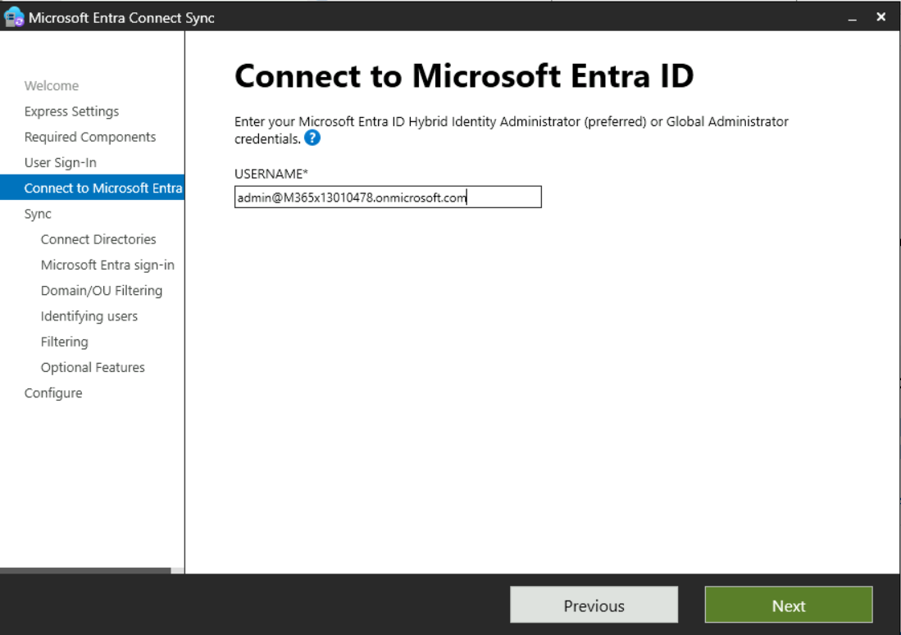
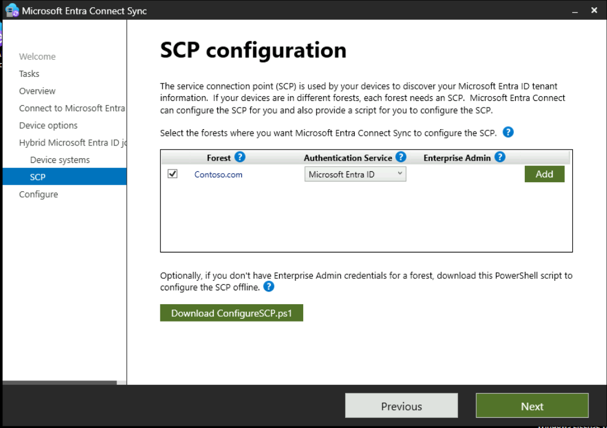
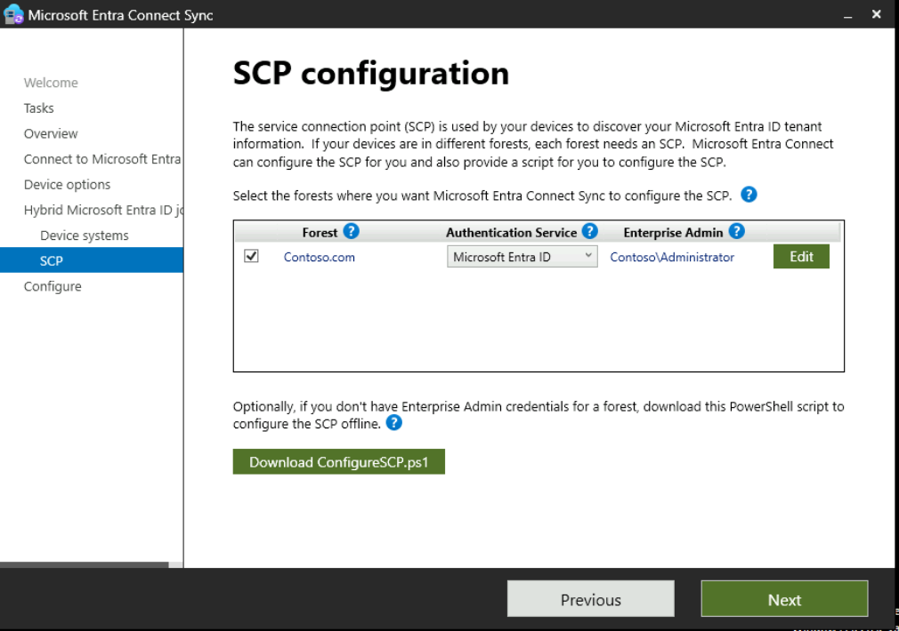

**Lab 03: Configuring and managing Microsoft Entra ID Join**

**Summary**

In this lab, you will configure Microsoft Entra ID Join settings and
perform both standard and Microsoft Entra hybrid join scenarios for
Windows devices.

**Prerequisites**

To following lab(s) must be completed before this lab:

-   Lab #2: Synchronizing Identities by using Microsoft Entra Connect

**Note**: You will also need a mobile phone that can receive text
messages used to secure Windows Hello sign in authentication to Entra
ID.

Task 0: Enable TLS 1.2 using PowerShell script. 

1.  On **SEA-WS1**, sign in
    as [**Contoso\\Administrator**](http://urn:gd:lg:a:send-vm-keys/) with
    the password of [**Pa55w.rd**](http://urn:gd:lg:a:send-vm-keys/) 

&nbsp;

2.  On the start menu type !!**PowerShell**!! right click on PowerShell
    and **select run as administrator**. 

{width="6.0625in"
height="6.104166666666667in"} 

3.  Run the following script on the PowerShell. 

If (-Not (Test-Path
\'HKLM:\\SOFTWARE\\WOW6432Node\\Microsoft\\.NETFramework\\v4.0.30319\')) 

{ 

    New-Item
\'HKLM:\\SOFTWARE\\WOW6432Node\\Microsoft\\.NETFramework\\v4.0.30319\'
-Force \| Out-Null 

} 

New-ItemProperty -Path
\'HKLM:\\SOFTWARE\\WOW6432Node\\Microsoft\\.NETFramework\\v4.0.30319\'
-Name \'SystemDefaultTlsVersions\' -Value \'1\' -PropertyType \'DWord\'
-Force \| Out-Null 

New-ItemProperty -Path
\'HKLM:\\SOFTWARE\\WOW6432Node\\Microsoft\\.NETFramework\\v4.0.30319\'
-Name \'SchUseStrongCrypto\' -Value \'1\' -PropertyType \'DWord\' -Force
\| Out-Null 

 

If (-Not (Test-Path
\'HKLM:\\SOFTWARE\\Microsoft\\.NETFramework\\v4.0.30319\')) 

{ 

    New-Item \'HKLM:\\SOFTWARE\\Microsoft\\.NETFramework\\v4.0.30319\'
-Force \| Out-Null 

} 

New-ItemProperty -Path
\'HKLM:\\SOFTWARE\\Microsoft\\.NETFramework\\v4.0.30319\' -Name
\'SystemDefaultTlsVersions\' -Value \'1\' -PropertyType \'DWord\' -Force
\| Out-Null 

New-ItemProperty -Path
\'HKLM:\\SOFTWARE\\Microsoft\\.NETFramework\\v4.0.30319\' -Name
\'SchUseStrongCrypto\' -Value \'1\' -PropertyType \'DWord\' -Force \|
Out-Null 

 

If (-Not (Test-Path
\'HKLM:\\SYSTEM\\CurrentControlSet\\Control\\SecurityProviders\\SCHANNEL\\Protocols\\TLS
1.2\\Server\')) 

{ 

    New-Item
\'HKLM:\\SYSTEM\\CurrentControlSet\\Control\\SecurityProviders\\SCHANNEL\\Protocols\\TLS
1.2\\Server\' -Force \| Out-Null 

} 

New-ItemProperty -Path
\'HKLM:\\SYSTEM\\CurrentControlSet\\Control\\SecurityProviders\\SCHANNEL\\Protocols\\TLS
1.2\\Server\' -Name \'Enabled\' -Value \'1\' -PropertyType \'DWord\'
-Force \| Out-Null 

New-ItemProperty -Path
\'HKLM:\\SYSTEM\\CurrentControlSet\\Control\\SecurityProviders\\SCHANNEL\\Protocols\\TLS
1.2\\Server\' -Name \'DisabledByDefault\' -Value \'0\' -PropertyType
\'DWord\' -Force \| Out-Null 

 

If (-Not (Test-Path
\'HKLM:\\SYSTEM\\CurrentControlSet\\Control\\SecurityProviders\\SCHANNEL\\Protocols\\TLS
1.2\\Client\')) 

{ 

    New-Item
\'HKLM:\\SYSTEM\\CurrentControlSet\\Control\\SecurityProviders\\SCHANNEL\\Protocols\\TLS
1.2\\Client\' -Force \| Out-Null 

} 

New-ItemProperty -Path
\'HKLM:\\SYSTEM\\CurrentControlSet\\Control\\SecurityProviders\\SCHANNEL\\Protocols\\TLS
1.2\\Client\' -Name \'Enabled\' -Value \'1\' -PropertyType \'DWord\'
-Force \| Out-Null 

New-ItemProperty -Path
\'HKLM:\\SYSTEM\\CurrentControlSet\\Control\\SecurityProviders\\SCHANNEL\\Protocols\\TLS
1.2\\Client\' -Name \'DisabledByDefault\' -Value \'0\' -PropertyType
\'DWord\' -Force \| Out-Null 

 

Write-Host \'TLS 1.2 has been enabled. You must restart the Windows
Server for the changes to take affect.\' -ForegroundColor Cyan 

 

{width="6.6875in"
height="5.740972222222222in"} 

 

4.  Restart the Windows Server VM. 

{width="6.6875in"
height="6.736805555555556in"}

**Exercise 1: Configuring Microsoft Entra Join**

**Scenario**

You need to configure Entra ID device settings to ensure that all users
are allowed to join devices to Entra ID. You also need to ensure that
users can only join a maximum of 20 devices and that Allan Deyoung is
added as a local administrator on all Microsoft Entra Joined devices.
Finally, you will verify that Microsoft Entra Join works as expected by
having Joni Sherman join SEA-WS1 to the tenant.

Task 1: Configure Microsoft Entra ID join Device settings

1.  Switch to **SEA-SVR1**. In the **Microsoft Edge** browser address
    bar, type the following URL:
    !\!!
    and press the **Enter** button.

2.  Sign in with your O365 tenant ID:
    !!**admin@M365xXXXXXXXX.onmicrosoft.com**!!, and use the tenant
    Admin password.

{width="4.294104330708661in"
height="3.883924978127734in"}

{width="4.352379702537183in"
height="3.796318897637795in"}

3.  On **Stay signed in?** dialog box, select the **Yes** button.

{width="5.411093613298338in"
height="4.6607108486439195in"}

4.  In the **Microsoft Entra admin center** window, navigate and click
    on **Identity**.

{width="6.268055555555556in"
height="3.729861111111111in"}

5.  Under the **Identity** section, select **Devices**, then navigate
    and click on **All devices** as shown in the below image.

{width="6.268055555555556in"
height="3.7958333333333334in"}

[Notice that there are no devices found, as you have not joined any
devices yet.]{.mark}

{width="6.369360236220473in"
height="3.602435476815398in"}

6.  On the **Devices** \| All devices page, select **Device settings**.

{width="6.268055555555556in"
height="3.8958333333333335in"}

7.  On the **Devices \| Device settings** page, in the details pane,
    under **Users may join devices to Entra**, verify that **All** is
    selected.

[This indicates that all Entra users are permitted to join Windows 10 or
newer devices to Microsoft Entra. Note that this setting does not apply
to Entra hybrid joined devices, or devices joined by using Windows
Autopilot self-deployment mode.]{.mark}

8.  In the **Require Multi-factor Authentication to register or join
    devices with Entra** section, verify that the setting is set
    to **No**.

{width="6.268055555555556in"
height="4.177083333333333in"}

9.  In the **Maximum number of devices per user** section, select **20
    (Recommended)**.

10. Click on **Manage** **Additional local administrators on all
    Microsoft Entra Joined devices** link. The **Device Administrators
    page** opens.

{width="6.268055555555556in"
height="3.9791666666666665in"}

11. In the **Device Administrators \| Assignments** page, select **Add
    assignments**.

{width="6.268055555555556in"
height="3.7118055555555554in"}

12. In the Search box, enter !!**Allan Deyoung**!!, select the **Allan
    Deyoung** user object, and then select **Add**.

{width="6.268055555555556in"
height="5.202083333333333in"}

13. Allan Deyoung will now be added as a Device Administrator on all
    Microsoft Entra Joined devices.

{width="6.268055555555556in"
height="3.6256944444444446in"}

14. Click on **Devices \| Device settings** link below Azure portal
    search bar to go back to **Device Settings** page.

{width="6.268055555555556in"
height="2.957638888888889in"}

15. On the **Device settings** page, select **Save**.

{width="6.268055555555556in"
height="4.475694444444445in"}

**Task 2: Perform Microsoft Entra ID Join**

1.  Switch
    to [SEA-WS1](https://labclient.labondemand.com/Instructions/e7cc4ae1-e3d9-4c55-accc-696f537e1e17?rc=10) and
    sign in as **Admin** with the password of !!**Pa55w.rd**!!.

{width="6.268055555555556in"
height="2.9180555555555556in"}

2.  On the taskbar, select **Windows Start button** icon and then
    select **Settings**.

{width="4.963144138232721in"
height="5.593055555555556in"}

3.  In the **Settings** window, select **Accounts**.

{width="5.524257436570429in"
height="4.222244094488189in"}

4.  On the **Accounts** page, select **Access work or school**.

{width="5.818042432195975in"
height="4.607507655293088in"}

5.  In the **Access work or school** page, select **Connect**.

{width="6.104166666666667in"
height="4.635416666666667in"}

6.  In the **Microsoft account** window, select **Join this device to
    Microsoft Entra ID**.

{width="5.700975503062117in"
height="5.4139468503937005in"}

7.  On the **Sign in** page, type 
    !!JoniS@M365xXXXXXXX.onmicrosoft.com!!  and then select **Next**.

{width="5.385416666666667in"
height="4.9375in"}

8.  On the **Enter password** page, enter the tenant password:
    !\!! and then select **Sign
    in**.

{width="6.268055555555556in"
height="5.166666666666667in"}

9.  On the **Make sure this is your organization** dialog box,
    select **Join**.

{width="6.268055555555556in"
height="2.6958333333333333in"}

10. On the **You\'re all set!** page, select **Done**.

{width="6.119787839020122in"
height="6.011399825021872in"}

11. On the **Access work or school** page, verify that **Connected to
    Contoso\'s Azure AD** is displayed.

{width="6.268055555555556in"
height="4.871527777777778in"}

12. Close the **Settings** page.

**Task 3: Validate Microsoft Entra Join**

1.  On [SEA-WS1](https://labclient.labondemand.com/Instructions/e7cc4ae1-e3d9-4c55-accc-696f537e1e17?rc=10),
    right-click on **Windows** **Start button** icon, and then
    select **Windows Terminal (Admin)** as shown in the below image.

{width="3.1023370516185476in"
height="5.711831802274716in"}

2.  On **User Account Control** dialog box, select **Yes**.

{width="4.302193788276465in"
height="3.5267989938757656in"}

3.  In the PowerShell console, type the following command and press the
    **Enter** button:

!!**dsregcmd /status**!!

4.  In the output, under **Device State**, verify that **AzureAdJoined :
    YES** is displayed.

[This indicates that the device is Microsoft Entra Joined.]{.mark}

{width="6.268055555555556in"
height="3.8361111111111112in"}

5.  Close PowerShell.

6.  Right-click again on **Windows** **Start** **button** icon and then
    select **Computer Management**.

{width="3.0146894138232723in"
height="5.7827351268591425in"}

7.  In **Computer Management** window, expand **Local Users and
    Groups**, and then select **Groups**.

{width="6.268055555555556in"
height="4.006944444444445in"}

{width="6.268055555555556in"
height="3.861111111111111in"}

8.  Double-click the **Administrators** group.

{width="6.268055555555556in"
height="3.571527777777778in"}

[Notice that Joni Sherman has been added as a local Administrator
On [SEA-WS1](https://labclient.labondemand.com/Instructions/e7cc4ae1-e3d9-4c55-accc-696f537e1e17?rc=10).
Also notice two security principals represented by their security
identifiers (SID). These two SIDs represent the Entra global
administrator role and the Microsoft Entra Joined device administrator
role.]{.mark}

{width="6.268055555555556in"
height="3.908333333333333in"}

9.  Close all open windows and sign out of SEA-WS1 by clicking on
    **Windows Start button icon \> Admin \> Sign out**.

{width="6.268055555555556in"
height="5.545833333333333in"}

10. Switch to **SEA-SVR1** and login with the credentials
    **Contoso\\Administrator** and password !!**Pa55w.rd**!!

{width="1.885680227471566in"
height="4.2714293525809275in"}

11. In **Microsoft Entra admin center**, navigate and click on
    **Identity**.

12. Navigate and select **Devices**, then click on **All devices**.

13. In the **Devices \| All devices** page, notice that **SEA-WS1** is
    listed.

{width="6.268055555555556in"
height="3.5416666666666665in"}

14. Verify that the **Join Type** is listed as **Microsoft Entra
    Joined** and that the owner is **Joni Sherman**.

{width="6.268055555555556in"
height="3.1951388888888888in"}

15. Also note that the MDM column shows **None**. This indicates that
    this device is not yet managed by Microsoft Intune.

{width="6.268055555555556in"
height="3.216666666666667in"}

**Task 4: Sign in to Windows as Microsoft Entra User**

1.  Switch to **SEA-WS1** and click on **Other user.**

{width="6.268055555555556in"
height="3.7333333333333334in"}

2.  **Sign** in as !!**JoniS@M365xXXXXXXX.onmicrosoft.com**!!  with the
    tenant password: !!**P@55w.rd1234**!!

**[Note: Wait for the profile to be created.]{.mark}**

{width="6.268055555555556in"
height="4.645138888888889in"}

[**Note** -- If you are prompted for **Windows Hello**, then complete
the sign in process accordingly and on the **Set up a PIN** page, in
the **New PIN** and **Confirm PIN** boxes,
type ]{.mark}!!**[102938]{.mark}**!! [ and then select **OK**.]{.mark}

{width="6.107073490813648in"
height="2.8977712160979876in"}

**Task 5: Remove a Windows device from Entra**

1.  On [SEA-WS1](https://labclient.labondemand.com/Instructions/e7cc4ae1-e3d9-4c55-accc-696f537e1e17?rc=10),
    login with Joni Sherman if prompted and if the option to enter the
    Pin is available then enter the pin: !!**102938**!! or enter the
    password as !!**P@55w.rd1234**!!

{width="6.268055555555556in"
height="4.548611111111111in"}

2.  In the **Settings** window, select **Accounts**.

{width="6.268055555555556in"
height="6.770833333333333in"}

3.  In the left-sided navigation pane, navigate and click on
    **Accounts**. On the **Accounts** page, select **Access work or
    school**.

{width="6.268055555555556in"
height="4.954861111111111in"}

4.  In the **Access work or school** page, select the dropdown beside
    **Connected to Contoso\'s Azure AD** as shown in the below image.
    Click on **Disconnect** and then select **Yes**.

{width="6.268055555555556in"
height="4.792361111111111in"}

{width="6.268055555555556in"
height="4.793055555555555in"}

{width="6.268055555555556in"
height="4.647222222222222in"}

5.  On the **Disconnect from the organization** page,
    select **Disconnect**.

{width="6.268055555555556in"
height="2.722916666666667in"}

6.  On the **Windows Security** dialog box, in the **Email
    address** box, enter !!Admin!! and in the **Password** box,
    type !!Pa55w.rd!!. Select **OK**.

{width="5.369260717410324in"
height="4.231281714785652in"}

7.  In the **Restart your PC** dialog box, select **Restart now**.
    **SEA-WS1** restarts.

{width="6.268055555555556in"
height="2.1847222222222222in"}

**Results**: After completing this exercise, you will have configured
Microsoft Entra device settings, joined a device to Entra, and removed a
device from Entra.

**Exercise 2: Configuring Microsoft Entra hybrid join**

**Scenario**

Some Contoso Windows devices are currently joined to the local Active
Directory Domain Services. To enable those devices to seamlessly access
cloud services you plan to enable Microsoft Entra hybrid join. You will
test Microsoft Entra hybrid join by re-configuring Azure AD Connect and
testing out the process on SEA-CL2.

**Task 1: Prepare the environment**

1.  Switch
    to [SEA-SVR1](https://labclient.labondemand.com/Instructions/e7cc4ae1-e3d9-4c55-accc-696f537e1e17?rc=10).

{width="6.268055555555556in"
height="3.8472222222222223in"}

2.  Select **Windows** **Start icon** button, expand **Windows
    Administrative Tools**, and then select **Active Directory Users and
    Computers**.

{width="6.268055555555556in"
height="6.5777777777777775in"}

3.  In **Active Directory Users and Computers**,
    right-click **Contoso.com**, point to **New**, and then
    select **Organizational Unit**.

{width="5.758236001749781in"
height="4.060562117235346in"}

4.  In the **New-Object - Organizational Unit** dialog box,
    type !!**Entra clients**!! and then select **OK**.

{width="4.573555336832896in"
height="3.979722222222222in"}

5.  In the navigation pane, select **Seattle Clients**. Right-click on
    **SEA-CL2** and then select **Move**.

{width="5.93832895888014in"
height="4.1672484689413825in"}

6.  In the **Move** dialog box, select **Entra clients** and then
    select **OK**.

{width="3.3754713473315836in"
height="4.052648731408574in"}

7.  Close **Active Directory Users and Computers**.

{width="6.261290463692038in"
height="4.51104658792651in"}

**Task 2: Re-configure Entra Connect**

1.  On [SEA-SVR1](https://labclient.labondemand.com/Instructions/e7cc4ae1-e3d9-4c55-accc-696f537e1e17?rc=10),
    double-click Azure AD Connect on the Desktop

{width="3.9067957130358706in"
height="2.4170034995625547in"}

2.  In the **Microsoft Azure Active Directory Connect** window
    select **Configure**.

{width="6.6875in" height="4.710259186351706in"}

3.  On the **Additional tasks** page, select **Customize synchronization
    options** and select **Next**.

{width="6.6875in"
height="4.689583333333333in"}

4.  On the **Connect to Entra** page, in
    the **USERNAME** and **PASSWORD** boxes, enter your **Office 365
    Tenant credentials** and then select **Next**.

{width="6.6875in" height="4.68125in"}

5.  On the **Connect your directories** page, click on the Next button.

{width="6.6875in"
height="4.697222222222222in"}

6.  On the **Domain and OU filtering** page, ensure that **Sync selected
    domains and Ous** is selected.

7.  Expand **Contoso.com**, select **Entra clients,** and then click
    on **Next**.

{width="6.6875in"
height="4.697222222222222in"}

8.  On the **Optional features** page, ensure that **Password hash
    synchronization** is selected, and then select **Next**.

9.  On the **Ready to configure** page, ensure that the **Start the
    synchronization process when configuration completes** is selected,
    and then select **Configure**.

{width="6.6875in"
height="4.684722222222222in"}

10. When the configuration is complete, select **Exit**.

{width="6.6875in" height="4.704166666666667in"}

[Note: Wait for approximately 5 minutes for the synchronization to
complete.]{.mark}

**Task 3: Configure Microsoft Entra hybrid Join using Azure AD Connect**

1.  On [SEA-SVR1](https://labclient.labondemand.com/Instructions/e7cc4ae1-e3d9-4c55-accc-696f537e1e17?rc=10)
    VM **Desktop**, double-click on **Azure AD Connect**.

{width="6.268055555555556in"
height="3.626388888888889in"}

2.  In the **Microsoft Azure Active Directory Connect** window,
    select **Configure**.

{width="6.268055555555556in"
height="4.304861111111111in"}

3.  On the **Additional tasks** page, select **Configure device
    options** and select **Next**.

{width="6.268055555555556in" height="4.275in"}

4.  On the **Overview** page, select **Next**.

{width="6.268055555555556in"
height="4.354861111111111in"}

5.  On the **Connect to Entra** page, enter the Admin Tenant password
    into the **PASSWORD** box, then select **Next**.

{width="6.268055555555556in"
height="4.311111111111111in"}

6.  On the **Device options** page, select **Configure Hybrid Azure AD
    Join**, and then select **Next**.

{width="6.268055555555556in"
height="4.340972222222222in"}

7.  On the **Device operating systems** page, select **Windows 10 or
    later domain-joined devices**, and then select **Next**.

{width="6.268055555555556in"
height="4.333333333333333in"}

8.  On the **SCP configuration** page, select the check box next
    to **Contoso.com**. Select **Azure Active Directory** from
    the **Authentication Service** dropdown and select **Add**.

{width="6.268055555555556in"
height="4.345833333333333in"}

9.  In the **Enterprise Admin Credentials** window
    enter **Contoso\\Administrator** as **Username** and !!**Pa55w.rd**!! as **Password**.
    Select **OK** and select **Next**.

{width="4.708990594925634in"
height="3.1462718722659666in"}

{width="6.268055555555556in"
height="4.316666666666666in"}

10. In the **Ready to configure** page, select **Configure** to run the
    configuration.

{width="6.268055555555556in"
height="4.3694444444444445in"}

11. When the configuration is complete, select **Exit**.

{width="6.268055555555556in"
height="4.281944444444444in"}

12. On the taskbar, right-click on **Windows Start button icon** and
    select **Windows Powershell (Admin)**.

{width="4.452270341207349in"
height="7.111960848643919in"}

13. In the **Windows PowerShell** window, type the following command,
    and then press **Enter**:

!!**Start-ADSyncSyncCycle -PolicyType Initial**!!

{width="6.268055555555556in"
height="2.6152777777777776in"}

14. Close the PowerShell window.

[Note: Wait for approximately 5 minutes for the synchronization to
complete.]{.mark}

**Task 4: Verify the Entra registration**

1.  Switch
    to [SEA-CL2](https://labclient.labondemand.com/Instructions/e7cc4ae1-e3d9-4c55-accc-696f537e1e17?rc=10).

2.  At the sign-in page, select the **Power** button and then
    select **Restart**.

{width="6.268055555555556in"
height="4.201388888888889in"}

***Note**: The reboot will trigger the hybrid Microsoft Entra Join
On [SEA-CL2](https://labclient.labondemand.com/Instructions/e7cc4ae1-e3d9-4c55-accc-696f537e1e17?rc=10).*

3.  After **SEA-CL2** has restarted, sign in
    as **Contoso\\Administrator** with the password of !!**Pa55w.rd**!!

{width="6.268055555555556in"
height="3.638888888888889in"}

4.  On the taskbar, right-click on **Windows Start icon button** and
    select **Windows Terminal (Admin)**.

{width="4.452270341207349in"
height="7.111960848643919in"}

5.  In the **Windows PowerShell** window, type the following command,
    and then press **Enter**:

!!**dsregcmd /status**!!

6.  In the output under **Device State**, verify that. 

-   **AzureAdJoined : YES** 

-   **DomainJoined : YES** are displayed.

{width="6.268055555555556in"
height="4.127083333333333in"}

***[Note: If the device is not yet joined to Entra wait for the Entra
Connect sync to complete and restart SEA-CL2 again. It might take 5-10
minutes for the status to update.]{.mark}***

[Additionally you can login to **SEA-SVR1** and in the **Windows
PowerShell** window, type the following command to speed up
synchronization.]{.mark}

!!**[Start-ADSyncSyncCycle -PolicyType Initial]{.mark}**!!

7.  Close all windows
    On [SEA-CL2](https://labclient.labondemand.com/Instructions/e7cc4ae1-e3d9-4c55-accc-696f537e1e17?rc=10) and
    sign out.

8.  Switch
    to [SEA-SVR1](https://labclient.labondemand.com/Instructions/e7cc4ae1-e3d9-4c55-accc-696f537e1e17?rc=10) and
    move to **Microsoft Entra admin center** window, navigate and click
    on **Identity**.

{width="6.268055555555556in"
height="3.729861111111111in"}

9.  Under the **Identity** section, select **Devices**, then navigate
    and click on **All devices** as shown in the below image.

{width="6.268055555555556in"
height="3.7958333333333334in"}

10. Verify that **SEA-CL2** has **Microsoft Entra** **hybrid joined** as
    value for the row **Join type**. Click on the **Refresh** button if
    SEA-CL2 is not listed.

{width="6.6875in"
height="3.466666666666667in"}

11. Close all windows
    on [SEA-SVR1](https://labclient.labondemand.com/Instructions/e7cc4ae1-e3d9-4c55-accc-696f537e1e17?rc=10).

**Results**: After completing this exercise, you will have successfully
configured and validated Microsoft Entra hybrid join.
