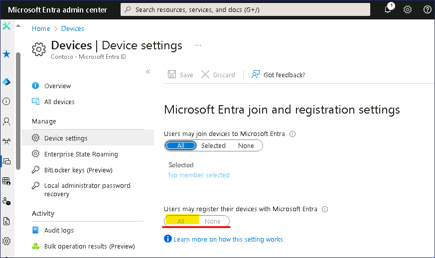
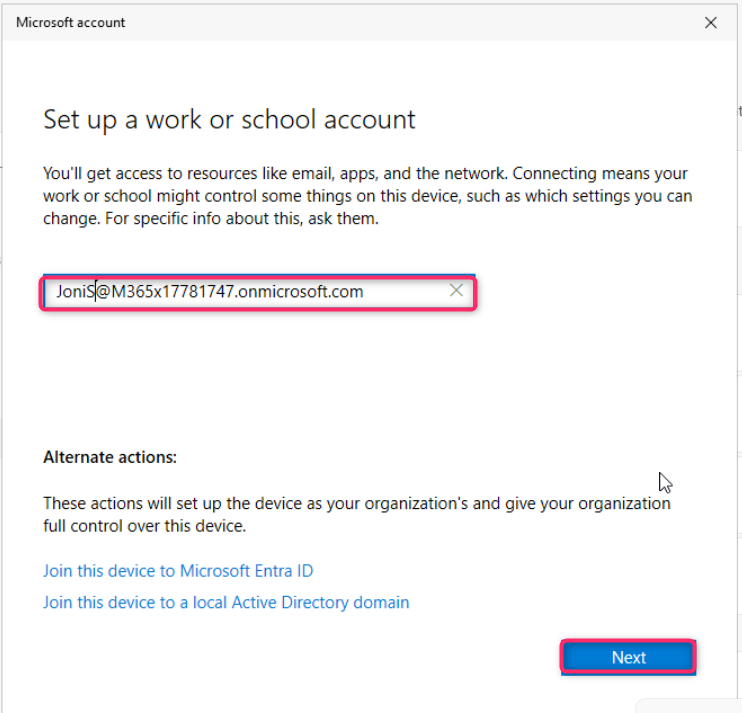
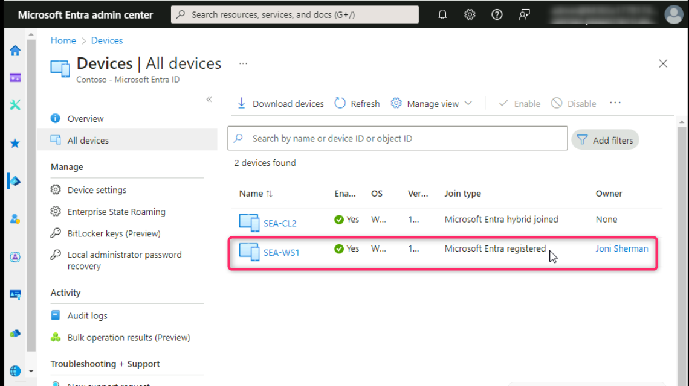
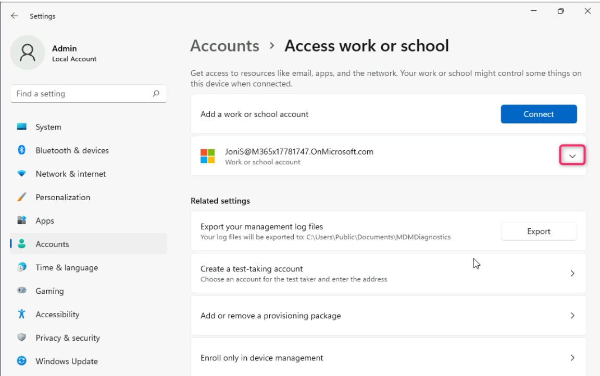

# Lab 4 - Manage Microsoft Entra Device registration.

**Summary**

In this lab, we will perform Microsoft Entra registration using a
Windows device.

**Exercise 1: Configuring Microsoft Entra device registration**

**Scenario**

Several users have asked to use their personal iOS, Android, and Windows
devices to access Contoso cloud resources. Since Contoso does not own
the devices, you do not want to have the users perform an Entra join for
full device management. Instead, you need to ensure that users are able
to register their devices with Microsoft Entra, which still allows you
to apply company policy to apps as needed, and still permit users to
access Contoso resources. You will test out Microsoft Entra device
registration using a Windows 11 device.

**Task 1: Configure Azure AD device registration**

1.  On the
    [*SEA-SVR1*](https://labclient.labondemand.com/Instructions/e7cc4ae1-e3d9-4c55-accc-696f537e1e17?rc=10),
    open a new tab in the Edge browser and enter the following URL,
    !!**https://entra.microsoft.com**!!, then press the **Enter**
    button.

2.  Sign in with your O365 tenant ID
    !!**admin@M365xXXXXXXXX.onmicrosoft.com**!! and use the tenant Admin
    password.

> 
>
> 

3.  On **Stay signed in?** dialog box, select the **Yes** button.

> 

4.  In the **Microsoft Entra admin center** window, navigate and click
    on **Identity**.

5.  Select **Devices**, then **Device settings** page, in the details
    pane, verify that **Users may register their devices with Microsoft
    Entra** is set to **All** and is greyed out.

> This option is greyed out and set to **All** by default when Microsoft
> Intune is enabled in the tenant. This ensures that all users are able
> to register Windows 10 or newer personal, iOS, Android, and macOS
> devices with Azure AD.
>
> 

**Task 2: Perform Microsoft Entra registration**

1.  Switch
    to [*SEA-WS1*](https://labclient.labondemand.com/Instructions/e7cc4ae1-e3d9-4c55-accc-696f537e1e17?rc=10) and
    sign in as **Admin** with the password of !!**Pa55w.rd**!!.

2.  On the taskbar, select **Start** and then select **Settings**.

3.  In the **Settings** window, select **Accounts**.

4.  On the **Accounts** page, select **Access work or school**.

5.  In the **Access work or school** page, select **Connect**.

6.  On the **Sign in** page,
    type !!**JoniS@M365xXXXXXXX.onmicrosoft.com**!!  and then
    select **Next**.

7.  On the **Enter password** page, enter the tenant password:
    !\!! and then select **Sign
    in**

8.  On the **You're all set!** page, select **Done**.

9.  On the **Access work or school** page, verify that Joni's **Work or
    school account** is displayed.

10. Close the **Settings** page.

**Task 3: Validate Microsoft Entra registration**

1.  On [*SEA-WS1*](https://labclient.labondemand.com/Instructions/e7cc4ae1-e3d9-4c55-accc-696f537e1e17?rc=10),
    right-click on **Start button**, and then select **Windows Terminal
    (Admin)**.

> 

2.  On the **User Account Control** dialog box, select **Yes**.

> 

3.  In the PowerShell console, type the following and press **Enter**:

> !!**dsregcmd /status**!!

4.  In the output under **User State**, verify that **WorkplaceJoined :
    YES** is displayed. This indicates that the user has performed a
    device registration in Microsoft Entra.

> 

5.  Close PowerShell and then sign out of **SEA-WS1**.

6.  Switch to SEA-SVR1. Go to **Microsoft Entra admin center** window,
    navigate and click on **Identity**.

> 
>
> 7\. Under the **Identity** section, select **Devices**, then navigate
> and click on **All devices** as shown in the below image.
>
> 

8.  Verify that the **Join Type** is listed as **Microsoft Entra
    registered** and that the owner is **Joni Sherman**.

> 
>
> Notice that the device is Microsoft Entra registered, NOT Microsoft
> Entra joined. Entra registered devices are typically devices that
> cannot be Entra joined, or devices that are personally owned by the
> user. Registering a device will provide access to Cloud based
> resources.

9.  Close Microsoft Edge.

**Task 4: Sign in to Windows and disconnect from the organization**

1.  Switch
    to *[SEA-WS1](https://labclient.labondemand.com/Instructions/e7cc4ae1-e3d9-4c55-accc-696f537e1e17?rc=10).* On
    the taskbar, select **Windows Start icon** button and then
    select **Settings**.

2.  In the **Settings** window, select **Accounts**.

> 

3.  On the **Accounts** page, select **Access work or school**.

> 

4.  In the **Access work or school** page, click on the dropdown beside
    **JoniS@M3654xXXXXXXXX** **Work or school** account as shown in the
    below image.

> 

5.  Click on **Disconnect** button.

> 

6.  Click on the **Yes** button to confirm the removal of the account.

> 
>
> Notice that you do not have to restart to disconnect a Microsoft Entra
> registered device.

7.  Sign out of **SEA-WS1**.

**Results**: After completing this exercise, you will have configured
Microsoft Entra device registration.
