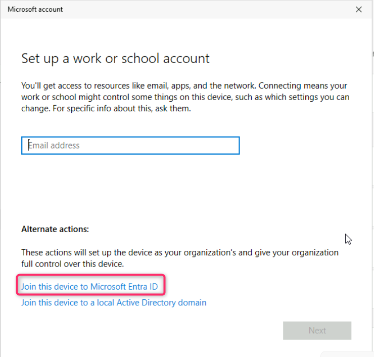
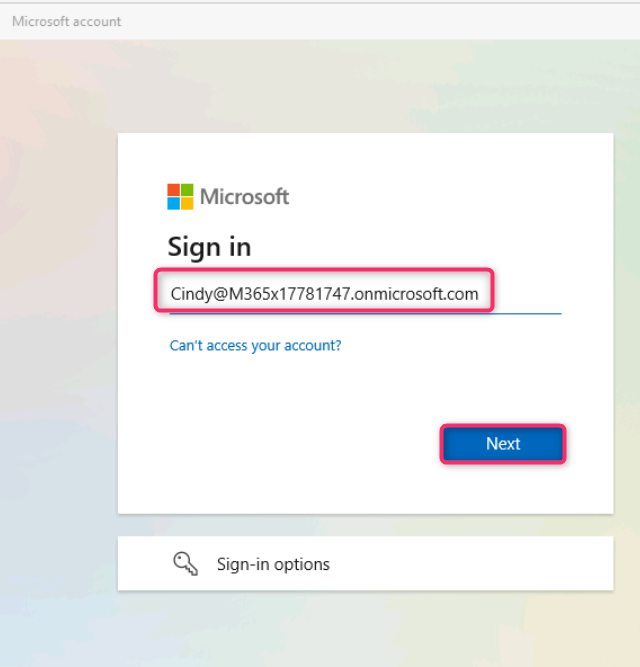
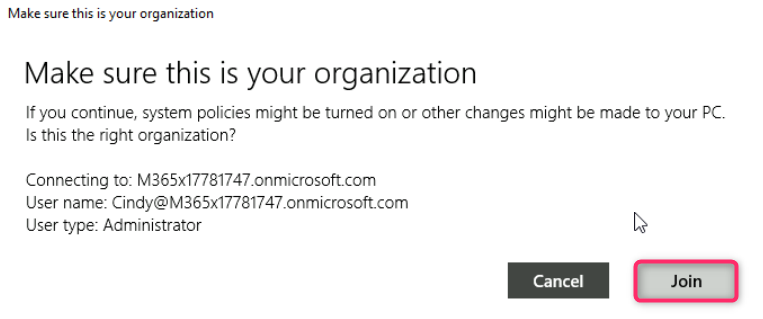
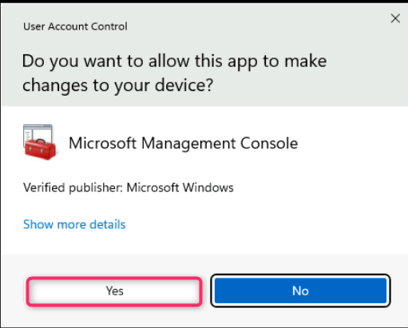
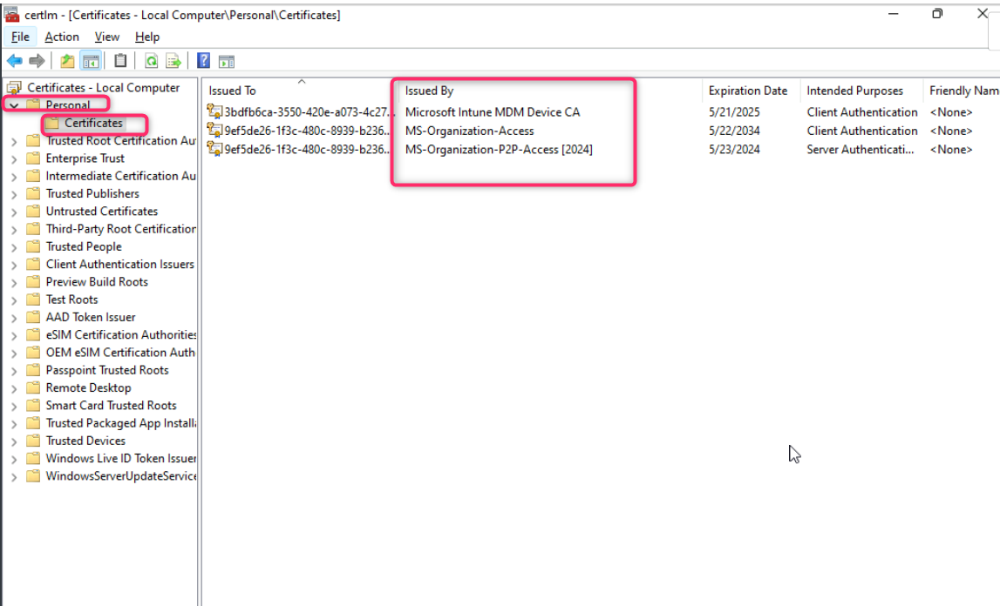
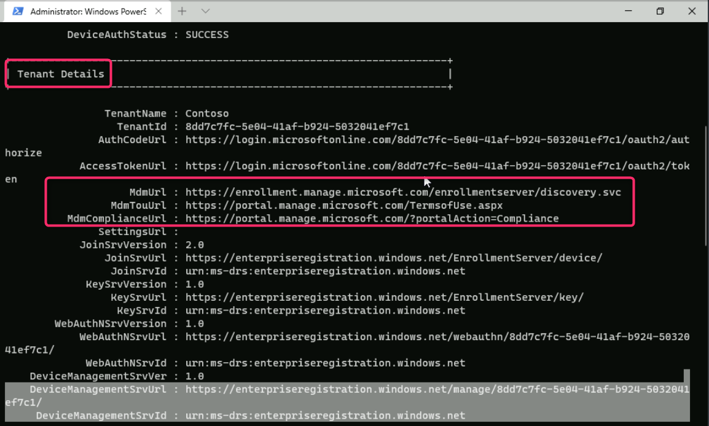
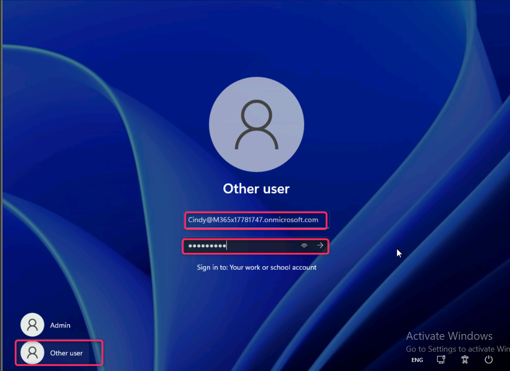
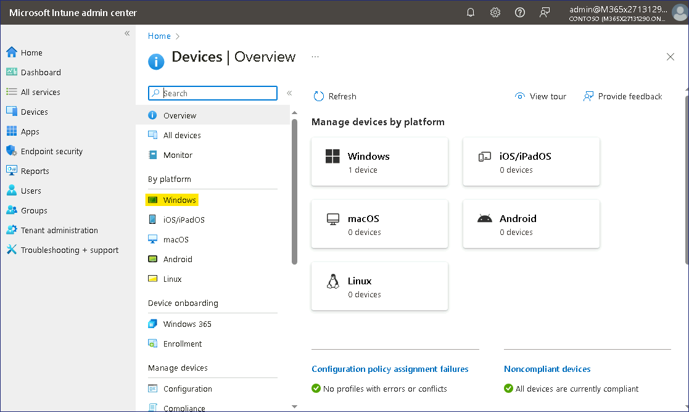

**Lab 6 - Enrolling devices into Microsoft Intune**

**Summary**

In this lab, you will join a Windows client to Entra ID and verify that
the device has automatically enrolled into Microsoft Intune.

**Prerequisites**

To following lab(s) must be completed before this lab:

- Lab \#1-Managing Identities in Microsoft Entra ID

- Lab \#2-Synchronizing Identities by using Microsoft Entra Connect

- Lab \#5-Manage Device Enrollment into Microsoft Intune

Note: You may also need a mobile phone that can receive text messages
used to secure Windows Hello sign in authentication to Entra ID.

**Scenario**

You have assigned Cindy White appropriate licenses and will now test the
process of joining a Windows device to Entra ID and have it
automatically enroll in Microsoft Intune.

**Task 1: Automatically enroll a Windows device to Microsoft Intune**

1.  Switch to SEA-WS1 and sign in as **Admin** with the password of !!Pa55w.rd!!

    

2.  On the taskbar, select **Start** and then select **Settings**.

    

3.  In the **Settings** window, select **Accounts**.

    

4.  On the Accounts page, select **Access work or school**.

    

5.  In the **Access work or school** page, select **Connect**.

    

6.  In the **Microsoft account** window, select **Join this device to
    Microsoft Entra ID**.

    

7.  On the **Sign in** page, type !!Cindy@M365x51282399.onmicrosoft.com!!
     and then select **Next**.

    

8.  On the **Enter password** page, enter the password:
    !!P@55w.rd1234!! and then select **Sign in**.

    

9.  **Make sure this is your organization** dialog box appear, then
    select **Join**.

    

10. On the **You're all set!** page, read the information and then
    select **Done**.

    

11. In the **Access work or school** section, verify that **Connected to
    Contoso's Azure AD** displays.

12. Select **Connected to Contoso's Azure AD** and then select **Info**.

    

13. Take note of the information regarding the areas managed by Contoso,
    scroll down, and then select **Sync**. This will force a Device sync
    with Intune.

    

14. Close the **Settings** window.

**Task 2: Validate device enrollment into Microsoft Entra And Intune**

1.  On the **SEA-WS1** taskbar, select **Start**,
    type !!certlm.msc!! press **Enter**.

    

2.  On User Account Control dialog box, select **Yes** button.

    

3.  In the **Certificates** console, in the navigation pane,
    expand **Personal** and select the **Certificate** node. Verify that
    the following certificates are listed in the details pane:

    - Microsoft Intune MDM Device CA

    - MS-Organization-Access

    - MS-Organization-P2P-Access \[2024\]

    This indicates that the device is enrolled in Microsoft Entra and
    Intune.

    

4.  Close the Certificates window.

5.  Right-click on **Start** button and then select **Windows Terminal
    (Admin)**.

    

6.  On **User Account Control** dialog box, click on the **Yes** button.

    

7.  In the PowerShell console, type the following and press **Enter**:

    !!dsregcmd /status!!

8.  In the output, under **Device State**, verify that **AzureAdJoined :
    YES** is displayed. This indicates that the device is Azure AD
    joined.

    

9.  In the output under **Tenant Details**, verify that the following
    three entries exist:

    - mdmUrl:https://enrollment.manage.microsoft.com/enrollmentserver/discovery.svc

    - mdmTouUrl:https://portal.manage.microsoft.com/TermsofUse.aspxmdm

    - ComplianceUrl:https://portal.manage.microsoft.com/?portalAction=Compliance

    

    *Note: These entries indicate that the device is enrolled in Intune.*

**Task 3: Sign in as Microsoft Entra ID user**

1.  Sign out of **SEA-WS1** as you are logged with the local admin
    account.

2.  On the Sign in screen select Other user and sign in
    as !!Cindy@M365xXXXXXXX.onmicrosoft.com!!  with the password:
     !!P@55w.rd1234!!

    

3.  Wait for the profile to be created

    

    **Note** – If you are prompted for **Windows Hello**, then complete the
    sign in process accordingly and on the **Set up a PIN** page, in
    the **New PIN** and **Confirm PIN** boxes, type !!**102938**!!  and then
    select **OK**.

    

4.  Sign out of **SEA-WS1**.

**Task 4: Verifying device enrollment in the Microsoft Intune console**

1.  Switch``to SEA-SVR1 and login using the provided credentials.

2.  In Microsoft Edge browser, type !!https://intune.microsoft.com!!
    in the address bar, and then press **Enter**. Sign in with your
    Office 365 Tenant administrator account.

3.  In the navigation pane, select **Devices**.

    

4.  On the **Devices | Overview** page, navigate and click on
    **Windows**.

    

5.  Navigate and click on **Windows devices**. Verify
    that **SEA-WS1** is listed.

    Note that for SEA-WS1, the **Managed by** column displays **Intune** and
    the **Ownership** column displays **Corporate**.

    

    **Note**: This view lists devices that are enrolled to Intune. Remember
    that you configured automatic enrollment between Microsoft Entra and
    Microsoft Intune, and because of that, any device that is joined or
    registered to Microsoft Entra is automatically enrolled to Microsoft
    Intune. Any devices joined prior to setting up enrollment are only
    joined or registered to Entra, but not enrolled in Intune.

6.  Open a new tab and navigate to **Microsoft Entra admin center**
    !!https://entra.microsoft.com!!. Click on **Devices** and then
    select **All devices**.

    

7.  Take note of **SEA-WS1**. Notice that the **Join Type** column
    displays Microsoft Entra joined and the **MDM** column displays
    Microsoft Intune.

    

    **Results**: After completing this exercise, you will have successfully
    joined a Windows client to Microsoft Entra ID and verified that the
    device has automatically enrolled into Microsoft Intune.
