**Lab 7 - Creating and Deploying Configuration Profiles**

**Summary**

In this lab, we will use Microsoft Intune to create and apply a
Configuration profile for a Windows 11 device.

**Prerequisites**

To following lab(s) must be completed before this lab:

- Lab \#1-Managing Identities in Microsoft Entra ID

- Lab \#2-Synchronizing Identities by using Microsoft Entra Connect

- Lab \#5-Manage Device Enrollment into Microsoft Intune

- Lab \#6-Enrolling devices into Microsoft Intune

Note: You will also need a mobile phone that can receive text messages
used to secure Windows Hello sign in authentication to Microsoft Entra
ID.

**Exercise 1: Create and apply a Configuration profile.**

**Scenario**

You need to use Microsoft Entra and Microsoft Intune to manage members
of the Developers department at Contoso. You have been asked to evaluate
the solutions that would enable the users to work effectively and
securely on Windows 11 devices. Cindy White has volunteered to help you
test and evaluate the solution and provide feedback. He has also given
you some initial requirements that must be included and applied to the
developer's Windows devices:

- The Gaming section in Settings should not be visible.

- The Privacy section in Settings should be restricted as much as
  possible.

- The **C:\DevProjects** folder must be excluded from Windows Defender.

- The process devbuild.exe must be excluded from Windows Defender.

- Most used apps and Recently added apps should not be displayed on the
  Start menu.

**Task 1: Verify device settings**

1.  Sign in
    to SEA-WS1 as Cindy
    White using her credentials
    !!Cindy@M365xXXXXXX.onmicrosoft.com!! with the
    PIN !!102938!! or Password !!P@55w.rd1234!!

2.  On the taskbar, select **Start** and then select **Settings**.

3.  On the **Settings** navigation list, verify that you can see
    the **Gaming** setting.

4.  Select the **Personalization** setting and then on the
    Personalization page, select **Start**. Make a note of **Show
    recently added apps** and **Show most used apps** settings.

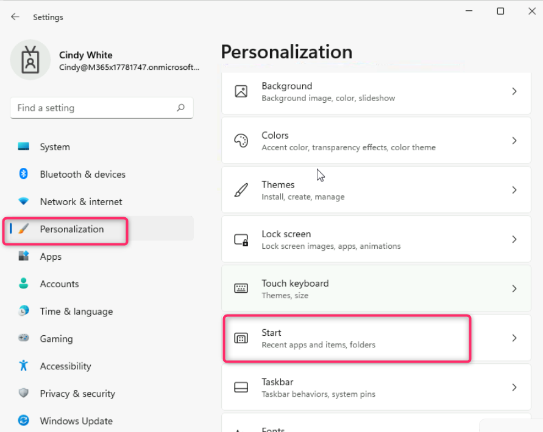

5.  In the **Settings** app, select **Privacy & security**.

6.  On the **Privacy & security** page, take note of the options
    under **Security**, **Windows permissions**, and **App
    permissions**.

7.  On the **Privacy & security** page, select **Windows Security** and
    then select **Open Windows Security**.

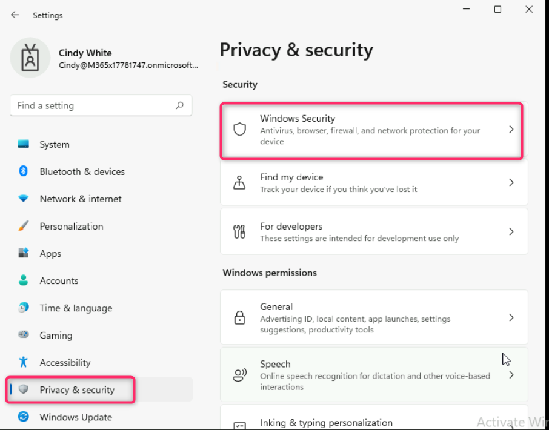

8.  On the **Windows Security** page, select **Virus & threat
    protection**.

9.  On the **Virus & threat protection** page, under **Virus & threat
    protection settings**, select **Manage settings**.

10. Scroll down to **Exclusions** and select **Add or remove
    exclusions**. On User Account Control dialog box, select **Yes**.

11. On the **Exclusions** page, verify that no exclusions have been
    configured.

12. Close the **Windows Security** window.

13. Close the **Settings** window.

**Task 2: Create a Configuration profile based on scenario
requirements**

1.  Switch
    to [*SEA-SVR1*](https://labclient.labondemand.com/Instructions/e7cc4ae1-e3d9-4c55-accc-696f537e1e17?rc=10).

2.  Switch back to the tab with the **Microsoft Intune admin center**
    open, select **Devices** from the navigation bar.

3.  On the **Devices | Overview** page, select **Windows** as shown in
    the below image.

4.  On the **Windows | Windows devices** page, navigate and click on
    **Configuration profiles**.

5.  On the **Windows | Configuration profiles** page, in the
    **Policies** tab, click on **+ Create** and select **+ New Policy**.

6.  In the **Create a profile** pane that appears on the right side,
    select the following options, and then select **Create**:

- Platform: **Windows 10 and later**

- Profile type: **Templates**

- Template name: !!!!

7.  In the **Basics** blade, enter the following information, and then
    select **Next**:

- Name: !!Contoso Developer - standard!!

- Description: !!Basic restrictions and configuration for Contoso
  Developers.!!

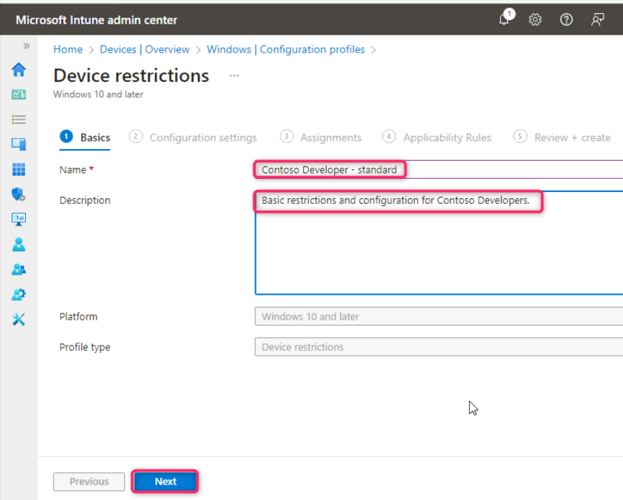

8.  On the **Configurations settings** blade, expand **Control Panel and
    Settings**.

9.  Select **Block** next to the **Gaming** and **Privacy** options.

10. On the **Device restrictions** blade, expand **Start**.

11. Scroll down and select **Block** next to **Most used
    apps**, **Recently added apps** and **Recently opened items in Jump
    Lists**.

12. On the **Device restrictions** blade, scroll down and
    expand **Microsoft Defender Antivirus**.

13. Under **Microsoft Defender Antivirus,** scroll down and
    expand **Microsoft Defender Antivirus Exclusions**.

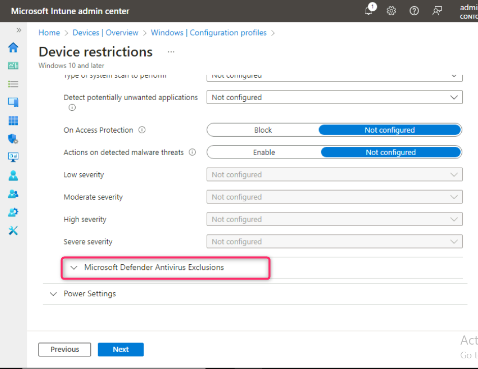

14. Under **Microsoft Defender Antivirus Exclusions** provide the below
    details and click on the **Next** button:

- Files and folders box - !!**C:\DevProjects**!!

- Processes box - !!**DevBuild.exe**!!

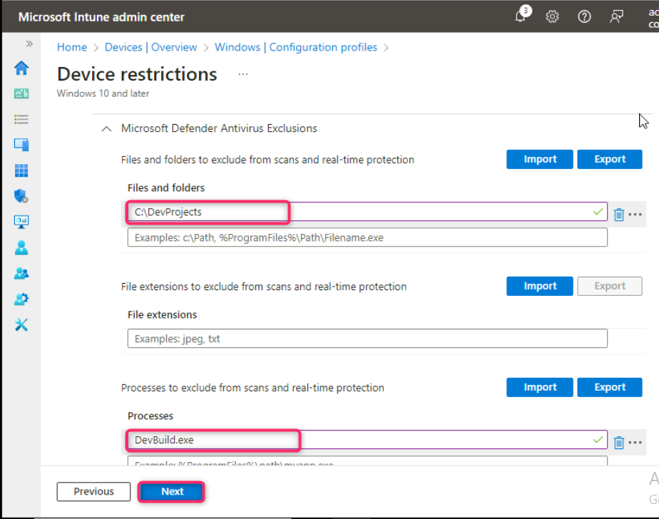

15. In the **Assignments** tab, click on the **Next** button.

16. In the **Applicability Rules** tab, click on the **Next** button.

17. In the **Review + create** tab, click on the **Create** button.

18. The Configuration profile should be listed now.

**Task 3: Create the Contoso Developer device group**

1.  In the Microsoft Intune admin center, in the navigation pane,
    select **Groups**.

2.  On the **Groups | All groups** blade, select **New group**.

3.  On the **New Group** blade, enter the following information:

- Group type: **Security**

- Group name: !!Contoso Developer devices!!

- Group description: !!All Windows devices in Contoso Developer
  department!!

- Membership type: **Assigned**

4.  Under **Members**, select **No members selected**.

5.  On the **Add members** blade, in the **Search** box type !!Sea!! .
    Select **SEA-WS1** and then choose **Select**.

6.  On the **New Group** blade, select **Create**.

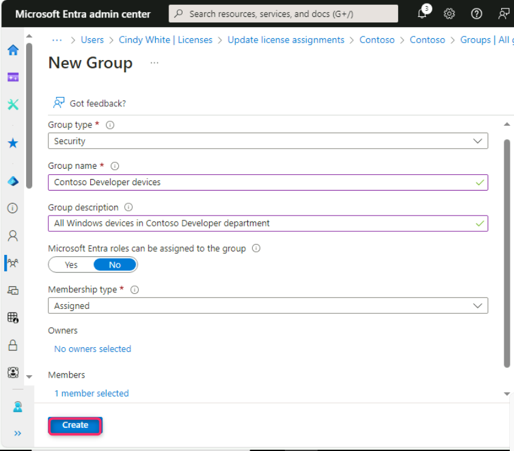

7.  On the **Groups | All groups** blade, verify that the **Contoso
    developer devices** group is displayed.

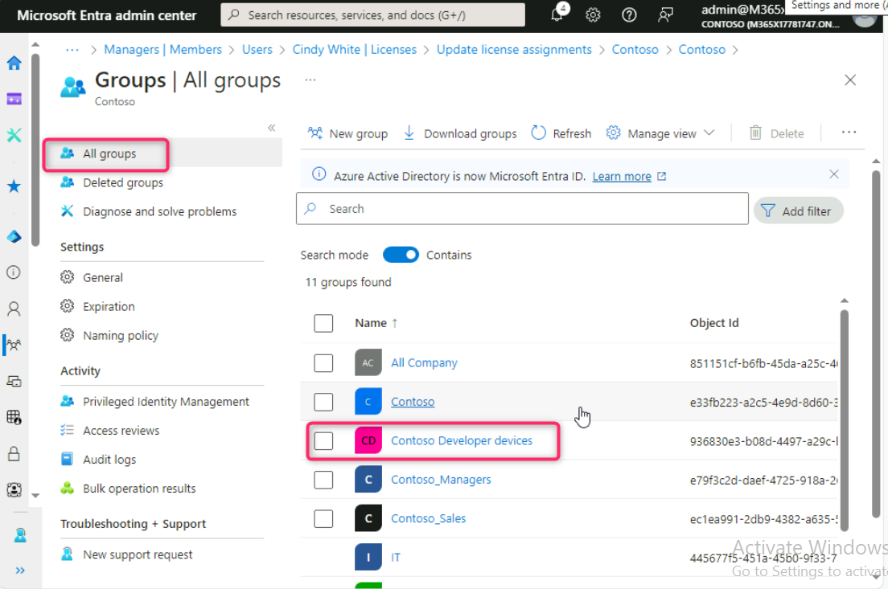

**Task 4: Create a dynamic Azure AD device group**

1.  On the **Groups | All Groups** blade, on the details pane,
    select **New group**.

2.  On the **Group** blade, provide the following values:

- Group type: **Security**

- Group name: !!Windows Devices!!

- Membership type: **Dynamic Device**

3.  Under the **Dynamic Device Members** section, select **Add dynamic
    query**.

4.  On the **Dynamic membership rules** blade, in the **Rule
    syntax** section, select **Edit**.

5.  In the **Edit rule syntax** text box, add the following simple
    membership rule and select **OK**.

!!**(device.deviceOSType -contains "Windows")**!!

6.  On the **Dynamic membership rules** blade, select **Save**.

7.  On the **New Group** page, select **Create**.

**Task 5: Assign a Configuration profile to Windows devices**

1.  While on the **Microsoft Intune admin center** page,
    select **Devices** from the navigation bar.

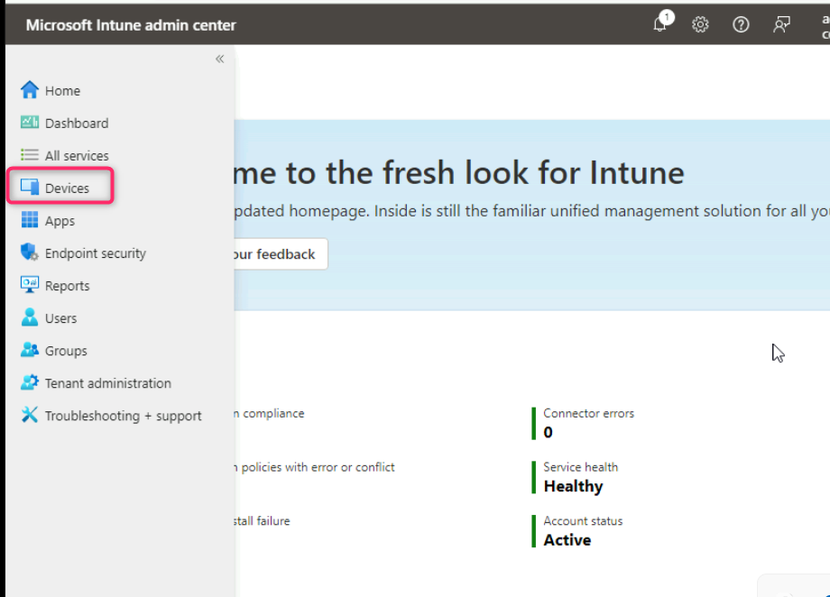

2.  On the **Devices | Overview** page, select **Windows** as shown in
    the below image.

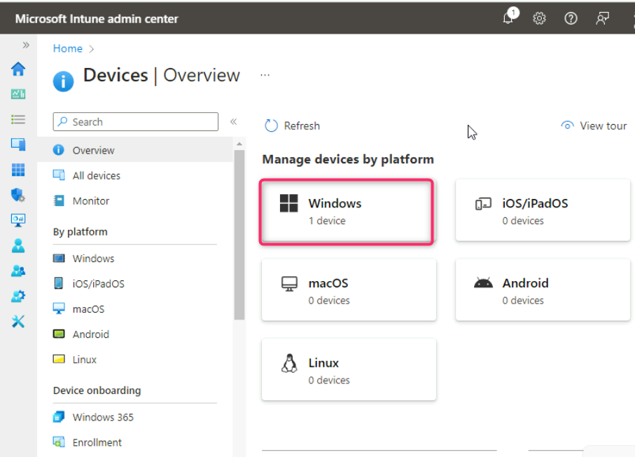

3.  On the **Windows | Windows devices** page, navigate and click on
    **Configuration profiles**.

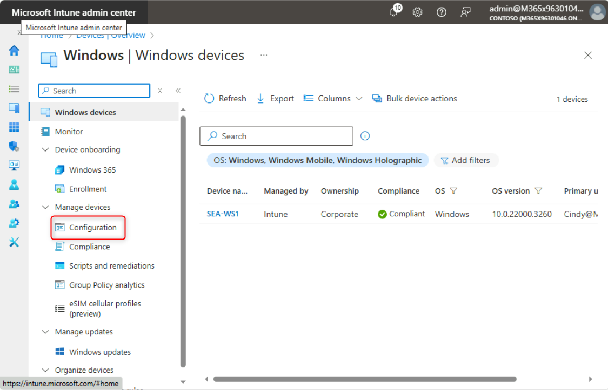

4.  On the **Devices | Configuration profiles** blade, in the details
    pane, select the **Contoso Developer – standard** profile.

5.  On the **Contoso Developer – standard** blade, scroll down to
    the **Assignments** section, and select **Edit**.

6.  On the Assignments page, under **Included groups** select **Add
    groups**.

7.  On the **Select groups to include** blade, in the **Search** box,
    type and select !!**Contoso Developer devices**!!  and then click on
    the **Select** button.

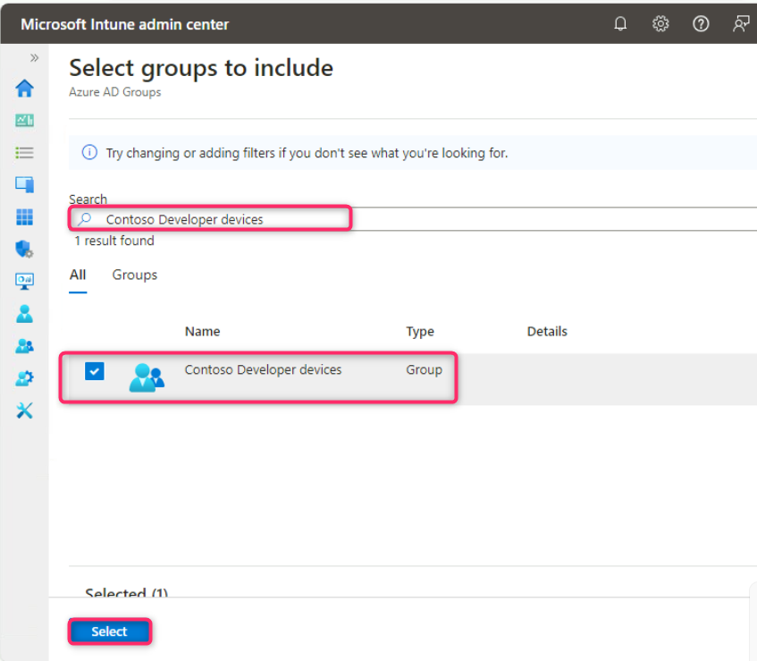

14. Back on the **Device restrictions** blade, select **Review + save**,
    then select **Save**.

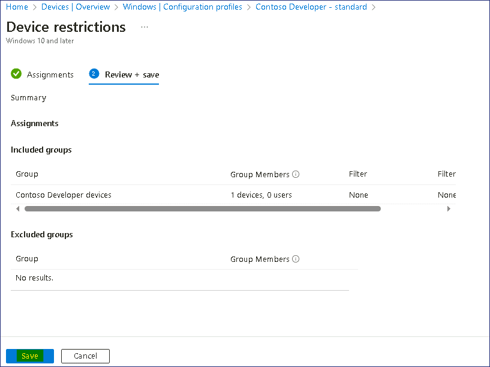

**Task 6: Verify that the Configuration profile is applied**

1.  Switch
    to *[SEA-WS1](https://labclient.labondemand.com/Instructions/e7cc4ae1-e3d9-4c55-accc-696f537e1e17?rc=10).* Login
    using Cindy White’s account.

- Username - !!**Cindy@M365xXXXXXXX.onmicrosoft.com**!!

- Password – !!**P@55w.rd1234**!!

2.  On the taskbar, select **Start** and then select **Settings**.

> 

3.  In the **Settings** window, select **Accounts**. On the Accounts
    page, select **Access work or school**.

4.  Click on the dropdown beside **Connected to Contoso’s Azure AD** and
    select **Info** button.

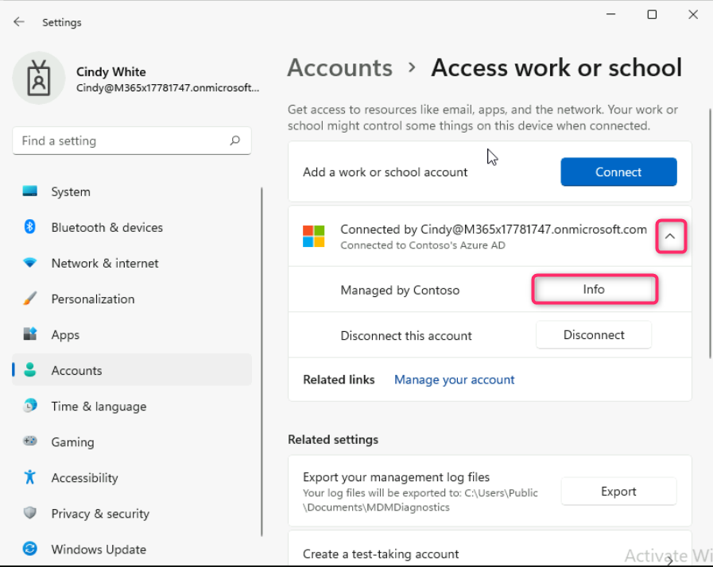

5.  In the **Managed by Contoso** page, scroll down and then under
    Device sync status, select **Sync**. Wait for the synchronization to
    complete.

6.  

7.  Close the **Settings** app.

> **Note**: The sync progress may take up to 15 minutes before the
> profile is applied to the Windows 11 device. Signing out or restarting
> the device can accelerate this process.

8.  On [*SEA-WS1*](https://labclient.labondemand.com/Instructions/e7cc4ae1-e3d9-4c55-accc-696f537e1e17?rc=10),
    select **Start** again and then select **Settings**. Verify that
    the **Gaming** setting has been removed.

9.  Select **Privacy & security** and notice that many of the privacy
    settings are now hidden.

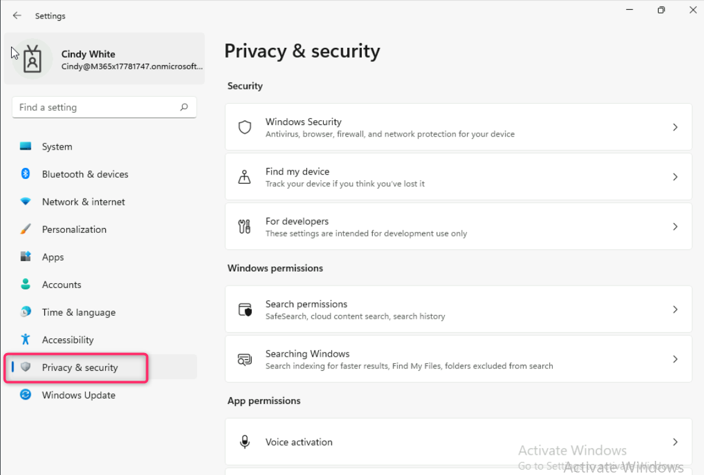

10. Select the **Personalization** setting and then select **Start**.
    Verify that **Show recently added apps** and **Show most used
    apps** are set to **Off** and greyed out.

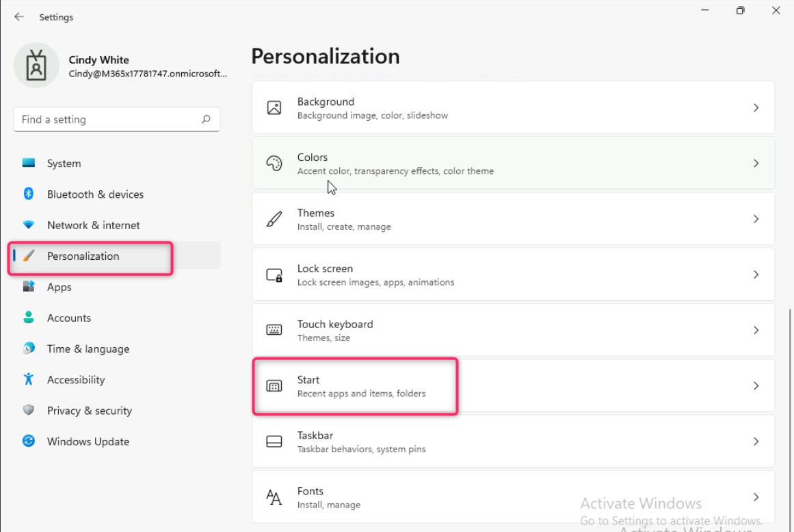

11. In the **Settings** app, select **Privacy and Security**.

12. On the **Privacy & Security** page, select **Windows Security** and
    then select **Open Windows Security**.

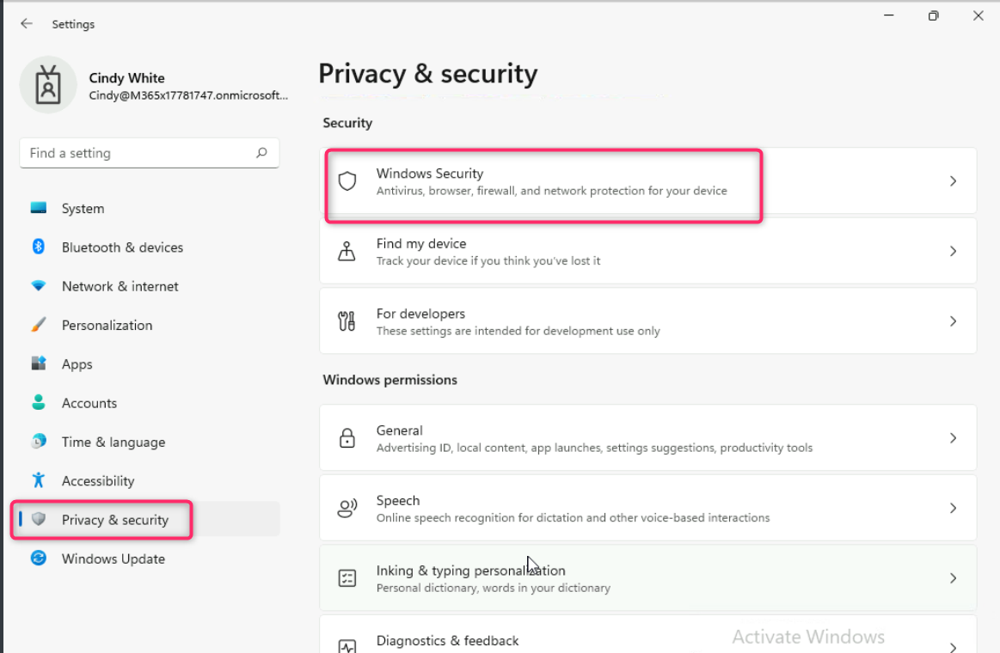

13. On the **Windows Security** page, select **Virus & threat
    protection**.

14. On the **Virus & threat protection** page, select **Manage
    settings** under **Virus & threat protection settings**.

15. Scroll down to **Exclusions** and select **Add or remove
    exclusions**. Select **Yes** at the User Account Control message.

16. On the **Exclusions** page, verify
    that **C:\DevProjects** and **DevBuild.exe** are displayed.

17. Close the **Windows Security** page and then close
    the **Settings** app.

**Results**: After completing this exercise, you will have successfully
created and assigned a Configuration profile for a Windows 11 device.

**Exercise 2: Modify an assigned Configuration profile policy.**

**Scenario**

There was an exception to Contoso's policy that specifies that members
of the Developer department should not have the Privacy options blocked
in Settings on their devices. This change should be implemented and
tested.

**Task 1: Change settings in an assigned Configuration profile**

1.  Switch to **SEA-SVR1**. Switch back to **Microsoft Intune admin
    center** tab, select **Devices** from the navigation bar.

2.  On the **Devices | Overview** page, select **Windows** as shown in
    the below image.

3.  On the **Windows | Windows devices** page, navigate and click on
    **Configuration profiles**.

4.  On the **Devices | Configuration profiles** blade, in the details
    pane select **Contoso Developer - standard**.

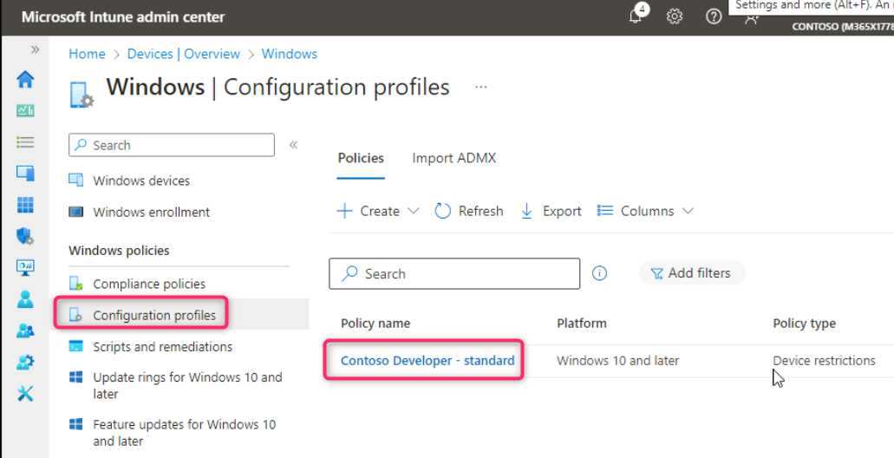

5.  On the **Contoso Developer - standard** blade, scroll down to
    the **Configuration settings** section, and then select **Edit**.

6.  On the **Device restrictions** page, expand **Control Panel and
    Settings**.

7.  Next to **Privacy**, ensure that **Not configured** is selected.

8.  Select **Review + save**, and then select **Save**.

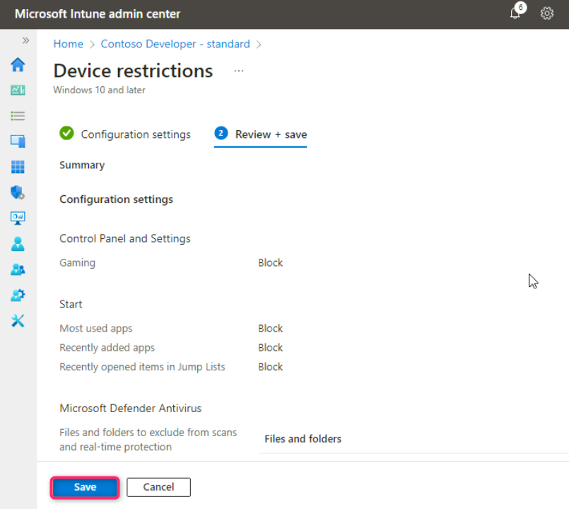

**Task 2: Force device synchronization from Microsoft Intune admin
center**

1.  On [*SEA-SVR1*](https://labclient.labondemand.com/Instructions/e7cc4ae1-e3d9-4c55-accc-696f537e1e17?rc=10),
    in the **Microsoft Intune admin center**, select **Devices** in the
    navigation pane and then select **All devices** and
    select **SEA-WS1**.

2.  On the **SEA-WS1** blade, select **Sync** and when prompted
    select **Yes**.

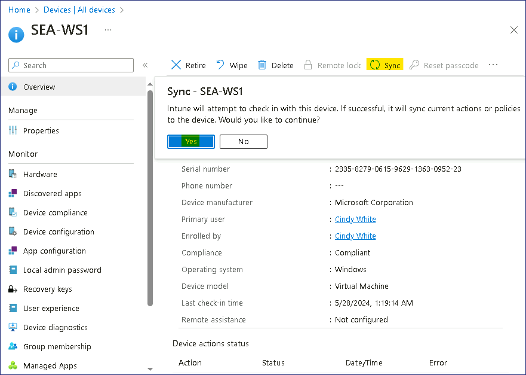

**Note**: Intune will connect the device and synchronize all policies.
This may take up to 5 minutes.

**Task 3: Verify changes
On [*SEA-WS1*](https://labclient.labondemand.com/Instructions/e7cc4ae1-e3d9-4c55-accc-696f537e1e17?rc=10)**

1.  Switch
    to [*SEA-WS1*](https://labclient.labondemand.com/Instructions/e7cc4ae1-e3d9-4c55-accc-696f537e1e17?rc=10).
    On the taskbar, select **Start** and then select the **Settings**.

2.  In the **Settings** app, select **Privacy & security** and verify
    that all the customization options are back.

3.  Close all open windows and sign out of **SEA-WS1**.

**Results**: After completing this exercise, you will have successfully
modified an assigned a Configuration profile, modified a Configuration
profile, and verified the changes.
