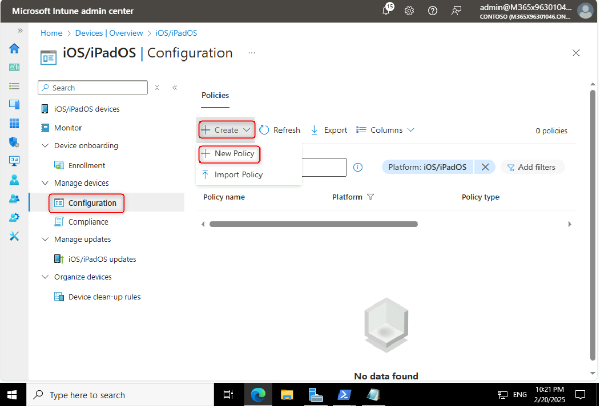

**Lab 9 - Using a Configuring Profile to configure iOS and iPadOS Wi-Fi
settings.**

**Summary**

In this lab, we will use Microsoft Intune to create and apply a
Configuration profile to run configure Wi-Fi settings for iOS and iPadOS
devices.

**Exercise 1: Creating a Configuration profile.**

**Scenario**

You have been asked to create a Configuration profile to be used to
automatically configure Wi-Fi settings for enrolled iOS and iPadOS
devices. You need to ensure that the Wi-Fi settings are configured as
follows:

- Network name: **Contoso Wi-Fi**

- SSID: **MainOffice**

- Connect automatically: **Enable**

- Security type: **WPA/WPA2-Personal**

- Pre-Shared key: **ContosoWiFi123**

- Assigned to: **A new security group named iOS_iPadOS Devices**

**Task 1: Create the iOS_iPadOS device group**

1.  Switch to SEA-SVR1
     In the **Microsoft Entra admin center** window, navigate and select
    **Groups**, then click on **All groups**.

     

2.  On the **Groups | All groups** blade, select **New group**.

     

3.  On the **New Group** blade, enter the following information and
    click on the **Create** button as shown in the below image:

    - Group type: **Security**

    - Group name: !!iOS_iPadOS Devices!!

    - Group description: !!All iOS and iPadOS devices!!

    - Membership type: **Assigned**

     

4.  On the **Groups | All groups** blade, refresh the page and verify
    that the **iOS_iPadOS Devices** group is displayed.

     

**Task 2: Create a Configuration profile based on scenario
requirements**

1.  Switch to **Microsoft Intune admin center** tab,
    select **Devices** from the navigation bar.

    

2.  On the **Devices | Overview** page, select **iOS/iPadOS** as shown
    in the below image.

    

3.  On the **iOS/iPadOS** page, navigate and click on **Configuration**, Under **Manage devices**.

4.  On the **iOS/iPadOS | Configuration** page, in the
    **Policies** tab, click on **+ Create** and select **+ New Policy**.

    

5.  In the **Create a profile** blade, select the following options, and
    then select **Create**:

    - Platform: **iOS/iPadOS**

    - Profile type: **Templates**

    - Template name: **Wi-Fi**

   

6.  In the **Basics** blade, enter the following information, and then
    select **Next**:

    - Name: !!iOS/iPadOS Wi-Fi Policy!!

    - Description: !!Wi-Fi settings for iOS/iPadOS Devices!!

     

7.  On the **Configuration settings** blade, next to **Wi-Fi type**,
    select **Basic**.

     Additional options display based upon the type selected.

8.  On the **Configuration settings** blade, select the following
    options, and then select **Next**:

    - Network name: !!Contoso Wi-Fi!!

    - SSID: !!MainOffice!!

    - Connect automatically: **Enable**

    - Security type: **WPA/WPA2-Personal**

    - Pre-Shared key: !!ContosoWiFi123!!

    

9.  On the **Assignments** blade, under **Included groups**,
    select **Add groups**.

     

10. In the **Select groups to include** window, select **iOS_iPadOS
    Devices**, and then click **Select**.

     

11. In the **Assignments** tab, click on the **Next** button.

     

12. In the **Review + create** tab, click on the **Create** button.

     

13. Verify that the **iOS/iPadOS Wi-Fi Policy** is listed.

     

> **Results**: After completing this exercise, you will have
> successfully created and assigned a Configuration profile to configure
> Wi-Fi settings for iOS and iPadOS devices.
