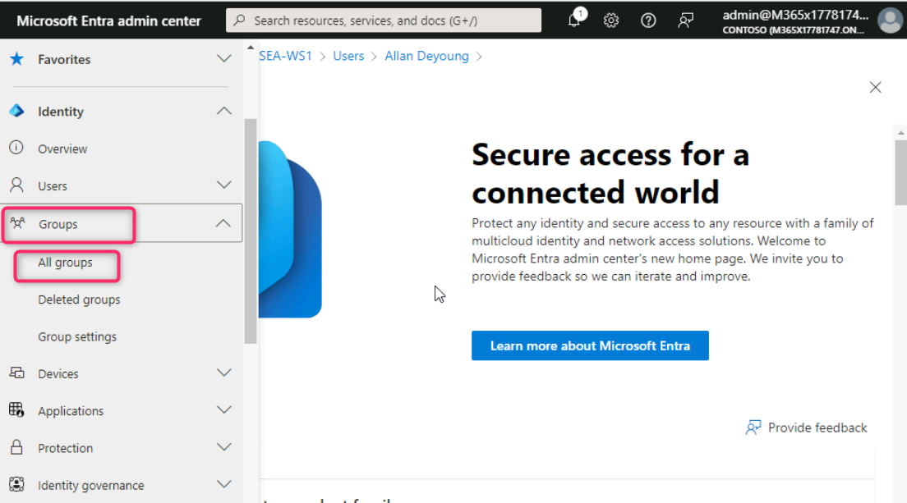
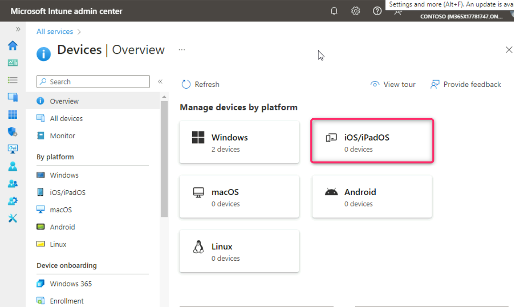
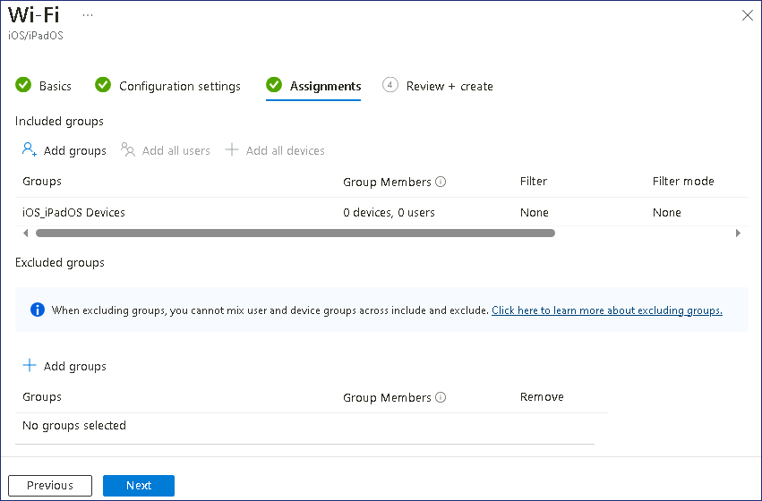
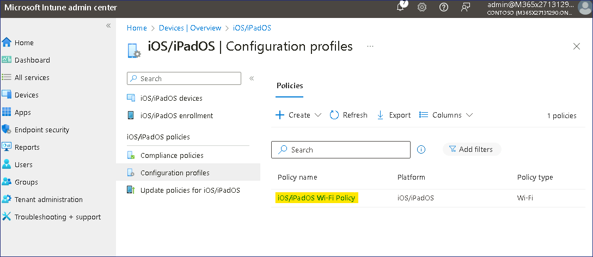

**Lab 8 - Using a Configuring Profile to configure Kiosk mode**

**Summary**

In this lab, we will use Microsoft Intune to create and apply a
Configuration profile to run single-app Kiosk mode on a Windows 11
device.

**Prerequisites**

To following lab(s) must be completed before this lab:

- Lab 05 - Manage Device Enrollment into Microsoft Intune

Note: You will also need a mobile phone that can receive text messages
used to secure Windows Hello sign in authentication to Entra ID.

**Exercise 1: Create and apply a Configuration profile**

**Scenario**

You have been asked to configure **SEA-WS2** as a Windows 11 kiosk to
allow Contoso visitors the ability to browse the Internet. You need to
ensure that the kiosk is configured as follows:

- A single app, full-screen kiosk.

- Auto logon.

- Provides access to the Microsoft Edge browser, which is to be
  configured in Public Browsing (InPrivate) mode. The home page should
  be configured for **http://bing.com**.

**Task 1: Enroll SEA-WS2 to Microsoft Intune**

1.  Sign in
    to [*SEA-WS2*](https://labclient.labondemand.com/Instructions/e7cc4ae1-e3d9-4c55-accc-696f537e1e17?rc=10) as **Admin** with
    the password of !!**Pa55w.rd**!!.

2.  On the taskbar, select **Start** and then select **Settings**.

3.  In the **Settings** window, select **Accounts**.

4.  On the Accounts page, select **Access work or school**.

5.  In the **Access work or school** page, select **Connect**.

6.  In the **Microsoft account** window, select **Join this device to
    Microsoft Entra ID**.

7.  On the **Sign in** page,
    type !!**AllanD@M365xXXXXXX.onmicrosoft.com**!! and then
    select **Next**.

8.  On the **Enter password** page, enter the tenant password:
    !!**P@55w.rd1234**!! and then select **Sign in**.

9.  On the **Make sure this is your organization** dialog box,
    select **Join**.

10. On the **You're all set!** page, read the information and then
    select **Done**.

11. In the **Access work or school** section, verify that **Connected to
    Contoso's Azure AD** displays.

12. Select **Connected to Contoso's Azure AD** and then select **Info**.

13. Scroll down, and then select **Sync**. This will force a Device sync
    with Intune.

14. Close the **Settings** window.

**Task 2: Create the Contoso Kiosk device group**

1.  On [*SEA-SVR1*](https://labclient.labondemand.com/Instructions/e7cc4ae1-e3d9-4c55-accc-696f537e1e17?rc=10),
    switch to **Microsoft Entra admin center** tab. Navigate and select
    **Groups,** then click on **All groups**.

2.  On the **Groups | All groups** page, select **New group**.

3.  On the **New Group** blade, enter the following information:

- Group type: **Security**

- Group name: !! Contoso Kiosk Devices!!

- Group description: !!All Windows devices configured as a Kiosk!!

- Membership type: **Assigned**

4.  Under **Members**, select **No members selected**.

5.  On the **Add members** blade, in the **Search** box type **Sea**.
    Select **SEA-WS2** and then choose **Select**.

6.  On the **New Group** blade, select **Create**.

7.  On the **Groups | All groups** blade, refresh the page and verify
    that the **Contoso Kiosk Devices** group is displayed.

**Task 3: Create a Configuration profile based on scenario
requirements**

1.  Go back to Microsoft Intune admin center, select **Devices** from
    the navigation bar.

2.  On the **Devices | Overview** page, select **Windows** as shown in
    the below image.

3.  On the **Windows | Windows devices** page, navigate and click on
    **Configuration profiles**.

4.  On the **Windows | Configuration profiles** page, in the
    **Policies** tab, click on **+ Create** and select **+ New Policy**.

5.  In the **Create a profile** blade, select the following options, and
    then select **Create**:

- Platform: **Windows 10 and later**

- Profile type: **Templates**

- Template name: !!**Kiosk**!!

6.  In the **Basics** blade, enter the following information, and then
    select **Next**:

- Name: !!Contoso Kiosk Policy!!

- Description: !!Basic settings for Contoso Kiosk Devices.!!

7.  On the **Configuration settings** blade, next to **Select a kiosk
    mode**, select **Single app, full-screen kiosk**.

Additional options display based upon the mode selected.

8.  On the **Configuration settings** blade, select the following
    options, and then select **Next**:

- User logon type: **Auto logon (Windows 10, version 1803 and later, or
  Windows 11)**

- Application type: **Add Microsoft Edge browser**

- Edge Kiosk URL: !! **http://bing.com**!!

- Microsoft Edge kiosk mode type: **Public Browsing (InPrivate)**

- Refresh browser after idle time: **5**

- Specify Maintenance Window for App Restarts: **Not configured**

> 

9.  On the **Assignments** blade, under **Included groups**,
    select **Add groups**.

10. In the **Select groups to include** window, select !!**Contoso Kiosk
    Devices**!!, and then click **Select**.

11. In the **Assignment** tab, click on the **Next** button.

12. In the **Applicability Rules** tab, click on the **Next** button.

13. In the **Review + create** tab, click on the **Create** button.

14. The Configuration profile will be listed.

**Task 4: Verify that the Configuration profile is applied**

1.  Sign in
    to [*SEA-WS2*](https://labclient.labondemand.com/Instructions/e7cc4ae1-e3d9-4c55-accc-696f537e1e17?rc=10) as **Admin** with
    the password of !!**Pa55w.rd**!!.

2.  On the taskbar, select **Start** and then select **Settings**.

3.  In the **Settings** window, select **Accounts**.

4.  On the Accounts page, select **Access work or school**.

5.  Select **Connected to Contoso's Azure AD** and then select **Info**.

6.  Scroll down, and then select **Sync**. This will force a Device sync
    with Intune.

7.  Close the **Settings** window.

> 

5.  Restart **SEA-WS2**.

Notice that **SEA-WS2** automatically signs in and creates a profile.
After the sign-in is complete, Microsoft Edge is displayed configured
with InPrivate browsing. If SEA-WS2 does not sign in automatically,
repeat steps 1-7 to ensure that the policy has refreshed on the device.

**Results**: After completing this exercise, you will have successfully
created and assigned a Configuration profile to configure a Windows 11
device as a single-app kiosk.
